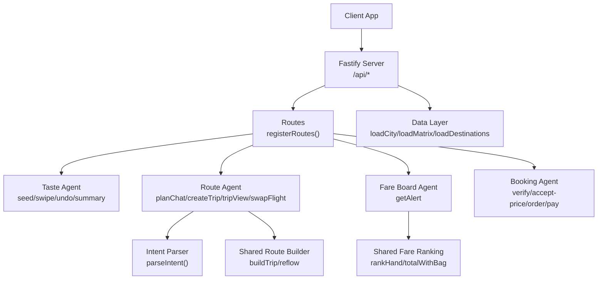
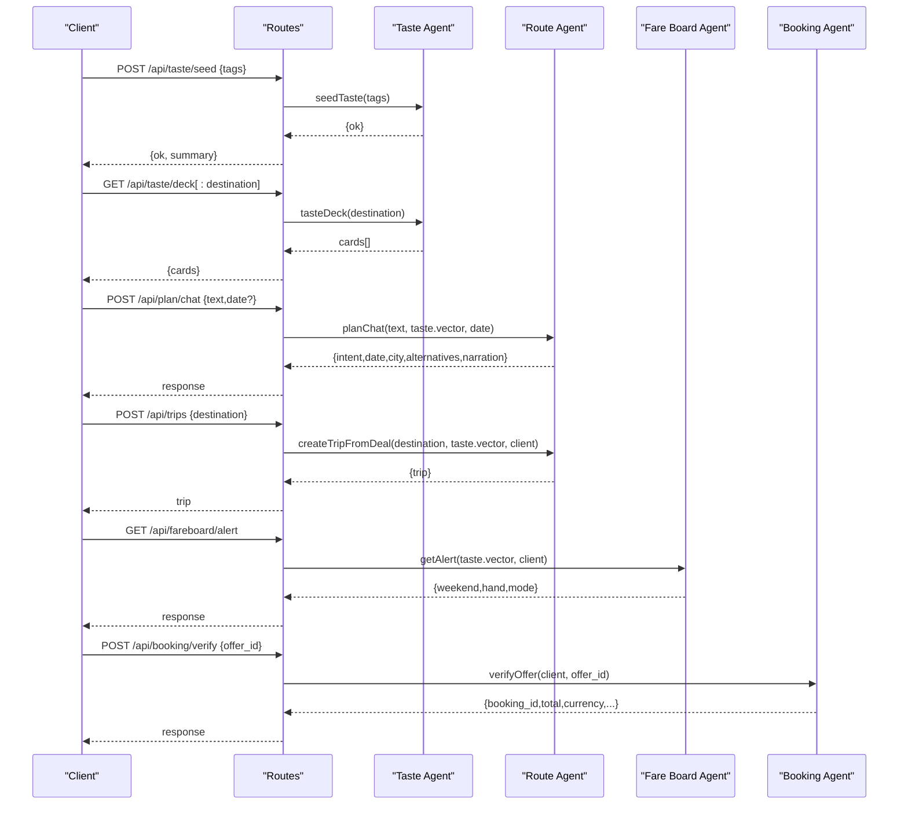
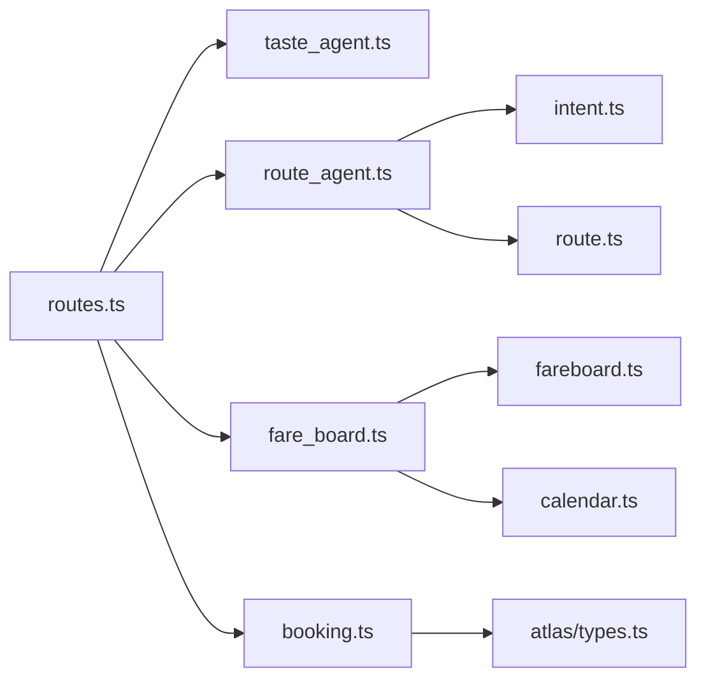

# API Reference

<cite>
**Referenced Files in This Document**
- [routes.ts](file://apps/api/src/routes.ts)
- [server.ts](file://apps/api/src/server.ts)
- [taste_agent.ts](file://apps/api/src/agents/taste_agent.ts)
- [route_agent.ts](file://apps/api/src/agents/route_agent.ts)
- [fare_board.ts](file://apps/api/src/agents/fare_board.ts)
- [booking.ts](file://apps/api/src/booking.ts)
- [intent.ts](file://apps/api/src/intent.ts)
- [types.ts](file://packages/shared/src/types.ts)
- [taste.ts](file://packages/shared/src/taste.ts)
- [route.ts](file://packages/shared/src/route.ts)
- [fareboard.ts](file://packages/shared/src/fareboard.ts)
- [calendar.ts](file://packages/shared/src/calendar.ts)
- [narrate.ts](file://packages/shared/src/narrate.ts)
- [atlas_types.ts](file://apps/api/src/atlas/types.ts)
</cite>

## Table of Contents
1. Introduction
2. Project Structure
3. Core Components
4. Architecture Overview
5. Detailed Component Analysis
6. Dependency Analysis
7. Performance Considerations
8. Troubleshooting Guide
9. Conclusion
10. Appendices

## Introduction
This document provides comprehensive API documentation for the Trip Graph Agent backend. It covers all RESTful endpoints, authentication considerations, HTTP methods, URL patterns, request/response schemas (with TypeScript types from the shared package), and error handling. It also documents the intent parsing system for natural language trip requests, client implementation guidelines, rate limiting considerations, debugging approaches, common use cases, and integration patterns.

## Project Structure
The backend is a Fastify application that registers routes under /api/* and orchestrates several agents:
- Taste Agent: manages user taste preferences via swiping and seeding
- Route Agent: parses natural language intents, builds day plans, creates trips, and supports flight swaps
- Fare Board Agent: ranks fare snapshots into a “hand” of deals and alerts
- Booking Agent: verifies offers, accepts price changes, creates orders, and completes payment
- Data layer: loads city/place data, travel matrices, holidays, and destinations
- Shared package: defines core types and algorithms used by agents

**Diagram sources**
- [routes.ts:10-134](file://apps/api/src/routes.ts#L10-L134)
- [server.ts:8-12](file://apps/api/src/server.ts#L8-L12)
- [taste_agent.ts:28-110](file://apps/api/src/agents/taste_agent.ts#L28-L110)
- [route_agent.ts:62-185](file://apps/api/src/agents/route_agent.ts#L62-L185)
- [fare_board.ts:97-117](file://apps/api/src/agents/fare_board.ts#L97-L117)
- [booking.ts:31-98](file://apps/api/src/booking.ts#L31-L98)
- [intent.ts:41-64](file://apps/api/src/intent.ts#L41-L64)
- [route.ts:349-387](file://packages/shared/src/route.ts#L349-L387)
- [fareboard.ts:111-179](file://packages/shared/src/fareboard.ts#L111-L179)

**Section sources**
- [server.ts:8-25](file://apps/api/src/server.ts#L8-L25)
- [routes.ts:10-134](file://apps/api/src/routes.ts#L10-L134)

## Core Components
- Taste Agent: Maintains an in-memory taste profile with swipe history, must-go lists per destination, and vector scoring. Provides deck generation, seeding, swiping, undo, and summary retrieval.
- Route Agent: Parses natural language to extract city, area, must-tags, and mood tags; builds alternative day plans; creates full trips with flights and daily itineraries; supports swapping outbound flights and reflowing plans.
- Fare Board Agent: Runs nightly batch searches over candidate destinations, stores snapshots, and ranks them into a hand of top deals plus a wildcard based on taste affinity, fare moment distress, and unexpectedness.
- Booking Agent: Implements a deterministic booking state machine: verify offer, accept price change if needed, create order with passenger details, pay with exact approved total, and retrieve ticket status.
- Shared Types and Algorithms: Define core models like FlightOption, TripGraph, DayPlan, StopNode, TasteVector, VibeTag, and utilities for time math, route building, narration, and fare ranking.

**Section sources**
- [taste_agent.ts:14-118](file://apps/api/src/agents/taste_agent.ts#L14-L118)
- [route_agent.ts:19-191](file://apps/api/src/agents/route_agent.ts#L19-L191)
- [fare_board.ts:15-118](file://apps/api/src/agents/fare_board.ts#L15-L118)
- [booking.ts:3-104](file://apps/api/src/booking.ts#L3-L104)
- [types.ts:1-170](file://packages/shared/src/types.ts#L1-L170)
- [route.ts:16-475](file://packages/shared/src/route.ts#L16-L475)
- [fareboard.ts:1-197](file://packages/shared/src/fareboard.ts#L1-L197)
- [narrate.ts:1-79](file://packages/shared/src/narrate.ts#L1-L79)
- [calendar.ts:1-56](file://packages/shared/src/calendar.ts#L1-L56)

## Architecture Overview
The API exposes a set of REST endpoints grouped by feature areas:
- Taste learning: /api/taste/*
- Trip planning chat: /api/plan/chat
- Trip management: /api/trips/*
- Booking workflow: /api/booking/*
- Fare monitoring alerts: /api/fareboard/alert
- Meta and evidence: /api/meta/*, /api/evidence
- Place reveal: /api/reveal/:city/:placeId

**Diagram sources**
- [routes.ts:14-115](file://apps/api/src/routes.ts#L14-L115)
- [taste_agent.ts:28-110](file://apps/api/src/agents/taste_agent.ts#L28-L110)
- [route_agent.ts:62-153](file://apps/api/src/agents/route_agent.ts#L62-L153)
- [fare_board.ts:97-117](file://apps/api/src/agents/fare_board.ts#L97-L117)
- [booking.ts:31-52](file://apps/api/src/booking.ts#L31-L52)

## Detailed Component Analysis

### Authentication and Security
- No explicit authentication middleware is registered in the server setup. The server enables CORS with origin true, allowing browser-based clients to call the API.
- For production deployments, integrate an authentication layer (e.g., JWT, API keys) at the Fastify level before registering routes.
- Sensitive operations (booking) pass through one-time passenger details without storing them beyond the immediate flow.

**Section sources**
- [server.ts:8-12](file://apps/api/src/server.ts#L8-L12)

### Taste Learning Endpoints (/api/taste/*)
- GET /api/taste/deck
  - Purpose: Retrieve a curated deck of place cards for taste learning.
  - Response: { cards: DeckCard[] }
  - Notes: Deterministic diverse pick across vibe tag buckets.

- GET /api/taste/deck/:destination
  - Purpose: Retrieve a deck scoped to a specific destination.
  - Path Params: destination (string)
  - Response: { cards: DeckCard[] }
  - Errors: 404 Unknown destination

- POST /api/taste/seed
  - Purpose: Seed the taste profile with initial vibe tags.
  - Request Body: { tags: VibeTag[] }
  - Response: { ok: boolean, summary?: TasteSummary }
  - Errors: 400 If fewer than minimum vibes selected

- POST /api/taste/swipe
  - Purpose: Record a swipe action (like/pass/mustgo) on a card.
  - Request Body: { cardId: string, action: SwipeAction, destination?: string }
  - Response: { done: boolean, summary?: TasteSummary }
  - Errors: 400 If not seeded or unknown card

- POST /api/taste/undo
  - Purpose: Undo the last swipe.
  - Response: { summary?: TasteSummary }
  - Errors: 400 If not seeded

- GET /api/taste/vector
  - Purpose: Retrieve current taste summary including vector, top tags, must-go list, strength, and swipe count.
  - Response: TasteSummary | Error
  - Errors: 404 Not seeded

Type references:
- VibeTag, DeckCard, SwipeAction, TasteState, TasteVector from shared types.

**Section sources**
- [routes.ts:14-50](file://apps/api/src/routes.ts#L14-L50)
- [taste_agent.ts:28-110](file://apps/api/src/agents/taste_agent.ts#L28-L110)
- [types.ts:18-84](file://packages/shared/src/types.ts#L18-L84)
- [taste.ts:16-68](file://packages/shared/src/taste.ts#L16-L68)

### Trip Planning Interface (/api/plan/chat)
- POST /api/plan/chat
  - Purpose: Parse natural language intent and generate alternative day plans anchored around must-tags or mood tags.
  - Request Body: { text: string, date?: string }
  - Response: { intent: ParsedIntent, date: string, city: { id, name, center }, alternatives: DayRouteResult[], narration: string }
  - Errors: 400 If taste not seeded

Intent parsing:
- Extracts city, area (CBD/downtown), must-tags (must eat/try/see/visit/do/go to ...), and mood tags (quiet, nightlife, art, culture, history, nature, views, shopping, food, coffee, adventure, beach).
- Uses deterministic regex patterns and a city alias map.

**Section sources**
- [routes.ts:52-56](file://apps/api/src/routes.ts#L52-L56)
- [route_agent.ts:62-93](file://apps/api/src/agents/route_agent.ts#L62-L93)
- [intent.ts:41-64](file://apps/api/src/intent.ts#L41-L64)
- [types.ts:8-16](file://packages/shared/src/types.ts#L8-L16)

### Trip Management Endpoints (/api/trips/*)
- POST /api/trips
  - Purpose: Create a full trip graph from a deal destination using upcoming long weekend windows and real flight options.
  - Request Body: { destination: string }
  - Response: TripGraph view (enriched with stops and explanations)
  - Errors: 400 If taste not seeded, no city file, no upcoming long weekend, no flights, or no return flight

- GET /api/trips/:id
  - Purpose: Retrieve a stored trip by ID with enriched stops and available flight options.
  - Path Params: id (string)
  - Response: { graph: TripGraph, cityName: string, center: { lat, lng }, flightOptions: FlightOption[] }
  - Errors: 404 Unknown trip

- POST /api/trips/:id/swap-flight
  - Purpose: Swap the outbound flight and reflow the itinerary accordingly.
  - Path Params: id (string)
  - Request Body: { offer_id: string }
  - Response: { trip: TripGraph, delta: ReflowDelta, narration: string }
  - Errors: 400 Unknown trip or unknown offer

Reflow behavior:
- Rebuilds affected days based on arrival timing and airport cutoffs, preserves non-affected days, and updates budget and narration.

**Section sources**
- [routes.ts:64-85](file://apps/api/src/routes.ts#L64-L85)
- [route_agent.ts:107-185](file://apps/api/src/agents/route_agent.ts#L107-L185)
- [route.ts:349-475](file://packages/shared/src/route.ts#L349-L475)
- [types.ts:86-146](file://packages/shared/src/types.ts#L86-L146)

### Booking Workflow Endpoints (/api/booking/*)
- POST /api/booking/verify
  - Purpose: Verify an offer and obtain a booking_id with verified total and currency. Handles price changes.
  - Request Body: { offer_id: string }
  - Response: { booking_id, total, currency, price_changed, previous_total_with_bag?, environment, mode }
  - Errors: 400 If verification fails

- POST /api/booking/accept-price
  - Purpose: Accept a price increase when price_changed is true.
  - Request Body: { booking_id: string }
  - Response: { booking_id, accepted: boolean }
  - Errors: 400 If booking not found

- POST /api/booking/order
  - Purpose: Create an order with passenger details after verification and price acceptance.
  - Request Body: { booking_id: string, passengers: PassengerInput[] }
  - Response: { confirmation_id, summary: OrderSummary }
  - Errors: 400 If booking not found, price not accepted, or passengers missing

- POST /api/booking/pay
  - Purpose: Pay the order with the exact approved total and retrieve ticketing status.
  - Request Body: { confirmation_id: string, approved_total: number }
  - Response: { order_no, pnr?, ticket_numbers[], ticketing_status, environment, mode }
  - Errors: 409 If consent total mismatch or confirmation not found

Passenger details are passed through once and not stored or logged.

**Section sources**
- [routes.ts:87-115](file://apps/api/src/routes.ts#L87-L115)
- [booking.ts:31-98](file://apps/api/src/booking.ts#L31-L98)
- [atlas_types.ts:42-78](file://apps/api/src/atlas/types.ts#L42-L78)

### Fare Monitoring Alerts (/api/fareboard/alert)
- GET /api/fareboard/alert
  - Purpose: Return a ranked “hand” of deals for the next long weekend based on stored fare snapshots and the user’s taste vector.
  - Response: { weekend: LongWeekend|null, hand: HandResult|null, mode: string }
  - Errors: 400 If taste not seeded

Ranking logic:
- Combines taste affinity, fare moment distress signals (seat scarcity, family spread, refundable/changeable flags), and unexpectedness to rank destinations.
- Top 3 deals plus a sealed wildcard introducing novelty relative to expressed tastes.

**Section sources**
- [routes.ts:58-62](file://apps/api/src/routes.ts#L58-L62)
- [fare_board.ts:97-117](file://apps/api/src/agents/fare_board.ts#L97-L117)
- [fareboard.ts:111-179](file://packages/shared/src/fareboard.ts#L111-L179)
- [types.ts:148-169](file://packages/shared/src/types.ts#L148-L169)

### Meta and Evidence Endpoints
- GET /api/meta/vibes
  - Returns available vibe tags and minimum selection threshold.

- GET /api/meta/mode
  - Returns server mode and environment.

- GET /api/evidence
  - Returns mode, environment, and evidence log entries for debugging.

- GET /api/reveal/:city/:placeId
  - Reveals a sealed wildcard place identity for UI interactions.
  - Errors: 404 Unknown city or place

**Section sources**
- [routes.ts:11-13](file://apps/api/src/routes.ts#L11-L13)
- [routes.ts:117-131](file://apps/api/src/routes.ts#L117-L131)
- [routes.ts:133-134](file://apps/api/src/routes.ts#L133-L134)

## Dependency Analysis
Key dependencies between components:
- Routes depend on agents for business logic and shared types for schemas.
- Route Agent depends on Intent Parser for natural language understanding and Shared Route Builder for trip construction and reflow.
- Fare Board Agent depends on Shared Fare Ranking and Calendar utilities to compute long weekends and rank deals.
- Booking Agent depends on Atlas Client interface for search, verification, ordering, and payment flows.

**Diagram sources**
- [routes.ts:10-134](file://apps/api/src/routes.ts#L10-L134)
- [route_agent.ts:1-191](file://apps/api/src/agents/route_agent.ts#L1-L191)
- [fare_board.ts:1-118](file://apps/api/src/agents/fare_board.ts#L1-L118)
- [booking.ts:1-104](file://apps/api/src/booking.ts#L1-L104)
- [intent.ts:1-65](file://apps/api/src/intent.ts#L1-L65)
- [route.ts:1-475](file://packages/shared/src/route.ts#L1-L475)
- [fareboard.ts:1-197](file://packages/shared/src/fareboard.ts#L1-L197)
- [calendar.ts:1-56](file://packages/shared/src/calendar.ts#L1-L56)
- [atlas_types.ts:1-91](file://apps/api/src/atlas/types.ts#L1-L91)

**Section sources**
- [routes.ts:10-134](file://apps/api/src/routes.ts#L10-L134)
- [route_agent.ts:1-191](file://apps/api/src/agents/route_agent.ts#L1-L191)
- [fare_board.ts:1-118](file://apps/api/src/agents/fare_board.ts#L1-L118)
- [booking.ts:1-104](file://apps/api/src/booking.ts#L1-L104)

## Performance Considerations
- In-memory state: Taste profile, trips, and bookings are stored in memory. For multi-instance deployments, externalize state (e.g., Redis) to maintain consistency.
- Deck caching: Taste decks are cached per destination to avoid repeated computations.
- Nightly fare runs: Batch searches include backoff retries; ensure scheduled tasks run reliably and persist snapshots.
- Rate limiting: No built-in rate limiting; consider adding middleware (e.g., @fastify/rate-limit) to protect endpoints, especially booking and fareboard alert.
- Payload sizes: Trip graphs can be large; paginate or limit fields where appropriate for client consumption.

[No sources needed since this section provides general guidance]

## Troubleshooting Guide
Common errors and resolutions:
- Taste not seeded: Ensure POST /api/taste/seed succeeds before calling plan/chat, trips, or fareboard/alert.
- Unknown destination/card: Validate destination and card IDs returned by deck endpoints.
- No upcoming long weekend: Check holiday calendar and adjust dates; the system derives long weekends from official holidays.
- No flights or return flight: Verify destination has city files and that flight search returns offers; retry later or adjust dates.
- Booking state issues: Follow the sequence verify -> accept-price (if needed) -> order -> pay with exact approved total.
- Evidence logging: Use GET /api/evidence to inspect calls and environment for debugging.

**Section sources**
- [routes.ts:17-50](file://apps/api/src/routes.ts#L17-L50)
- [routes.ts:64-85](file://apps/api/src/routes.ts#L64-L85)
- [routes.ts:87-115](file://apps/api/src/routes.ts#L87-L115)
- [routes.ts:133-134](file://apps/api/src/routes.ts#L133-L134)

## Conclusion
The Trip Graph Agent backend provides a cohesive set of APIs for taste-driven trip planning, deal discovery, and secure booking workflows. By leveraging deterministic intent parsing, robust route building, and transparent fare ranking, it enables reliable integrations for custom applications. Adopt recommended security, rate limiting, and state persistence practices for production readiness.

[No sources needed since this section summarizes without analyzing specific files]

## Appendices

### Request/Response Schemas (Selected)
- VibeTag: One of the predefined tags (food, coffee, nature, culture, nightlife, shopping, adventure, chill, art, history, beach, views, sports, wellness).
- DeckCard: { id, placeId?, title, emoji, vibeTags, subtitle? }
- SwipeAction: "like" | "pass" | "mustgo"
- TasteState: { vector, mustGoByDestination, swipeCount, history }
- FlightOption: Includes offer_id, carrier, flight_no, origin, destination, depart/arrive dates and times, duration, stops, price, bags, price_status, bookable, fare_family, optional seatCount/familySpreadPct/refundable/changeable.
- StopNode: { placeId, arrive, depart, travelMinFromPrev, role, sealed? }
- DayPlan: { date, stops }
- TripBudget: { flightTotal, ground, total, currency }
- TripGraph: { id, city, origin, destination, window, flight, days, budget, narration, explanations }
- LongWeekend: { holiday, start, end, nights }
- FareSnapshotEntry: { origin, destination, depart, offer, fetchedAt, request_id, mode }
- PassengerInput: Full name, gender, DOB, nationality, document info, contact.

**Section sources**
- [types.ts:1-170](file://packages/shared/src/types.ts#L1-L170)
- [atlas_types.ts:19-78](file://apps/api/src/atlas/types.ts#L19-L78)

### Client Implementation Guidelines
- Initialize taste: Call POST /api/taste/seed with at least 5 vibe tags.
- Build preferences: Use GET /api/taste/deck and POST /api/taste/swipe to refine taste; optionally scope to a destination.
- Plan a day: POST /api/plan/chat with natural language text and optional date; consume alternatives and narration.
- Create a trip: POST /api/trips with destination; then GET /api/trips/:id for enriched view and flight options.
- Swap flights: POST /api/trips/:id/swap-flight with offer_id; handle delta and updated narration.
- Discover deals: GET /api/fareboard/alert to get a hand of ranked deals for the next long weekend.
- Book securely: Follow verify -> accept-price (if needed) -> order -> pay with exact approved_total; store confirmation_id and order_no for reconciliation.

**Section sources**
- [routes.ts:14-115](file://apps/api/src/routes.ts#L14-L115)
- [taste_agent.ts:28-110](file://apps/api/src/agents/taste_agent.ts#L28-L110)
- [route_agent.ts:62-185](file://apps/api/src/agents/route_agent.ts#L62-L185)
- [fare_board.ts:97-117](file://apps/api/src/agents/fare_board.ts#L97-L117)
- [booking.ts:31-98](file://apps/api/src/booking.ts#L31-L98)

### Debugging Approaches
- Use GET /api/meta/mode to confirm server mode and environment.
- Use GET /api/evidence to inspect recent calls and logs.
- Inspect deck progress and taste summary via GET /api/taste/vector.
- For fareboard, check snapshot directory and ensure nightly runs persist entries.

**Section sources**
- [routes.ts:11-13](file://apps/api/src/routes.ts#L11-L13)
- [routes.ts:133-134](file://apps/api/src/routes.ts#L133-L134)
- [fare_board.ts:84-92](file://apps/api/src/agents/fare_board.ts#L84-L92)