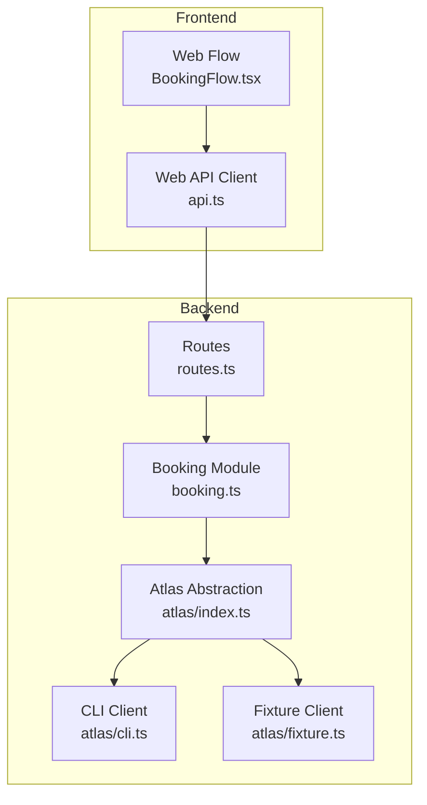
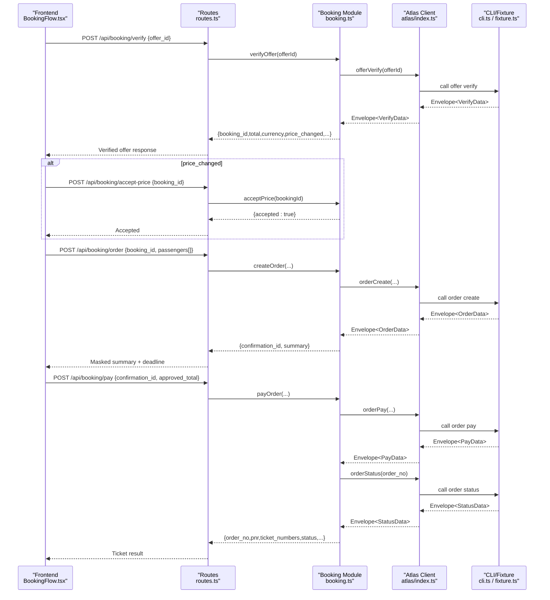
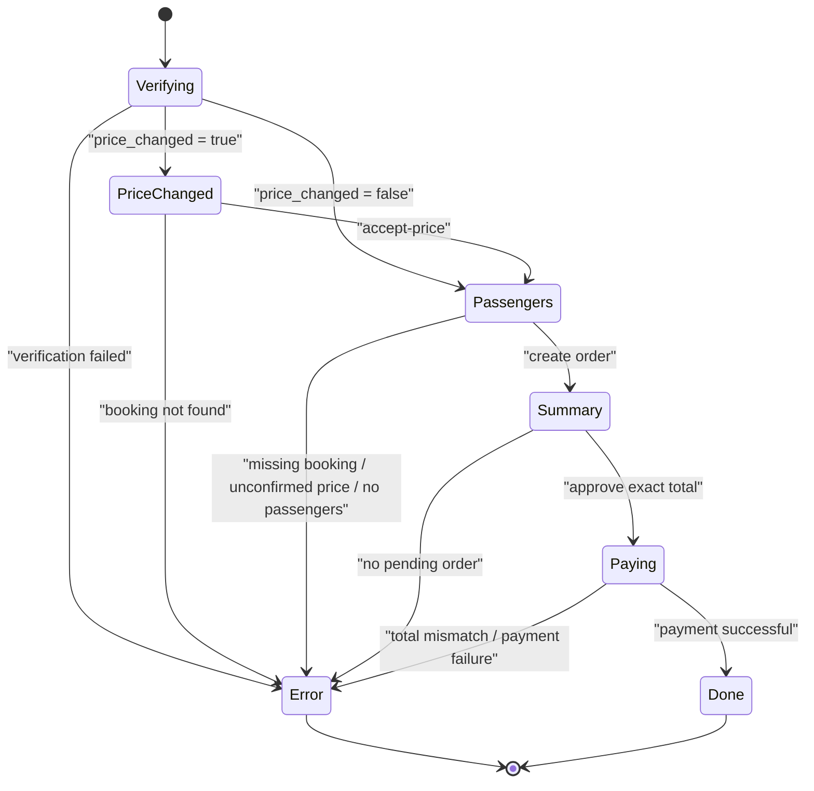
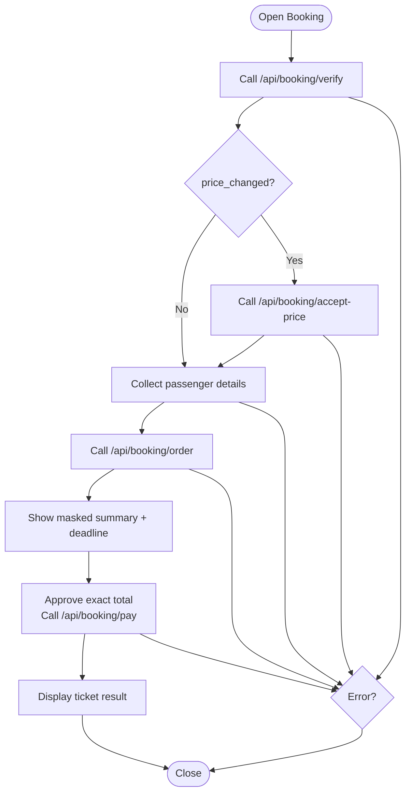
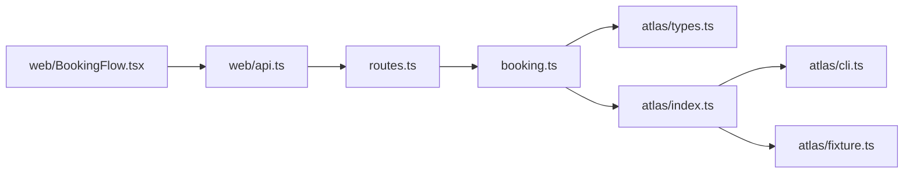

# Booking API

<cite>
**Referenced Files in This Document**
- [routes.ts](file://apps/api/src/routes.ts)
- [booking.ts](file://apps/api/src/booking.ts)
- [types.ts](file://apps/api/src/atlas/types.ts)
- [cli.ts](file://apps/api/src/atlas/cli.ts)
- [fixture.ts](file://apps/api/src/atlas/fixture.ts)
- [index.ts](file://apps/api/src/atlas/index.ts)
- [BookingFlow.tsx](file://apps/web/src/components/booking/BookingFlow.tsx)
- [api.ts](file://apps/web/src/api.ts)
- [atlas.test.ts](file://apps/api/test/atlas.test.ts)
</cite>

## Table of Contents
1. [Introduction](#introduction)
2. [Project Structure](#project-structure)
3. [Core Components](#core-components)
4. [Architecture Overview](#architecture-overview)
5. [Detailed Component Analysis](#detailed-component-analysis)
6. [Dependency Analysis](#dependency-analysis)
7. [Performance Considerations](#performance-considerations)
8. [Troubleshooting Guide](#troubleshooting-guide)
9. [Conclusion](#conclusion)
10. [Appendices](#appendices)

## Introduction
This document provides comprehensive API documentation for the flight booking workflow endpoints that implement a secure, multi-step booking process: offer verification, price change acceptance, order creation with passenger information, and payment confirmation. It explains how these endpoints integrate with Atlas flight booking APIs (via CLI or fixture client), defines data schemas such as PassengerInput, documents booking lifecycle states, and provides examples for handling errors, price discrepancies, and payment failures.

The booking flow enforces strict checkpoints to ensure user consent at each step, prevents shortcuts, and guarantees that sensitive passenger details are passed one-time without being stored or logged.

## Project Structure
The booking functionality is implemented across server routes, a stateful booking module, and an abstraction over Atlas clients. The web frontend orchestrates the UI-driven flow by calling these endpoints in sequence.

**Diagram sources**
- [routes.ts:87-115](file://apps/api/src/routes.ts#L87-L115)
- [booking.ts:31-98](file://apps/api/src/booking.ts#L31-L98)
- [index.ts:10-13](file://apps/api/src/atlas/index.ts#L10-L13)
- [cli.ts:95-113](file://apps/api/src/atlas/cli.ts#L95-L113)
- [fixture.ts:115-203](file://apps/api/src/atlas/fixture.ts#L115-L203)
- [BookingFlow.tsx:55-94](file://apps/web/src/components/booking/BookingFlow.tsx#L55-L94)
- [api.ts:152-194](file://apps/web/src/api.ts#L152-L194)

**Section sources**
- [routes.ts:87-115](file://apps/api/src/routes.ts#L87-L115)
- [booking.ts:31-98](file://apps/api/src/booking.ts#L31-L98)
- [index.ts:10-13](file://apps/api/src/atlas/index.ts#L10-L13)
- [cli.ts:95-113](file://apps/api/src/atlas/cli.ts#L95-L113)
- [fixture.ts:115-203](file://apps/api/src/atlas/fixture.ts#L115-L203)
- [BookingFlow.tsx:55-94](file://apps/web/src/components/booking/BookingFlow.tsx#L55-L94)
- [api.ts:152-194](file://apps/web/src/api.ts#L152-L194)

## Core Components
- Routes: Expose HTTP endpoints for booking steps and map requests to business logic.
- Booking Module: Implements the deterministic state machine for verify → accept-price → order → pay, including validation and error handling.
- Atlas Clients: Provide two implementations:
  - CLI client: shells out to the official atlas-flight CLI in sandbox mode.
  - Fixture client: deterministic offline simulation used in development and tests.
- Web Frontend: Orchestrates the user journey through the booking checkpoints and calls backend endpoints.

Key responsibilities:
- Verify offers and detect price changes.
- Require explicit user acceptance when prices change.
- Create orders with masked summaries and enforce passenger input requirements.
- Enforce exact total approval before payment.
- Return ticketing results and environment/mode metadata.

**Section sources**
- [routes.ts:87-115](file://apps/api/src/routes.ts#L87-L115)
- [booking.ts:31-98](file://apps/api/src/booking.ts#L31-L98)
- [cli.ts:18-26](file://apps/api/src/atlas/cli.ts#L18-L26)
- [fixture.ts:42-47](file://apps/api/src/atlas/fixture.ts#L42-L47)
- [BookingFlow.tsx:5-9](file://apps/web/src/components/booking/BookingFlow.tsx#L5-L9)

## Architecture Overview
The booking workflow follows a fixed sequence enforced by both backend state and frontend UI:

1. Offer Verification: Confirm current price and baggage-inclusive totals; may indicate a price change.
2. Price Change Acceptance: If price changed, require explicit user consent to proceed.
3. Order Creation: Collect passenger details once, create order, return masked summary and payment deadline.
4. Payment Confirmation: Approve the exact displayed total; complete payment and retrieve ticketing status.

**Diagram sources**
- [routes.ts:87-115](file://apps/api/src/routes.ts#L87-L115)
- [booking.ts:31-98](file://apps/api/src/booking.ts#L31-L98)
- [cli.ts:95-113](file://apps/api/src/atlas/cli.ts#L95-L113)
- [fixture.ts:115-203](file://apps/api/src/atlas/fixture.ts#L115-L203)
- [BookingFlow.tsx:55-94](file://apps/web/src/components/booking/BookingFlow.tsx#L55-L94)
- [api.ts:152-194](file://apps/web/src/api.ts#L152-L194)

## Detailed Component Analysis

### Endpoints

#### POST /api/booking/verify
- Purpose: Verify an offer’s current price and baggage-inclusive total; detect price changes.
- Request body:
  - offer_id: string
- Response on success:
  - booking_id: string
  - total: number
  - currency: string
  - price_changed: boolean
  - previous_total: number | null
  - environment: string
  - mode: string
- Error responses:
  - 400 Bad Request with { error, message } when verification fails or offer not found.

Behavior:
- Calls Atlas offerVerify and stores verified booking state internally.
- Returns metadata indicating whether price changed and what the previous total was.

**Section sources**
- [routes.ts:87-91](file://apps/api/src/routes.ts#L87-L91)
- [booking.ts:31-52](file://apps/api/src/booking.ts#L31-L52)
- [types.ts:32-40](file://apps/api/src/atlas/types.ts#L32-L40)

#### POST /api/booking/accept-price
- Purpose: Explicitly accept a new total when price has changed.
- Request body:
  - booking_id: string
- Response on success:
  - accepted: boolean
- Error responses:
  - 400 Bad Request with { error } when booking not found.

Behavior:
- Marks the verified booking as priceAccepted so order creation can proceed.

**Section sources**
- [routes.ts:93-97](file://apps/api/src/routes.ts#L93-L97)
- [booking.ts:54-59](file://apps/api/src/booking.ts#L54-L59)

#### POST /api/booking/order
- Purpose: Create a booking order using verified offer and passenger details.
- Request body:
  - booking_id: string
  - passengers: PassengerInput[]
- Response on success:
  - confirmation_id: string
  - summary:
    - flight_no: string
    - route: string
    - depart: string
    - passenger_masked: string
    - total: number
    - currency: string
    - payment_deadline: string
- Error responses:
  - 400 Bad Request with { error, message } for missing booking, unconfirmed price, or empty passengers.

Behavior:
- Validates prior verification and price acceptance.
- Creates order via Atlas and stores pending order keyed by confirmation_id.
- Returns masked passenger info and payment deadline.

**Section sources**
- [routes.ts:99-106](file://apps/api/src/routes.ts#L99-L106)
- [booking.ts:61-75](file://apps/api/src/booking.ts#L61-L75)
- [types.ts:42-66](file://apps/api/src/atlas/types.ts#L42-L66)

#### POST /api/booking/pay
- Purpose: Complete payment for a pending order after explicit approval of the exact total.
- Request body:
  - confirmation_id: string
  - approved_total: number
- Response on success:
  - order_no: string
  - pnr: string | null
  - ticket_numbers: string[]
  - ticketing_status: string
  - environment: string
  - mode: string
- Error responses:
  - 409 Conflict with { error, message } if confirmation not found or approved total mismatch.

Behavior:
- Ensures approved_total matches the exact displayed total.
- Executes payment and retrieves final ticketing status.

**Section sources**
- [routes.ts:108-115](file://apps/api/src/routes.ts#L108-L115)
- [booking.ts:77-98](file://apps/api/src/booking.ts#L77-L98)

### Data Schemas

#### PassengerInput
- full_name: string
- gender: string
- date_of_birth: string
- nationality: string
- document_type: string
- document_number: string
- issuing_country: string
- expiry_date: string
- contact_name: string

Notes:
- Passed one-time to the order creation endpoint.
- Never stored or logged by the system; only masked names appear in summaries.

**Section sources**
- [types.ts:42-52](file://apps/api/src/atlas/types.ts#L42-L52)
- [fixture.ts:155-165](file://apps/api/src/atlas/fixture.ts#L155-L165)

#### Envelope<T>
- schema_version: string
- status: "ok" | "error"
- code: string
- message: string
- retryable: boolean
- request_id: string
- data: T | null
- details: unknown

Used consistently across all Atlas operations.

**Section sources**
- [types.ts:8-17](file://apps/api/src/atlas/types.ts#L8-L17)

### Booking Lifecycle States
The internal state machine ensures a deterministic, auditable flow:

**Diagram sources**
- [booking.ts:31-98](file://apps/api/src/booking.ts#L31-L98)
- [routes.ts:87-115](file://apps/api/src/routes.ts#L87-L115)

### Atlas Integration

#### CLI Client
- Shells out to the official atlas-flight CLI in sandbox mode.
- Requires prior authorization and environment selection.
- Sends passenger details via stdin one-time; never logs them.
- Records evidence for every operation.

**Section sources**
- [cli.ts:18-26](file://apps/api/src/atlas/cli.ts#L18-L26)
- [cli.ts:31-79](file://apps/api/src/atlas/cli.ts#L31-L79)
- [cli.ts:95-113](file://apps/api/src/atlas/cli.ts#L95-L113)

#### Fixture Client
- Deterministic offline implementation for development and tests.
- Simulates price bumps for specific offers to test price-change flows.
- Masks passenger names in summaries and enforces single-use confirmations.

**Section sources**
- [fixture.ts:42-47](file://apps/api/src/atlas/fixture.ts#L42-L47)
- [fixture.ts:115-135](file://apps/api/src/atlas/fixture.ts#L115-L135)
- [fixture.ts:137-167](file://apps/api/src/atlas/fixture.ts#L137-L167)
- [fixture.ts:169-203](file://apps/api/src/atlas/fixture.ts#L169-L203)

### Frontend Orchestration
The web component drives the user through each checkpoint, ensuring consent at critical points and preventing bypasses.

**Diagram sources**
- [BookingFlow.tsx:55-94](file://apps/web/src/components/booking/BookingFlow.tsx#L55-L94)
- [api.ts:152-194](file://apps/web/src/api.ts#L152-L194)

**Section sources**
- [BookingFlow.tsx:55-94](file://apps/web/src/components/booking/BookingFlow.tsx#L55-L94)
- [api.ts:152-194](file://apps/web/src/api.ts#L152-L194)

## Dependency Analysis
- Routes depend on the Booking module for business logic.
- Booking module depends on AtlasClient interface; actual behavior determined by environment.
- AtlasClient implementations encapsulate external dependencies (CLI or fixtures).
- Frontend depends on typed API client functions that call the routes.

**Diagram sources**
- [routes.ts:1-10](file://apps/api/src/routes.ts#L1-L10)
- [booking.ts:1-2](file://apps/api/src/booking.ts#L1-L2)
- [index.ts:1-13](file://apps/api/src/atlas/index.ts#L1-L13)
- [api.ts:152-194](file://apps/web/src/api.ts#L152-L194)
- [BookingFlow.tsx:55-94](file://apps/web/src/components/booking/BookingFlow.tsx#L55-L94)

**Section sources**
- [routes.ts:1-10](file://apps/api/src/routes.ts#L1-L10)
- [booking.ts:1-2](file://apps/api/src/booking.ts#L1-L2)
- [index.ts:1-13](file://apps/api/src/atlas/index.ts#L1-L13)
- [api.ts:152-194](file://apps/web/src/api.ts#L152-L194)
- [BookingFlow.tsx:55-94](file://apps/web/src/components/booking/BookingFlow.tsx#L55-L94)

## Performance Considerations
- CLI client uses a timeout for child process execution; consider monitoring latency and retries based on envelope.retryable flag.
- Fixture client is deterministic and fast; suitable for local-first development and tests.
- Evidence logging records each operation; ensure log volume is managed in production.
- Avoid unnecessary repeated verification; cache verified booking state per session where appropriate.

[No sources needed since this section provides general guidance]

## Troubleshooting Guide
Common issues and strategies:

- Offer verification failure:
  - Symptoms: 400 response with error code and message from Atlas.
  - Action: Inspect envelope.code and message; validate offer_id; check environment and credentials if using CLI.

- Price discrepancy:
  - Symptoms: price_changed = true; previous_total differs from current total.
  - Action: Present difference to user; require explicit acceptance via /api/booking/accept-price before proceeding.

- Missing or invalid passenger details:
  - Symptoms: 400 response with PASSENGERS_REQUIRED.
  - Action: Ensure non-empty passengers array with required fields; validate formats.

- Unconfirmed price change:
  - Symptoms: 400 response with PRICE_CHANGE_UNCONFIRMED.
  - Action: Call /api/booking/accept-price first.

- Payment confirmation mismatch:
  - Symptoms: 409 response with CONSENT_TOTAL_MISMATCH.
  - Action: Ensure approved_total exactly matches the displayed total from the summary.

- Single-use confirmation reuse:
  - Symptoms: 409 response with CONFIRMATION_USED.
  - Action: Use fresh confirmation_id per payment attempt.

- CLI unavailable:
  - Symptoms: CLI_UNAVAILABLE fallback envelope.
  - Action: Verify atlas-flight CLI installation, authentication, and environment selection; fall back to fixture mode for local development.

Evidence log:
- Use /api/evidence to inspect recorded operations, request IDs, modes, and environments for debugging.

**Section sources**
- [booking.ts:54-98](file://apps/api/src/booking.ts#L54-L98)
- [cli.ts:58-79](file://apps/api/src/atlas/cli.ts#L58-L79)
- [fixture.ts:115-203](file://apps/api/src/atlas/fixture.ts#L115-L203)
- [routes.ts:87-115](file://apps/api/src/routes.ts#L87-L115)
- [atlas.test.ts:43-73](file://apps/api/test/atlas.test.ts#L43-L73)

## Conclusion
The booking API implements a robust, checkpoint-driven workflow that integrates with Atlas flight booking services while enforcing user consent and security best practices. By separating concerns between routes, booking logic, and Atlas clients, the system remains flexible for both live CLI usage and deterministic fixture-based development. The provided endpoints, schemas, and error-handling patterns enable reliable end-to-end booking experiences with clear feedback for price changes and payment outcomes.

[No sources needed since this section summarizes without analyzing specific files]

## Appendices

### Example Requests and Responses

- Verify offer:
  - Request: POST /api/booking/verify { offer_id: "fxo-tr318-1106" }
  - Success: { booking_id, total, currency, price_changed, previous_total, environment, mode }
  - Error: { error, message }

- Accept price change:
  - Request: POST /api/booking/accept-price { booking_id: "<id>" }
  - Success: { accepted: true }
  - Error: { error: "BOOKING_NOT_FOUND" }

- Create order:
  - Request: POST /api/booking/order { booking_id, passengers: [PassengerInput] }
  - Success: { confirmation_id, summary }
  - Error: { error, message }

- Pay order:
  - Request: POST /api/booking/pay { confirmation_id, approved_total }
  - Success: { order_no, pnr, ticket_numbers, ticketing_status, environment, mode }
  - Error: { error, message }

**Section sources**
- [routes.ts:87-115](file://apps/api/src/routes.ts#L87-L115)
- [types.ts:42-78](file://apps/api/src/atlas/types.ts#L42-L78)
- [api.ts:152-194](file://apps/web/src/api.ts#L152-L194)