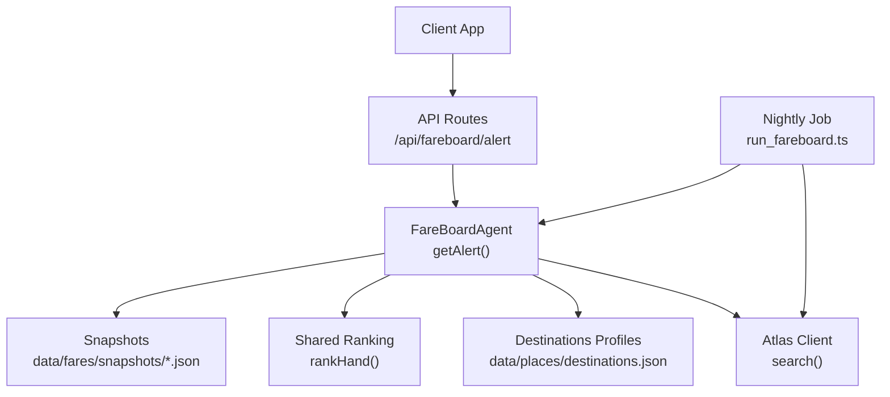
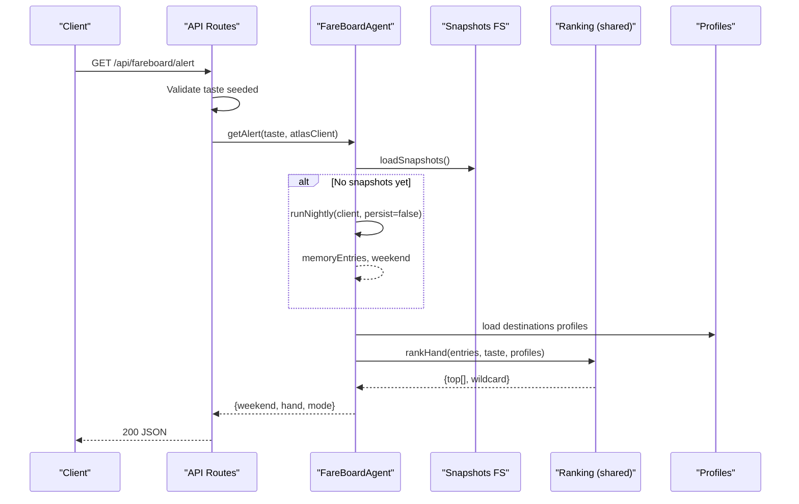
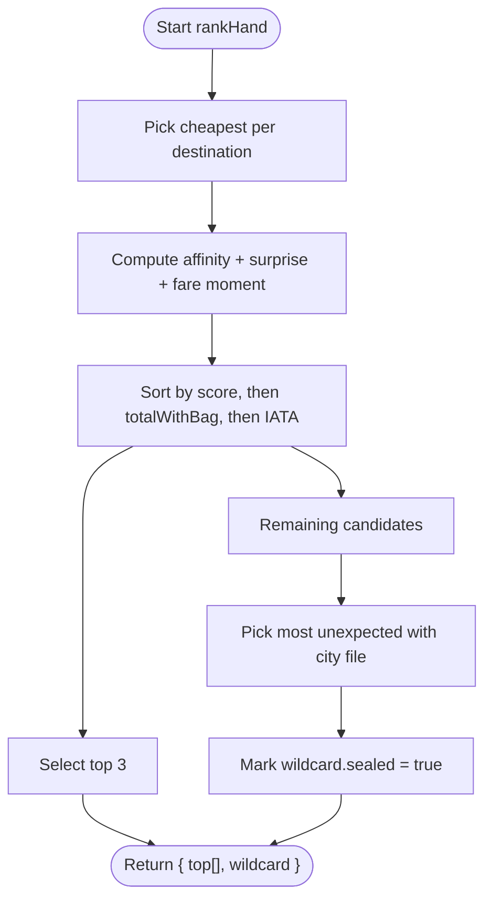
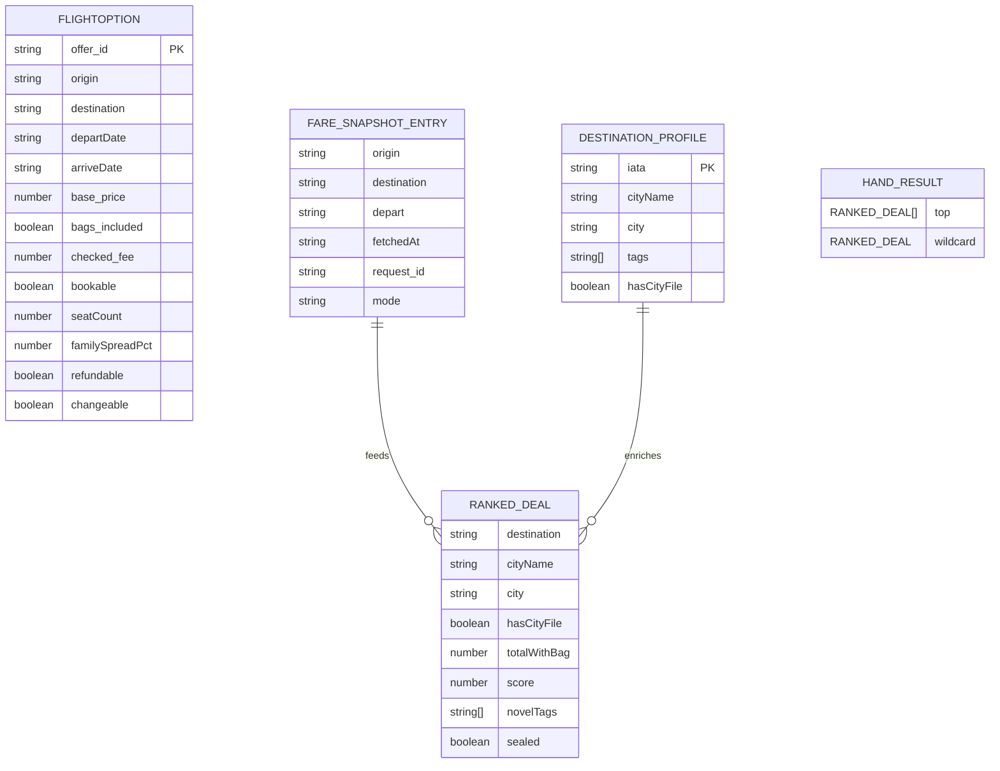
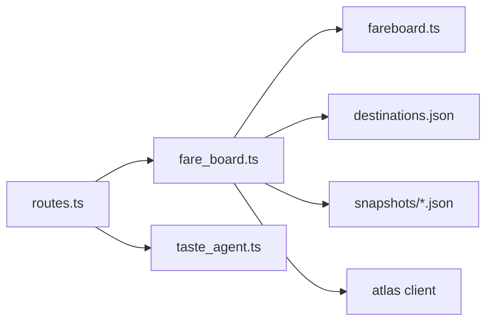

# Fare Monitoring API

<cite>
**Referenced Files in This Document**
- [routes.ts](file://apps/api/src/routes.ts)
- [fare_board.ts](file://apps/api/src/agents/fare_board.ts)
- [run_fareboard.ts](file://apps/api/src/jobs/run_fareboard.ts)
- [fareboard.ts](file://packages/shared/src/fareboard.ts)
- [types.ts](file://packages/shared/src/types.ts)
- [destinations.json](file://data/places/destinations.json)
- [api.test.ts](file://apps/api/test/api.test.ts)
- [api.ts](file://apps/web/src/api.ts)
- [fare-board-nightly.md](file://infra/scheduled-tasks/fare-board-nightly.md)
</cite>

## Table of Contents
1. [Introduction](#introduction)
2. [Project Structure](#project-structure)
3. [Core Components](#core-components)
4. [Architecture Overview](#architecture-overview)
5. [Detailed Component Analysis](#detailed-component-analysis)
6. [Dependency Analysis](#dependency-analysis)
7. [Performance Considerations](#performance-considerations)
8. [Troubleshooting Guide](#troubleshooting-guide)
9. [Conclusion](#conclusion)
10. [Appendices](#appendices)

## Introduction
This document describes the fare monitoring and alert system exposed by the API, focusing on the /api/fareboard/alert endpoint. It explains how the fare board agent monitors flight prices nightly, ranks deals against a user’s taste profile, and returns a hand of three open deals plus one sealed wildcard deal. It also documents the background job that runs nightly fare monitoring, the alert format, timing considerations, and integration patterns for real-time applications.

## Project Structure
The fare monitoring feature spans:
- API routes that expose the alert endpoint and gate it behind a seeded taste profile
- A fare board agent that performs nightly batch scans and per-user ranking over stored snapshots
- Shared ranking logic that blends taste affinity with fare-moment signals to produce ranked deals
- A scheduled task configuration that runs the nightly scan and persists snapshots
- Web client types that mirror the API response shapes for frontend consumption

**Diagram sources**
- [routes.ts:58-62](file://apps/api/src/routes.ts#L58-L62)
- [fare_board.ts:41-82](file://apps/api/src/agents/fare_board.ts#L41-L82)
- [fare_board.ts:97-117](file://apps/api/src/agents/fare_board.ts#L97-L117)
- [fareboard.ts:111-179](file://packages/shared/src/fareboard.ts#L111-L179)
- [run_fareboard.ts:1-15](file://apps/api/src/jobs/run_fareboard.ts#L1-L15)
- [destinations.json:1-98](file://data/places/destinations.json#L1-L98)

**Section sources**
- [routes.ts:58-62](file://apps/api/src/routes.ts#L58-L62)
- [fare_board.ts:41-82](file://apps/api/src/agents/fare_board.ts#L41-L82)
- [fare_board.ts:97-117](file://apps/api/src/agents/fare_board.ts#L97-L117)
- [run_fareboard.ts:1-15](file://apps/api/src/jobs/run_fareboard.ts#L1-L15)
- [fareboard.ts:111-179](file://packages/shared/src/fareboard.ts#L111-L179)
- [destinations.json:1-98](file://data/places/destinations.json#L1-L98)

## Core Components
- Alert endpoint: GET /api/fareboard/alert
  - Requires a seeded taste profile via prior calls to the taste endpoints
  - Returns a weekend window, a hand of ranked deals, and the operating mode
- Fare board agent: nightly batch and per-user ranking
  - Nightly batch queries fares for a fixed candidate set and next long weekend
  - Per-user path ranks stored snapshots using taste and fare-moment signals
- Shared ranking: rankHand
  - Produces top 3 deals and a sealed wildcard based on blended scores
- Nightly job: run_fareboard
  - Orchestrates the nightly scan and writes snapshot files
- Data models: shared types and destination profiles
  - Defines FlightOption, FareSnapshotEntry, HandResult, RankedDeal, etc.

**Section sources**
- [routes.ts:58-62](file://apps/api/src/routes.ts#L58-L62)
- [fare_board.ts:41-82](file://apps/api/src/agents/fare_board.ts#L41-L82)
- [fare_board.ts:97-117](file://apps/api/src/agents/fare_board.ts#L97-L117)
- [fareboard.ts:111-179](file://packages/shared/src/fareboard.ts#L111-L179)
- [run_fareboard.ts:1-15](file://apps/api/src/jobs/run_fareboard.ts#L1-L15)
- [types.ts:86-169](file://packages/shared/src/types.ts#L86-L169)
- [destinations.json:1-98](file://data/places/destinations.json#L1-L98)

## Architecture Overview
The alert flow combines a pre-seeded taste vector with stored fare snapshots to return a personalized hand of deals. The nightly job ensures fresh snapshots are available; if none exist at request time, the agent can perform an in-memory pass to keep the demo functional.

**Diagram sources**
- [routes.ts:58-62](file://apps/api/src/routes.ts#L58-L62)
- [fare_board.ts:97-117](file://apps/api/src/agents/fare_board.ts#L97-L117)
- [fare_board.ts:41-82](file://apps/api/src/agents/fare_board.ts#L41-L82)
- [fareboard.ts:111-179](file://packages/shared/src/fareboard.ts#L111-L179)

## Detailed Component Analysis

### Alert Endpoint: GET /api/fareboard/alert
- Purpose: Return a personalized hand of fare deals for the upcoming long weekend based on the current taste profile and latest snapshots.
- Prerequisites: Taste must be seeded first via the taste endpoints; otherwise returns a 400 error.
- Response fields:
  - weekend: LongWeekend object or null when no upcoming long weekend is found
  - hand: HandResult containing top[] and wildcard
  - mode: string indicating environment/mode used by the Atlas client
- Error behavior:
  - 400 when taste is not seeded
  - If fewer than four valid entries exist, hand may be null; clients should handle gracefully

Response schema (derived from shared types and tests):
- Weekend:
  - holiday: string
  - start: string (ISO date)
  - end: string (ISO date)
  - nights: number
- Hand:
  - top: array of RankedDeal (up to 3)
  - wildcard: RankedDeal (sealed)
- Mode: string (e.g., "fixture", "cli")

RankedDeal fields:
- destination: string (IATA)
- cityName: string
- city: string (slug)
- hasCityFile: boolean
- offer: FlightOption
- totalWithBag: number (headline price including checked bag fee if not included)
- score: number (internal ranking score)
- novelTags: array of VibeTag
- sealed: boolean (true only for wildcard)

FlightOption fields include carrier info, route, times, duration, stops, price, bags, bookable flags, and optional distress signals (seatCount, familySpreadPct, refundable, changeable).

Timing considerations:
- The endpoint does not call live search directly; it ranks stored snapshots
- If no snapshots exist, the agent runs an in-memory batch once to populate results for the session
- Snapshot persistence occurs during the nightly job; per-user requests do not write files

Integration notes:
- Clients should seed taste before calling this endpoint
- Clients can poll or refresh the alert periodically; responses are deterministic given the same snapshots and taste

**Section sources**
- [routes.ts:58-62](file://apps/api/src/routes.ts#L58-L62)
- [fare_board.ts:97-117](file://apps/api/src/agents/fare_board.ts#L97-L117)
- [types.ts:86-169](file://packages/shared/src/types.ts#L86-L169)
- [api.test.ts:73-85](file://apps/api/test/api.test.ts#L73-L85)
- [api.ts:65-81](file://apps/web/src/api.ts#L65-L81)

### Background Job: Nightly Fare Monitoring
- Entry point: apps/api/src/jobs/run_fareboard.ts
- Behavior:
  - Creates an Atlas client and invokes runNightly to query fares for the next long weekend across the fixed candidate destinations
  - Persists snapshots into data/fares/snapshots/<date>.json
  - Logs summary including number of entries and weekend window
- Scheduling:
  - Configured as a daily scheduled task at 02:00 SGT
  - Uses cheap model tier and off goal mode
  - Runs npm run fareboard which executes the job script
- Backoff and retries:
  - The nightly runner backs off on retryable rate-limit responses with exponential delays
  - Only non-retryable or final attempts break the loop

Operational constraints:
- Candidate set is fixed to eight destinations defined in destinations.json
- Only search operations are allowed; no passenger data is logged

**Section sources**
- [run_fareboard.ts:1-15](file://apps/api/src/jobs/run_fareboard.ts#L1-L15)
- [fare_board.ts:41-82](file://apps/api/src/agents/fare_board.ts#L41-L82)
- [fare-board-nightly.md:1-35](file://infra/scheduled-tasks/fare-board-nightly.md#L1-L35)
- [destinations.json:1-98](file://data/places/destinations.json#L1-L98)

### Ranking Algorithm: How Alerts Are Generated
- Inputs:
  - FareSnapshotEntry[]: cheapest offers per destination for the depart date
  - TasteVector: user’s vibe affinities
  - Destination profiles: tags and metadata per destination
- Scoring components:
  - Taste affinity: average tag affinity plus unexpectedness relative to strong tags
  - Fare moment: scarcity and restrictiveness signals (seat count, family spread, refundability/changeability)
  - Blend weights: 65% taste, 35% fare moment
- Output:
  - Top 3 deals sorted by blend score, then cheaper totalWithBag, then IATA tie-break
  - Wildcard: most unexpected remaining destination with full trip data, marked sealed

**Diagram sources**
- [fareboard.ts:111-179](file://packages/shared/src/fareboard.ts#L111-L179)

**Section sources**
- [fareboard.ts:111-179](file://packages/shared/src/fareboard.ts#L111-L179)
- [types.ts:86-169](file://packages/shared/src/types.ts#L86-L169)

### Data Models and Relationships

**Diagram sources**
- [types.ts:86-169](file://packages/shared/src/types.ts#L86-L169)
- [fareboard.ts:111-179](file://packages/shared/src/fareboard.ts#L111-L179)
- [destinations.json:1-98](file://data/places/destinations.json#L1-L98)

## Dependency Analysis
- API routes depend on:
  - Taste agent to ensure a seeded profile exists
  - Fare board agent to compute alerts
- Fare board agent depends on:
  - Snapshot storage (filesystem)
  - Destination profiles
  - Shared ranking functions
  - Atlas client for nightly search
- Shared ranking depends on:
  - Types for FlightOption, FareSnapshotEntry, TasteVector
  - Destination profiles for tags and metadata

**Diagram sources**
- [routes.ts:58-62](file://apps/api/src/routes.ts#L58-L62)
- [fare_board.ts:97-117](file://apps/api/src/agents/fare_board.ts#L97-L117)
- [fareboard.ts:111-179](file://packages/shared/src/fareboard.ts#L111-L179)
- [destinations.json:1-98](file://data/places/destinations.json#L1-L98)

**Section sources**
- [routes.ts:58-62](file://apps/api/src/routes.ts#L58-L62)
- [fare_board.ts:97-117](file://apps/api/src/agents/fare_board.ts#L97-L117)
- [fareboard.ts:111-179](file://packages/shared/src/fareboard.ts#L111-L179)

## Performance Considerations
- Per-user alert requests are fast: they read snapshots from disk and run pure ranking logic without live network calls
- Nightly job uses backoff on retryable errors to avoid hammering external services
- Snapshot directory is small and local; reads are O(n) over entries but typically limited to ~8 destinations
- Ranking complexity is dominated by sorting up to N destinations; N is small and constant

[No sources needed since this section provides general guidance]

## Troubleshooting Guide
Common issues and resolutions:
- 400 error on /api/fareboard/alert
  - Cause: Taste not seeded
  - Resolution: Call taste seeding endpoints first to build a valid taste vector
- Empty or null hand
  - Cause: Fewer than four valid snapshot entries available
  - Resolution: Ensure nightly job ran successfully and produced snapshots; verify snapshot files exist
- Fixture vs CLI mode
  - In fixture mode, distress signals may be present; in CLI mode, some fields may be stripped
  - Use the evidence endpoint to inspect mode and recent calls
- Rate limiting during nightly runs
  - The job backs off automatically; check logs for retryable codes and do not re-run manually unless necessary

**Section sources**
- [routes.ts:58-62](file://apps/api/src/routes.ts#L58-L62)
- [fare_board.ts:41-82](file://apps/api/src/agents/fare_board.ts#L41-L82)
- [fare_board.ts:97-117](file://apps/api/src/agents/fare_board.ts#L97-L117)
- [api.test.ts:73-85](file://apps/api/test/api.test.ts#L73-L85)

## Conclusion
The fare monitoring API delivers personalized fare alerts by combining a user’s taste profile with nightly-fetched fare snapshots. The /api/fareboard/alert endpoint returns a compact, actionable hand of deals optimized for both personal relevance and favorable fare moments. The nightly job ensures fresh data while keeping per-request latency low. Integrators should seed taste first, consume the alert endpoint, and optionally expand deals into trips or swap flights for dynamic planning.

[No sources needed since this section summarizes without analyzing specific files]

## Appendices

### Request/Response Schema Summary
- GET /api/fareboard/alert
  - Success 200:
    - weekend: { holiday, start, end, nights } | null
    - hand: { top: RankedDeal[], wildcard: RankedDeal } | null
    - mode: string
  - Error 400:
    - { error: "Seed taste first" }

- RankedDeal:
  - destination, cityName, city, hasCityFile, offer, totalWithBag, score, novelTags, sealed

- FlightOption (selected fields):
  - offer_id, carrier, flight_no, origin, destination, departDate, arriveDate, duration_min, stops, price.base, price.currency, bags.included, bags.checked_fee, bookable, seatCount, familySpreadPct, refundable, changeable

- LongWeekend:
  - holiday, start, end, nights

**Section sources**
- [routes.ts:58-62](file://apps/api/src/routes.ts#L58-L62)
- [types.ts:86-169](file://packages/shared/src/types.ts#L86-L169)
- [api.ts:65-81](file://apps/web/src/api.ts#L65-L81)
- [api.test.ts:73-85](file://apps/api/test/api.test.ts#L73-L85)

### Example Alert Response
A typical successful response includes:
- weekend: identifies the upcoming long weekend and its dates
- hand.top: three ranked deals with headline prices including a checked bag
- hand.wildcard: a sealed deal that reveals its identity upon interaction
- mode: indicates whether the result came from fixtures or live CLI

Example shape (values illustrative):
- weekend: { holiday: "Deepavali", start: "YYYY-MM-DD", end: "YYYY-MM-DD", nights: N }
- hand.top: [
    { destination: "DAD", cityName: "Da Nang", ... },
    { destination: "DPS", cityName: "Bali", ... },
    { destination: "KCH", cityName: "Kuching", ... }
  ]
- hand.wildcard: { destination: "CNX", ..., sealed: true }
- mode: "fixture"

**Section sources**
- [api.test.ts:73-85](file://apps/api/test/api.test.ts#L73-L85)
- [api.ts:65-81](file://apps/web/src/api.ts#L65-L81)

### Integration Patterns for Real-Time Applications
- Pre-seed taste:
  - Call taste seeding and swiping endpoints to build a robust taste vector
- Poll or refresh alerts:
  - Periodically call /api/fareboard/alert to reflect updated snapshots after nightly runs
- Expand deals to trips:
  - Use trip creation endpoints to plan detailed itineraries from selected deals
- Swap flights:
  - Use swap-flight endpoints to refine day plans and observe deltas
- Observe mode and evidence:
  - Check mode and evidence endpoints to understand environment and recent calls

**Section sources**
- [routes.ts:58-62](file://apps/api/src/routes.ts#L58-L62)
- [api.test.ts:87-112](file://apps/api/test/api.test.ts#L87-L112)