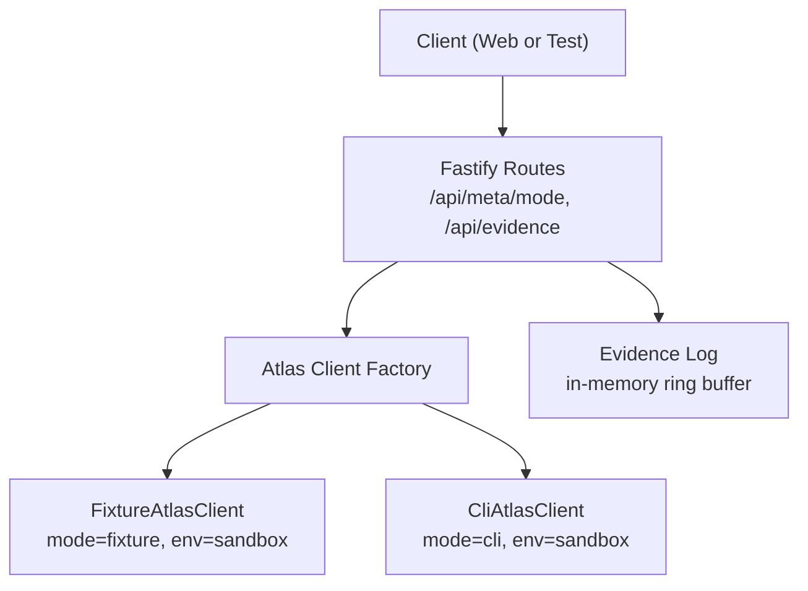
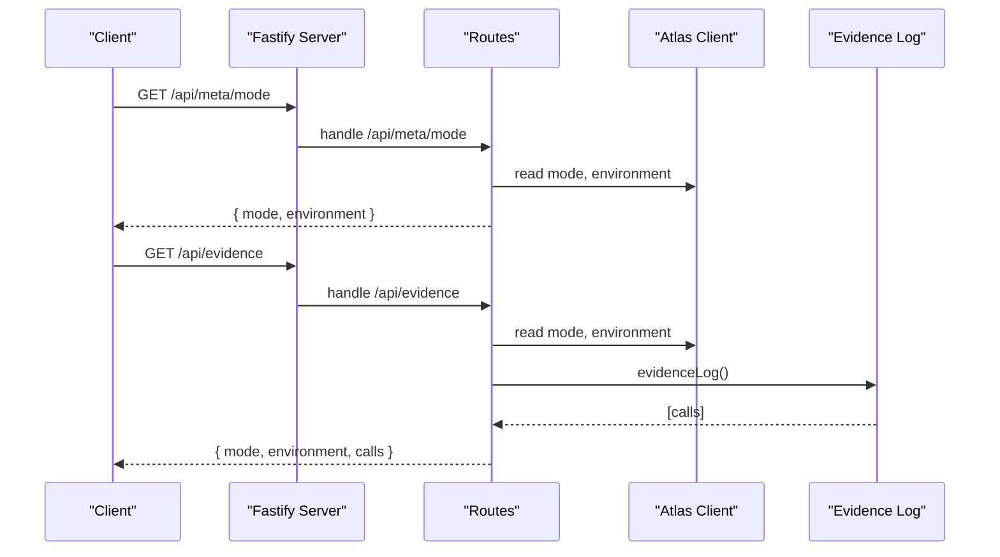
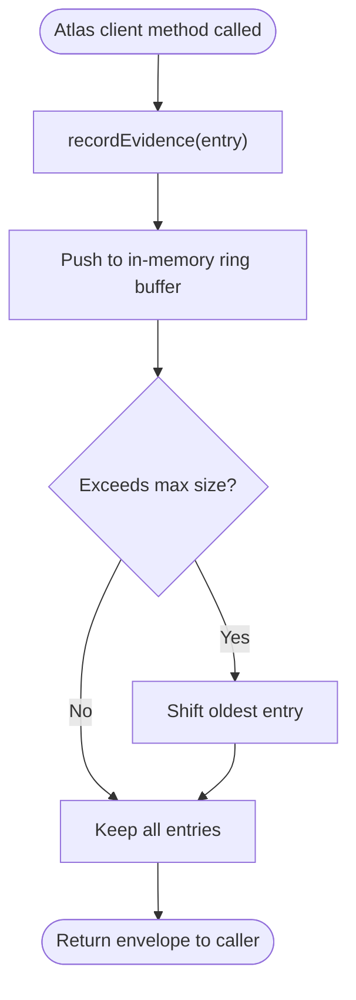
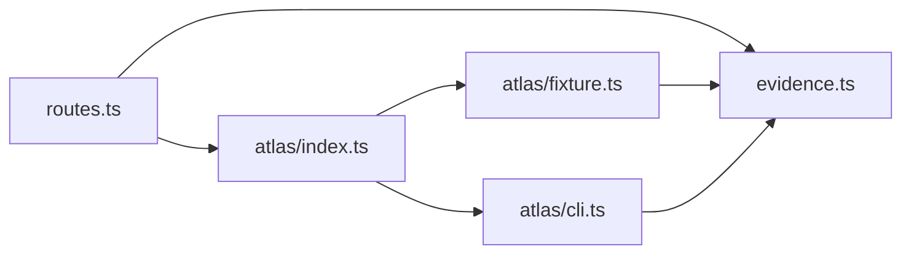

# System Meta API

<cite>
**Referenced Files in This Document**
- [routes.ts](file://apps/api/src/routes.ts)
- [evidence.ts](file://apps/api/src/evidence.ts)
- [server.ts](file://apps/api/src/server.ts)
- [index.ts](file://apps/api/src/atlas/index.ts)
- [types.ts](file://apps/api/src/atlas/types.ts)
- [fixture.ts](file://apps/api/src/atlas/fixture.ts)
- [cli.ts](file://apps/api/src/atlas/cli.ts)
- [api.ts](file://apps/web/src/api.ts)
- [EvidencePanel.tsx](file://apps/web/src/components/evidence/EvidencePanel.tsx)
</cite>

## Table of Contents
1. [Introduction](#introduction)
2. [Project Structure](#project-structure)
3. [Core Components](#core-components)
4. [Architecture Overview](#architecture-overview)
5. [Detailed Component Analysis](#detailed-component-analysis)
6. [Dependency Analysis](#dependency-analysis)
7. [Performance Considerations](#performance-considerations)
8. [Troubleshooting Guide](#troubleshooting-guide)
9. [Conclusion](#conclusion)

## Introduction
This document explains the system metadata and debugging endpoints that support development, testing, and troubleshooting workflows:
- /api/meta/mode: Returns application mode and environment information for the current server instance.
- /api/evidence: Returns a recent log of Atlas client calls (operation metadata only), along with mode and environment context.

These endpoints help you verify how the API is configured at runtime, understand which backend implementation is active, and inspect the sequence of external operations performed during requests.

## Project Structure
The endpoints are registered in the Fastify routes file and rely on an Atlas client abstraction that can run in two modes:
- fixture: deterministic, offline data used for local-first development and tests.
- cli: shells out to the official atlas-flight CLI against a sandbox environment.

**Diagram sources**
- [routes.ts:10-13](file://apps/api/src/routes.ts#L10-L13)
- [index.ts:10-13](file://apps/api/src/atlas/index.ts#L10-L13)
- [fixture.ts:48-50](file://apps/api/src/atlas/fixture.ts#L48-L50)
- [cli.ts:27-29](file://apps/api/src/atlas/cli.ts#L27-L29)
- [evidence.ts:15-25](file://apps/api/src/evidence.ts#L15-L25)

**Section sources**
- [routes.ts:10-13](file://apps/api/src/routes.ts#L10-L13)
- [server.ts:8-12](file://apps/api/src/server.ts#L8-L12)
- [index.ts:10-13](file://apps/api/src/atlas/index.ts#L10-L13)

## Core Components
- /api/meta/mode: A read-only endpoint that returns the current mode and environment as exposed by the Atlas client instance.
- /api/evidence: A read-only endpoint that returns the last N evidence records plus the current mode and environment.

Both endpoints are implemented as simple GET handlers that delegate to the shared Atlas client and the evidence logging module.

**Section sources**
- [routes.ts:11-12](file://apps/api/src/routes.ts#L11-L12)
- [routes.ts:133-133](file://apps/api/src/routes.ts#L133-L133)
- [evidence.ts:18-25](file://apps/api/src/evidence.ts#L18-L25)

## Architecture Overview
The server constructs an Atlas client based on the ATLAS_MODE environment variable. The same client instance is passed into route registration so both meta and evidence endpoints can report consistent runtime context.

**Diagram sources**
- [routes.ts:11-12](file://apps/api/src/routes.ts#L11-L12)
- [routes.ts:133-133](file://apps/api/src/routes.ts#L133-L133)
- [index.ts:10-13](file://apps/api/src/atlas/index.ts#L10-L13)
- [evidence.ts:23-25](file://apps/api/src/evidence.ts#L23-L25)

## Detailed Component Analysis

### /api/meta/mode
Purpose:
- Report the active Atlas client mode and environment string.

Behavior:
- Returns a JSON object with:
  - mode: one of "fixture" or "cli".
  - environment: a string indicating the environment label (for example, "sandbox").

How it works:
- The handler reads mode and environment from the Atlas client instance created by the factory.
- The factory selects the implementation based on ATLAS_MODE:
  - If ATLAS_MODE equals "cli", CliAtlasClient is used.
  - Otherwise, FixtureAtlasClient is used.

Response schema:
- mode: string ("fixture" | "cli")
- environment: string

Typical usage:
- Confirm whether the server is running in fixture mode (local-first development/testing) or CLI mode (integration with the real CLI).
- Validate environment labeling for observability and routing decisions.

**Section sources**
- [routes.ts:11-12](file://apps/api/src/routes.ts#L11-L12)
- [index.ts:10-13](file://apps/api/src/atlas/index.ts#L10-L13)
- [types.ts:80-84](file://apps/api/src/atlas/types.ts#L80-L84)
- [fixture.ts:48-50](file://apps/api/src/atlas/fixture.ts#L48-L50)
- [cli.ts:27-29](file://apps/api/src/atlas/cli.ts#L27-L29)

### /api/evidence
Purpose:
- Provide a recent history of Atlas client calls for debugging and verification.

Behavior:
- Returns a JSON object with:
  - mode: current Atlas client mode.
  - environment: current environment label.
  - calls: an array of recent evidence records, newest first.

Evidence record fields:
- request_id: string — unique identifier for the operation.
- ts: string — ISO timestamp when the call was recorded.
- op: string — operation name (for example, search, offerVerify, orderCreate, orderPay, orderStatus).
- env: string — environment label associated with the call.
- mode: string — mode in effect at the time of the call ("fixture" | "cli").
- summary: string — human-readable summary of the operation outcome.

Capacity and retention:
- In-memory ring buffer capped at a fixed maximum number of records; older entries are dropped automatically.

How it works:
- Each Atlas client method records an evidence entry before returning results.
- The evidence endpoint retrieves the current list via the evidence log function.

Usage in the web UI:
- The frontend polls /api/evidence while the evidence panel is open and displays each call’s timestamp, mode, operation, request ID, and summary.

**Section sources**
- [routes.ts:133-133](file://apps/api/src/routes.ts#L133-L133)
- [evidence.ts:6-13](file://apps/api/src/evidence.ts#L6-L13)
- [evidence.ts:15-25](file://apps/api/src/evidence.ts#L15-L25)
- [fixture.ts:64-73](file://apps/api/src/atlas/fixture.ts#L64-L73)
- [cli.ts:1-39](file://apps/api/src/atlas/cli.ts#L1-L39)
- [EvidencePanel.tsx:11-27](file://apps/web/src/components/evidence/EvidencePanel.tsx#L11-L27)
- [api.ts:101-107](file://apps/web/src/api.ts#L101-L107)

### Evidence recording flow

**Diagram sources**
- [evidence.ts:15-25](file://apps/api/src/evidence.ts#L15-L25)
- [fixture.ts:64-73](file://apps/api/src/atlas/fixture.ts#L64-L73)

## Dependency Analysis
- Routes depend on the Atlas client for mode/environment and on the evidence module for call logs.
- The Atlas client factory depends on ATLAS_MODE to choose between fixture and CLI implementations.
- Both implementations implement the same interface and always record evidence entries.

**Diagram sources**
- [routes.ts:10-12](file://apps/api/src/routes.ts#L10-L12)
- [routes.ts:133-133](file://apps/api/src/routes.ts#L133-L133)
- [index.ts:10-13](file://apps/api/src/atlas/index.ts#L10-L13)
- [fixture.ts:64-73](file://apps/api/src/atlas/fixture.ts#L64-L73)
- [cli.ts:1-39](file://apps/api/src/atlas/cli.ts#L1-L39)

**Section sources**
- [routes.ts:10-12](file://apps/api/src/routes.ts#L10-L12)
- [index.ts:10-13](file://apps/api/src/atlas/index.ts#L10-L13)
- [evidence.ts:15-25](file://apps/api/src/evidence.ts#L15-L25)

## Performance Considerations
- Evidence log is an in-memory ring buffer with a fixed capacity. It avoids disk I/O and network overhead.
- The buffer automatically drops the oldest entries when full, preventing unbounded memory growth.
- Polling frequency in the UI should be reasonable to avoid unnecessary load; the UI refreshes periodically while the panel is open.

[No sources needed since this section provides general guidance]

## Troubleshooting Guide
Common scenarios and how to use these endpoints:

- Verify runtime configuration:
  - Call /api/meta/mode to confirm whether the server is using fixture or CLI mode and what environment label is reported.
  - Use this to ensure your test harness or deployment is configured as expected.

- Inspect recent operations:
  - Call /api/evidence to see the most recent Atlas client operations, including timestamps, modes, and summaries.
  - Use this to trace the exact sequence of calls made by the API during a user action or test case.

- Distinguish fixture vs CLI behavior:
  - Compare mode values across calls to identify where the system switched contexts or where unexpected behavior occurred.
  - In fixture mode, responses are deterministic and suitable for unit and integration tests.

- Investigate errors:
  - Examine the evidence summaries and request IDs to correlate issues with specific operations.
  - Use request IDs to track a single end-to-end operation across multiple steps.

- Frontend debugging:
  - Open the Evidence Panel in the web app to watch live updates of evidence calls and the current environment/mode context.

**Section sources**
- [routes.ts:11-12](file://apps/api/src/routes.ts#L11-L12)
- [routes.ts:133-133](file://apps/api/src/routes.ts#L133-L133)
- [EvidencePanel.tsx:11-27](file://apps/web/src/components/evidence/EvidencePanel.tsx#L11-L27)
- [api.ts:101-107](file://apps/web/src/api.ts#L101-L107)

## Conclusion
The /api/meta/mode and /api/evidence endpoints provide essential visibility into the API’s runtime configuration and operational history. They enable developers and testers to:
- Confirm the active mode and environment.
- Inspect the sequence and outcomes of Atlas client calls.
- Diagnose issues quickly without invasive logging.
- Maintain confidence in deterministic behavior during local-first development and controlled integration testing.