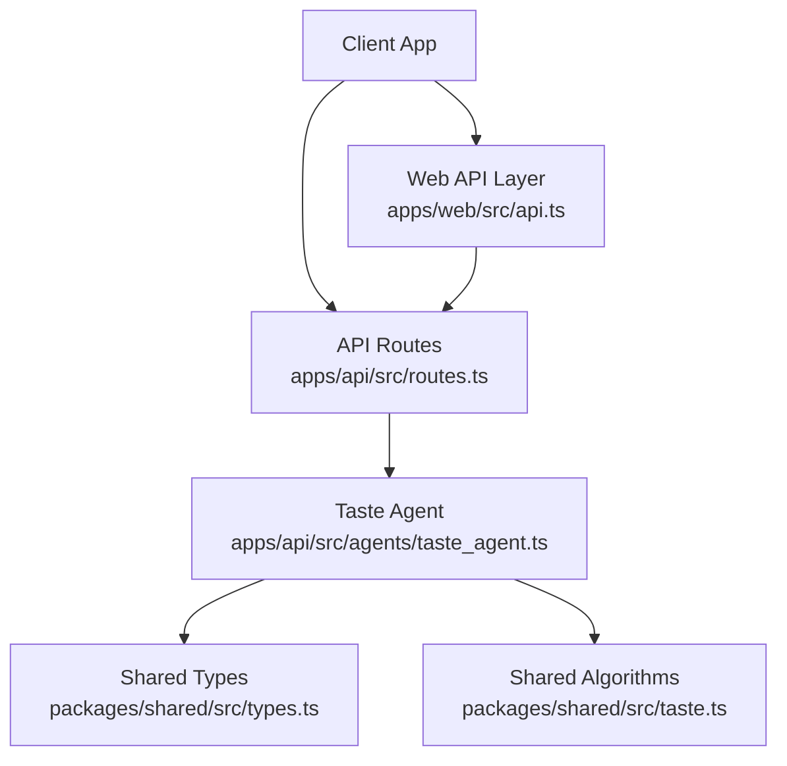
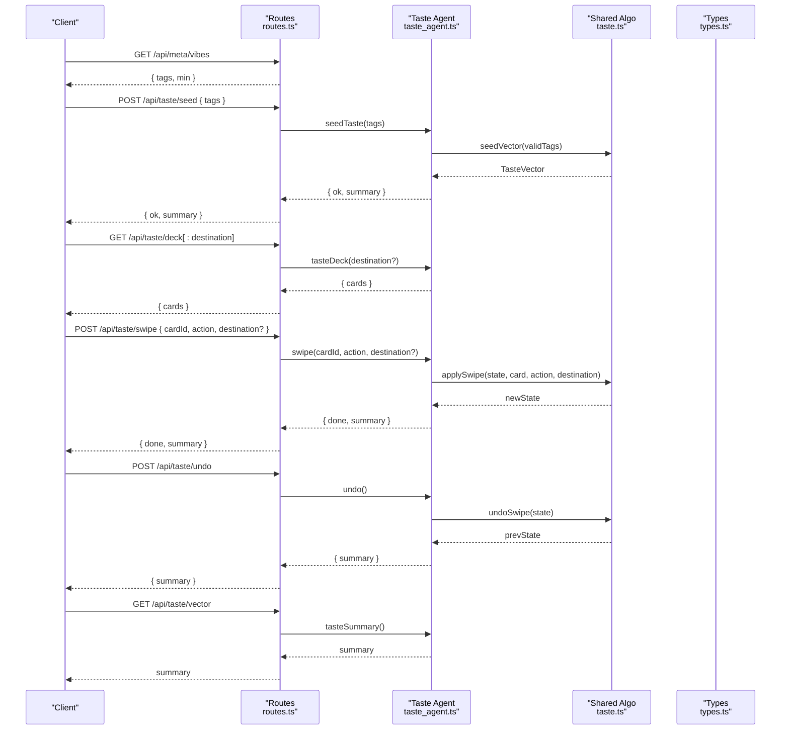
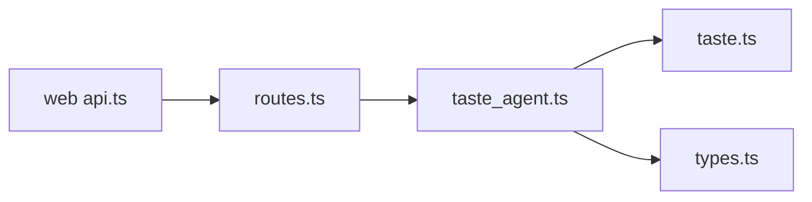
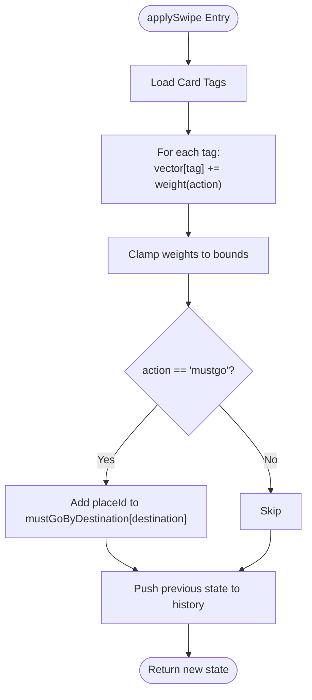
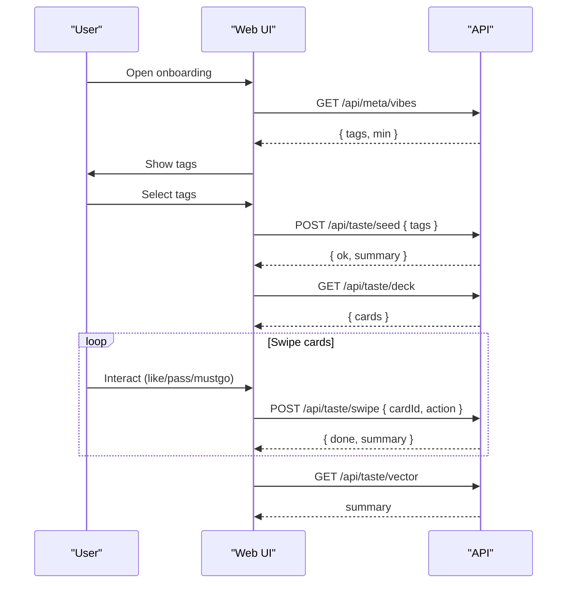

# Taste Learning API

<cite>
**Referenced Files in This Document**
- [routes.ts](file://apps/api/src/routes.ts)
- [taste_agent.ts](file://apps/api/src/agents/taste_agent.ts)
- [types.ts](file://packages/shared/src/types.ts)
- [taste.ts](file://packages/shared/src/taste.ts)
- [index.ts](file://packages/shared/src/index.ts)
- [api.ts](file://apps/web/src/api.ts)
- [TasteDeck.tsx](file://apps/web/src/components/onboarding/TasteDeck.tsx)
- [taste.test.ts](file://packages/shared/test/taste.test.ts)
</cite>

## Table of Contents
1. [Introduction](#introduction)
2. [Project Structure](#project-structure)
3. [Core Components](#core-components)
4. [Architecture Overview](#architecture-overview)
5. [Detailed Component Analysis](#detailed-component-analysis)
6. [Dependency Analysis](#dependency-analysis)
7. [Performance Considerations](#performance-considerations)
8. [Troubleshooting Guide](#troubleshooting-guide)
9. [Conclusion](#conclusion)
10. [Appendices](#appendices)

## Introduction
This document provides comprehensive API documentation for the taste learning system endpoints that power a swipe-based preference onboarding flow. It covers:
- Retrieving available preference tags
- Fetching swipeable cards
- Initializing preferences with tags
- Processing user interactions (like, pass, must-go)
- Undoing actions
- Retrieving the final taste vector and summary

It also explains the underlying swipe-based preference learning algorithm and how user interactions build a taste profile, along with typical usage flows for onboarding new users and collecting preference data.

## Project Structure
The taste learning feature spans three layers:
- API routes define HTTP endpoints and map them to agent functions.
- The taste agent manages session state, deck generation, swiping, undo, and summary computation.
- Shared types and algorithms define the data model and preference scoring logic.

**Diagram sources**
- [routes.ts:10-50](file://apps/api/src/routes.ts#L10-L50)
- [taste_agent.ts:14-118](file://apps/api/src/agents/taste_agent.ts#L14-L118)
- [types.ts:1-84](file://packages/shared/src/types.ts#L1-L84)
- [taste.ts:16-67](file://packages/shared/src/taste.ts#L16-L67)
- [api.ts:119-139](file://apps/web/src/api.ts#L119-L139)

**Section sources**
- [routes.ts:10-50](file://apps/api/src/routes.ts#L10-L50)
- [taste_agent.ts:14-118](file://apps/api/src/agents/taste_agent.ts#L14-L118)
- [types.ts:1-84](file://packages/shared/src/types.ts#L1-L84)
- [taste.ts:16-67](file://packages/shared/src/taste.ts#L16-L67)
- [api.ts:119-139](file://apps/web/src/api.ts#L119-L139)

## Core Components
- API routes register endpoints for meta information, deck retrieval, seeding, swiping, undo, and vector retrieval.
- Taste agent maintains an in-memory session state per request lifecycle, builds diverse decks by destination, applies swipes, supports undo, and computes summaries.
- Shared types define vibe tags, card shapes, swipe actions, and taste state.
- Shared algorithms implement vector initialization, swipe application, undo, and place scoring.

Key responsibilities:
- /api/meta/vibes: returns available vibe tags and minimum required count.
- /api/taste/deck: returns a deterministic, diverse set of cards for onboarding or a specific destination.
- /api/taste/seed: initializes the taste vector from selected vibe tags.
- /api/taste/swipe: updates the taste vector based on like/pass/must-go interactions.
- /api/taste/undo: reverts the last interaction.
- /api/taste/vector: returns the current taste summary including vector, top tags, strength, and must-go places.

**Section sources**
- [routes.ts:10-50](file://apps/api/src/routes.ts#L10-L50)
- [taste_agent.ts:28-110](file://apps/api/src/agents/taste_agent.ts#L28-L110)
- [types.ts:1-84](file://packages/shared/src/types.ts#L1-L84)
- [taste.ts:16-67](file://packages/shared/src/taste.ts#L16-L67)

## Architecture Overview
The taste learning flow is a closed loop between client and server:
- Client requests available vibes and seeds initial preferences.
- Client fetches a deck of cards and presents them as swipeable items.
- Client sends swipe actions; server updates the taste vector and returns updated summary.
- Client can undo actions and retrieve the final vector when ready to proceed to planning.

**Diagram sources**
- [routes.ts:10-50](file://apps/api/src/routes.ts#L10-L50)
- [taste_agent.ts:28-110](file://apps/api/src/agents/taste_agent.ts#L28-L110)
- [taste.ts:16-67](file://packages/shared/src/taste.ts#L16-L67)
- [types.ts:1-84](file://packages/shared/src/types.ts#L1-L84)

## Detailed Component Analysis

### Endpoint: GET /api/meta/vibes
Purpose:
- Returns the list of available vibe tags and the minimum number required to seed a profile.

Request:
- None.

Response schema:
- tags: array of VibeTag strings
- min: number (minimum number of tags required)

Notes:
- VibeTag values are defined centrally and validated during seeding.

Typical usage:
- Display tag options to users before they select their initial preferences.

**Section sources**
- [routes.ts:10-12](file://apps/api/src/routes.ts#L10-L12)
- [types.ts:1-18](file://packages/shared/src/types.ts#L1-L18)

### Endpoint: GET /api/taste/deck
Purpose:
- Retrieves a deterministic, diverse deck of cards for onboarding or a specific destination.

Request:
- Optional path parameter destination (e.g., "home", "singapore", "da-nang"). Defaults to home/onboarding if omitted.

Response schema:
- cards: array of DeckCard objects

Behavior:
- Cards are generated via round-robin across primary vibe tags to ensure diversity.
- Deck size is fixed per session.

Usage:
- Call after seeding or at any time to get the next batch of cards to present to the user.

**Section sources**
- [routes.ts:14-23](file://apps/api/src/routes.ts#L14-L23)
- [taste_agent.ts:35-67](file://apps/api/src/agents/taste_agent.ts#L35-L67)
- [types.ts:68-75](file://packages/shared/src/types.ts#L68-L75)

### Endpoint: POST /api/taste/seed
Purpose:
- Initializes the taste profile with selected vibe tags.

Request body schema:
- tags: array of VibeTag strings

Response schema:
- ok: boolean indicating success
- summary: TasteSummary object

Validation:
- Only valid vibe tags are accepted.
- At least a minimum number of tags must be provided; otherwise, a 400 error is returned.

Algorithm impact:
- Creates an initial taste vector where selected tags receive positive weight.

**Section sources**
- [routes.ts:25-29](file://apps/api/src/routes.ts#L25-L29)
- [taste_agent.ts:28-33](file://apps/api/src/agents/taste_agent.ts#L28-L33)
- [taste.ts:20-24](file://packages/shared/src/taste.ts#L20-L24)
- [types.ts:1-20](file://packages/shared/src/types.ts#L1-L20)

### Endpoint: POST /api/taste/swipe
Purpose:
- Processes a user interaction on a card to update the taste profile.

Request body schema:
- cardId: string
- action: "like" | "pass" | "mustgo"
- destination?: string (defaults to "home")

Response schema:
- done: boolean indicating whether the deck session is complete
- summary: TasteSummary object

Behavior:
- Validates the card exists within the active deck.
- Applies weighted updates to the taste vector based on action type.
- Tracks progress per destination and marks completion when the deck size is reached.

Error handling:
- Returns 400 with an error message if the profile is not seeded or the card is unknown.

**Section sources**
- [routes.ts:31-38](file://apps/api/src/routes.ts#L31-L38)
- [taste_agent.ts:69-84](file://apps/api/src/agents/taste_agent.ts#L69-L84)
- [taste.ts:30-50](file://packages/shared/src/taste.ts#L30-L50)
- [types.ts:77-84](file://packages/shared/src/types.ts#L77-L84)

### Endpoint: POST /api/taste/undo
Purpose:
- Reverses the most recent swipe action.

Request:
- None.

Response schema:
- summary: TasteSummary object

Behavior:
- Restores previous vector and must-go lists for the relevant destination.
- Adjusts deck progress accordingly.

Error handling:
- Returns 400 with an error message if no profile exists.

**Section sources**
- [routes.ts:40-44](file://apps/api/src/routes.ts#L40-L44)
- [taste_agent.ts:86-92](file://apps/api/src/agents/taste_agent.ts#L86-L92)
- [taste.ts:52-61](file://packages/shared/src/taste.ts#L52-L61)

### Endpoint: GET /api/taste/vector
Purpose:
- Retrieves the current taste summary, including the full vector, top tags, strength, and must-go places.

Request:
- None.

Response schema:
- vector: Record<VibeTag, number>
- topTags: array of VibeTag strings (top 3 by value)
- mustGo: array of place IDs (for "home" destination)
- swipeCount: number
- deckSize: number
- strength: number (normalized measure of profile strength)

Error handling:
- Returns 404 with an error message if the profile has not been seeded.

**Section sources**
- [routes.ts:46-50](file://apps/api/src/routes.ts#L46-L50)
- [taste_agent.ts:98-110](file://apps/api/src/agents/taste_agent.ts#L98-L110)
- [types.ts:79-84](file://packages/shared/src/types.ts#L79-L84)

## Dependency Analysis
The taste learning system depends on shared types and algorithms for consistency and testability:
- Routes depend on the taste agent for business logic.
- The taste agent depends on shared algorithms for vector operations and on shared types for data contracts.
- The web client uses a typed API layer that mirrors these endpoints.

**Diagram sources**
- [routes.ts:10-50](file://apps/api/src/routes.ts#L10-L50)
- [taste_agent.ts:1-118](file://apps/api/src/agents/taste_agent.ts#L1-L118)
- [taste.ts:1-67](file://packages/shared/src/taste.ts#L1-L67)
- [types.ts:1-84](file://packages/shared/src/types.ts#L1-L84)
- [api.ts:119-139](file://apps/web/src/api.ts#L119-L139)

**Section sources**
- [routes.ts:10-50](file://apps/api/src/routes.ts#L10-L50)
- [taste_agent.ts:1-118](file://apps/api/src/agents/taste_agent.ts#L1-L118)
- [taste.ts:1-67](file://packages/shared/src/taste.ts#L1-L67)
- [types.ts:1-84](file://packages/shared/src/types.ts#L1-L84)
- [api.ts:119-139](file://apps/web/src/api.ts#L119-L139)

## Performance Considerations
- Deck generation is cached per destination to avoid recomputation.
- Session state is in-memory; this is suitable for demo/single-session use but should be persisted for production multi-user scenarios.
- Undo maintains a history stack; keep deck sizes reasonable to limit memory growth.
- Vector updates are O(T) per swipe where T is the number of vibe tags on the card; with a small fixed tag set, this is efficient.

[No sources needed since this section provides general guidance]

## Troubleshooting Guide
Common issues and resolutions:
- Not seeded: If you call /api/taste/vector without seeding first, you will receive a 404 error. Seed the profile using /api/taste/seed.
- Unknown card: Swiping an unrecognized cardId results in a 400 error. Ensure the cardId matches one from the current deck.
- Minimum vibes: Seeding requires at least the configured minimum number of vibe tags; otherwise, a 400 error is returned.
- Destination scoping: Must-go places are tracked per destination; ensure you specify the correct destination when swiping across multiple destinations.

**Section sources**
- [routes.ts:25-50](file://apps/api/src/routes.ts#L25-L50)
- [taste_agent.ts:28-92](file://apps/api/src/agents/taste_agent.ts#L28-L92)

## Conclusion
The taste learning API provides a robust, swipe-driven mechanism to capture user preferences through simple interactions. By combining deterministic deck generation, weighted vector updates, and undo support, it enables a smooth onboarding experience that converges into a usable taste profile for downstream planning features.

[No sources needed since this section summarizes without analyzing specific files]

## Appendices

### TypeScript Types Reference
- VibeTag: union of allowed preference tags.
- TasteVector: mapping from each VibeTag to a numeric weight.
- DeckCard: representation of a swipeable card with title, emoji, and vibe tags.
- SwipeAction: allowed actions "like", "pass", "mustgo".
- TasteState: internal state including vector, must-go lists, swipe count, and history.
- TasteSummary: response shape for vector queries including top tags and strength.

**Section sources**
- [types.ts:1-84](file://packages/shared/src/types.ts#L1-L84)
- [api.ts:3-10](file://apps/web/src/api.ts#L3-L10)

### Algorithm Details: Swipe-Based Preference Learning
- Initialization: Selected vibe tags receive positive weights to start the profile.
- Updates: Each swipe adjusts weights for all tags on the card:
  - Like increases weights moderately.
  - Pass decreases weights slightly.
  - Must-go increases weights strongly and records the place ID for that destination.
- Bounds: Weights are clamped within a defined range to prevent runaway values.
- Scoring: Place scores are computed by summing vector weights over the place’s tags and normalizing by the square root of tag count to balance multi-tagged places.
- Undo: Restores previous vector and must-go lists exactly, enabling reversible exploration.

**Diagram sources**
- [taste.ts:30-50](file://packages/shared/src/taste.ts#L30-L50)
- [taste.ts:11-15](file://packages/shared/src/taste.ts#L11-L15)

**Section sources**
- [taste.ts:11-15](file://packages/shared/src/taste.ts#L11-L15)
- [taste.ts:30-50](file://packages/shared/src/taste.ts#L30-L50)
- [taste.test.ts:43-76](file://packages/shared/test/taste.test.ts#L43-L76)

### Typical Usage Flows

#### Onboarding New Users
1. Fetch available vibes to display tag options.
2. Let the user pick at least the minimum number of vibe tags.
3. Seed the profile with the chosen tags.
4. Retrieve the deck and present cards for swiping.
5. Process swipes until the deck is complete or the user opts out.
6. Retrieve the vector summary to confirm readiness for planning.

**Diagram sources**
- [routes.ts:10-50](file://apps/api/src/routes.ts#L10-L50)
- [api.ts:119-139](file://apps/web/src/api.ts#L119-L139)
- [TasteDeck.tsx:5-21](file://apps/web/src/components/onboarding/TasteDeck.tsx#L5-L21)

**Section sources**
- [routes.ts:10-50](file://apps/api/src/routes.ts#L10-L50)
- [api.ts:119-139](file://apps/web/src/api.ts#L119-L139)
- [TasteDeck.tsx:5-21](file://apps/web/src/components/onboarding/TasteDeck.tsx#L5-L21)

#### Collecting Preference Data Across Destinations
- Use /api/taste/deck/:destination to load destination-specific decks.
- Send swipes with the corresponding destination to scope must-go places.
- Retrieve the vector summary to see aggregated preferences and per-destination must-go lists.

**Section sources**
- [routes.ts:14-23](file://apps/api/src/routes.ts#L14-L23)
- [routes.ts:31-50](file://apps/api/src/routes.ts#L31-L50)
- [taste_agent.ts:69-92](file://apps/api/src/agents/taste_agent.ts#L69-L92)