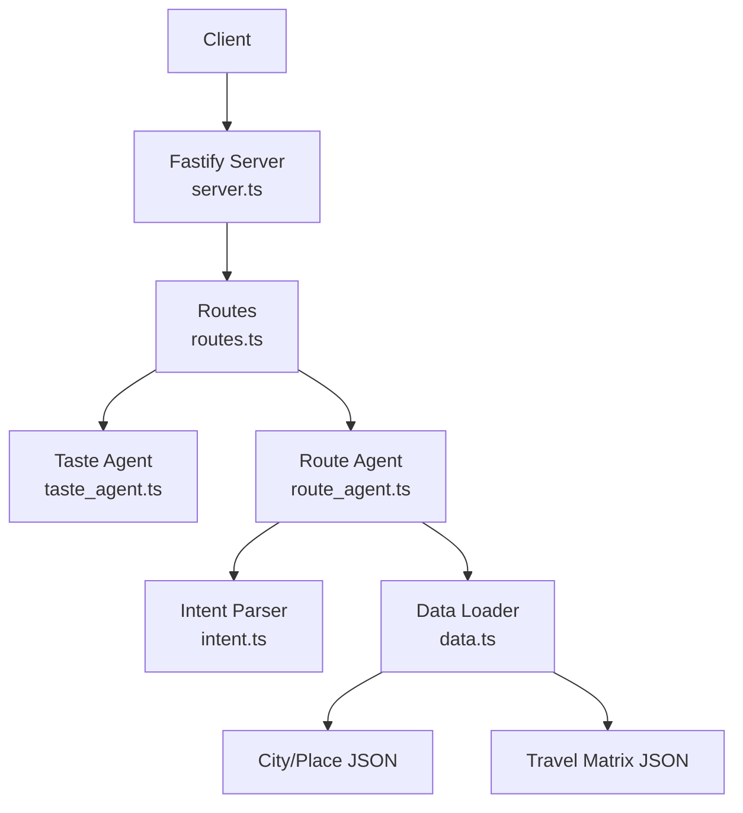
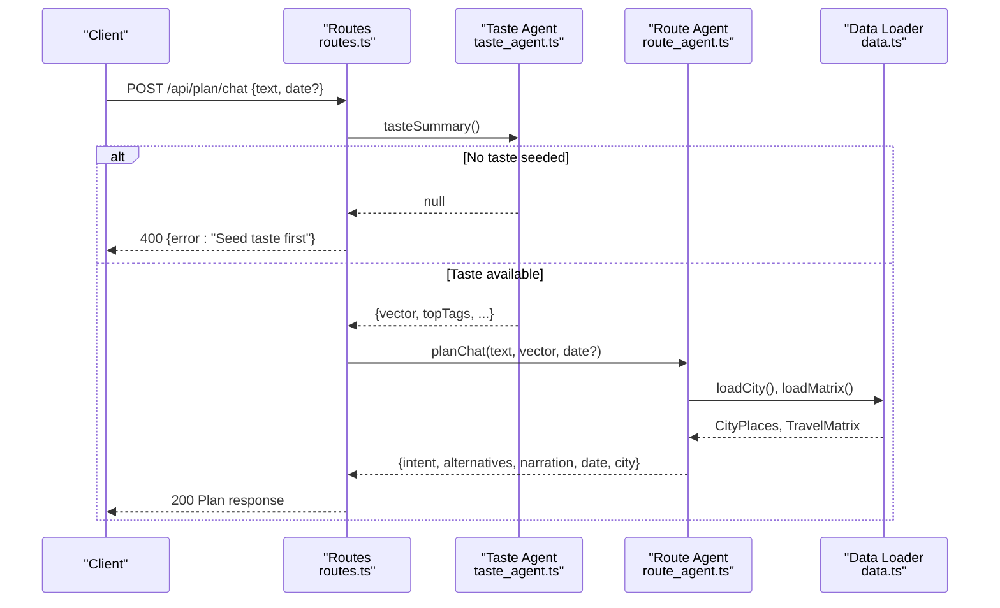
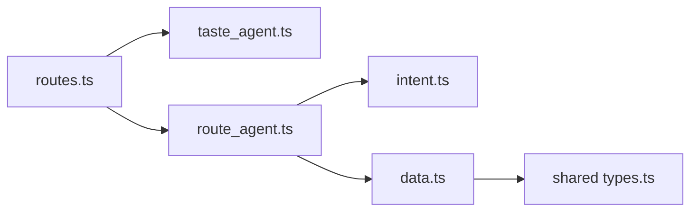

# Trip Planning API

<cite>
**Referenced Files in This Document**
- [routes.ts](file://apps/api/src/routes.ts)
- [server.ts](file://apps/api/src/server.ts)
- [intent.ts](file://apps/api/src/intent.ts)
- [route_agent.ts](file://apps/api/src/agents/route_agent.ts)
- [taste_agent.ts](file://apps/api/src/agents/taste_agent.ts)
- [data.ts](file://apps/api/src/data.ts)
- [types.ts](file://packages/shared/src/types.ts)
</cite>

## Table of Contents
1. [Introduction](#introduction)
2. [Project Structure](#project-structure)
3. [Core Components](#core-components)
4. [Architecture Overview](#architecture-overview)
5. [Detailed Component Analysis](#detailed-component-analysis)
6. [Dependency Analysis](#dependency-analysis)
7. [Performance Considerations](#performance-considerations)
8. [Troubleshooting Guide](#troubleshooting-guide)
9. [Conclusion](#conclusion)
10. [Appendices](#appendices)

## Introduction
This document provides detailed API documentation for trip planning and management endpoints, focusing on natural language trip planning, trip creation from flight deals, trip retrieval, flight swapping within trips, and lazy-loading place details. It also explains the intent parsing system that converts natural language into structured trip requests and includes conversation flows, trip creation patterns, and flight swapping scenarios with error handling guidance.

## Project Structure
The API is implemented using Fastify and exposes REST endpoints under /api. The core logic is split across:
- Route registration and HTTP handlers
- Intent parsing for natural language inputs
- Agents for taste profiling, route planning, and trip management
- Data loading utilities for city/place data and travel matrices
- Shared types used across the application

**Diagram sources**
- [server.ts:8-12](file://apps/api/src/server.ts#L8-L12)
- [routes.ts:10-134](file://apps/api/src/routes.ts#L10-L134)
- [route_agent.ts:62-185](file://apps/api/src/agents/route_agent.ts#L62-L185)
- [intent.ts:41-64](file://apps/api/src/intent.ts#L41-L64)
- [data.ts:17-37](file://apps/api/src/data.ts#L17-L37)

**Section sources**
- [server.ts:8-12](file://apps/api/src/server.ts#L8-L12)
- [routes.ts:10-134](file://apps/api/src/routes.ts#L10-L134)

## Core Components
- Intent parser: Converts natural language into a structured ParsedIntent including city, area, must-go items, and mood tags.
- Taste agent: Manages user taste vector via swiping and seeding; provides summary and deck generation.
- Route agent: Orchestrates trip planning (alternatives), trip creation from flight deals, trip view retrieval, and flight swapping with reflow.
- Data loader: Loads city/place data and travel matrices with caching.

Key responsibilities:
- Natural language to structured request mapping
- Taste-driven personalization
- Deterministic route building and trip graph construction
- In-memory trip storage and mutation

**Section sources**
- [intent.ts:41-64](file://apps/api/src/intent.ts#L41-L64)
- [taste_agent.ts:28-110](file://apps/api/src/agents/taste_agent.ts#L28-L110)
- [route_agent.ts:62-185](file://apps/api/src/agents/route_agent.ts#L62-L185)
- [data.ts:17-37](file://apps/api/src/data.ts#L17-L37)

## Architecture Overview
The API follows a layered architecture:
- HTTP layer: Fastify routes handle requests and responses
- Business layer: Agents implement domain logic (taste, routing, trips)
- Data layer: File-based JSON data loaded with caching

**Diagram sources**
- [routes.ts:52-56](file://apps/api/src/routes.ts#L52-L56)
- [route_agent.ts:62-93](file://apps/api/src/agents/route_agent.ts#L62-L93)
- [data.ts:17-24](file://apps/api/src/data.ts#L17-L24)
- [taste_agent.ts:98-110](file://apps/api/src/agents/taste_agent.ts#L98-L110)

## Detailed Component Analysis

### Natural Language Trip Planning: POST /api/plan/chat
Purpose:
- Accepts natural language text and optional date
- Requires prior taste seeding
- Returns parsed intent, suggested day plans, and narration

Request:
- Method: POST
- Path: /api/plan/chat
- Body:
  - text: string (natural language input)
  - date?: string (optional ISO date; defaults to next Saturday if omitted)

Response:
- Success (200):
  - intent: ParsedIntent
  - date: string
  - city: { id, name, center }
  - alternatives: array of enriched day plans
  - narration: string describing the plan
- Error (400):
  - { error: "Seed taste first" } when no taste profile exists
  - { error: "Tell me the city — e.g. ..." } when city cannot be inferred

Processing flow:
- Validate taste state
- Parse intent to extract city, area, must-go items, mood tags
- Load city and matrix data
- Build alternatives based on time window, taste, and constraints
- Enrich stops with place details (sealed wildcards hidden until reveal)

Example conversation flow:
- User: "Plan a quiet day in Singapore CBD, must eat chicken rice, then somewhere calm."
- API returns a day plan anchored around food and chill vibes, with sealed wildcard stop to reveal later.

Error handling:
- Missing or invalid city in text leads to explicit error instructing to include city
- Missing taste seed returns 400 with guidance to seed first

**Section sources**
- [routes.ts:52-56](file://apps/api/src/routes.ts#L52-L56)
- [route_agent.ts:62-93](file://apps/api/src/agents/route_agent.ts#L62-L93)
- [intent.ts:41-64](file://apps/api/src/intent.ts#L41-L64)

### Trip Creation from Deals: POST /api/trips
Purpose:
- Creates a multi-day trip by expanding flight deal options into a full trip graph
- Uses destination profile and current origin to search outbound and return flights
- Seeds must-go places from pre-swiped preferences per destination

Request:
- Method: POST
- Path: /api/trips
- Body:
  - destination: string (destination identifier matching destinations.json profiles)

Response:
- Success (200):
  - trip: TripGraph view including days, budget, narration, explanations
  - flightOptions: list of candidate outbound offers with totals
- Error (400):
  - { error: "No full trip data for <destination>" }
  - { error: "No upcoming long weekend" }
  - { error: "No flights for <destination>" }
  - { error: "No return flight for <destination>" }

Processing flow:
- Load destinations and validate destination has city file
- Compute next long weekend and departure dates
- Search outbound flights for two windows; select best by total cost with bag
- Search return flight; ensure availability
- Build trip graph with places, matrix, taste, and must-place IDs
- Store trip in memory and return view

Trip creation pattern:
- Seed taste and swipe must-go places per destination to influence trip composition
- Create trip to get a complete itinerary with flights and daily stops
- Optionally swap flights to refine schedule

**Section sources**
- [routes.ts:64-70](file://apps/api/src/routes.ts#L64-L70)
- [route_agent.ts:107-153](file://apps/api/src/agents/route_agent.ts#L107-L153)
- [data.ts:31-37](file://apps/api/src/data.ts#L31-L37)

### Retrieve Trip View: GET /api/trips/:id
Purpose:
- Retrieves a stored trip’s view, enriching daily stops with place details

Request:
- Method: GET
- Path: /api/trips/:id
- Params:
  - id: string (trip identifier returned by createTripFromDeal)

Response:
- Success (200):
  - graph: TripGraph with enriched days and stops
  - cityName: string
  - center: { lat, lng }
  - flightOptions: array of offers with computed totals
- Not Found (404):
  - { error: "Unknown trip" }

Processing flow:
- Lookup trip by id in memory store
- Load city and matrix to enrich stops
- Return view with all necessary fields for UI rendering

**Section sources**
- [routes.ts:72-76](file://apps/api/src/routes.ts#L72-L76)
- [route_agent.ts:155-168](file://apps/api/src/agents/route_agent.ts#L155-L168)

### Swap Flights Within Existing Trip: POST /api/trips/:id/swap-flight
Purpose:
- Swaps the outbound flight option for an existing trip and recalculates the itinerary

Request:
- Method: POST
- Path: /api/trips/:id/swap-flight
- Params:
  - id: string (trip identifier)
- Body:
  - offer_id: string (outbound offer identifier from flightOptions)

Response:
- Success (200):
  - trip: Updated TripGraph view after reflow
  - delta: object describing changes (e.g., new stops, timing adjustments)
  - narration: updated narrative reflecting swapped flight
- Error (400):
  - { error: "Unknown trip" }
  - { error: "Unknown offer for this trip" }

Processing flow:
- Validate trip existence
- Find matching offer among stored flight options
- Reflow trip graph with new flight while preserving taste and must-go constraints
- Update stored graph and return enriched view

Flight swapping scenario:
- After creating a trip, inspect flightOptions to choose alternative outbound flights
- Call swap-flight with chosen offer_id to refresh the itinerary
- Use narration and delta to inform UI updates

**Section sources**
- [routes.ts:78-85](file://apps/api/src/routes.ts#L78-L85)
- [route_agent.ts:170-185](file://apps/api/src/agents/route_agent.ts#L170-L185)

### Lazy-Load Place Details: GET /api/reveal/:city/:placeId
Purpose:
- Reveals sealed place details only when the user taps to reveal, preventing leakage of identity in initial payloads

Request:
- Method: GET
- Path: /api/reveal/:city/:placeId
- Params:
  - city: string (city identifier)
  - placeId: string (place identifier)

Response:
- Success (200):
  - place: Place object with full details
- Not Found (404):
  - { error: "Unknown place" }
  - { error: "Unknown city" }

Processing flow:
- Dynamically import data module to avoid loading all city files upfront
- Load city data and find place by id
- Return place details or appropriate not found errors

Lazy-loading rationale:
- Keeps initial payloads small and preserves surprise elements in trip plans
- Ensures client-side reveal behavior aligns with sealed stops

**Section sources**
- [routes.ts:117-131](file://apps/api/src/routes.ts#L117-L131)

### Intent Parsing System
Purpose:
- Converts natural language into structured ParsedIntent for deterministic planning without LLM calls in the request path

Key capabilities:
- City detection via aliases
- Area inference (CBD/downtown/city center)
- Must-go extraction using regex patterns
- Mood tag inference via keyword patterns mapped to vibe tags

Input examples:
- "Day trip in Singapore CBD, must eat chicken rice, then somewhere quiet"
- "Plan a beach day in Bali with coffee and views"

Output structure:
- city: string | null
- cityName: string | null
- area?: string
- mustTags: string[]
- moodTags: VibeTag[]
- raw: string

Parsing rules:
- City aliases include common names and short forms
- Must-go phrases captured via specific patterns
- Mood tags derived from keyword matches against predefined patterns

**Section sources**
- [intent.ts:3-64](file://apps/api/src/intent.ts#L3-L64)

## Dependency Analysis
The API components have clear dependencies:
- Routes depend on agents for business logic
- Route agent depends on intent parser, data loader, and shared algorithms
- Taste agent manages in-memory state and provides summaries
- Data loader caches city and matrix data for performance

**Diagram sources**
- [routes.ts:1-9](file://apps/api/src/routes.ts#L1-L9)
- [route_agent.ts:1-18](file://apps/api/src/agents/route_agent.ts#L1-L18)
- [intent.ts:1-15](file://apps/api/src/intent.ts#L1-L15)
- [data.ts:1-6](file://apps/api/src/data.ts#L1-L6)
- [types.ts:1-170](file://packages/shared/src/types.ts#L1-L170)

**Section sources**
- [routes.ts:1-9](file://apps/api/src/routes.ts#L1-L9)
- [route_agent.ts:1-18](file://apps/api/src/agents/route_agent.ts#L1-L18)
- [intent.ts:1-15](file://apps/api/src/intent.ts#L1-L15)
- [data.ts:1-6](file://apps/api/src/data.ts#L1-L6)
- [types.ts:1-170](file://packages/shared/src/types.ts#L1-L170)

## Performance Considerations
- Data caching: City and matrix data are cached in memory to avoid repeated file reads
- Lazy loading: Place reveal endpoint dynamically imports data to reduce startup overhead
- In-memory trip storage: Trips are stored in a Map for fast lookup and mutation
- Deterministic planning: Intent parsing avoids LLM calls in request path for predictable latency
- Flight search batching: Outbound searches use multiple departure windows to maximize options

Optimization opportunities:
- Consider persisting trips to disk for durability beyond process restart
- Add rate limiting for high-frequency endpoints
- Implement pagination for large trip graphs if needed

[No sources needed since this section provides general guidance]

## Troubleshooting Guide
Common issues and resolutions:
- "Seed taste first": Ensure POST /api/taste/seed or swiping has been completed before using planning endpoints
- "Unknown trip": Verify trip id was returned by createTripFromDeal and still exists in memory
- "Unknown offer for this trip": Confirm offer_id belongs to the trip’s flightOptions
- "No full trip data for <destination>": Check destinations.json for valid destination profiles
- "No upcoming long weekend": Adjust date context or wait for next holiday window
- "No flights for <destination>": Verify flight search availability for selected dates
- "Unknown place" / "Unknown city": Ensure city and placeId exist in data files

Debugging tips:
- Use /api/evidence to inspect mode and environment
- Check taste summary via /api/taste/vector to validate profile strength
- Inspect trip view to confirm enrichment and flight options

**Section sources**
- [routes.ts:52-85](file://apps/api/src/routes.ts#L52-L85)
- [routes.ts:117-131](file://apps/api/src/routes.ts#L117-L131)
- [route_agent.ts:107-185](file://apps/api/src/agents/route_agent.ts#L107-L185)

## Conclusion
The Trip Planning API provides a comprehensive set of endpoints for natural language trip planning, trip creation from flight deals, trip retrieval, flight swapping, and lazy-loading place details. The intent parsing system enables deterministic conversion of natural language into structured requests, while the taste agent personalizes recommendations. The architecture balances performance through caching and lazy loading with clear error handling for robust client interactions.

[No sources needed since this section summarizes without analyzing specific files]

## Appendices

### API Endpoints Summary
- POST /api/plan/chat: Natural language trip planning
- POST /api/trips: Create trip from deals
- GET /api/trips/:id: Retrieve trip view
- POST /api/trips/:id/swap-flight: Swap flights within trip
- GET /api/reveal/:city/:placeId: Lazy-load place details

### Data Models
- ParsedIntent: Structured intent from natural language
- TasteState: User taste vector and swipe history
- TripGraph: Multi-day trip with flights, days, budget, and narration
- FlightOption: Individual flight offer with pricing and baggage details
- Place: Location details with tags, hours, and estimated costs

**Section sources**
- [types.ts:1-170](file://packages/shared/src/types.ts#L1-L170)
- [intent.ts:8-15](file://apps/api/src/intent.ts#L8-L15)
- [route_agent.ts:26-34](file://apps/api/src/agents/route_agent.ts#L26-L34)