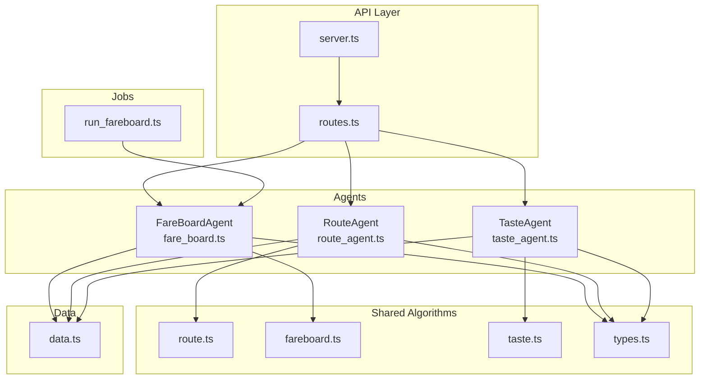
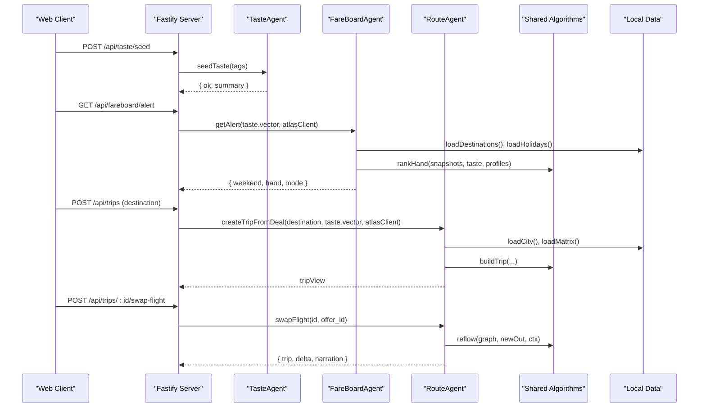
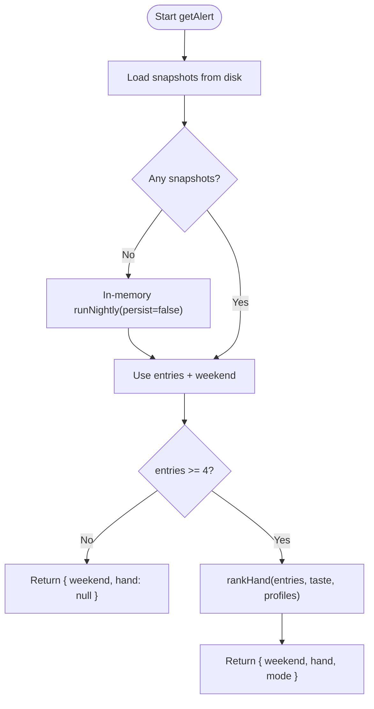
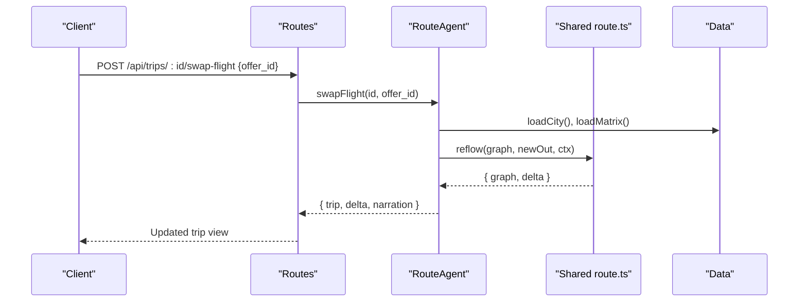
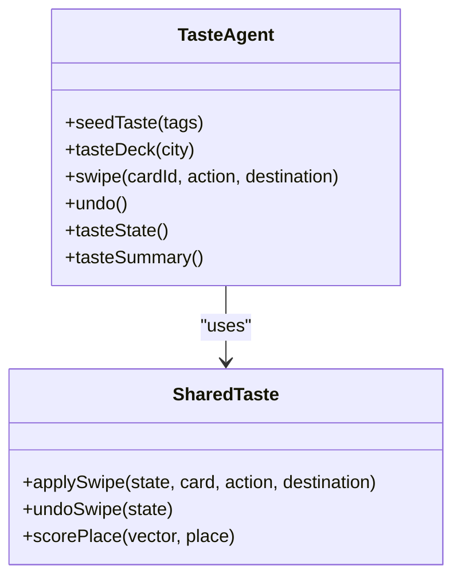
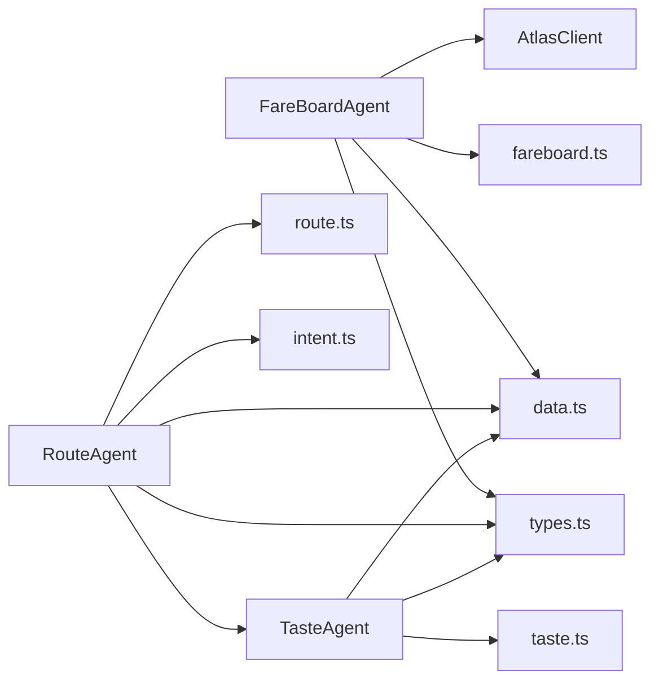

# Agent System Architecture

<cite>
**Referenced Files in This Document**
- [fare_board.ts](file://apps/api/src/agents/fare_board.ts)
- [route_agent.ts](file://apps/api/src/agents/route_agent.ts)
- [taste_agent.ts](file://apps/api/src/agents/taste_agent.ts)
- [run_fareboard.ts](file://apps/api/src/jobs/run_fareboard.ts)
- [types.ts](file://packages/shared/src/types.ts)
- [route.ts](file://packages/shared/src/route.ts)
- [fareboard.ts](file://packages/shared/src/fareboard.ts)
- [taste.ts](file://packages/shared/src/taste.ts)
- [intent.ts](file://apps/api/src/intent.ts)
- [routes.ts](file://apps/api/src/routes.ts)
- [data.ts](file://apps/api/src/data.ts)
- [server.ts](file://apps/api/src/server.ts)
</cite>

## Table of Contents
1. [Introduction](#introduction)
2. [Project Structure](#project-structure)
3. [Core Components](#core-components)
4. [Architecture Overview](#architecture-overview)
5. [Detailed Component Analysis](#detailed-component-analysis)
6. [Dependency Analysis](#dependency-analysis)
7. [Performance Considerations](#performance-considerations)
8. [Troubleshooting Guide](#troubleshooting-guide)
9. [Conclusion](#conclusion)

## Introduction
This document explains the three-agent system that powers trip discovery, planning, and personalization:
- FareBoardAgent: discovers deals by running a nightly batch over candidate destinations and ranking snapshots against user taste.
- RouteAgent: builds graph-based day plans and multi-day trips; automatically reflows downstream plans when flights change.
- TasteAgent: learns preferences from swipe interactions and produces a taste vector used across agents.

It also documents how agents communicate via shared types and REST endpoints, how they collaborate end-to-end, and how errors are handled.

## Project Structure
The API layer exposes REST endpoints that delegate to the three agents. Shared algorithms live in a packages/shared library consumed by all agents. Data (places, matrices, holidays) is loaded from local JSON files with caching. A scheduled job runs the fare-board batch pipeline.

**Diagram sources**
- [routes.ts:10-135](file://apps/api/src/routes.ts#L10-L135)
- [server.ts:8-25](file://apps/api/src/server.ts#L8-L25)
- [fare_board.ts:15-118](file://apps/api/src/agents/fare_board.ts#L15-L118)
- [route_agent.ts:19-191](file://apps/api/src/agents/route_agent.ts#L19-L191)
- [taste_agent.ts:14-118](file://apps/api/src/agents/taste_agent.ts#L14-L118)
- [route.ts:16-475](file://packages/shared/src/route.ts#L16-L475)
- [fareboard.ts:1-197](file://packages/shared/src/fareboard.ts#L1-L197)
- [taste.ts:1-68](file://packages/shared/src/taste.ts#L1-L68)
- [types.ts:1-170](file://packages/shared/src/types.ts#L1-L170)
- [data.ts:7-38](file://apps/api/src/data.ts#L7-L38)
- [run_fareboard.ts:1-15](file://apps/api/src/jobs/run_fareboard.ts#L1-L15)

**Section sources**
- [routes.ts:10-135](file://apps/api/src/routes.ts#L10-L135)
- [server.ts:8-25](file://apps/api/src/server.ts#L8-L25)
- [data.ts:7-38](file://apps/api/src/data.ts#L7-L38)

## Core Components
- FareBoardAgent: schedules nightly scans for a fixed origin to multiple destinations during the next long weekend, persists snapshots, and ranks them per-user to produce deal alerts.
- RouteAgent: parses natural-language intent into constraints, builds alternative day routes, constructs multi-day trip graphs around flight options, and supports swapping flights with automatic downstream reflow.
- TasteAgent: maintains an in-memory preference profile updated by swipe events, producing a taste vector and must-go lists per destination.

Key shared contracts:
- Types define places, travel matrices, trip graphs, flight options, and taste state.
- Algorithms implement scoring, route building, trip construction, and reflow logic.

**Section sources**
- [types.ts:1-170](file://packages/shared/src/types.ts#L1-L170)
- [fare_board.ts:15-118](file://apps/api/src/agents/fare_board.ts#L15-L118)
- [route_agent.ts:19-191](file://apps/api/src/agents/route_agent.ts#L19-L191)
- [taste_agent.ts:14-118](file://apps/api/src/agents/taste_agent.ts#L14-L118)

## Architecture Overview
The system composes three specialized agents behind a stable REST surface. The web client drives onboarding (taste), deal discovery (fare board), and trip planning (route). A scheduled job keeps fare data fresh.

**Diagram sources**
- [routes.ts:25-85](file://apps/api/src/routes.ts#L25-L85)
- [fare_board.ts:97-118](file://apps/api/src/agents/fare_board.ts#L97-L118)
- [route_agent.ts:107-185](file://apps/api/src/agents/route_agent.ts#L107-L185)
- [route.ts:349-475](file://packages/shared/src/route.ts#L349-L475)
- [fareboard.ts:111-179](file://packages/shared/src/fareboard.ts#L111-L179)
- [data.ts:17-38](file://apps/api/src/data.ts#L17-L38)

## Detailed Component Analysis

### FareBoardAgent: Scheduled Job Execution and Alert Generation
Responsibilities:
- Identify the next long weekend window based on holiday data.
- Query flight offers for a fixed origin to each candidate destination on departure dates.
- Persist snapshots per date and rank them per user taste to produce a “hand” of top deals plus a wildcard surprise.

Key behaviors:
- Nightly batch run queries offers with retryable backoff and writes timestamped snapshot files.
- Per-user alert path ranks stored snapshots without live calls if available; otherwise performs an in-memory pass using the current client mode.
- Ranking blends taste affinity, unexpectedness, and fare-moment distress signals, then selects top 3 and a sealed wildcard.

Invocation patterns:
- Scheduled job: run_fareboard.ts invokes runNightly(client) to populate snapshots.
- API endpoint: /api/fareboard/alert returns a ranked hand after ensuring taste is seeded.

Error handling:
- Retryable responses use exponential backoff before giving up.
- If no upcoming long weekend or insufficient snapshots, the alert returns empty results gracefully.

**Diagram sources**
- [fare_board.ts:97-118](file://apps/api/src/agents/fare_board.ts#L97-L118)
- [fareboard.ts:111-179](file://packages/shared/src/fareboard.ts#L111-L179)

**Section sources**
- [fare_board.ts:15-118](file://apps/api/src/agents/fare_board.ts#L15-L118)
- [run_fareboard.ts:1-15](file://apps/api/src/jobs/run_fareboard.ts#L1-L15)
- [fareboard.ts:1-197](file://packages/shared/src/fareboard.ts#L1-L197)
- [routes.ts:58-62](file://apps/api/src/routes.ts#L58-L62)

### RouteAgent: Graph-Based Trip Planning and Downstream Reflow
Responsibilities:
- Parse user intent into constraints (city, area, must-tags, mood-tags).
- Build alternative day routes using place scoring and travel-time matrices.
- Construct multi-day trip graphs anchored by outbound and return flights.
- Swap flights and automatically reflow affected days while preserving unaffected stops.

Key behaviors:
- planChat uses deterministic parsing and builds alternatives respecting time windows, open hours, and taste.
- createTripFromDeal queries flight options for both directions, seeds must-go places from pre-swiped preferences, and builds a full TripGraph.
- swapFlight computes affected dates and rebuilds only those days, returning a delta and narration describing changes.

Algorithm highlights:
- Day route builder scores candidates by taste, meal windows, area fit, must-satisfaction, and travel cost.
- Wildcard placement introduces novelty by selecting taste-adjacent but unexpressed tags.
- Reflow preserves non-affected days and updates budgets and narration accordingly.

**Diagram sources**
- [route_agent.ts:170-185](file://apps/api/src/agents/route_agent.ts#L170-L185)
- [route.ts:414-475](file://packages/shared/src/route.ts#L414-L475)
- [routes.ts:78-85](file://apps/api/src/routes.ts#L78-L85)

**Section sources**
- [route_agent.ts:19-191](file://apps/api/src/agents/route_agent.ts#L19-L191)
- [route.ts:16-475](file://packages/shared/src/route.ts#L16-L475)
- [intent.ts:1-65](file://apps/api/src/intent.ts#L1-L65)
- [routes.ts:52-85](file://apps/api/src/routes.ts#L52-L85)

### TasteAgent: Preference Learning and Taste Vector Generation
Responsibilities:
- Initialize a taste vector from selected vibe tags.
- Serve diverse decks of place cards grouped by primary vibe tag.
- Update the taste vector and must-go lists per swipe action; support undo.
- Expose a summary including top tags, strength, and must-go selections.

Key behaviors:
- applySwipe increments/decrements weights per vibe tag based on action type and records history for undo.
- Must-go selections are tracked per destination key, enabling RouteAgent to prioritize specific places.
- Deck generation uses round-robin across buckets to ensure diversity.

**Diagram sources**
- [taste_agent.ts:28-118](file://apps/api/src/agents/taste_agent.ts#L28-L118)
- [taste.ts:20-68](file://packages/shared/src/taste.ts#L20-L68)

**Section sources**
- [taste_agent.ts:14-118](file://apps/api/src/agents/taste_agent.ts#L14-L118)
- [taste.ts:1-68](file://packages/shared/src/taste.ts#L1-L68)
- [routes.ts:14-50](file://apps/api/src/routes.ts#L14-L50)

### Agent Communication Patterns and Collaboration
- Shared interfaces: All agents consume and produce types defined in shared types.ts (e.g., FlightOption, TripGraph, TasteVector, Place).
- REST boundaries: routes.ts wires endpoints to agent functions, enforcing preconditions like taste seeding and returning standardized error shapes.
- Data access: Agents read city/place data and travel matrices via data.ts, which caches results in memory.
- External integration: Agents receive an AtlasClient abstraction for flight search and booking flows; the server injects the appropriate implementation.

Collaboration flow example:
- User seeds taste via TasteAgent.
- FareBoardAgent ranks snapshots using the taste vector to present deals.
- RouteAgent consumes the same taste vector to build personalized day plans and trips.
- When flights change, RouteAgent reflows downstream plans while preserving unaffected days.

**Section sources**
- [types.ts:1-170](file://packages/shared/src/types.ts#L1-L170)
- [routes.ts:10-135](file://apps/api/src/routes.ts#L10-L135)
- [data.ts:7-38](file://apps/api/src/data.ts#L7-L38)
- [server.ts:8-25](file://apps/api/src/server.ts#L8-L25)

### Examples of Agent Invocation Patterns
- Seed taste: POST /api/taste/seed with vibe tags; returns success and summary.
- Get deal alert: GET /api/fareboard/alert requires prior taste seeding; returns weekend and ranked hand.
- Create trip from deal: POST /api/trips with destination; returns trip graph view.
- Swap flight: POST /api/trips/:id/swap-flight with offer_id; returns updated trip and delta.
- Plan chat: POST /api/plan/chat with text and optional date; returns alternatives and narration.

**Section sources**
- [routes.ts:25-85](file://apps/api/src/routes.ts#L25-L85)

### Error Handling Strategies
- Precondition checks: Many endpoints require taste to be seeded first; missing state returns 400 with descriptive errors.
- Not found cases: Unknown trips or destinations return 404.
- Network resilience: FareBoardAgent retries on retryable responses with exponential backoff.
- Graceful degradation: If no snapshots exist, getAlert runs in-memory once to keep the demo functional.

**Section sources**
- [routes.ts:17-85](file://apps/api/src/routes.ts#L17-L85)
- [fare_board.ts:53-72](file://apps/api/src/agents/fare_board.ts#L53-L72)
- [fare_board.ts:101-118](file://apps/api/src/agents/fare_board.ts#L101-L118)

## Dependency Analysis
- FareBoardAgent depends on:
  - Shared fareboard ranking and types.
  - Local data for holidays and destinations.
  - AtlasClient for searching offers during nightly runs or in-memory fallback.
- RouteAgent depends on:
  - Shared route algorithms for day planning and trip construction/reflow.
  - Intent parser for natural language constraints.
  - Local data for cities and matrices.
  - TasteAgent’s state for must-go preferences.
- TasteAgent depends on:
  - Shared taste algorithms for vector updates and scoring.
  - Local data for place decks.

**Diagram sources**
- [fare_board.ts:1-118](file://apps/api/src/agents/fare_board.ts#L1-L118)
- [route_agent.ts:1-191](file://apps/api/src/agents/route_agent.ts#L1-L191)
- [taste_agent.ts:1-118](file://apps/api/src/agents/taste_agent.ts#L1-L118)
- [fareboard.ts:1-197](file://packages/shared/src/fareboard.ts#L1-L197)
- [route.ts:1-475](file://packages/shared/src/route.ts#L1-L475)
- [taste.ts:1-68](file://packages/shared/src/taste.ts#L1-L68)
- [intent.ts:1-65](file://apps/api/src/intent.ts#L1-L65)
- [data.ts:7-38](file://apps/api/src/data.ts#L7-L38)

**Section sources**
- [fare_board.ts:1-118](file://apps/api/src/agents/fare_board.ts#L1-L118)
- [route_agent.ts:1-191](file://apps/api/src/agents/route_agent.ts#L1-L191)
- [taste_agent.ts:1-118](file://apps/api/src/agents/taste_agent.ts#L1-L118)

## Performance Considerations
- Caching: City and matrix data are cached in memory to avoid repeated file reads.
- Efficient ranking: FareBoardAgent deduplicates by destination and picks cheapest per destination before ranking.
- Minimal reflow: RouteAgent rebuilds only affected days when swapping flights, preserving unchanged stops and reducing recomputation.
- Deterministic planning: Intent parsing and route building are deterministic, avoiding expensive model calls in hot paths.

[No sources needed since this section provides general guidance]

## Troubleshooting Guide
Common issues and resolutions:
- Taste not seeded: Endpoints requiring taste will return 400; call /api/taste/seed first.
- No snapshots available: getAlert falls back to an in-memory run; verify scheduled job execution or environment variables controlling client mode.
- Unknown trip or destination: Ensure correct IDs and that the destination has full trip data (hasCityFile).
- Flight swap fails: Confirm the offer_id belongs to the trip’s stored options; check network connectivity if using live mode.

Operational tips:
- Inspect evidence log via /api/evidence to see recent Atlas calls and modes.
- Verify client mode and environment via /api/meta/mode.

**Section sources**
- [routes.ts:52-85](file://apps/api/src/routes.ts#L52-L85)
- [routes.ts:133-135](file://apps/api/src/routes.ts#L133-L135)
- [fare_board.ts:101-118](file://apps/api/src/agents/fare_board.ts#L101-L118)

## Conclusion
The three-agent architecture cleanly separates concerns:
- FareBoardAgent focuses on deal discovery and ranking.
- RouteAgent owns graph-based planning and robust reflow.
- TasteAgent captures and applies user preferences.

They collaborate through shared types and a stable REST interface, enabling end-to-end trip planning from preference learning to deal discovery and dynamic itinerary updates. Error handling is explicit and resilient, and performance is optimized via caching, minimal recomputation, and deterministic algorithms.

[No sources needed since this section summarizes without analyzing specific files]