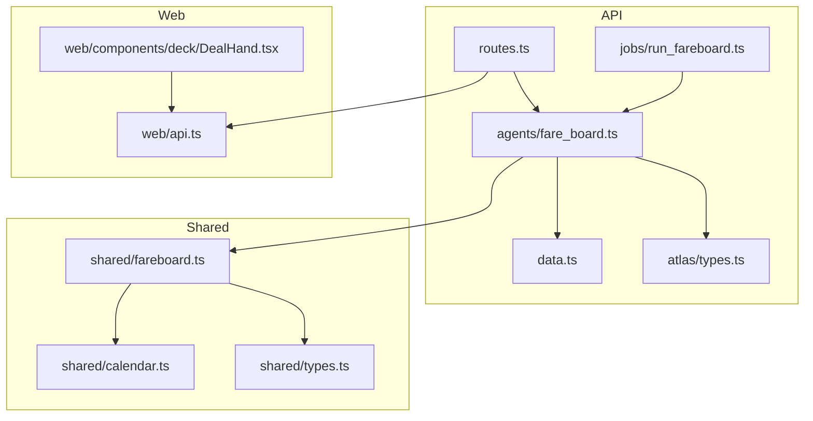
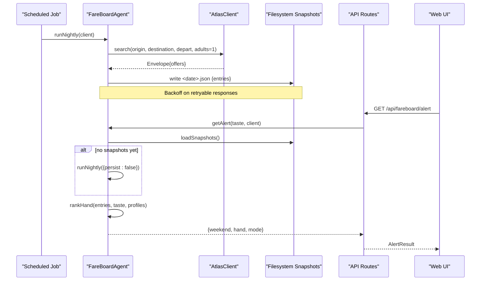
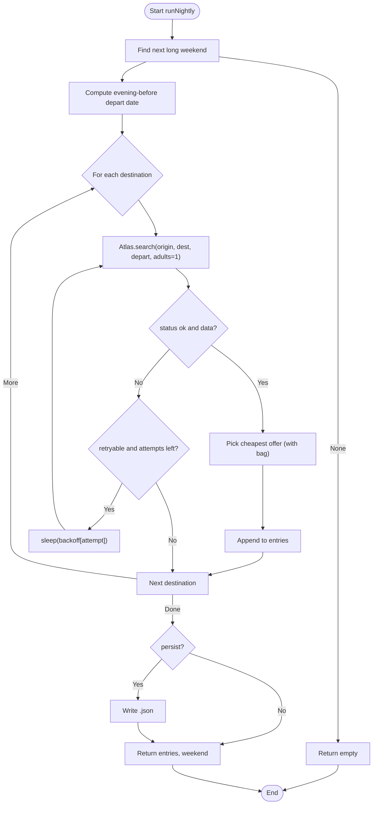
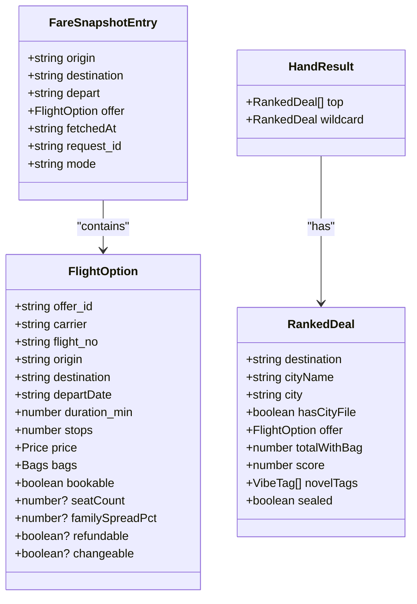
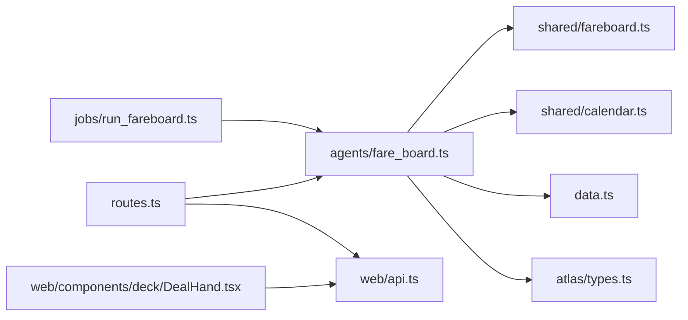

# FareBoardAgent - Deal Discovery & Monitoring

<cite>
**Referenced Files in This Document**
- [fare_board.ts](file://apps/api/src/agents/fare_board.ts)
- [run_fareboard.ts](file://apps/api/src/jobs/run_fareboard.ts)
- [fareboard.ts](file://packages/shared/src/fareboard.ts)
- [types.ts](file://packages/shared/src/types.ts)
- [calendar.ts](file://packages/shared/src/calendar.ts)
- [routes.ts](file://apps/api/src/routes.ts)
- [data.ts](file://apps/api/src/data.ts)
- [types.ts](file://apps/api/src/atlas/types.ts)
- [fare-board-nightly.md](file://infra/scheduled-tasks/fare-board-nightly.md)
- [DealHand.tsx](file://apps/web/src/components/deck/DealHand.tsx)
- [api.ts](file://apps/web/src/api.ts)
</cite>

## Table of Contents
1. [Introduction](#introduction)
2. [Project Structure](#project-structure)
3. [Core Components](#core-components)
4. [Architecture Overview](#architecture-overview)
5. [Detailed Component Analysis](#detailed-component-analysis)
6. [Dependency Analysis](#dependency-analysis)
7. [Performance Considerations](#performance-considerations)
8. [Troubleshooting Guide](#troubleshooting-guide)
9. [Conclusion](#conclusion)
10. [Appendices](#appendices)

## Introduction
FareBoardAgent is the deal discovery and monitoring subsystem that periodically searches for flight fares across a fixed set of destinations, ranks them against user taste preferences, and surfaces alerts with curated trip suggestions. It integrates with Atlas APIs to retrieve live or fixture fare data, persists snapshots over time, and powers both scheduled nightly runs and on-demand alert generation. The system also connects into trip creation workflows so users can expand a discovered deal into a full itinerary.

Key goals:
- Schedule nightly scans for upcoming long weekends using an evening-before departure date.
- Rank deals by a blend of taste affinity and fare moment signals.
- Persist snapshots for historical comparison and observed-fare badges.
- Expose an alert endpoint that returns a hand of top deals plus a sealed wildcard.
- Enable trip creation from a selected deal.

## Project Structure
The fare monitoring feature spans API agents, shared ranking logic, scheduling scripts, and UI components:
- Agent and job entry points orchestrate nightly runs and per-user alerts.
- Shared library provides ranking algorithms, calendar helpers, and types.
- Routes expose endpoints for alerts and trip creation.
- Web UI renders the alert banner and deal cards.

**Diagram sources**
- [routes.ts:58-70](file://apps/api/src/routes.ts#L58-L70)
- [run_fareboard.ts:1-15](file://apps/api/src/jobs/run_fareboard.ts#L1-L15)
- [fare_board.ts:41-82](file://apps/api/src/agents/fare_board.ts#L41-L82)
- [fareboard.ts:111-179](file://packages/shared/src/fareboard.ts#L111-L179)
- [calendar.ts:28-55](file://packages/shared/src/calendar.ts#L28-L55)
- [types.ts:86-169](file://packages/shared/src/types.ts#L86-L169)
- [types.ts:8-30](file://apps/api/src/atlas/types.ts#L8-L30)
- [DealHand.tsx:11-25](file://apps/web/src/components/deck/DealHand.tsx#L11-L25)
- [api.ts:65-81](file://apps/web/src/api.ts#L65-L81)

**Section sources**
- [routes.ts:58-70](file://apps/api/src/routes.ts#L58-L70)
- [run_fareboard.ts:1-15](file://apps/api/src/jobs/run_fareboard.ts#L1-L15)
- [fare_board.ts:15-22](file://apps/api/src/agents/fare_board.ts#L15-L22)
- [fareboard.ts:1-13](file://packages/shared/src/fareboard.ts#L1-L13)
- [calendar.ts:22-27](file://packages/shared/src/calendar.ts#L22-L27)
- [types.ts:86-169](file://packages/shared/src/types.ts#L86-L169)
- [types.ts:8-30](file://apps/api/src/atlas/types.ts#L8-L30)
- [DealHand.tsx:11-25](file://apps/web/src/components/deck/DealHand.tsx#L11-L25)
- [api.ts:65-81](file://apps/web/src/api.ts#L65-L81)

## Core Components
- Nightly batch runner: Executes scheduled fare scans for the next long weekend’s evening-before departure date across all candidate destinations, backs off on rate limits, and persists timestamped snapshots.
- Alert generator: Loads stored snapshots (or performs an in-memory run if none exist), ranks them against the user’s taste vector, and returns a hand of top deals plus a sealed wildcard.
- Ranking engine: Computes blended scores from taste affinity and fare moment signals; selects top three and a novelty-driven wildcard.
- Calendar utilities: Derives long-weekend windows from official holidays.
- Data loaders: Provide destination profiles and holiday lists.
- Atlas client interface: Defines search envelopes and modes (fixture/cli).
- Web integration: Displays alert banner and deal cards; supports expanding deals into trips.

**Section sources**
- [fare_board.ts:41-117](file://apps/api/src/agents/fare_board.ts#L41-L117)
- [fareboard.ts:111-196](file://packages/shared/src/fareboard.ts#L111-L196)
- [calendar.ts:28-55](file://packages/shared/src/calendar.ts#L28-L55)
- [data.ts:27-37](file://apps/api/src/data.ts#L27-L37)
- [types.ts:8-30](file://apps/api/src/atlas/types.ts#L8-L30)
- [DealHand.tsx:11-25](file://apps/web/src/components/deck/DealHand.tsx#L11-L25)

## Architecture Overview
The system has two primary flows:
- Scheduled nightly scan: A job triggers the agent to search fares for the next long weekend’s evening-before departure, persisting snapshots.
- On-demand alert: An API endpoint computes a ranked hand from stored snapshots and serves it to the web UI.

**Diagram sources**
- [run_fareboard.ts:1-15](file://apps/api/src/jobs/run_fareboard.ts#L1-L15)
- [fare_board.ts:41-82](file://apps/api/src/agents/fare_board.ts#L41-L82)
- [fare_board.ts:97-117](file://apps/api/src/agents/fare_board.ts#L97-L117)
- [routes.ts:58-62](file://apps/api/src/routes.ts#L58-L62)
- [types.ts:8-30](file://apps/api/src/atlas/types.ts#L8-L30)

## Detailed Component Analysis

### Nightly Batch Runner
Responsibilities:
- Determine the next long weekend and compute the evening-before departure date.
- Iterate through candidate destinations and call Atlas search.
- Select the cheapest offer per destination (including checked bag cost).
- Persist snapshots with timestamps, request IDs, and environment mode.
- Implement exponential backoff for retryable errors.

Key behaviors:
- Uses calendar helpers to derive long weekends from official holidays.
- Stores entries under a dated JSON file per run.
- Skips persistence when requested (e.g., in-memory demo runs).

**Diagram sources**
- [fare_board.ts:30-37](file://apps/api/src/agents/fare_board.ts#L30-L37)
- [fare_board.ts:41-82](file://apps/api/src/agents/fare_board.ts#L41-L82)
- [calendar.ts:28-55](file://packages/shared/src/calendar.ts#L28-L55)

**Section sources**
- [fare_board.ts:41-82](file://apps/api/src/agents/fare_board.ts#L41-L82)
- [calendar.ts:28-55](file://packages/shared/src/calendar.ts#L28-L55)

### Alert Generator and Ranking Engine
Responsibilities:
- Load persisted snapshots or perform an in-memory run if none exist.
- Compute a ranked hand: top three deals plus a sealed wildcard.
- Use a taste-led blend of tag affinity and fare moment signals.
- Ensure headline prices include checked bag costs.

Ranking details:
- Affinity combines tag score and unexpectedness relative to user taste.
- Fare moment considers seat scarcity, family price spread, refundability, and changeability.
- Final score weights affinity at 65% and fare moment at 35%.
- Wildcard maximizes novelty among remaining candidates.

**Diagram sources**
- [types.ts:86-169](file://packages/shared/src/types.ts#L86-L169)
- [fareboard.ts:22-37](file://packages/shared/src/fareboard.ts#L22-L37)
- [fareboard.ts:111-179](file://packages/shared/src/fareboard.ts#L111-L179)

**Section sources**
- [fare_board.ts:97-117](file://apps/api/src/agents/fare_board.ts#L97-L117)
- [fareboard.ts:111-196](file://packages/shared/src/fareboard.ts#L111-L196)

### Calendar and Long Weekend Calculation
Responsibilities:
- Derive long weekend windows from official holiday data.
- Handle holidays falling on weekdays adjacent to weekends to form extended periods.
- Compute nights count for display and planning.

Behavior:
- Considers observed dates when provided.
- Sorts windows chronologically.

**Section sources**
- [calendar.ts:28-55](file://packages/shared/src/calendar.ts#L28-L55)

### Atlas Integration
Responsibilities:
- Define a stable envelope for responses including status, code, message, retryable flag, request ID, and typed data.
- Support search operations with parameters for origin, destination, departure date, and adults.
- Distinguish between fixture and CLI modes for evidence and auditing.

Usage:
- Nightly runner calls search per destination and backs off on retryable responses.
- Evidence panel logs calls with request IDs and environment metadata.

**Section sources**
- [types.ts:8-30](file://apps/api/src/atlas/types.ts#L8-L30)
- [fare_board.ts:52-72](file://apps/api/src/agents/fare_board.ts#L52-L72)

### Web Integration and Alert Display
Responsibilities:
- Show an unprompted alert banner when a long weekend is detected.
- Render a hand of deals with headline prices including checked bag costs.
- Support revealing the sealed wildcard and expanding deals into trips.

User flow:
- User sees alert banner indicating a long weekend and number of trips built.
- Opening the alert shows ranked deals and a sealed wildcard.
- Expanding a deal navigates to trip creation.

**Section sources**
- [DealHand.tsx:11-25](file://apps/web/src/components/deck/DealHand.tsx#L11-L25)
- [api.ts:65-81](file://apps/web/src/api.ts#L65-L81)

## Dependency Analysis
- fare_board.ts depends on:
  - shared fareboard.ts for ranking and badge logic.
  - shared calendar.ts for long weekend derivation.
  - data.ts for destination profiles and holidays.
  - atlas/types.ts for client interface and response envelopes.
- routes.ts wires alert and trip endpoints to agents.
- run_fareboard.ts orchestrates nightly execution via the agent.
- Web components consume alert results via api.ts interfaces.

**Diagram sources**
- [fare_board.ts:1-13](file://apps/api/src/agents/fare_board.ts#L1-L13)
- [routes.ts:58-70](file://apps/api/src/routes.ts#L58-L70)
- [run_fareboard.ts:1-15](file://apps/api/src/jobs/run_fareboard.ts#L1-L15)
- [DealHand.tsx:11-25](file://apps/web/src/components/deck/DealHand.tsx#L11-L25)
- [api.ts:65-81](file://apps/web/src/api.ts#L65-L81)

**Section sources**
- [fare_board.ts:1-13](file://apps/api/src/agents/fare_board.ts#L1-L13)
- [routes.ts:58-70](file://apps/api/src/routes.ts#L58-L70)
- [run_fareboard.ts:1-15](file://apps/api/src/jobs/run_fareboard.ts#L1-L15)

## Performance Considerations
- Rate-limit resilience: The nightly runner implements capped exponential backoff for retryable responses to avoid hammering the Atlas service.
- Snapshot caching: Alerts load from persisted snapshots; only when none exist does it perform an in-memory run to ensure responsiveness.
- Minimal per-request work: The alert path performs pure ranking over stored data without live Atlas calls, keeping latency low.
- Efficient ranking: Aggregates cheapest offers per destination before scoring, reducing redundant computations.

[No sources needed since this section provides general guidance]

## Troubleshooting Guide
Common issues and resolutions:
- No snapshots found: The alert generator will run an in-memory pass if there are no persisted snapshots, ensuring the demo always has a board.
- Rate limiting: If the nightly job encounters retryable responses, it backs off automatically; do not re-run manually—note the code in the summary.
- Missing long weekends: If no upcoming long weekend is detected from the holiday file, the nightly job returns empty results; verify the holiday data.
- Observed-fare badge not showing: Requires at least seven distinct nights of real (CLI-mode) snapshot history; fixture-mode snapshots do not count toward the badge.

Operational tips:
- Verify snapshot files appear daily under the snapshots directory with the expected filename format.
- Confirm the scheduled task configuration matches the documented schedule and constraints.
- Use the evidence endpoint to inspect Atlas calls, request IDs, and environment/mode metadata.

**Section sources**
- [fare_board.ts:97-117](file://apps/api/src/agents/fare_board.ts#L97-L117)
- [fare_board.ts:52-72](file://apps/api/src/agents/fare_board.ts#L52-L72)
- [fareboard.ts:181-196](file://packages/shared/src/fareboard.ts#L181-L196)
- [fare-board-nightly.md:1-35](file://infra/scheduled-tasks/fare-board-nightly.md#L1-L35)

## Conclusion
FareBoardAgent provides a robust, auditable pipeline for discovering and surfacing flight deals aligned with user preferences. It schedules nightly scans for long weekends, persists snapshots for historical analysis, and generates personalized alerts with a curated hand of deals. The system integrates cleanly with Atlas APIs, supports resilient error handling, and connects seamlessly into trip creation workflows. Its design emphasizes transparency, performance, and reliability, making it suitable for both automated operations and interactive user experiences.

[No sources needed since this section summarizes without analyzing specific files]

## Appendices

### Scheduled Task Configuration Example
- Name: fare-board-nightly
- Time: daily at 02:00 SGT
- Model tier: cheap (retrieval/storage focus)
- Goal mode: off
- Instructions:
  - Run the nightly fare board batch from the repo root.
  - Confirm a new snapshot file appears in the snapshots directory with one entry per candidate destination.
  - Do not re-run on retryable rate-limit codes; note the code in the summary.
  - Commit only the new snapshot file with a standardized message.
  - Constraints: use only the search operation; keep the candidate set fixed; never log passenger data.

**Section sources**
- [fare-board-nightly.md:1-35](file://infra/scheduled-tasks/fare-board-nightly.md#L1-L35)

### Alert Triggering Conditions
- Unprompted alert appears when a long weekend is detected from the holiday file.
- The alert includes a hand of top deals plus a sealed wildcard.
- Headline prices include checked bag costs; no prediction language is used.
- Observed-fare badge appears only after seven distinct nights of real snapshot history.

**Section sources**
- [PRD.md:21-24](file://docs/PRD.md#L21-L24)
- [DealHand.tsx:11-25](file://apps/web/src/components/deck/DealHand.tsx#L11-L25)
- [fareboard.ts:181-196](file://packages/shared/src/fareboard.ts#L181-L196)

### Relationship Between Fare Monitoring and Trip Creation
- From the alert, users can expand a deal to create a trip.
- The trip creation endpoint accepts a destination and builds a graph with flight options and day plans.
- Swapping flights triggers a reflow of day one and updates budget deltas with narration.

**Section sources**
- [routes.ts:64-70](file://apps/api/src/routes.ts#L64-L70)
- [PRD.md:26-27](file://docs/PRD.md#L26-L27)