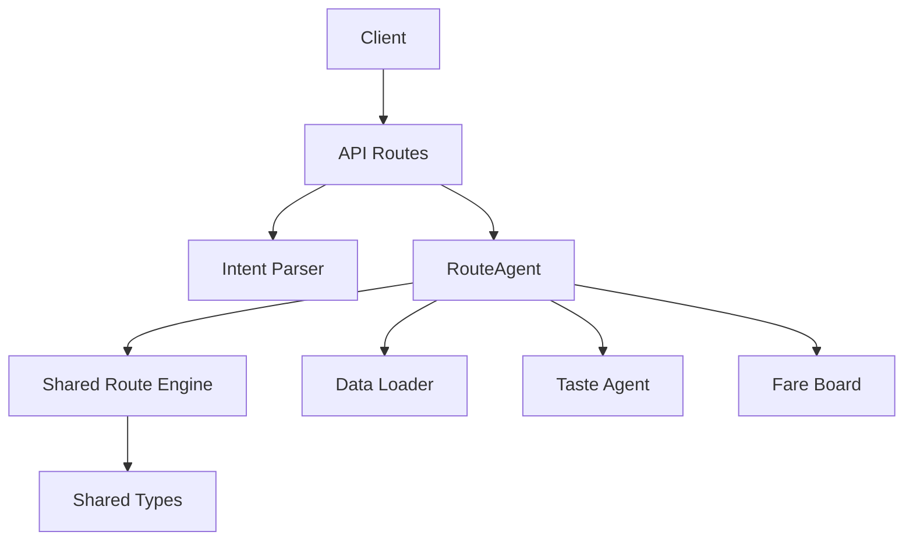
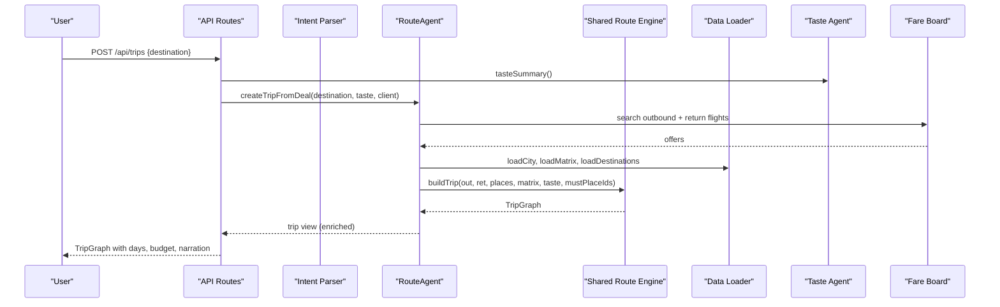
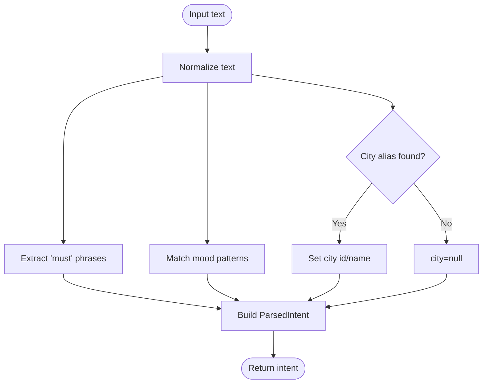
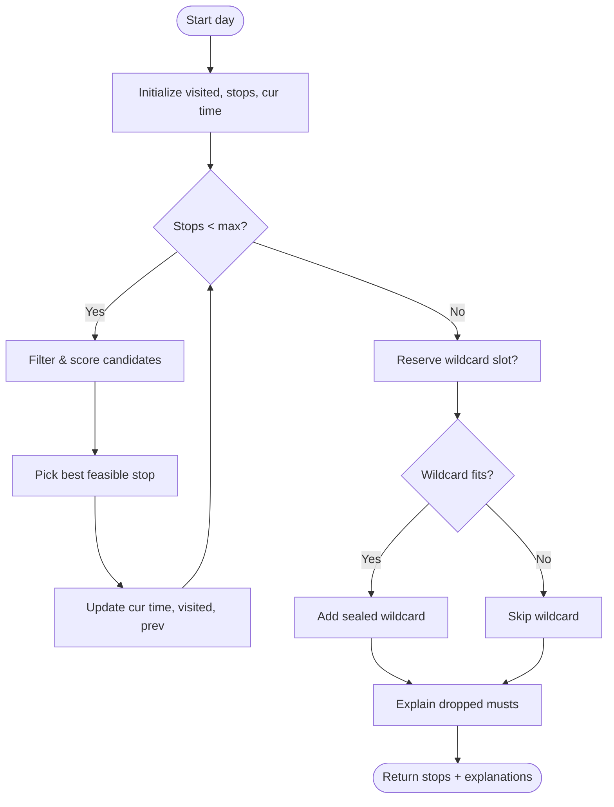
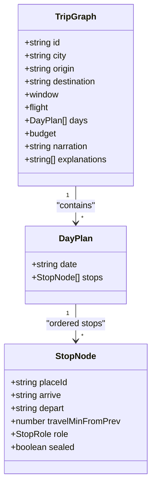
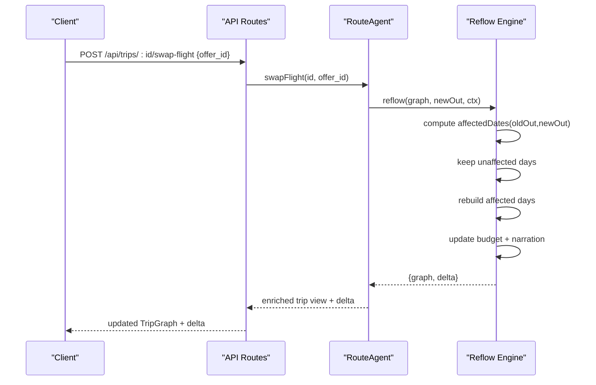
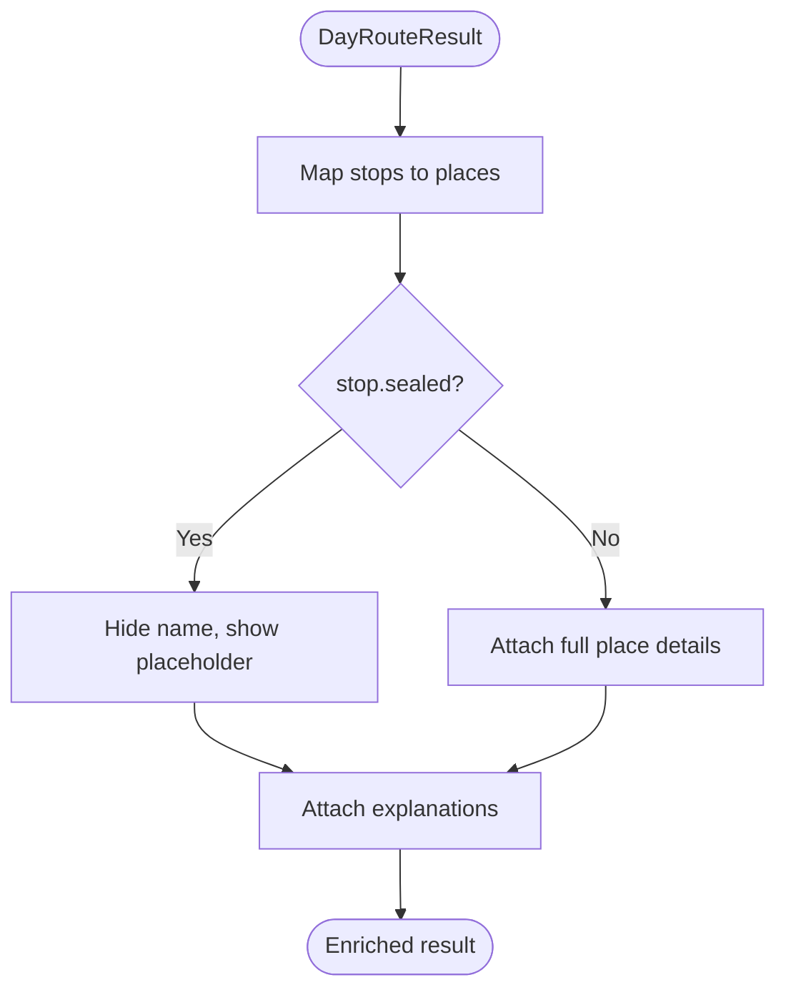
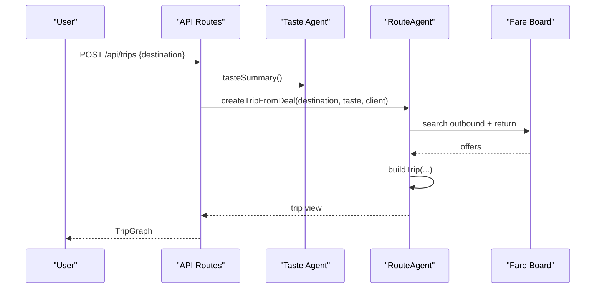
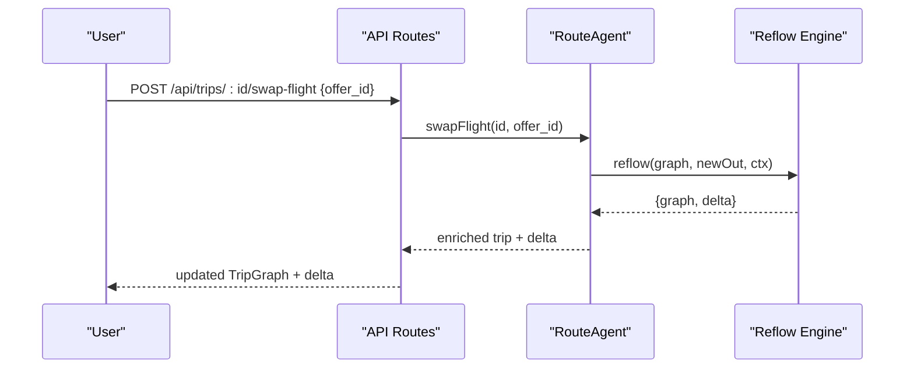
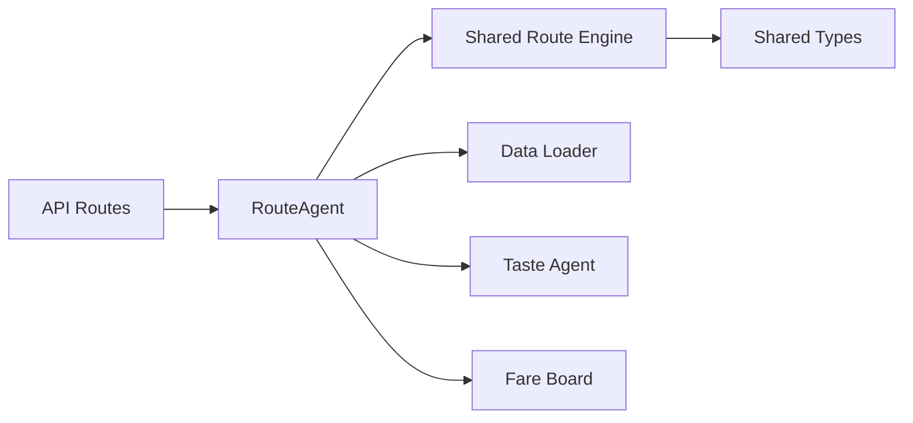

# RouteAgent - Graph-Based Trip Planning

<cite>
**Referenced Files in This Document**
- [route_agent.ts](file://apps/api/src/agents/route_agent.ts)
- [intent.ts](file://apps/api/src/intent.ts)
- [route.ts](file://packages/shared/src/route.ts)
- [types.ts](file://packages/shared/src/types.ts)
- [routes.ts](file://apps/api/src/routes.ts)
- [data.ts](file://apps/api/src/data.ts)
- [taste_agent.ts](file://apps/api/src/agents/taste_agent.ts)
- [fare_board.ts](file://apps/api/src/agents/fare_board.ts)
</cite>

## Table of Contents
1. [Introduction](#introduction)
2. [Project Structure](#project-structure)
3. [Core Components](#core-components)
4. [Architecture Overview](#architecture-overview)
5. [Detailed Component Analysis](#detailed-component-analysis)
6. [Dependency Analysis](#dependency-analysis)
7. [Performance Considerations](#performance-considerations)
8. [Troubleshooting Guide](#troubleshooting-guide)
9. [Conclusion](#conclusion)

## Introduction
This document explains the RouteAgent’s graph-based trip planning system. The core idea is that a trip is a single dependency graph: flights are “node zero,” and ground activities (stops) are interconnected through shared constraints like timing, opening hours, travel times, taste preferences, and budget. When a flight changes, the system automatically reflows downstream dependencies to keep the entire trip consistent. It also includes an intent parsing layer that converts natural language into structured planning parameters, and an enrichment process that adds place details and explanations to route results.

## Project Structure
The RouteAgent lives in the API layer and orchestrates several sub-agents and shared logic:
- Intent parsing transforms user requests into structured parameters for planning.
- The RouteAgent builds day routes and multi-day trip graphs using shared algorithms.
- Reflow recalculates affected days when flights change.
- Data loaders provide city places, routing matrices, and destination profiles.
- TasteAgent maintains a per-session preference vector used to score and rank stops.
- FareBoardAgent supplies flight options and weekend windows.

**Diagram sources**
- [routes.ts:10-85](file://apps/api/src/routes.ts#L10-L85)
- [route_agent.ts:62-185](file://apps/api/src/agents/route_agent.ts#L62-L185)
- [route.ts:16-475](file://packages/shared/src/route.ts#L16-L475)
- [data.ts:17-37](file://apps/api/src/data.ts#L17-L37)
- [taste_agent.ts:28-110](file://apps/api/src/agents/taste_agent.ts#L28-L110)
- [fare_board.ts:30-117](file://apps/api/src/agents/fare_board.ts#L30-L117)
- [types.ts:35-146](file://packages/shared/src/types.ts#L35-L146)

**Section sources**
- [routes.ts:10-85](file://apps/api/src/routes.ts#L10-L85)
- [route_agent.ts:62-185](file://apps/api/src/agents/route_agent.ts#L62-L185)
- [route.ts:16-475](file://packages/shared/src/route.ts#L16-L475)
- [data.ts:17-37](file://apps/api/src/data.ts#L17-L37)
- [taste_agent.ts:28-110](file://apps/api/src/agents/taste_agent.ts#L28-L110)
- [fare_board.ts:30-117](file://apps/api/src/agents/fare_board.ts#L30-L117)
- [types.ts:35-146](file://packages/shared/src/types.ts#L35-L146)

## Core Components
- Intent parser: Converts natural language into city, area, must-tags, and mood tags for deterministic planning without LLMs in the request path.
- Day route builder: Constructs ordered stops with arrival/departure times, roles (anchor, food, quiet, wildcard, must), and respects opening hours, meal windows, and travel times.
- Trip builder: Creates a multi-day TripGraph where the outbound flight is node zero; it schedules days based on arrival and departure constraints and computes budget totals.
- Reflow engine: Swaps the outbound flight and rebuilds only affected days while preserving unaffected ones, then updates budgets and narration.
- Enrichment: Adds place details and explanations to route results, including sealed wildcards revealed later by the client.
- Data loader: Caches city data and travel matrices for performance.
- Taste agent: Maintains a swipe-driven preference vector and per-destination must-go lists that seed trip planning.

**Section sources**
- [intent.ts:41-64](file://apps/api/src/intent.ts#L41-L64)
- [route.ts:163-247](file://packages/shared/src/route.ts#L163-L247)
- [route.ts:349-387](file://packages/shared/src/route.ts#L349-L387)
- [route.ts:414-474](file://packages/shared/src/route.ts#L414-L474)
- [route_agent.ts:36-53](file://apps/api/src/agents/route_agent.ts#L36-L53)
- [data.ts:17-37](file://apps/api/src/data.ts#L17-L37)
- [taste_agent.ts:28-110](file://apps/api/src/agents/taste_agent.ts#L28-L110)

## Architecture Overview
The RouteAgent coordinates planning across layers:
- User input flows through API routes to the intent parser.
- The RouteAgent uses shared algorithms to build day routes and assemble them into a TripGraph.
- Flight options come from the fare board integration or nightly snapshots.
- Reflow recalculates downstream days when flights change, maintaining consistency across the graph.
- Enrichment attaches place metadata and explanations before returning results to clients.

**Diagram sources**
- [routes.ts:64-85](file://apps/api/src/routes.ts#L64-L85)
- [route_agent.ts:107-153](file://apps/api/src/agents/route_agent.ts#L107-L153)
- [route.ts:349-387](file://packages/shared/src/route.ts#L349-L387)
- [fare_board.ts:30-117](file://apps/api/src/agents/fare_board.ts#L30-L117)
- [data.ts:17-37](file://apps/api/src/data.ts#L17-L37)
- [taste_agent.ts:98-110](file://apps/api/src/agents/taste_agent.ts#L98-L110)

## Detailed Component Analysis

### Intent Parsing System
The intent parser extracts:
- City identification via aliases.
- Area hints such as CBD.
- Must-do tags extracted from phrases like “must eat chicken rice.”
- Mood tags inferred from patterns (e.g., “quiet” maps to chill/nature).

It returns a deterministic structure consumed by the planner, ensuring stable behavior across runs.

**Diagram sources**
- [intent.ts:41-64](file://apps/api/src/intent.ts#L41-L64)

**Section sources**
- [intent.ts:41-64](file://apps/api/src/intent.ts#L41-L64)

### Day Route Building and Constraints
Day routes are built with strict feasibility checks:
- Opening hours: Places must be open at arrival time with buffer before closing.
- Travel times: Derived from precomputed matrices; first leg has a minimum buffer.
- Meal windows: Food stops get scoring boosts during typical meal times.
- Must-go guarantees: Must-place IDs and must-tags are prioritized; if not placed, explanations are generated.
- Wildcard placement: One novel, taste-adjacent stop may be reserved and sealed until reveal.

**Diagram sources**
- [route.ts:163-247](file://packages/shared/src/route.ts#L163-L247)

**Section sources**
- [route.ts:163-247](file://packages/shared/src/route.ts#L163-L247)

### Trip Builder: Flights as Node Zero
The trip builder treats the outbound flight as node zero and constructs a multi-day plan constrained by:
- Arrival buffer after landing.
- Late arrival mode limiting to one night-only food/nightlife stop.
- Airport cutoff before departure on the last day.
- Shared budget computation combining flight costs and estimated ground costs.
- Narration generation summarizing the plan.

**Diagram sources**
- [types.ts:123-146](file://packages/shared/src/types.ts#L123-L146)
- [types.ts:114-121](file://packages/shared/src/types.ts#L114-L121)
- [route.ts:349-387](file://packages/shared/src/route.ts#L349-L387)

**Section sources**
- [route.ts:349-387](file://packages/shared/src/route.ts#L349-L387)

### Reflow Mechanism: Automatic Propagation
When a flight is swapped:
- Identify affected dates based on late arrivals.
- Keep unaffected days intact to preserve stability.
- Rebuild only affected days using the same scheduling rules.
- Recompute budget totals and generate a concise swap narration.
- Return delta metrics for UI updates (fare delta, rebuilt/dropped/added dates, day-one stop counts).

**Diagram sources**
- [routes.ts:78-85](file://apps/api/src/routes.ts#L78-L85)
- [route_agent.ts:170-185](file://apps/api/src/agents/route_agent.ts#L170-L185)
- [route.ts:414-474](file://packages/shared/src/route.ts#L414-L474)

**Section sources**
- [route.ts:414-474](file://packages/shared/src/route.ts#L414-L474)
- [route_agent.ts:170-185](file://apps/api/src/agents/route_agent.ts#L170-L185)

### Enrichment Process
Enrichment attaches place details to route results:
- For each stop, find matching place metadata.
- Preserve sealed wildcards by hiding identity until client reveals.
- Include explanations generated by the planner.
- Trip views enrich day-level stops with place info for display.

**Diagram sources**
- [route_agent.ts:36-53](file://apps/api/src/agents/route_agent.ts#L36-L53)

**Section sources**
- [route_agent.ts:36-53](file://apps/api/src/agents/route_agent.ts#L36-L53)

### Examples and Workflows

#### Creating a Trip from Deals
- Seed taste preferences via swiping or initial tags.
- Request trip creation for a destination.
- System searches outbound and return flights within a long weekend window.
- Builds a TripGraph with days scheduled around flight times and constraints.
- Returns enriched trip view with budget and narration.

**Diagram sources**
- [routes.ts:64-70](file://apps/api/src/routes.ts#L64-L70)
- [route_agent.ts:107-153](file://apps/api/src/agents/route_agent.ts#L107-L153)
- [fare_board.ts:30-117](file://apps/api/src/agents/fare_board.ts#L30-L117)

**Section sources**
- [route_agent.ts:107-153](file://apps/api/src/agents/route_agent.ts#L107-L153)
- [routes.ts:64-70](file://apps/api/src/routes.ts#L64-L70)

#### Flight Swapping Workflow
- User selects a different outbound flight offer.
- Swap endpoint triggers reflow to recalculate affected days.
- System preserves unaffected days, rebuilds impacted ones, updates budget and narration.
- Client receives delta to animate changes.

**Diagram sources**
- [routes.ts:78-85](file://apps/api/src/routes.ts#L78-L85)
- [route_agent.ts:170-185](file://apps/api/src/agents/route_agent.ts#L170-L185)
- [route.ts:414-474](file://packages/shared/src/route.ts#L414-L474)

**Section sources**
- [route_agent.ts:170-185](file://apps/api/src/agents/route_agent.ts#L170-L185)
- [route.ts:414-474](file://packages/shared/src/route.ts#L414-L474)

### Consistency Across the Trip Graph
Consistency is maintained by:
- Shared constraints: opening hours, travel times, meal windows, and airport cutoffs.
- Must-go guarantees: explicit explanations when constraints prevent inclusion.
- Budget aggregation: flight and ground costs combined and updated on reflow.
- Wildcard policy: at most one sealed wildcard per trip, preventing over-planning.
- Deterministic scoring: taste vector and tag-based heuristics ensure reproducible plans.

**Section sources**
- [route.ts:41-51](file://packages/shared/src/route.ts#L41-L51)
- [route.ts:111-130](file://packages/shared/src/route.ts#L111-L130)
- [route.ts:231-247](file://packages/shared/src/route.ts#L231-L247)
- [route.ts:349-387](file://packages/shared/src/route.ts#L349-L387)
- [route.ts:414-474](file://packages/shared/src/route.ts#L414-L474)

## Dependency Analysis
Key dependencies and relationships:
- API routes depend on RouteAgent for planning and swapping.
- RouteAgent depends on shared route engine for building days and trips.
- Shared route engine depends on types for data structures and narrative utilities.
- Data loader provides cached city and matrix data.
- Taste agent supplies preference vectors and must-go lists.
- Fare board supplies flight options and weekend windows.

**Diagram sources**
- [routes.ts:10-85](file://apps/api/src/routes.ts#L10-L85)
- [route_agent.ts:62-185](file://apps/api/src/agents/route_agent.ts#L62-L185)
- [route.ts:16-475](file://packages/shared/src/route.ts#L16-L475)
- [data.ts:17-37](file://apps/api/src/data.ts#L17-L37)
- [taste_agent.ts:28-110](file://apps/api/src/agents/taste_agent.ts#L28-L110)
- [fare_board.ts:30-117](file://apps/api/src/agents/fare_board.ts#L30-L117)
- [types.ts:35-146](file://packages/shared/src/types.ts#L35-L146)

**Section sources**
- [routes.ts:10-85](file://apps/api/src/routes.ts#L10-L85)
- [route_agent.ts:62-185](file://apps/api/src/agents/route_agent.ts#L62-L185)
- [route.ts:16-475](file://packages/shared/src/route.ts#L16-L475)
- [data.ts:17-37](file://apps/api/src/data.ts#L17-L37)
- [taste_agent.ts:28-110](file://apps/api/src/agents/taste_agent.ts#L28-L110)
- [fare_board.ts:30-117](file://apps/api/src/agents/fare_board.ts#L30-L117)
- [types.ts:35-146](file://packages/shared/src/types.ts#L35-L146)

## Performance Considerations
- Data caching: City and matrix data are cached in memory to avoid repeated file reads.
- Minimal reflow: Only affected days are rebuilt when flights change, preserving unaffected days for efficiency.
- Deterministic scoring: Heuristics and fixed thresholds reduce computational complexity during candidate selection.
- Wildcard reservation: Limits novelty to one stop per trip to avoid excessive recomputation.
- Nightly batch: Fare snapshots are precomputed to minimize live calls during user interactions.

[No sources needed since this section provides general guidance]

## Troubleshooting Guide
Common issues and resolutions:
- Unknown trip: Ensure the trip ID exists in session storage before swapping.
- Unknown offer: Verify the offer_id belongs to the stored flight options for the trip.
- No flights available: Check destination profile and weekend availability; ensure fare board queries succeed.
- No upcoming long weekend: Validate holiday calendar and current date relative to next long weekend.
- Place not fitting: Review must-go explanations; adjust time windows or must-tags accordingly.

**Section sources**
- [route_agent.ts:170-185](file://apps/api/src/agents/route_agent.ts#L170-L185)
- [route_agent.ts:107-153](file://apps/api/src/agents/route_agent.ts#L107-L153)
- [route.ts:231-247](file://packages/shared/src/route.ts#L231-L247)
- [fare_board.ts:30-117](file://apps/api/src/agents/fare_board.ts#L30-L117)

## Conclusion
The RouteAgent implements a robust, graph-based trip planning system where flights act as node zero and ground activities are interconnected through shared constraints. The intent parser translates natural language into structured parameters, enabling deterministic planning. The reflow mechanism ensures automatic propagation of changes when flights are swapped, recalculating downstream dependencies while maintaining consistency across the trip graph. Enrichment enhances results with place details and explanations, providing a clear and actionable itinerary to users.

[No sources needed since this section summarizes without analyzing specific files]