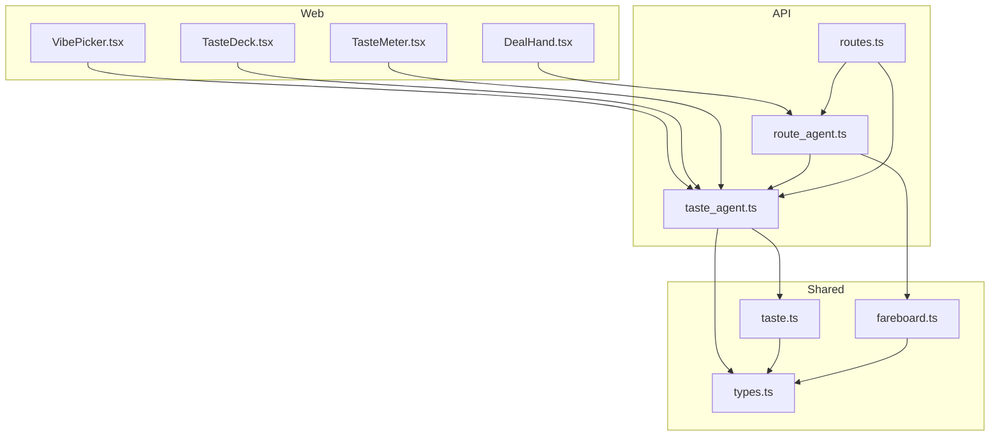
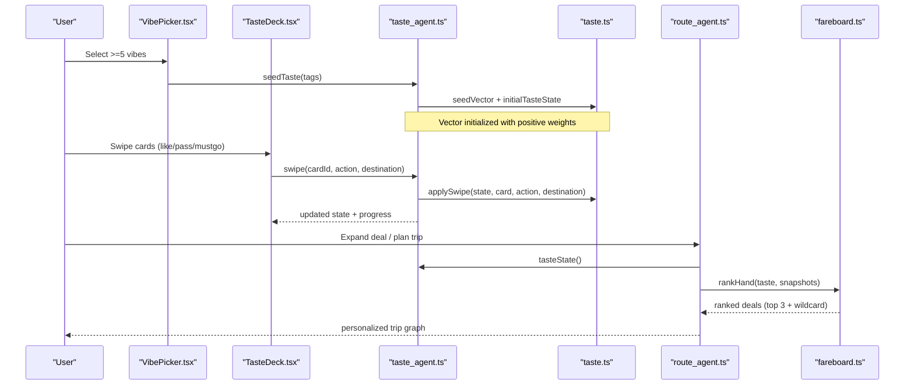
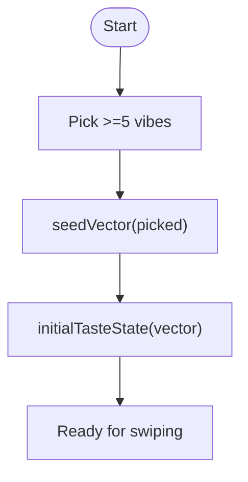
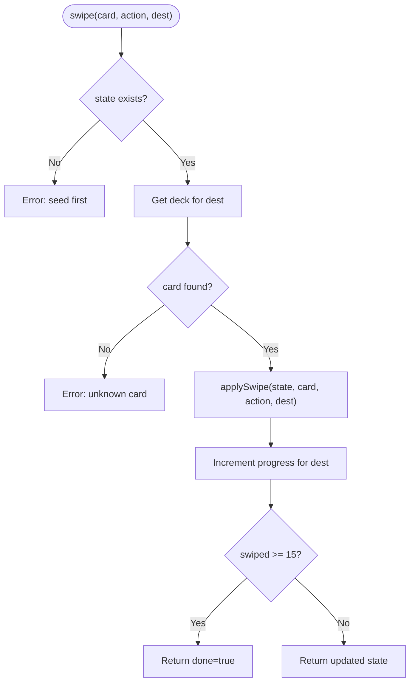
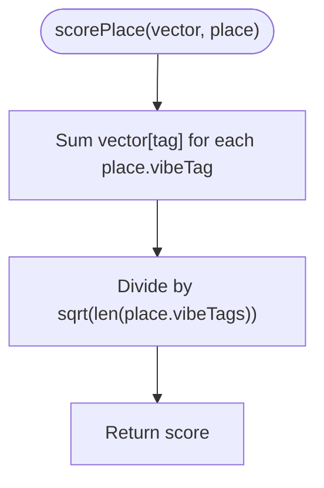
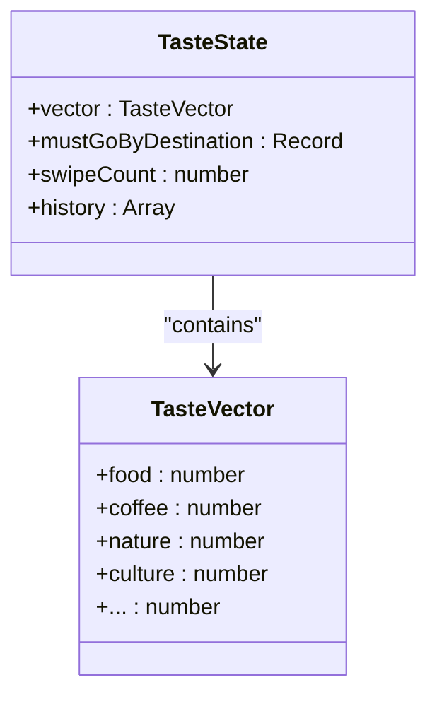
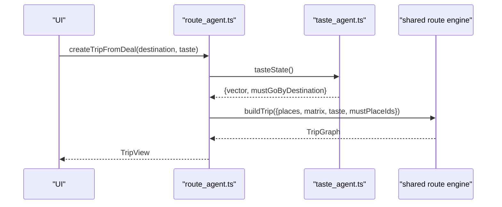
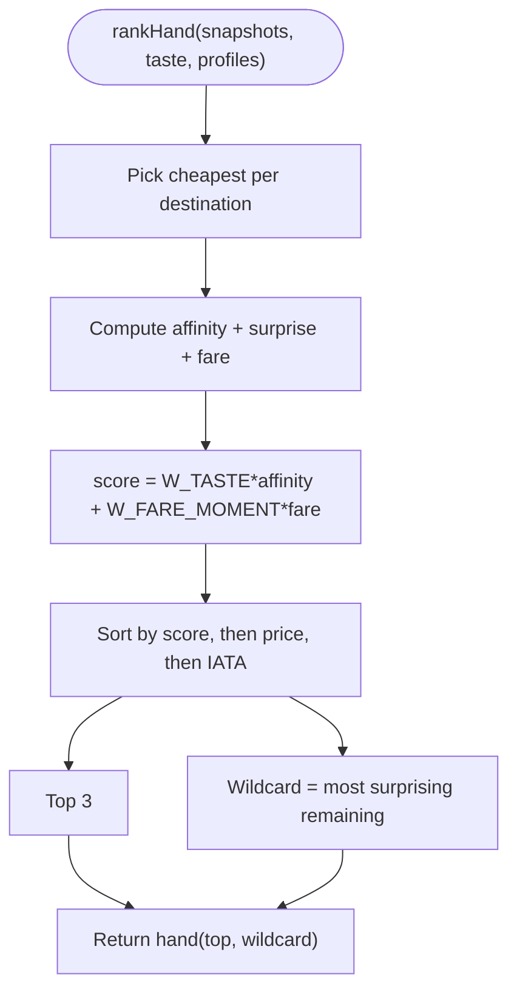
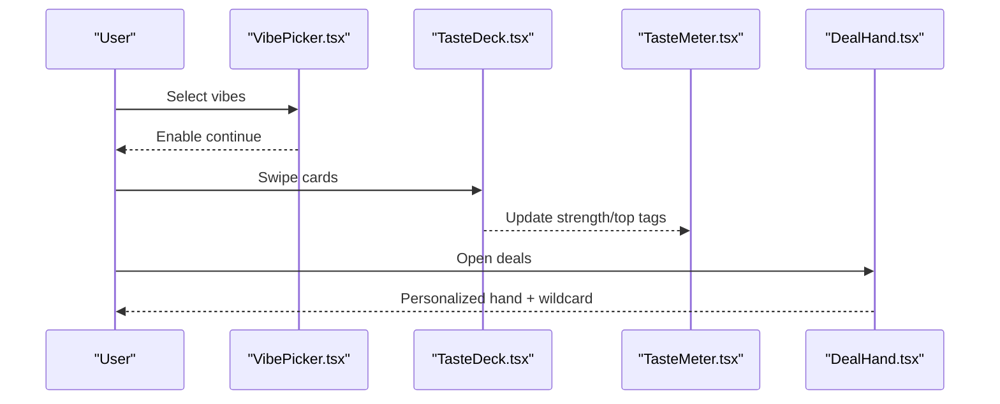
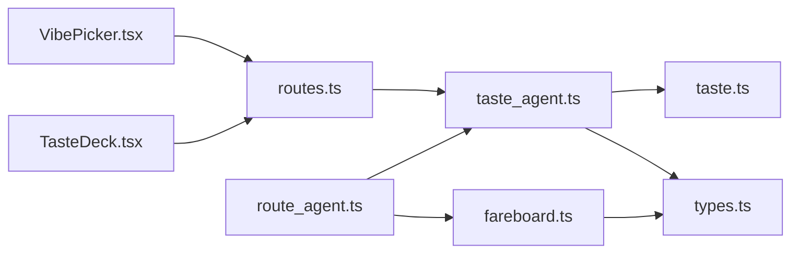

# TasteAgent - Preference Learning System

<cite>
**Referenced Files in This Document**
- [taste_agent.ts](file://apps/api/src/agents/taste_agent.ts)
- [taste.ts](file://packages/shared/src/taste.ts)
- [types.ts](file://packages/shared/src/types.ts)
- [route_agent.ts](file://apps/api/src/agents/route_agent.ts)
- [fareboard.ts](file://packages/shared/src/fareboard.ts)
- [routes.ts](file://apps/api/src/routes.ts)
- [TasteDeck.tsx](file://apps/web/src/components/onboarding/TasteDeck.tsx)
- [VibePicker.tsx](file://apps/web/src/components/onboarding/VibePicker.tsx)
- [TasteMeter.tsx](file://apps/web/src/components/onboarding/TasteMeter.tsx)
- [DealHand.tsx](file://apps/web/src/components/deck/DealHand.tsx)
</cite>

## Table of Contents
1. [Introduction](#introduction)
2. [Project Structure](#project-structure)
3. [Core Components](#core-components)
4. [Architecture Overview](#architecture-overview)
5. [Detailed Component Analysis](#detailed-component-analysis)
6. [Dependency Analysis](#dependency-analysis)
7. [Performance Considerations](#performance-considerations)
8. [Troubleshooting Guide](#troubleshooting-guide)
9. [Conclusion](#conclusion)
10. [Appendices](#appendices)

## Introduction
This document explains the TasteAgent preference learning system that turns swipe-based interactions into a personalized taste vector and applies it across trip planning. It covers:
- How user preferences are collected via a 15-card swipe deck per destination
- How the taste vector encodes preferences over vibe tags
- How must-go tracking remembers places users consistently select, with destination-specific storage
- How route optimization and deal selection use learned preferences to personalize recommendations
- Examples of taste vector structure, scoring algorithms, and integration points between agents

## Project Structure
The preference system spans UI, API, and shared logic:
- Web UI components collect initial vibes and drive swiping
- API agent manages session state, decks, and summary
- Shared library implements vector math, scoring, undo history, and ranking
- Route and fareboard modules consume the taste vector for personalization

**Diagram sources**
- [TasteDeck.tsx:1-22](file://apps/web/src/components/onboarding/TasteDeck.tsx#L1-L22)
- [VibePicker.tsx:1-55](file://apps/web/src/components/onboarding/VibePicker.tsx#L1-L55)
- [TasteMeter.tsx:1-32](file://apps/web/src/components/onboarding/TasteMeter.tsx#L1-L32)
- [DealHand.tsx:1-169](file://apps/web/src/components/deck/DealHand.tsx#L1-L169)
- [taste_agent.ts:1-118](file://apps/api/src/agents/taste_agent.ts#L1-L118)
- [route_agent.ts:1-191](file://apps/api/src/agents/route_agent.ts#L1-L191)
- [routes.ts:1-26](file://apps/api/src/routes.ts#L1-L26)
- [taste.ts:1-68](file://packages/shared/src/taste.ts#L1-L68)
- [fareboard.ts:1-197](file://packages/shared/src/fareboard.ts#L1-L197)
- [types.ts:1-170](file://packages/shared/src/types.ts#L1-L170)

**Section sources**
- [taste_agent.ts:14-26](file://apps/api/src/agents/taste_agent.ts#L14-L26)
- [types.ts:1-84](file://packages/shared/src/types.ts#L1-L84)

## Core Components
- Vibe seeding: Users pick at least five vibe tags to initialize their taste vector.
- Swipe deck: A deterministic 15-card deck per destination is presented; each swipe updates the taste vector and optionally records a must-go place for that destination.
- Undo support: Swipes can be undone by restoring previous state from an internal history stack.
- Summary and strength: The system exposes top tags and a “strength” metric derived from positive weights.
- Integration: Route and fareboard modules read the current taste vector and must-go lists to personalize day routes and deal rankings.

Key data structures:
- TasteVector: a map from vibe tag to numeric weight
- TasteState: includes vector, mustGoByDestination, swipeCount, and history
- DeckCard: a swipeable card representing a place
- SwipeAction: like, pass, or mustgo

**Section sources**
- [taste.ts:16-28](file://packages/shared/src/taste.ts#L16-L28)
- [taste.ts:30-67](file://packages/shared/src/taste.ts#L30-L67)
- [types.ts:68-84](file://packages/shared/src/types.ts#L68-L84)
- [taste_agent.ts:28-33](file://apps/api/src/agents/taste_agent.ts#L28-L33)
- [taste_agent.ts:69-92](file://apps/api/src/agents/taste_agent.ts#L69-L92)
- [taste_agent.ts:98-110](file://apps/api/src/agents/taste_agent.ts#L98-L110)

## Architecture Overview
The flow starts with onboarding (vibes), continues with swiping to refine preferences, and culminates in personalized trip planning and deal selection.

**Diagram sources**
- [VibePicker.tsx:20-55](file://apps/web/src/components/onboarding/VibePicker.tsx#L20-L55)
- [TasteDeck.tsx:9-21](file://apps/web/src/components/onboarding/TasteDeck.tsx#L9-L21)
- [taste_agent.ts:28-92](file://apps/api/src/agents/taste_agent.ts#L28-L92)
- [taste.ts:20-67](file://packages/shared/src/taste.ts#L20-L67)
- [route_agent.ts:107-152](file://apps/api/src/agents/route_agent.ts#L107-L152)
- [fareboard.ts:111-179](file://packages/shared/src/fareboard.ts#L111-L179)

## Detailed Component Analysis

### Vibe Seeding and Initial State
- Users choose at least five vibe tags to seed their taste thread.
- The server initializes a taste vector where selected tags receive a positive seed weight.
- An empty vector starts all-zero; the initial state also tracks must-go lists per destination and maintains an undo history.

**Diagram sources**
- [VibePicker.tsx:20-55](file://apps/web/src/components/onboarding/VibePicker.tsx#L20-L55)
- [taste.ts:20-28](file://packages/shared/src/taste.ts#L20-L28)

**Section sources**
- [VibePicker.tsx:20-55](file://apps/web/src/components/onboarding/VibePicker.tsx#L20-L55)
- [taste.ts:20-28](file://packages/shared/src/taste.ts#L20-L28)

### Swipe-Based Preference Collection
- Each destination has its own 15-card deck built deterministically by round-robin across primary vibe buckets.
- Swipes update the taste vector:
  - Like increases weights for the card’s vibe tags
  - Pass decreases them
  - Mustgo strongly increases weights and records the place ID under the destination key
- Progress is tracked per destination; undo restores prior state.

**Diagram sources**
- [taste_agent.ts:35-84](file://apps/api/src/agents/taste_agent.ts#L35-L84)
- [taste.ts:30-61](file://packages/shared/src/taste.ts#L30-L61)

**Section sources**
- [taste_agent.ts:35-84](file://apps/api/src/agents/taste_agent.ts#L35-L84)
- [taste.ts:30-61](file://packages/shared/src/taste.ts#L30-L61)

### Taste Vector Structure and Scoring
- TasteVector maps each vibe tag to a bounded number. Weights are clamped within a minimum and maximum range after each swipe.
- Place scoring sums the vector values for a place’s vibe tags and normalizes by the square root of tag count to avoid bias toward places with many tags.

**Diagram sources**
- [taste.ts:63-67](file://packages/shared/src/taste.ts#L63-L67)
- [types.ts:35-49](file://packages/shared/src/types.ts#L35-L49)

**Section sources**
- [taste.ts:63-67](file://packages/shared/src/taste.ts#L63-L67)
- [types.ts:35-49](file://packages/shared/src/types.ts#L35-L49)

### Must-Go Tracking and Destination-Specific Preferences
- When a user marks a card as “mustgo,” the place ID is appended to a list keyed by destination (e.g., “da-nang”, “home”).
- These must-go lists persist in the taste state and are used later when building trips for that destination.
- Undo removes the last recorded state, including must-go entries.

**Diagram sources**
- [types.ts:79-84](file://packages/shared/src/types.ts#L79-L84)
- [taste.ts:26-49](file://packages/shared/src/taste.ts#L26-L49)

**Section sources**
- [taste.ts:40-49](file://packages/shared/src/taste.ts#L40-L49)
- [types.ts:79-84](file://packages/shared/src/types.ts#L79-L84)

### Integration with Route Planning
- Day-route planning accepts the current taste vector and optional must-place IDs to ensure those stops are included.
- Trip creation reads must-go lists from the taste state for the chosen destination and seeds them into the trip builder.
- Reflow (flight swap) re-applies the same taste and must-go constraints to regenerate optimized routes.

**Diagram sources**
- [route_agent.ts:107-152](file://apps/api/src/agents/route_agent.ts#L107-L152)
- [route_agent.ts:170-184](file://apps/api/src/agents/route_agent.ts#L170-L184)
- [taste_agent.ts:94-96](file://apps/api/src/agents/taste_agent.ts#L94-L96)

**Section sources**
- [route_agent.ts:107-152](file://apps/api/src/agents/route_agent.ts#L107-L152)
- [route_agent.ts:170-184](file://apps/api/src/agents/route_agent.ts#L170-L184)

### Integration with Deal Selection (Fareboard)
- Deals are ranked using a blend of taste affinity and fare moment signals.
- Affinity combines average tag alignment with unexpectedness (novelty relative to strong tastes).
- Fare moment considers seat scarcity, price spread, and flexibility attributes.
- Top three deals are shown; a sealed wildcard highlights the most novel remaining option.

**Diagram sources**
- [fareboard.ts:111-179](file://packages/shared/src/fareboard.ts#L111-L179)
- [fareboard.ts:50-91](file://packages/shared/src/fareboard.ts#L50-L91)

**Section sources**
- [fareboard.ts:111-179](file://packages/shared/src/fareboard.ts#L111-L179)
- [fareboard.ts:50-91](file://packages/shared/src/fareboard.ts#L50-L91)

### UI Flow and Feedback
- VibePicker enforces a minimum of five vibes before proceeding.
- TasteDeck presents a 15-card deck with like/pass/mustgo actions and an undo button.
- TasteMeter visualizes strength and top tags to show how the taste thread evolves.
- DealHand surfaces personalized deals and allows tapping “taste” to swipe destination-specific favorites.

**Diagram sources**
- [VibePicker.tsx:20-55](file://apps/web/src/components/onboarding/VibePicker.tsx#L20-L55)
- [TasteDeck.tsx:9-21](file://apps/web/src/components/onboarding/TasteDeck.tsx#L9-L21)
- [TasteMeter.tsx:7-31](file://apps/web/src/components/onboarding/TasteMeter.tsx#L7-L31)
- [DealHand.tsx:27-169](file://apps/web/src/components/deck/DealHand.tsx#L27-L169)

**Section sources**
- [TasteDeck.tsx:9-21](file://apps/web/src/components/onboarding/TasteDeck.tsx#L9-L21)
- [TasteMeter.tsx:7-31](file://apps/web/src/components/onboarding/TasteMeter.tsx#L7-L31)
- [DealHand.tsx:27-169](file://apps/web/src/components/deck/DealHand.tsx#L27-L169)

## Dependency Analysis
- Web components depend on the API endpoints exposed by routes.ts to fetch decks and submit swipes.
- taste_agent.ts depends on shared taste functions and city data loaders.
- route_agent.ts consumes taste_state and shared routing/building functions.
- fareboard.ts uses taste vectors to compute affinity and novelty for deal ranking.

**Diagram sources**
- [routes.ts:1-26](file://apps/api/src/routes.ts#L1-L26)
- [taste_agent.ts:1-18](file://apps/api/src/agents/taste_agent.ts#L1-L18)
- [route_agent.ts:1-17](file://apps/api/src/agents/route_agent.ts#L1-L17)
- [fareboard.ts:1-20](file://packages/shared/src/fareboard.ts#L1-L20)
- [types.ts:1-20](file://packages/shared/src/types.ts#L1-L20)

**Section sources**
- [routes.ts:1-26](file://apps/api/src/routes.ts#L1-L26)
- [taste_agent.ts:1-18](file://apps/api/src/agents/taste_agent.ts#L1-L18)
- [route_agent.ts:1-17](file://apps/api/src/agents/route_agent.ts#L1-L17)
- [fareboard.ts:1-20](file://packages/shared/src/fareboard.ts#L1-L20)

## Performance Considerations
- Deterministic deck generation: Round-robin bucketing ensures consistent, diverse decks without heavy computation.
- Bounded vector updates: Clamping prevents runaway weights and keeps scoring stable.
- Undo history: Maintains a lightweight snapshot stack; keep deck size small (15) to limit memory growth.
- Deal ranking: Aggregates per-destination cheapest offers and computes simple linear scores; efficient for large snapshot sets.

[No sources needed since this section provides general guidance]

## Troubleshooting Guide
- “Seed vibes first”: Ensure at least five vibes are selected before swiping.
- Unknown card: Verify the card ID matches the current deck for the destination.
- No flights or no return flight: Confirm availability for the selected weekend window.
- No full trip data: Some destinations may not have complete city files required for trip building.
- Undo not working: If there is no history, undo returns the current state unchanged.

**Section sources**
- [taste_agent.ts:69-92](file://apps/api/src/agents/taste_agent.ts#L69-L92)
- [route_agent.ts:111-130](file://apps/api/src/agents/route_agent.ts#L111-L130)
- [taste.ts:52-61](file://packages/shared/src/taste.ts#L52-L61)

## Conclusion
TasteAgent transforms casual swiping into a robust, destination-aware preference model. By combining a clear taste vector, must-go tracking, and deterministic scoring, it personalizes both daily routes and deal selections. The modular design separates UI, agent orchestration, and shared algorithms, enabling easy extension and maintenance.

[No sources needed since this section summarizes without analyzing specific files]

## Appendices

### API Endpoints for Taste
- GET /api/meta/vibes: Returns available vibe tags and minimum required count
- GET /api/taste/deck: Returns the default deck
- GET /api/taste/deck/:destination: Returns a destination-specific deck
- POST /api/taste/seed: Seeds the taste vector with selected vibes
- POST /api/taste/swipe: Applies a swipe action to the current state
- POST /api/taste/undo: Undoes the last swipe

**Section sources**
- [routes.ts:10-26](file://apps/api/src/routes.ts#L10-L26)

### Example Data Models
- TasteVector: map of vibe tag to number
- TasteState: vector, mustGoByDestination, swipeCount, history
- DeckCard: id, placeId, title, emoji, vibeTags, subtitle
- Place: id, name, coordinates, area, vibeTags, openHours, cost, priceBand, emoji, blurb

**Section sources**
- [types.ts:20-84](file://packages/shared/src/types.ts#L20-L84)