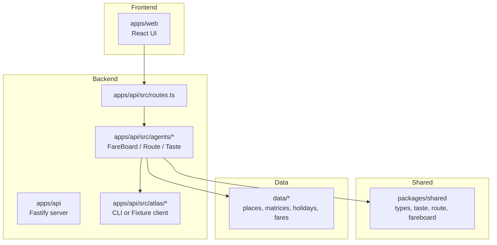
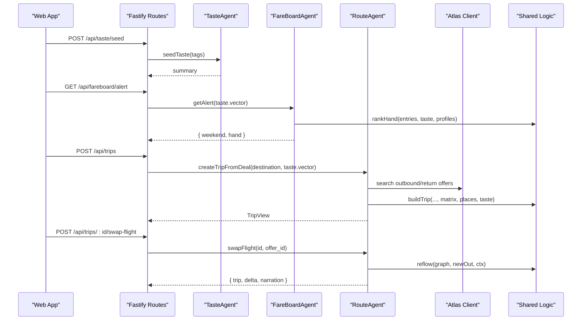
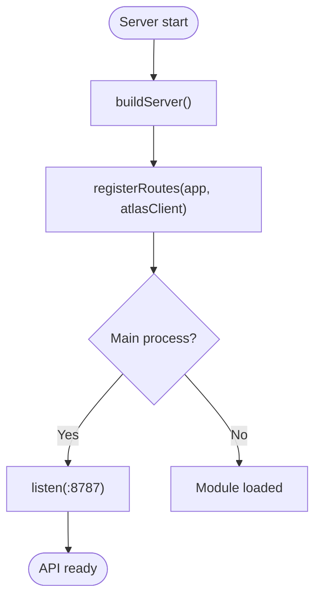
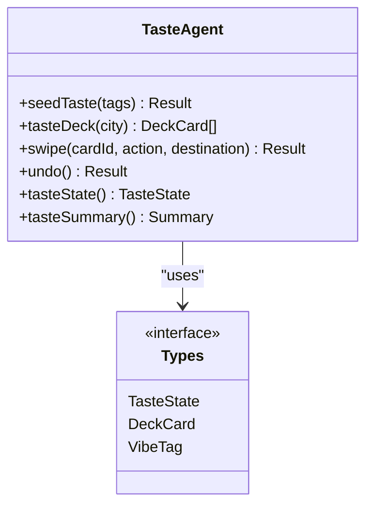
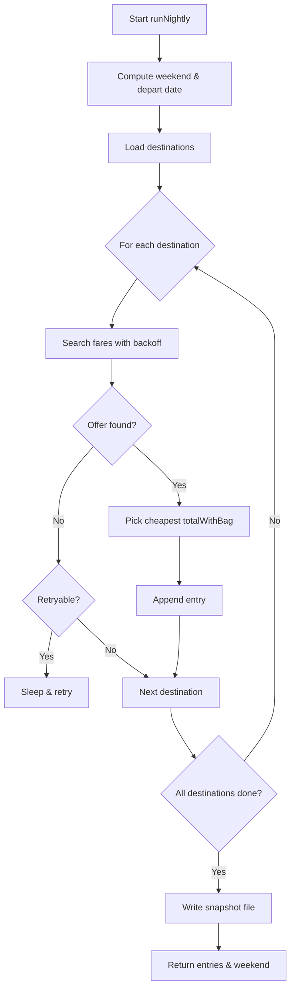
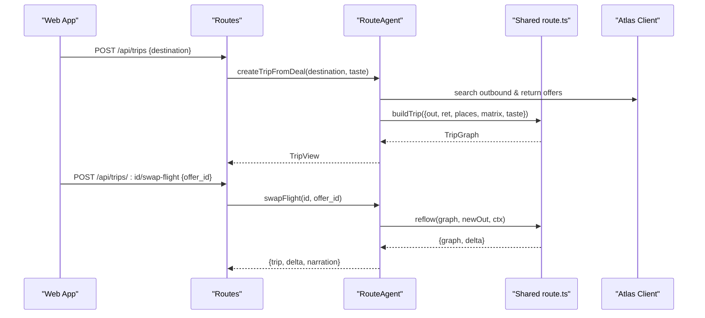
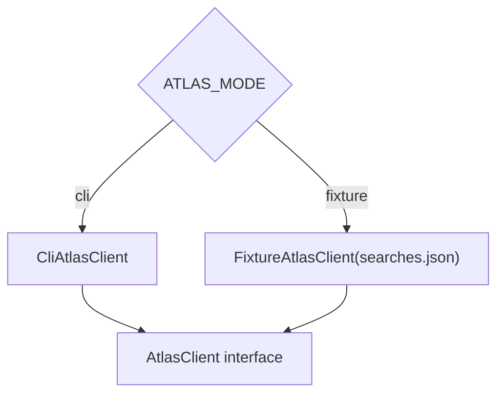
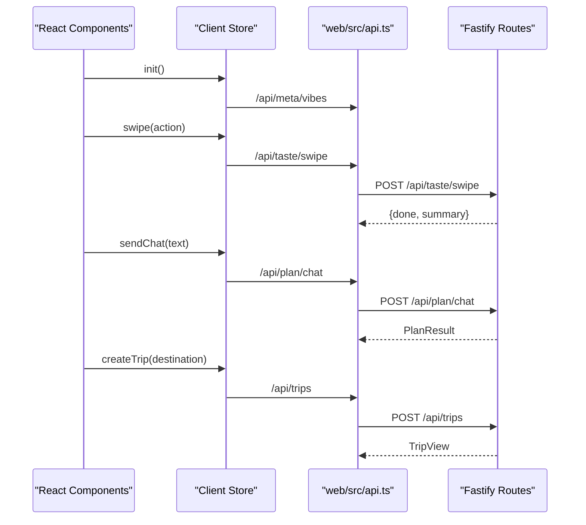
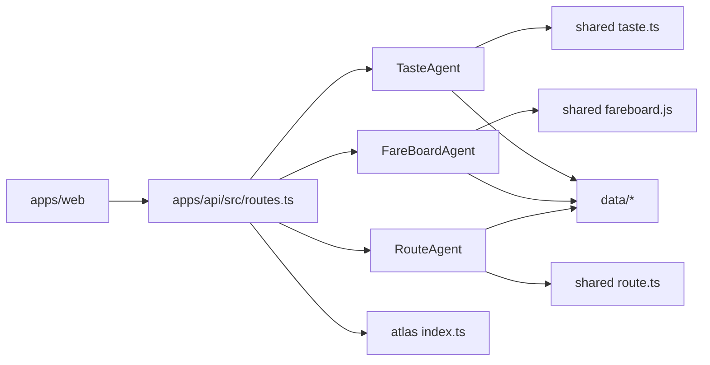

# Architecture Overview

<cite>
**Referenced Files in This Document**
- [README.md](file://README.md)
- [architecture.md](file://docs/architecture.md)
- [server.ts](file://apps/api/src/server.ts)
- [routes.ts](file://apps/api/src/routes.ts)
- [fare_board.ts](file://apps/api/src/agents/fare_board.ts)
- [route_agent.ts](file://apps/api/src/agents/route_agent.ts)
- [taste_agent.ts](file://apps/api/src/agents/taste_agent.ts)
- [atlas index.ts](file://apps/api/src/atlas/index.ts)
- [types.ts](file://packages/shared/src/types.ts)
- [route.ts](file://packages/shared/src/route.ts)
- [taste.ts](file://packages/shared/src/taste.ts)
- [api.ts](file://apps/web/src/api.ts)
- [App.tsx](file://apps/web/src/App.tsx)
- [TasteDeck.tsx](file://apps/web/src/components/onboarding/TasteDeck.tsx)
- [RoutePanel.tsx](file://apps/web/src/components/plan/RoutePanel.tsx)
</cite>

## Table of Contents
1. Introduction
2. Project Structure
3. Core Components
4. Architecture Overview
5. Detailed Component Analysis
6. Dependency Analysis
7. Performance Considerations
8. Troubleshooting Guide
9. Conclusion

## Introduction
This document describes the Trip Graph Agent system architecture: a monorepo with separate frontend and backend apps plus a shared package, built around a three-agent design that learns user preferences, monitors fares, and plans trips as a single dependency graph rooted at the flight. It explains the local-first data strategy, the Atlas Skill integration via CLI wrapper, the batch-plus-rank pipeline to respect rate limits, and the decision to use one backend app for operational simplicity.

## Project Structure
The repository is organized as a monorepo:
- apps/web: React + TypeScript frontend with map-first UI, swipe deck, trip view, booking flow, and narration strip.
- apps/api: Fastify backend hosting the three agents (FareBoardAgent, RouteAgent, TasteAgent), routes, and Atlas Skill integration.
- packages/shared: Shared types and algorithms (taste vector math, route builder, fareboard utilities, calendar helpers).
- data: Preloaded places, routing matrices, holidays, and fare fixtures/snapshots enabling offline-first behavior.
- docs: Design documents including this architecture overview and local-first design notes.
- infra: Scheduled task definitions for nightly fare-board runs.

**Diagram sources**
- [server.ts:1-26](file://apps/api/src/server.ts#L1-L26)
- [routes.ts:1-135](file://apps/api/src/routes.ts#L1-L135)
- [fare_board.ts:1-118](file://apps/api/src/agents/fare_board.ts#L1-L118)
- [route_agent.ts:1-191](file://apps/api/src/agents/route_agent.ts#L1-L191)
- [taste_agent.ts:1-118](file://apps/api/src/agents/taste_agent.ts#L1-L118)
- [atlas index.ts:1-14](file://apps/api/src/atlas/index.ts#L1-L14)
- [types.ts:1-170](file://packages/shared/src/types.ts#L1-L170)
- [route.ts:1-475](file://packages/shared/src/route.ts#L1-L475)
- [taste.ts:1-68](file://packages/shared/src/taste.ts#L1-L68)

**Section sources**
- [README.md:13-50](file://README.md#L13-L50)
- [architecture.md:21-38](file://docs/architecture.md#L21-L38)

## Core Components
- FareBoardAgent: Runs a nightly batch over a fixed candidate set (origin, destinations, long-weekend windows), backs off on rate limits, and writes timestamped fare snapshots. Per-user alerting ranks stored snapshots against the current taste vector without live calls.
- RouteAgent: Builds day routes and full trip graphs with flight as node zero; supports chat-driven planning, deal expansion into trips, and reflow when flights swap. Uses precomputed travel-time matrices and place data.
- TasteAgent: Converts swipe events into a taste vector and must-go lists per destination; provides decks and summaries used by both RouteAgent and FareBoardAgent.
- Atlas Skill Integration: Thin wrapper that either shells out to the official CLI or uses fixture data based on environment configuration. No direct REST implementation in-app.
- Shared Algorithms: Deterministic logic for taste scoring, route building, trip construction, and reflow calculations.

**Section sources**
- [fare_board.ts:15-118](file://apps/api/src/agents/fare_board.ts#L15-L118)
- [route_agent.ts:19-191](file://apps/api/src/agents/route_agent.ts#L19-L191)
- [taste_agent.ts:14-118](file://apps/api/src/agents/taste_agent.ts#L14-L118)
- [atlas index.ts:10-13](file://apps/api/src/atlas/index.ts#L10-L13)
- [route.ts:163-475](file://packages/shared/src/route.ts#L163-L475)
- [taste.ts:16-68](file://packages/shared/src/taste.ts#L16-L68)

## Architecture Overview
High-level design:
- Monorepo with one backend app (not microservices) for simplicity.
- Local-first: preloaded places, matrices, holidays, and fare fixtures enable offline-capable demos and resilient operation.
- Three-agent separation of concerns: preference learning, fare monitoring, and trip planning/reflow.
- Batch-plus-rank pipeline: nightly job collects fares; per-user interactions rank stored results using the taste vector.
- Atlas Skill via CLI wrapper: consistent interface whether running in fixture mode or live CLI mode.

**Diagram sources**
- [routes.ts:25-85](file://apps/api/src/routes.ts#L25-L85)
- [fare_board.ts:97-118](file://apps/api/src/agents/fare_board.ts#L97-L118)
- [route_agent.ts:107-185](file://apps/api/src/agents/route_agent.ts#L107-L185)
- [atlas index.ts:10-13](file://apps/api/src/atlas/index.ts#L10-L13)
- [route.ts:349-475](file://packages/shared/src/route.ts#L349-L475)

## Detailed Component Analysis

### Backend Server and Routing
- The Fastify server initializes CORS and registers routes with an Atlas client instance created from environment mode (fixture vs CLI).
- Routes expose endpoints for taste management, planning, fare alerts, trip creation, flight swapping, booking verification/order/pay, wildcard reveal, and evidence logging.

**Diagram sources**
- [server.ts:8-25](file://apps/api/src/server.ts#L8-L25)
- [routes.ts:10-135](file://apps/api/src/routes.ts#L10-L135)

**Section sources**
- [server.ts:1-26](file://apps/api/src/server.ts#L1-L26)
- [routes.ts:1-135](file://apps/api/src/routes.ts#L1-L135)

### TasteAgent: Preference Learning
- Seeds initial taste from vibe tags and builds a deterministic 15-card deck per destination using bucket round-robin across primary vibe tags.
- Swipe actions update the taste vector and must-go lists per destination; undo rewinds history.
- Summary exposes vector, top tags, must-go list, strength, and progress.

**Diagram sources**
- [taste_agent.ts:14-118](file://apps/api/src/agents/taste_agent.ts#L14-L118)
- [types.ts:18-84](file://packages/shared/src/types.ts#L18-L84)

**Section sources**
- [taste_agent.ts:14-118](file://apps/api/src/agents/taste_agent.ts#L14-L118)
- [taste.ts:16-68](file://packages/shared/src/taste.ts#L16-L68)

### FareBoardAgent: Nightly Batch and Alert Ranking
- Computes next long weekend and departure date, then iterates destinations to search fares with backoff on retryable errors.
- Persists timestamped snapshots; per-user alert loads snapshots and ranks them with the taste vector to produce a “hand” of deals.

**Diagram sources**
- [fare_board.ts:30-82](file://apps/api/src/agents/fare_board.ts#L30-L82)

**Section sources**
- [fare_board.ts:15-118](file://apps/api/src/agents/fare_board.ts#L15-L118)

### RouteAgent: Trip Graph Planning and Reflow
- Chat-driven planning parses intent, loads city and matrix, and builds multiple alternatives using taste and constraints.
- Deal expansion queries outbound and return flights, selects best options, and constructs a TripGraph with days derived from flight dates.
- Flight swap triggers reflow: rebuilds affected days while preserving unaffected ones, computes budget deltas, and narrates changes.

**Diagram sources**
- [route_agent.ts:107-185](file://apps/api/src/agents/route_agent.ts#L107-L185)
- [route.ts:349-475](file://packages/shared/src/route.ts#L349-L475)

**Section sources**
- [route_agent.ts:19-191](file://apps/api/src/agents/route_agent.ts#L19-L191)
- [route.ts:163-475](file://packages/shared/src/route.ts#L163-L475)

### Atlas Skill Integration
- Factory creates either a CLI-based client or a fixture-based client depending on environment variable.
- All booking/search flows go through this abstraction, keeping the rest of the codebase decoupled from transport details.

**Diagram sources**
- [atlas index.ts:10-13](file://apps/api/src/atlas/index.ts#L10-L13)

**Section sources**
- [atlas index.ts:1-14](file://apps/api/src/atlas/index.ts#L1-L14)

### Frontend Interaction with Backend
- The React app composes components for onboarding (vibes, taste deck), planning (chat bar, route cards), trip view (map, stops), booking flow, and evidence panel.
- A typed fetch layer calls backend endpoints for taste, planning, alerts, trips, swaps, reveals, and booking steps.

**Diagram sources**
- [App.tsx:15-90](file://apps/web/src/App.tsx#L15-L90)
- [TasteDeck.tsx:5-22](file://apps/web/src/components/onboarding/TasteDeck.tsx#L5-L22)
- [RoutePanel.tsx:5-108](file://apps/web/src/components/plan/RoutePanel.tsx#L5-L108)
- [api.ts:119-198](file://apps/web/src/api.ts#L119-L198)
- [routes.ts:52-85](file://apps/api/src/routes.ts#L52-L85)

**Section sources**
- [App.tsx:15-90](file://apps/web/src/App.tsx#L15-L90)
- [api.ts:119-198](file://apps/web/src/api.ts#L119-L198)

## Dependency Analysis
Key dependencies and relationships:
- Web depends on backend APIs defined in routes; it never calls Atlas directly.
- Backend routes depend on agents and shared modules; agents depend on shared algorithms and data loaders.
- Atlas client abstraction isolates transport; tests can run fully offline with fixtures.
- Shared types are consumed by both web and api to ensure contract consistency.

**Diagram sources**
- [routes.ts:1-135](file://apps/api/src/routes.ts#L1-L135)
- [taste_agent.ts:1-118](file://apps/api/src/agents/taste_agent.ts#L1-L118)
- [fare_board.ts:1-118](file://apps/api/src/agents/fare_board.ts#L1-L118)
- [route_agent.ts:1-191](file://apps/api/src/agents/route_agent.ts#L1-L191)
- [taste.ts:1-68](file://packages/shared/src/taste.ts#L1-L68)
- [route.ts:1-475](file://packages/shared/src/route.ts#L1-L475)
- [atlas index.ts:1-14](file://apps/api/src/atlas/index.ts#L1-L14)

**Section sources**
- [README.md:45-50](file://README.md#L45-L50)
- [architecture.md:46-51](file://docs/architecture.md#L46-L51)

## Performance Considerations
- Batch-plus-rank pipeline avoids per-user live Atlas calls by ranking stored fare snapshots against the taste vector, respecting daily and per-second rate limits.
- Precomputed travel-time matrices and static holiday files keep interactive planning fast and deterministic.
- Late-arrival handling reduces first-day stop counts and reserves time for night food only, improving feasibility and reducing recomputation.
- Reuse of kept days during reflow minimizes recomputation when swapping flights.

[No sources needed since this section provides general guidance]

## Troubleshooting Guide
- Mode detection: Ensure ATLAS_MODE is set correctly; default fixture mode runs fully offline with labeled fixtures.
- Missing snapshots: If no fare snapshots exist, the alert endpoint performs an in-memory pass so the demo still shows a board.
- Unknown card or destination: Taste deck endpoints validate inputs and return appropriate errors.
- Evidence log: Use the evidence endpoint to inspect recorded calls and environment details for debugging.

**Section sources**
- [fare_board.ts:97-118](file://apps/api/src/agents/fare_board.ts#L97-L118)
- [routes.ts:17-23](file://apps/api/src/routes.ts#L17-L23)
- [routes.ts:133-135](file://apps/api/src/routes.ts#L133-L135)

## Conclusion
The Trip Graph Agent system combines a clear monorepo structure, a three-agent backend, and a local-first data strategy to deliver a robust, rate-limit-aware travel planning experience. By treating the trip as a single dependency graph rooted at the flight, it enables proactive fare monitoring, preference-driven planning, and deterministic reflow when conditions change. The Atlas Skill CLI wrapper keeps integrations simple and testable, while the batch-plus-rank pipeline ensures scalability and cost control.

[No sources needed since this section summarizes without analyzing specific files]