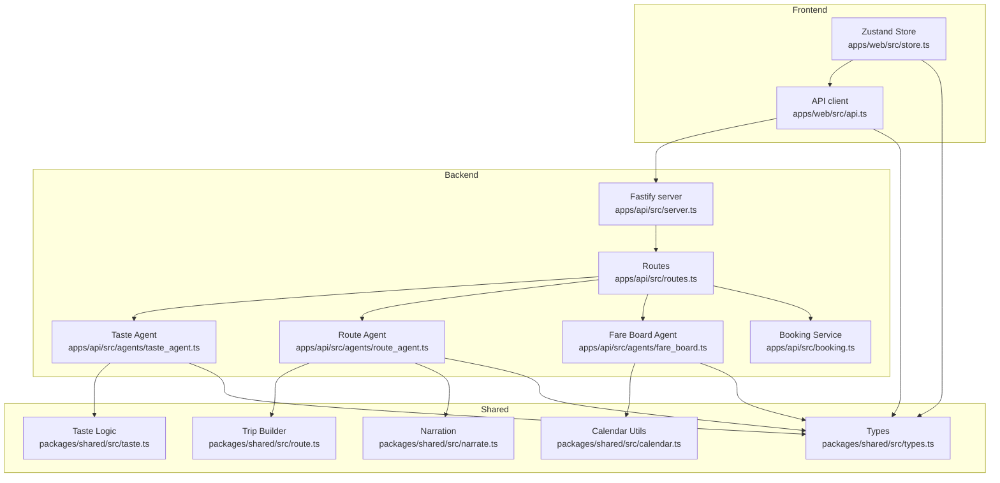
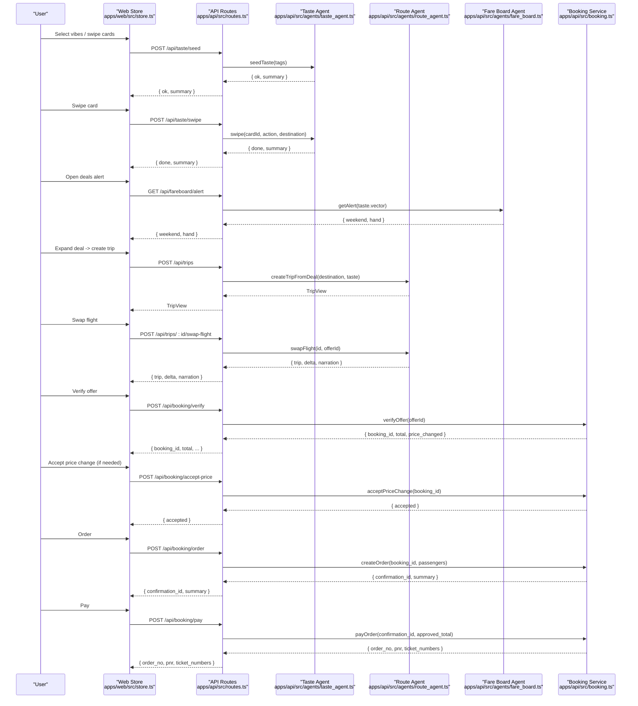
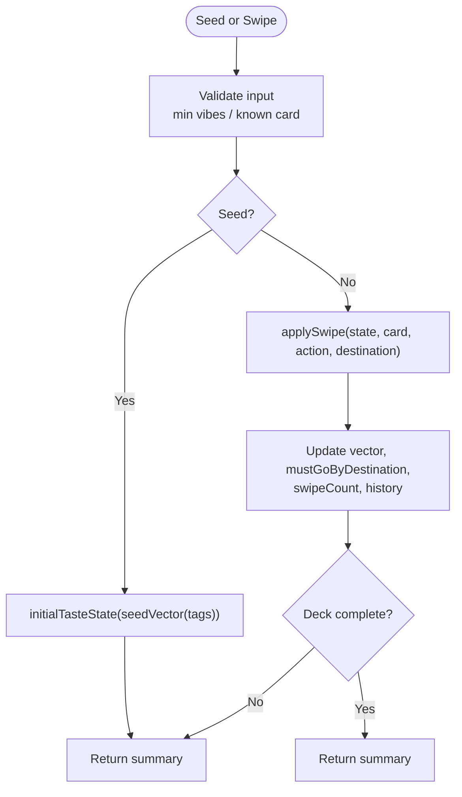
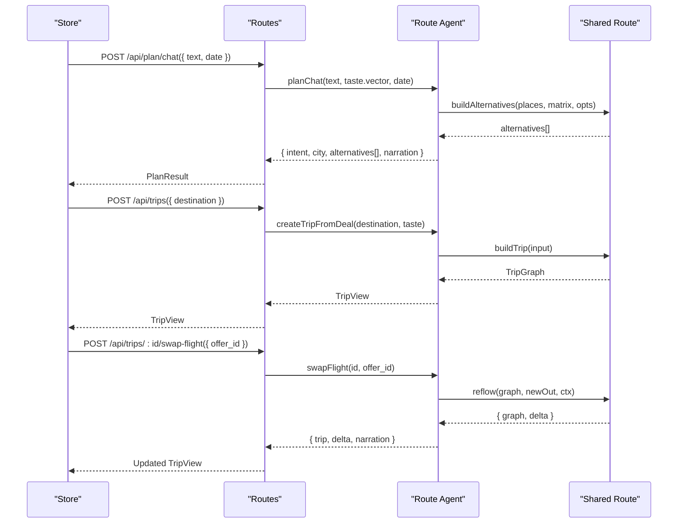
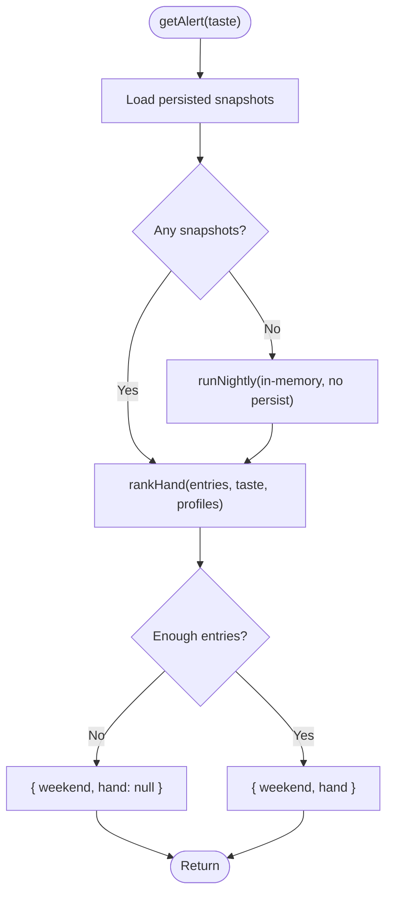
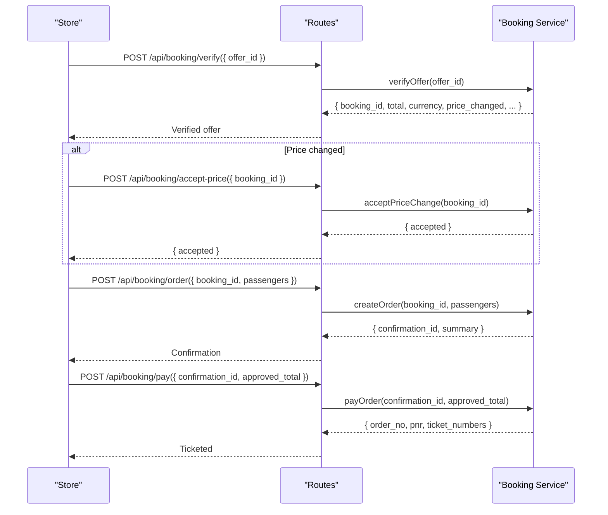
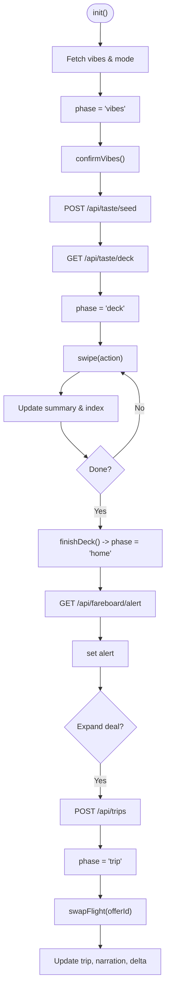
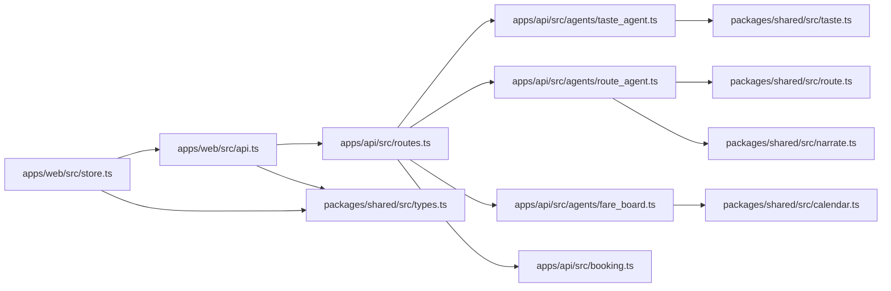

# Data Flow Patterns

<cite>
**Referenced Files in This Document**
- [index.ts](file://packages/shared/src/index.ts)
- [types.ts](file://packages/shared/src/types.ts)
- [taste.ts](file://packages/shared/src/taste.ts)
- [route.ts](file://packages/shared/src/route.ts)
- [calendar.ts](file://packages/shared/src/calendar.ts)
- [narrate.ts](file://packages/shared/src/narrate.ts)
- [store.ts](file://apps/web/src/store.ts)
- [api.ts](file://apps/web/src/api.ts)
- [server.ts](file://apps/api/src/server.ts)
- [routes.ts](file://apps/api/src/routes.ts)
- [taste_agent.ts](file://apps/api/src/agents/taste_agent.ts)
- [route_agent.ts](file://apps/api/src/agents/route_agent.ts)
- [fare_board.ts](file://apps/api/src/agents/fare_board.ts)
- [booking.ts](file://apps/api/src/booking.ts)
</cite>

## Table of Contents
1. Introduction
2. Project Structure
3. Core Components
4. Architecture Overview
5. Detailed Component Analysis
6. Dependency Analysis
7. Performance Considerations
8. Troubleshooting Guide
9. Conclusion

## Introduction
This document explains the end-to-end data flow patterns in the Trip Graph Agent system, from collecting user preferences to generating taste vectors, planning trips, and completing bookings. It focuses on:
- How the shared package provides common types and business logic for both frontend and backend
- Client-side state management with Zustand and how changes propagate
- Data transformation pipelines, validation rules, and error handling strategies
- Sequence diagrams that map typical user journeys and data transformations at each step

## Project Structure
The system is split into a frontend (web), a backend API, and a shared package used by both sides.

**Diagram sources**
- [server.ts:8-12](file://apps/api/src/server.ts#L8-L12)
- [routes.ts:10-134](file://apps/api/src/routes.ts#L10-L134)
- [taste_agent.ts:1-118](file://apps/api/src/agents/taste_agent.ts#L1-L118)
- [route_agent.ts:1-191](file://apps/api/src/agents/route_agent.ts#L1-L191)
- [fare_board.ts:1-118](file://apps/api/src/agents/fare_board.ts#L1-L118)
- [booking.ts:1-104](file://apps/api/src/booking.ts#L1-L104)
- [index.ts:1-7](file://packages/shared/src/index.ts#L1-L7)
- [types.ts:1-170](file://packages/shared/src/types.ts#L1-L170)
- [taste.ts:1-68](file://packages/shared/src/taste.ts#L1-L68)
- [route.ts:1-475](file://packages/shared/src/route.ts#L1-L475)
- [calendar.ts:1-56](file://packages/shared/src/calendar.ts#L1-L56)
- [narrate.ts:1-79](file://packages/shared/src/narrate.ts#L1-L79)

**Section sources**
- [server.ts:8-26](file://apps/api/src/server.ts#L8-L26)
- [routes.ts:10-134](file://apps/api/src/routes.ts#L10-L134)
- [index.ts:1-7](file://packages/shared/src/index.ts#L1-L7)

## Core Components
- Shared types and utilities define the canonical data model for tastes, places, routes, flights, and trip graphs. Both frontend and backend import these to ensure consistent contracts.
- Taste Agent manages an in-memory profile built from swipe interactions and produces summaries and decks.
- Route Agent builds day plans and multi-day trip graphs using deterministic algorithms and narrates outcomes.
- Fare Board Agent ranks fare snapshots per long weekends and serves alerts based on user taste.
- Booking Service implements a strict, human-in-the-loop checkout flow with verification, consent, order creation, and payment.
- Frontend uses Zustand to orchestrate UI phases and calls the API client to mutate state.

**Section sources**
- [types.ts:1-170](file://packages/shared/src/types.ts#L1-L170)
- [taste.ts:1-68](file://packages/shared/src/taste.ts#L1-L68)
- [route.ts:1-475](file://packages/shared/src/route.ts#L1-L475)
- [fare_board.ts:1-118](file://apps/api/src/agents/fare_board.ts#L1-L118)
- [booking.ts:1-104](file://apps/api/src/booking.ts#L1-L104)
- [store.ts:1-282](file://apps/web/src/store.ts#L1-L282)
- [api.ts:1-198](file://apps/web/src/api.ts#L1-L198)

## Architecture Overview
The system follows a layered architecture:
- Presentation layer (Zustand store + React components) drives user flows and updates UI state
- API layer (Fastify routes) validates inputs, delegates to agents/services, and returns typed responses
- Agents implement domain logic (taste, routing, fares)
- Shared package provides reusable types and pure functions consumed by both layers

**Diagram sources**
- [store.ts:86-281](file://apps/web/src/store.ts#L86-L281)
- [api.ts:109-197](file://apps/web/src/api.ts#L109-L197)
- [routes.ts:25-115](file://apps/api/src/routes.ts#L25-L115)
- [taste_agent.ts:28-110](file://apps/api/src/agents/taste_agent.ts#L28-L110)
- [route_agent.ts:62-185](file://apps/api/src/agents/route_agent.ts#L62-L185)
- [fare_board.ts:97-117](file://apps/api/src/agents/fare_board.ts#L97-L117)
- [booking.ts:31-98](file://apps/api/src/booking.ts#L31-L98)

## Detailed Component Analysis

### Shared Package: Types and Utilities
- Centralized type definitions for vibe tags, taste vectors, places, stops, days, budgets, flights, and trip graphs ensure consistency across frontend and backend.
- Pure functions compute taste vector updates, place scoring, time helpers, route building, trip construction, reflow, and narration.

Key responsibilities:
- Taste vector math and history-based undo
- Day route builder with must-go guarantees and wildcard placement
- Trip graph builder spanning multiple days with late arrival handling
- Reflow algorithm to rebuild affected days when flights change
- Calendar helpers to derive long weekends from holiday data
- Deterministic narration templates for plan and swap events

**Section sources**
- [types.ts:1-170](file://packages/shared/src/types.ts#L1-L170)
- [taste.ts:16-68](file://packages/shared/src/taste.ts#L16-L68)
- [route.ts:18-475](file://packages/shared/src/route.ts#L18-L475)
- [calendar.ts:22-56](file://packages/shared/src/calendar.ts#L22-L56)
- [narrate.ts:32-79](file://packages/shared/src/narrate.ts#L32-L79)

### Taste Collection and Vector Generation
- User selects initial vibe tags; backend seeds a taste profile and generates a diverse deck of cards.
- Each swipe updates the taste vector and tracks must-go selections per destination.
- Undo restores previous state via history.

Data flow highlights:
- Input validation enforces minimum vibe count
- Deck generation uses bucket round-robin to diversify cards
- Summary exposes top tags, strength, and must-go lists

**Diagram sources**
- [taste_agent.ts:28-110](file://apps/api/src/agents/taste_agent.ts#L28-L110)
- [taste.ts:16-68](file://packages/shared/src/taste.ts#L16-L68)

**Section sources**
- [taste_agent.ts:28-110](file://apps/api/src/agents/taste_agent.ts#L28-L110)
- [taste.ts:16-68](file://packages/shared/src/taste.ts#L16-L68)

### Trip Planning and Graph Building
- Chat-driven planning parses intent (must/mood tags, area) and builds alternative day routes using shared route builder.
- Deal expansion creates a full multi-day TripGraph by selecting outbound/return flights, computing dates, and scheduling stops with constraints (open hours, meal windows, travel times).
- Flight swap triggers reflow to rebuild only affected days while preserving others.

**Diagram sources**
- [route_agent.ts:62-185](file://apps/api/src/agents/route_agent.ts#L62-L185)
- [route.ts:163-475](file://packages/shared/src/route.ts#L163-L475)

**Section sources**
- [route_agent.ts:62-185](file://apps/api/src/agents/route_agent.ts#L62-L185)
- [route.ts:163-475](file://packages/shared/src/route.ts#L163-L475)

### Fare Board and Alerts
- Nightly batch queries fares for candidate destinations and persists snapshots.
- Per-user alert ranks stored snapshots against the current taste vector to surface relevant deals.

**Diagram sources**
- [fare_board.ts:97-117](file://apps/api/src/agents/fare_board.ts#L97-L117)
- [fare_board.ts:41-82](file://apps/api/src/agents/fare_board.ts#L41-L82)

**Section sources**
- [fare_board.ts:41-117](file://apps/api/src/agents/fare_board.ts#L41-L117)

### Booking Workflow
- Strict, deterministic checkout ensures transparency and trust:
  - Verify offer to lock pricing and obtain booking ID
  - If price changed, require explicit acceptance
  - Create order with masked passenger details
  - Pay with exact approved total to finalize ticketing

**Diagram sources**
- [booking.ts:31-98](file://apps/api/src/booking.ts#L31-L98)
- [routes.ts:87-115](file://apps/api/src/routes.ts#L87-L115)

**Section sources**
- [booking.ts:31-98](file://apps/api/src/booking.ts#L31-L98)
- [routes.ts:87-115](file://apps/api/src/routes.ts#L87-L115)

### Frontend State Management with Zustand
- The store defines phases (vibes, deck, home, trip) and orchestrates API calls to update state incrementally.
- Error states are captured and surfaced to the UI; loading flags prevent redundant requests.
- Destination-specific decks maintain independent progress and summaries.

**Diagram sources**
- [store.ts:86-281](file://apps/web/src/store.ts#L86-L281)
- [api.ts:109-197](file://apps/web/src/api.ts#L109-L197)

**Section sources**
- [store.ts:86-281](file://apps/web/src/store.ts#L86-L281)
- [api.ts:109-197](file://apps/web/src/api.ts#L109-L197)

## Dependency Analysis
- Frontend depends on the API client and shared types for UI state and wire formats.
- Backend routes depend on agents and services; agents depend on shared utilities for deterministic logic.
- Shared package has no runtime dependencies beyond standard libraries and exports pure functions and types.

**Diagram sources**
- [store.ts:1-282](file://apps/web/src/store.ts#L1-L282)
- [api.ts:1-198](file://apps/web/src/api.ts#L1-L198)
- [routes.ts:1-135](file://apps/api/src/routes.ts#L1-L135)
- [taste_agent.ts:1-118](file://apps/api/src/agents/taste_agent.ts#L1-L118)
- [route_agent.ts:1-191](file://apps/api/src/agents/route_agent.ts#L1-L191)
- [fare_board.ts:1-118](file://apps/api/src/agents/fare_board.ts#L1-L118)
- [booking.ts:1-104](file://apps/api/src/booking.ts#L1-L104)
- [taste.ts:1-68](file://packages/shared/src/taste.ts#L1-L68)
- [route.ts:1-475](file://packages/shared/src/route.ts#L1-L475)
- [calendar.ts:1-56](file://packages/shared/src/calendar.ts#L1-L56)
- [narrate.ts:1-79](file://packages/shared/src/narrate.ts#L1-L79)
- [types.ts:1-170](file://packages/shared/src/types.ts#L1-L170)

**Section sources**
- [store.ts:1-282](file://apps/web/src/store.ts#L1-L282)
- [api.ts:1-198](file://apps/web/src/api.ts#L1-L198)
- [routes.ts:1-135](file://apps/api/src/routes.ts#L1-L135)

## Performance Considerations
- Deck caching: taste agent caches generated decks per city to avoid recomputation.
- Minimal reflow: trip swap rebuilds only affected days, preserving unchanged stops to reduce computation.
- Snapshot-based alerts: per-user alert path ranks persisted snapshots instead of live API calls, improving responsiveness.
- Time helpers operate on UTC-anchored strings to avoid timezone overhead and errors.

[No sources needed since this section provides general guidance]

## Troubleshooting Guide
Common issues and where they are handled:
- API offline or network errors: frontend sets error messages and prevents further actions until resolved.
- Missing prerequisites: endpoints return clear errors if taste not seeded or unknown entities accessed.
- Booking flow guardrails: booking service enforces verification, price acceptance, and exact total approval before payment.

Error handling locations:
- Frontend fetch wrapper throws on non-OK responses and surfaces error strings
- Routes validate inputs and return structured error objects
- Booking service returns specific error codes/messages for invalid states

**Section sources**
- [api.ts:109-117](file://apps/web/src/api.ts#L109-L117)
- [routes.ts:25-115](file://apps/api/src/routes.ts#L25-L115)
- [booking.ts:54-98](file://apps/api/src/booking.ts#L54-L98)

## Conclusion
The Trip Graph Agent system composes a clean separation of concerns:
- Shared package centralizes types and deterministic logic
- Backend agents implement domain workflows with robust validation and error handling
- Frontend uses Zustand to manage phased user journeys and propagate changes through API calls
- Data flows are traceable through sequence and flow diagrams, making it easier to understand, extend, and debug the system

[No sources needed since this section summarizes without analyzing specific files]