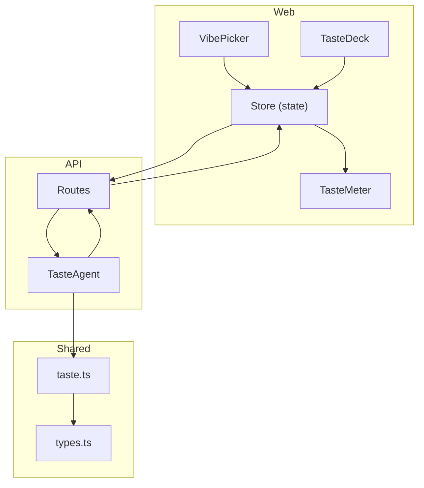
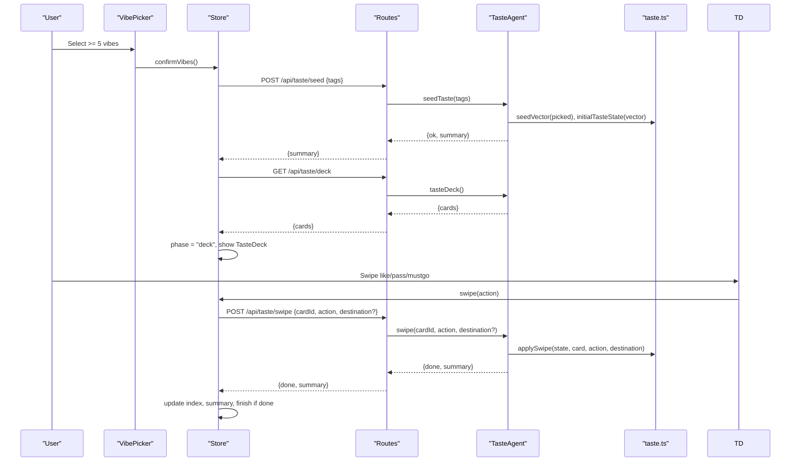
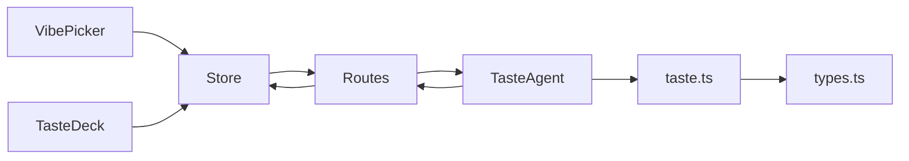
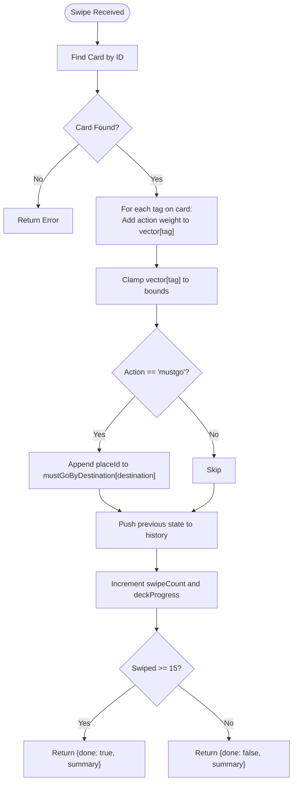
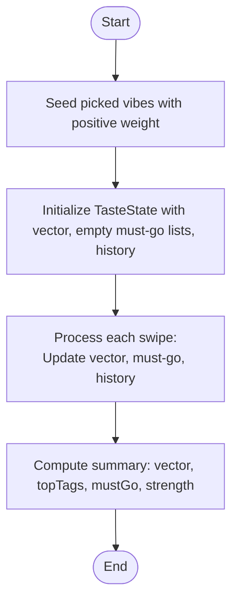

# Preference Learning Data Flow

<cite>
**Referenced Files in This Document**
- [VibePicker.tsx](file://apps/web/src/components/onboarding/VibePicker.tsx)
- [TasteDeck.tsx](file://apps/web/src/components/onboarding/TasteDeck.tsx)
- [TasteMeter.tsx](file://apps/web/src/components/onboarding/TasteMeter.tsx)
- [store.ts](file://apps/web/src/store.ts)
- [taste_agent.ts](file://apps/api/src/agents/taste_agent.ts)
- [routes.ts](file://apps/api/src/routes.ts)
- [taste.ts](file://packages/shared/src/taste.ts)
- [types.ts](file://packages/shared/src/types.ts)
- [taste.test.ts](file://packages/shared/test/taste.test.ts)
</cite>

## Table of Contents
1. [Introduction](#introduction)
2. [Project Structure](#project-structure)
3. [Core Components](#core-components)
4. [Architecture Overview](#architecture-overview)
5. [Detailed Component Analysis](#detailed-component-analysis)
6. [Dependency Analysis](#dependency-analysis)
7. [Performance Considerations](#performance-considerations)
8. [Troubleshooting Guide](#troubleshooting-guide)
9. [Conclusion](#conclusion)

## Introduction
This document explains the preference learning data flow in the Trip Graph Agent system. It covers how user vibe selections are captured by the VibePicker, transformed into a taste vector via shared utilities, and processed by the TasteAgent through a swipe-based algorithm. It also documents how preferences influence trip planning, including scoring calculations, validation rules, adaptation to feedback, and the end-to-end transformation from raw interactions to structured preference models.

## Project Structure
The preference learning pipeline spans three layers:
- Web UI: VibePicker collects initial vibes; TasteDeck presents a 15-card swipe session with like/pass/must-go actions; TasteMeter visualizes strength and top tags.
- API layer: Routes expose endpoints for seeding, swiping, undoing, and retrieving summaries or destination decks.
- Shared logic: Pure functions compute seed vectors, apply swipes, score places, and maintain state history for undo.

**Diagram sources**
- [VibePicker.tsx:20-52](file://apps/web/src/components/onboarding/VibePicker.tsx#L20-L52)
- [TasteDeck.tsx:9-20](file://apps/web/src/components/onboarding/TasteDeck.tsx#L9-L20)
- [TasteMeter.tsx:7-30](file://apps/web/src/components/onboarding/TasteMeter.tsx#L7-L30)
- [store.ts:100-127](file://apps/web/src/store.ts#L100-L127)
- [routes.ts:14-49](file://apps/api/src/routes.ts#L14-L49)
- [taste_agent.ts:28-110](file://apps/api/src/agents/taste_agent.ts#L28-L110)
- [taste.ts:16-67](file://packages/shared/src/taste.ts#L16-L67)
- [types.ts:1-84](file://packages/shared/src/types.ts#L1-L84)

**Section sources**
- [VibePicker.tsx:20-52](file://apps/web/src/components/onboarding/VibePicker.tsx#L20-L52)
- [TasteDeck.tsx:9-20](file://apps/web/src/components/onboarding/TasteDeck.tsx#L9-L20)
- [TasteMeter.tsx:7-30](file://apps/web/src/components/onboarding/TasteMeter.tsx#L7-L30)
- [store.ts:100-127](file://apps/web/src/store.ts#L100-L127)
- [routes.ts:14-49](file://apps/api/src/routes.ts#L14-L49)
- [taste_agent.ts:28-110](file://apps/api/src/agents/taste_agent.ts#L28-L110)
- [taste.ts:16-67](file://packages/shared/src/taste.ts#L16-L67)
- [types.ts:1-84](file://packages/shared/src/types.ts#L1-L84)

## Core Components
- VibePicker: Collects at least five vibe tags to seed the taste profile. Enforces a minimum selection before allowing confirmation.
- TasteDeck: Presents a 15-card deck per session (home or destination). Supports like, pass, must-go, and undo. Displays progress via TasteMeter.
- TasteAgent: Maintains an in-memory taste state, builds diverse decks, applies swipe updates, tracks must-go lists per destination, and exposes summary metrics.
- Shared taste utilities: Provide pure functions to create empty/seeded vectors, apply swipes with bounded weights, undo operations, and score places against the current vector.
- Store: Orchestrates UI state, calls API endpoints, and updates UI components based on server responses.

Key responsibilities:
- Input capture: VibePicker and SwipeDeck collect explicit preferences.
- Transformation: Shared taste utilities convert discrete interactions into a continuous taste vector.
- Processing: TasteAgent enforces session rules, diversity, and persistence of must-go choices.
- Output: Summary and vector inform downstream planning and alerting.

**Section sources**
- [VibePicker.tsx:20-52](file://apps/web/src/components/onboarding/VibePicker.tsx#L20-L52)
- [TasteDeck.tsx:9-20](file://apps/web/src/components/onboarding/TasteDeck.tsx#L9-L20)
- [taste_agent.ts:28-110](file://apps/api/src/agents/taste_agent.ts#L28-L110)
- [taste.ts:16-67](file://packages/shared/src/taste.ts#L16-L67)
- [store.ts:100-127](file://apps/web/src/store.ts#L100-L127)

## Architecture Overview
The preference learning pipeline is a request/response flow that transforms user gestures into a structured preference model used later for trip planning.

**Diagram sources**
- [VibePicker.tsx:20-52](file://apps/web/src/components/onboarding/VibePicker.tsx#L20-L52)
- [store.ts:100-127](file://apps/web/src/store.ts#L100-L127)
- [routes.ts:14-49](file://apps/api/src/routes.ts#L14-L49)
- [taste_agent.ts:28-110](file://apps/api/src/agents/taste_agent.ts#L28-L110)
- [taste.ts:16-67](file://packages/shared/src/taste.ts#L16-L67)

## Detailed Component Analysis

### VibePicker: Initial Preference Capture
- Purpose: Seed the taste profile by collecting at least five vibe tags.
- Behavior: Renders a grid of vibe chips; toggles selection; enables confirmation only when the minimum threshold is met.
- Integration: Calls store.confirmVibes(), which seeds the taste on the server and loads the first deck.

Validation rule: Minimum five distinct vibe tags required to proceed.

**Section sources**
- [VibePicker.tsx:20-52](file://apps/web/src/components/onboarding/VibePicker.tsx#L20-L52)
- [store.ts:100-107](file://apps/web/src/store.ts#L100-L107)

### TasteDeck and TasteMeter: Swipe Session and Feedback Visualization
- TasteDeck: Manages a 15-card swipe session per destination (home or specific city). Exposes like/pass/must-go and undo. Shows a meter reflecting preference strength and top tags.
- TasteMeter: Visualizes “strength” derived from the positive sum of vector values normalized to a 0–1 scale, and shows the top three tags currently being learned.

Interaction flow: Each swipe updates the server-side taste state and returns a new summary; the UI advances the deck index and may transition to the next phase when the deck completes.

**Section sources**
- [TasteDeck.tsx:9-20](file://apps/web/src/components/onboarding/TasteDeck.tsx#L9-L20)
- [TasteMeter.tsx:7-30](file://apps/web/src/components/onboarding/TasteMeter.tsx#L7-L30)
- [store.ts:109-127](file://apps/web/src/store.ts#L109-L127)

### TasteAgent: Session Management and Preference Processing
- Seeding: Validates input tags and initializes state with a seeded vector.
- Deck generation: Builds a deterministic, diverse 15-card deck by bucketing places by their primary vibe tag and round-robin sampling.
- Swiping: Applies weighted updates to the taste vector per action, records must-go places per destination, tracks progress, and signals completion after 15 swipes.
- Undo: Reverts to previous state snapshot, adjusting both vector and destination-scoped must-go lists.
- Summary: Provides vector, top tags, must-go list, swipe count, deck size, and a strength metric.

Algorithm highlights:
- Action weights: Like increases tagged dimensions positively; pass decreases them; must-go has a larger positive boost and records the place id under the destination key.
- Bounds: Vector values are clamped within a fixed range to prevent runaway growth.
- Diversity: Decks are constructed to rotate across primary vibe buckets for balanced exposure.

**Section sources**
- [taste_agent.ts:28-110](file://apps/api/src/agents/taste_agent.ts#L28-L110)
- [routes.ts:14-49](file://apps/api/src/routes.ts#L14-L49)

### Shared Taste Utilities: Vector Math and Scoring
- Empty and seed vectors: Initialize a zero vector and assign a positive seed weight to chosen tags.
- Apply swipe: For each tag on the swiped card, add the action’s weight to the corresponding dimension, clamp to bounds, and update must-go lists and history.
- Undo: Restore prior vector and must-go lists using stored snapshots.
- Place scoring: Compute a normalized score by summing vector values over the place’s tags and dividing by the square root of tag count to penalize overly broad matches.

Complexity notes:
- applySwipe: O(k) where k is the number of tags on the card.
- scorePlace: O(m) where m is the number of tags on the place.

**Section sources**
- [taste.ts:16-67](file://packages/shared/src/taste.ts#L16-L67)
- [types.ts:68-84](file://packages/shared/src/types.ts#L68-L84)

### Store: Orchestration and State Updates
- Initializes available vibes and mode.
- Confirms vibes by calling seed and fetching the first deck.
- Handles swipes and undo, updating local index and summary, and transitions phases when the deck completes.
- Loads destination-specific decks and manages per-destination swipe state.

Error handling: Catches network errors and sets a user-visible error message.

**Section sources**
- [store.ts:86-127](file://apps/web/src/store.ts#L86-L127)
- [store.ts:143-193](file://apps/web/src/store.ts#L143-L193)

### API Routes: Endpoints and Validation
- GET /api/meta/vibes: Returns available vibe tags and minimum requirement.
- GET /api/taste/deck[:destination]: Returns a 15-card deck for home or a specified destination.
- POST /api/taste/seed: Seeds taste with validated tags; returns summary.
- POST /api/taste/swipe: Applies swipe; returns completion flag and updated summary.
- POST /api/taste/undo: Reverts last swipe; returns updated summary.
- GET /api/taste/vector: Returns current summary or not-seeded error.

Validation and error behavior:
- Seed requires at least five valid tags; otherwise returns a 400 error.
- Unknown destinations return 404.
- Unseeded requests return appropriate errors.

**Section sources**
- [routes.ts:11-49](file://apps/api/src/routes.ts#L11-L49)

## Dependency Analysis
The preference learning pipeline depends on clear contracts between UI, API, and shared logic.

Coupling and cohesion:
- UI components depend on Store for state and side effects.
- Store depends on API routes for persistence and computation.
- TasteAgent encapsulates session logic and delegates pure math to shared taste utilities.
- Types define shared contracts for cards, states, and actions.

Potential circular dependencies: None observed; the flow is strictly layered.

External integration points:
- Destination-specific decks rely on place data loaded by the agent.
- Later planning steps consume the taste summary/vector to rank and plan trips.

**Diagram sources**
- [VibePicker.tsx:20-52](file://apps/web/src/components/onboarding/VibePicker.tsx#L20-L52)
- [TasteDeck.tsx:9-20](file://apps/web/src/components/onboarding/TasteDeck.tsx#L9-L20)
- [store.ts:100-127](file://apps/web/src/store.ts#L100-L127)
- [routes.ts:14-49](file://apps/api/src/routes.ts#L14-L49)
- [taste_agent.ts:28-110](file://apps/api/src/agents/taste_agent.ts#L28-L110)
- [taste.ts:16-67](file://packages/shared/src/taste.ts#L16-L67)
- [types.ts:68-84](file://packages/shared/src/types.ts#L68-L84)

**Section sources**
- [routes.ts:11-49](file://apps/api/src/routes.ts#L11-L49)
- [taste_agent.ts:28-110](file://apps/api/src/agents/taste_agent.ts#L28-L110)
- [taste.ts:16-67](file://packages/shared/src/taste.ts#L16-L67)
- [types.ts:68-84](file://packages/shared/src/types.ts#L68-L84)

## Performance Considerations
- Deck generation uses bucketing and round-robin sampling to ensure diversity without expensive sorting beyond initial keys.
- applySwipe operates over small arrays of tags per card; complexity is linear in tag count.
- Clamping vector values prevents numerical instability and keeps scoring stable.
- Undo maintains a compact history stack; memory usage grows with swipe count but remains modest for a 15-card session.

[No sources needed since this section provides general guidance]

## Troubleshooting Guide
Common issues and resolutions:
- Not seeded: Requests to taste endpoints require a successful seed. Ensure at least five valid vibes are submitted before swiping or requesting vector/summary.
- Unknown card or destination: Validate card IDs and destination names; the agent checks existence before applying swipes.
- Undo boundaries: Undo cannot go below the initial state; attempts to undo at the start are no-ops.
- Network errors: The store catches API failures and surfaces an error message to the user.

Validation rules enforced:
- Minimum five vibe tags for seeding.
- Action weights and bounds applied consistently.
- Must-go entries recorded per destination and restored correctly on undo.

**Section sources**
- [routes.ts:25-49](file://apps/api/src/routes.ts#L25-L49)
- [taste_agent.ts:69-92](file://apps/api/src/agents/taste_agent.ts#L69-L92)
- [taste.ts:30-61](file://packages/shared/src/taste.ts#L30-L61)
- [store.ts:109-127](file://apps/web/src/store.ts#L109-L127)

## Conclusion
The preference learning data flow transforms explicit user choices into a robust, evolving taste vector that guides trip planning. VibePicker captures initial intent; TasteDeck and TasteMeter provide interactive feedback; TasteAgent enforces session rules and computes preference updates; shared utilities ensure deterministic, bounded transformations. The resulting summary and vector are consumed by downstream planning and alerting systems to deliver personalized experiences.

[No sources needed since this section summarizes without analyzing specific files]

## Appendices

### Swipe-Based Preference Learning Algorithm

**Diagram sources**
- [taste_agent.ts:69-84](file://apps/api/src/agents/taste_agent.ts#L69-L84)
- [taste.ts:30-61](file://packages/shared/src/taste.ts#L30-L61)

### Taste Vector Generation Process

**Diagram sources**
- [taste.ts:16-28](file://packages/shared/src/taste.ts#L16-L28)
- [taste.ts:30-61](file://packages/shared/src/taste.ts#L30-L61)
- [taste_agent.ts:98-110](file://apps/api/src/agents/taste_agent.ts#L98-L110)

### Preference Validation Rules
- Minimum five vibe tags required to seed.
- Only known vibe tags accepted during seeding.
- Vector values clamped to a fixed range to prevent divergence.
- Must-go entries scoped per destination and preserved across swipes.

**Section sources**
- [routes.ts:25-29](file://apps/api/src/routes.ts#L25-L29)
- [taste_agent.ts:28-33](file://apps/api/src/agents/taste_agent.ts#L28-L33)
- [taste.ts:11-14](file://packages/shared/src/taste.ts#L11-L14)
- [taste.ts:30-49](file://packages/shared/src/taste.ts#L30-L49)

### Examples of Taste Scoring Calculations
- Place scoring sums vector values over the place’s tags and normalizes by the square root of tag count, ensuring places with fewer matching tags are not unfairly penalized while still rewarding strong alignment.
- Tests verify that food-heavy vectors rank food places above parks and that scoring is deterministic.

**Section sources**
- [taste.ts:63-67](file://packages/shared/src/taste.ts#L63-L67)
- [taste.test.ts:114-129](file://packages/shared/test/taste.test.ts#L114-L129)

### How Preferences Influence Trip Planning
- After completing the deck, the taste summary and vector are passed to planning endpoints to generate plans tailored to the user’s preferences.
- Alerts and fare board features also use the vector to tailor recommendations.

**Section sources**
- [routes.ts:52-67](file://apps/api/src/routes.ts#L52-L67)