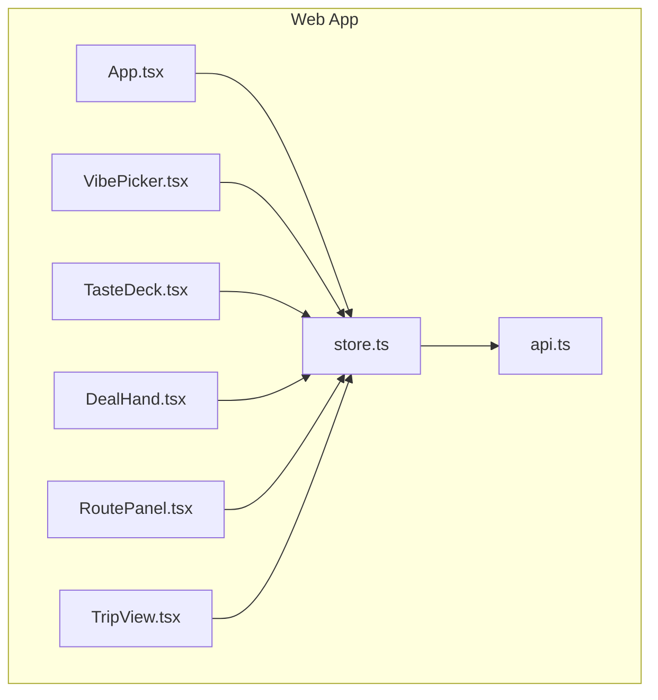
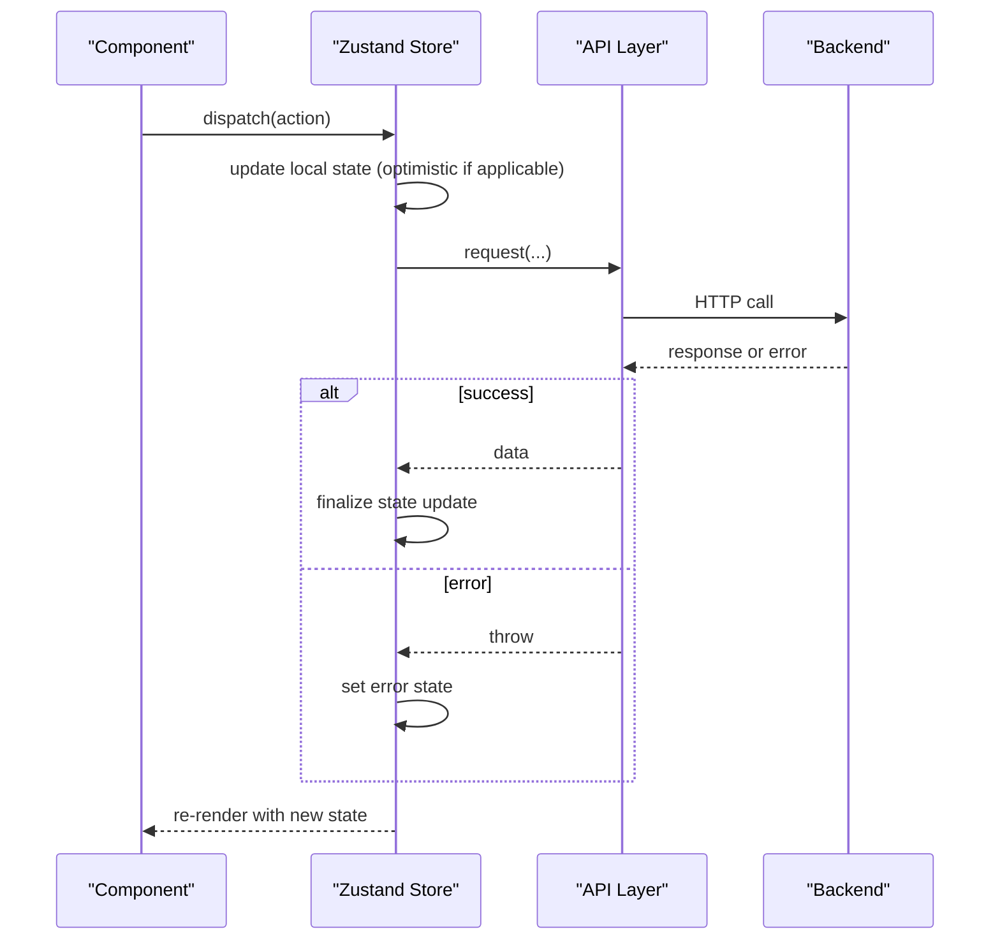
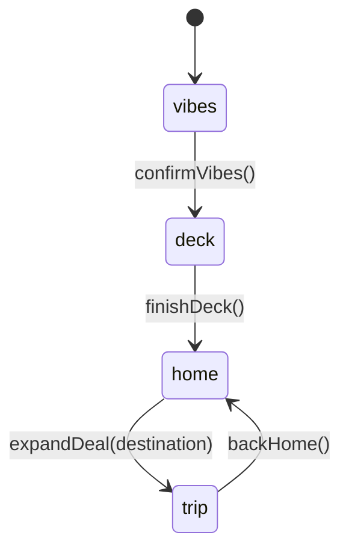
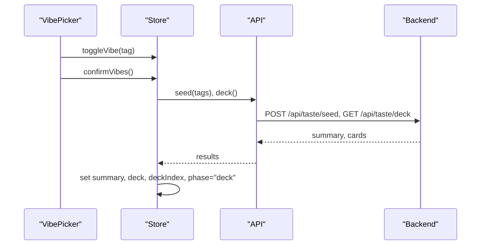
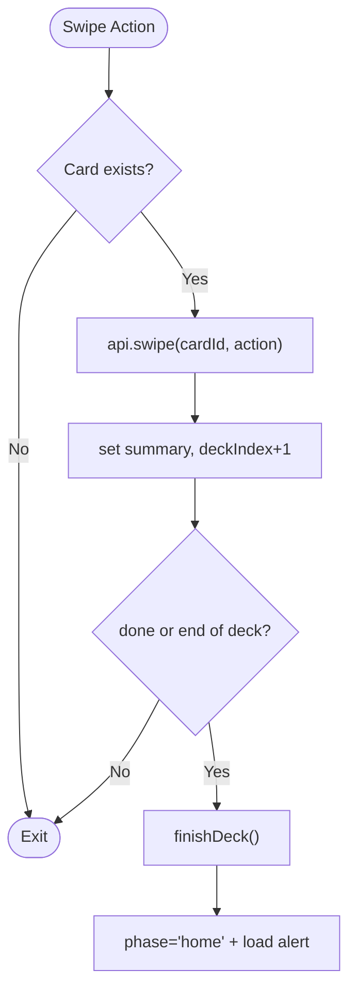
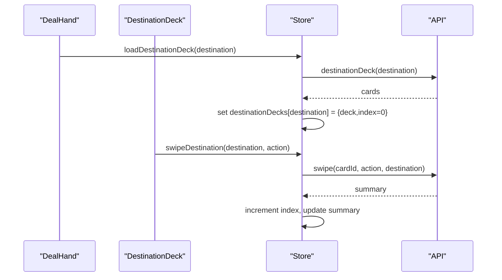
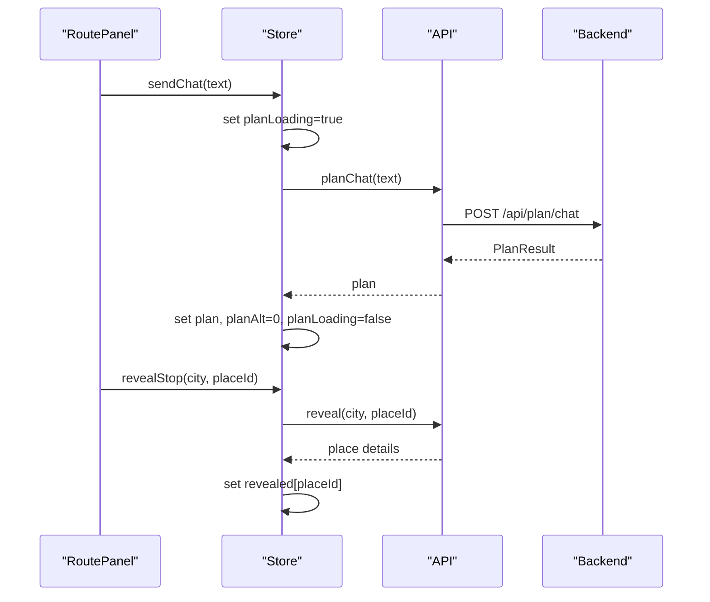
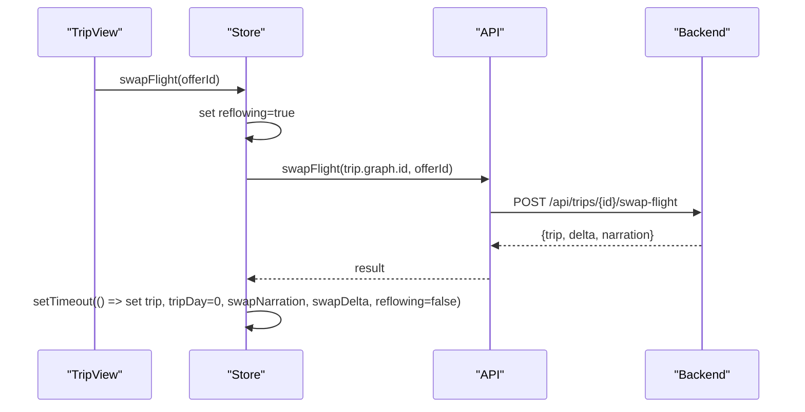
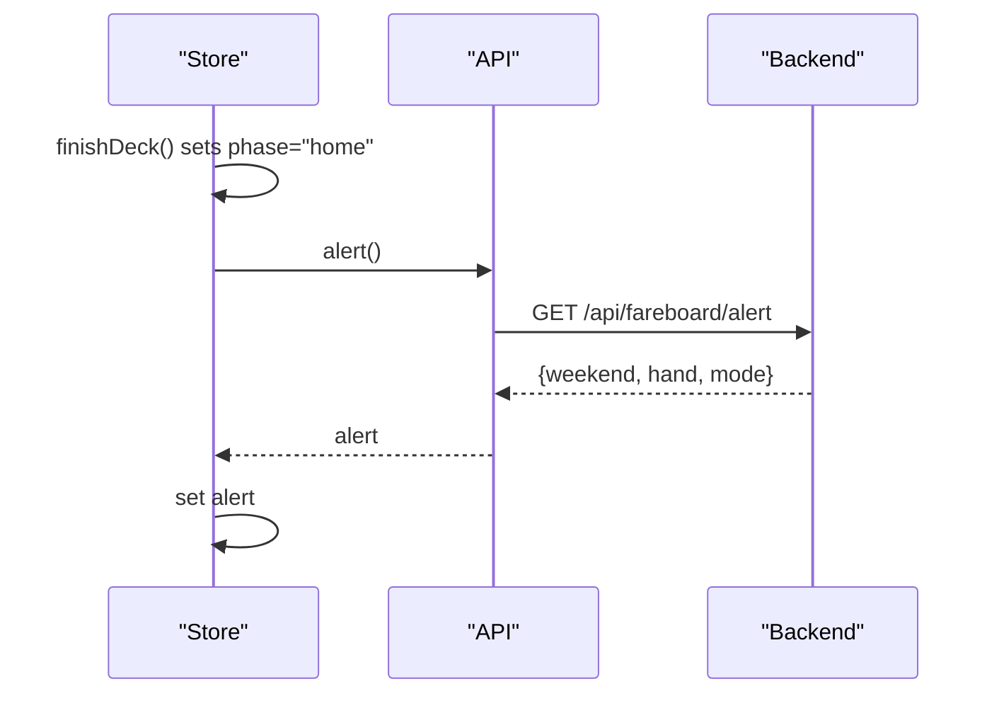
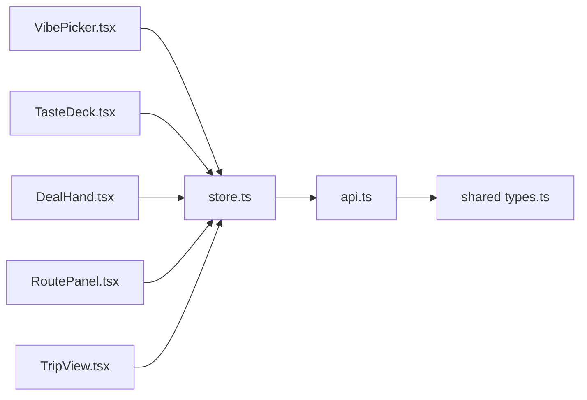

# State Management Patterns

<cite>
**Referenced Files in This Document**
- [store.ts](file://apps/web/src/store.ts)
- [api.ts](file://apps/web/src/api.ts)
- [App.tsx](file://apps/web/src/App.tsx)
- [VibePicker.tsx](file://apps/web/src/components/onboarding/VibePicker.tsx)
- [TasteDeck.tsx](file://apps/web/src/components/onboarding/TasteDeck.tsx)
- [DealHand.tsx](file://apps/web/src/components/deck/DealHand.tsx)
- [RoutePanel.tsx](file://apps/web/src/components/plan/RoutePanel.tsx)
- [TripView.tsx](file://apps/web/src/components/trip/TripView.tsx)
- [types.ts](file://packages/shared/src/types.ts)
</cite>

## Table of Contents
1. [Introduction](#introduction)
2. [Project Structure](#project-structure)
3. [Core Components](#core-components)
4. [Architecture Overview](#architecture-overview)
5. [Detailed Component Analysis](#detailed-component-analysis)
6. [Dependency Analysis](#dependency-analysis)
7. [Performance Considerations](#performance-considerations)
8. [Troubleshooting Guide](#troubleshooting-guide)
9. [Conclusion](#conclusion)

## Introduction
This document explains the state management patterns used in the Trip Graph Agent application, focusing on:
- The Zustand store architecture and its single source of truth for UI state
- A phase-based UI state machine (vibes → deck → trip) that drives component rendering and user flows
- How state changes propagate from components to the store and then to the server via a thin API layer
- Separation between client-side state and server-side data, including synchronization strategies and optimistic updates
- State schemas, action creators, and middleware-like patterns implemented within the store
- Examples of common state transitions, error handling in state updates, and performance optimization techniques for large trip graphs

## Project Structure
The web application is organized around a central store that coordinates UI state and orchestrates calls to the backend API. Components subscribe to relevant slices of state and dispatch actions through the store.

**Diagram sources**
- [App.tsx:15-90](file://apps/web/src/App.tsx#L15-L90)
- [store.ts:61-281](file://apps/web/src/store.ts#L61-L281)
- [api.ts:109-197](file://apps/web/src/api.ts#L109-L197)

**Section sources**
- [App.tsx:15-90](file://apps/web/src/App.tsx#L15-L90)
- [store.ts:61-281](file://apps/web/src/store.ts#L61-L281)
- [api.ts:109-197](file://apps/web/src/api.ts#L109-L197)

## Core Components
- Store: Centralized Zustand store defining the full application state shape and all actions. It encapsulates both local UI state and server-synced data.
- API Layer: Thin typed fetch wrapper that serializes requests and normalizes responses, throwing errors when the server responds with non-ok status.
- Components: Each feature area (onboarding, deck, plan, trip) reads from the store and triggers actions. Rendering is driven by a phase field that selects which UI surface to show.

Key responsibilities:
- Phase orchestration: vibes → deck → home → trip
- Deck interactions: swipe, undo, finish
- Destination decks: per-destination swipe sessions
- Plan generation: chat-driven route planning with alternatives
- Trip graph: flight selection, day navigation, budget display, wildcard reveals
- Alerts and deals: proactive fare board hand surfaced after finishing the deck

**Section sources**
- [store.ts:11-59](file://apps/web/src/store.ts#L11-L59)
- [api.ts:3-98](file://apps/web/src/api.ts#L3-L98)
- [App.tsx:23-89](file://apps/web/src/App.tsx#L23-L89)

## Architecture Overview
The application uses a unidirectional data flow:
- Components call store actions
- Actions may update local state immediately (optimistic) or await server responses
- On success, state is updated; on failure, errors are captured and surfaced to the UI
- Server data types are defined in the shared package and consumed by the store and components

**Diagram sources**
- [store.ts:95-281](file://apps/web/src/store.ts#L95-L281)
- [api.ts:109-197](file://apps/web/src/api.ts#L109-L197)

## Detailed Component Analysis

### Phase-Based UI State Machine
The store defines a Phase type and uses it to control which UI surface is rendered. The primary phases are:
- vibes: initial taste selection
- deck: 15-card swipe session to refine taste
- home: post-deck screen where alerts and deals can be shown
- trip: generated trip graph view

**Diagram sources**
- [store.ts:11-11](file://apps/web/src/store.ts#L11-L11)
- [store.ts:100-141](file://apps/web/src/store.ts#L100-L141)
- [store.ts:218-225](file://apps/web/src/store.ts#L218-L225)
- [store.ts:274-276](file://apps/web/src/store.ts#L274-L276)
- [App.tsx:23-89](file://apps/web/src/App.tsx#L23-L89)

**Section sources**
- [store.ts:11-11](file://apps/web/src/store.ts#L11-L11)
- [App.tsx:23-89](file://apps/web/src/App.tsx#L23-L89)

### Vibe Selection Flow
- VibePicker renders available vibe tags and toggles selections
- Confirming at least five vibes seeds the taste thread and loads the deck
- Errors during initialization or seeding are captured and displayed

**Diagram sources**
- [VibePicker.tsx:20-54](file://apps/web/src/components/onboarding/VibePicker.tsx#L20-L54)
- [store.ts:95-107](file://apps/web/src/store.ts#L95-L107)
- [api.ts:120-129](file://apps/web/src/api.ts#L120-L129)

**Section sources**
- [VibePicker.tsx:20-54](file://apps/web/src/components/onboarding/VibePicker.tsx#L20-L54)
- [store.ts:95-107](file://apps/web/src/store.ts#L95-L107)

### Swipe Deck and Taste Refinement
- Swipe actions update the current card index and mutate the taste summary
- Undo rewinds the last swipe and restores previous summary
- Finishing the deck transitions to home and proactively loads fare alerts

**Diagram sources**
- [store.ts:109-141](file://apps/web/src/store.ts#L109-L141)
- [api.ts:130-142](file://apps/web/src/api.ts#L130-L142)

**Section sources**
- [store.ts:109-141](file://apps/web/src/store.ts#L109-L141)
- [api.ts:130-142](file://apps/web/src/api.ts#L130-L142)

### Destination Decks and Per-Destination Swiping
- Destination decks are loaded lazily and stored keyed by destination
- Swiping updates per-destination index and summary
- Undo rewinds per-destination history

**Diagram sources**
- [DealHand.tsx:27-79](file://apps/web/src/components/deck/DealHand.tsx#L27-L79)
- [store.ts:143-193](file://apps/web/src/store.ts#L143-L193)
- [api.ts:123-139](file://apps/web/src/api.ts#L123-L139)

**Section sources**
- [store.ts:143-193](file://apps/web/src/store.ts#L143-L193)
- [api.ts:123-139](file://apps/web/src/api.ts#L123-L139)

### Route Planning and Alternatives
- Chat input sends text to generate a plan
- Loading state prevents duplicate submissions
- Alternatives can be navigated without refetching
- Sealed stops can be revealed individually

**Diagram sources**
- [RoutePanel.tsx:6-59](file://apps/web/src/components/plan/RoutePanel.tsx#L6-L59)
- [store.ts:195-229](file://apps/web/src/store.ts#L195-L229)
- [api.ts:140-151](file://apps/web/src/api.ts#L140-L151)

**Section sources**
- [RoutePanel.tsx:6-59](file://apps/web/src/components/plan/RoutePanel.tsx#L6-L59)
- [store.ts:195-229](file://apps/web/src/store.ts#L195-L229)
- [api.ts:140-151](file://apps/web/src/api.ts#L140-L151)

### Trip Graph View and Flight Swapping
- Trip panel shows flights, days, budget, and stops
- Swapping flights triggers a server-side re-plan with a brief reflow animation
- Budget delta indicates price change after swap
- Wildcard stops can be revealed one by one

**Diagram sources**
- [TripView.tsx:7-78](file://apps/web/src/components/trip/TripView.tsx#L7-L78)
- [store.ts:231-250](file://apps/web/src/store.ts#L231-L250)
- [api.ts:145-149](file://apps/web/src/api.ts#L145-L149)

**Section sources**
- [TripView.tsx:7-78](file://apps/web/src/components/trip/TripView.tsx#L7-L78)
- [store.ts:231-250](file://apps/web/src/store.ts#L231-L250)
- [api.ts:145-149](file://apps/web/src/api.ts#L145-L149)

### Proactive Alerts and Deals
- After finishing the deck, the app waits briefly and loads an alert containing top deals and a sealed wildcard
- Users can open the deal hand, explore destinations, and expand into a trip graph

**Diagram sources**
- [store.ts:129-141](file://apps/web/src/store.ts#L129-L141)
- [api.ts:142-142](file://apps/web/src/api.ts#L142-L142)
- [DealHand.tsx:11-25](file://apps/web/src/components/deck/DealHand.tsx#L11-L25)

**Section sources**
- [store.ts:129-141](file://apps/web/src/store.ts#L129-L141)
- [api.ts:142-142](file://apps/web/src/api.ts#L142-L142)
- [DealHand.tsx:11-25](file://apps/web/src/components/deck/DealHand.tsx#L11-L25)

## Dependency Analysis
The store depends on the API layer for all server interactions. Components depend only on the store. Shared types define contracts for data exchanged between client and server.

**Diagram sources**
- [store.ts:61-281](file://apps/web/src/store.ts#L61-L281)
- [api.ts:109-197](file://apps/web/src/api.ts#L109-L197)
- [types.ts:1-170](file://packages/shared/src/types.ts#L1-L170)

**Section sources**
- [store.ts:61-281](file://apps/web/src/store.ts#L61-L281)
- [api.ts:109-197](file://apps/web/src/api.ts#L109-L197)
- [types.ts:1-170](file://packages/shared/src/types.ts#L1-L170)

## Performance Considerations
- Local-first updates: Many actions update local state immediately before awaiting server responses (e.g., deckIndex increments on swipe). This reduces perceived latency and keeps UI responsive.
- Selective subscriptions: Components subscribe only to the fields they need (e.g., RoutePanel reads plan, planAlt, planLoading; TripView reads trip, tripDay, reflowing). This minimizes unnecessary re-renders.
- Lazy loading: Destination decks are loaded on demand and cached per destination in memory, avoiding redundant network calls.
- Optimistic transitions: Phase transitions like finishDeck happen immediately, while background tasks (alert loading) run asynchronously.
- Animation gating: Re-planning trips uses a short timeout to sequence animations and avoid jarring reflows when swapping flights.
- Error isolation: Errors are captured per action and surfaced via a global error state, preventing crashes and allowing graceful recovery.

[No sources needed since this section provides general guidance]

## Troubleshooting Guide
Common issues and how the store handles them:
- API offline or unreachable: Initialization sets an error message; components render an error toast that can be dismissed.
- Network failures during swipes or plan generation: Errors are caught and set to the store’s error field; loading flags are reset appropriately.
- Empty or invalid server responses: The API layer throws errors for non-ok responses; the store converts them to strings and displays them.
- Stuck loading states: Ensure each async action resets loading flags in both success and error paths (e.g., planLoading in sendChat).

Recommended debugging steps:
- Inspect the store’s error field and clear it after addressing the issue
- Verify that phase transitions occur as expected (vibes → deck → home → trip)
- Check that destination decks are loaded only when needed and not duplicated
- For trip swaps, ensure reflowing is reset even on errors

**Section sources**
- [store.ts:86-93](file://apps/web/src/store.ts#L86-L93)
- [store.ts:100-107](file://apps/web/src/store.ts#L100-L107)
- [store.ts:195-203](file://apps/web/src/store.ts#L195-L203)
- [store.ts:231-250](file://apps/web/src/store.ts#L231-L250)
- [App.tsx:93-100](file://apps/web/src/App.tsx#L93-L100)

## Conclusion
The Trip Graph Agent application employs a clean, centralized Zustand store to manage UI state and coordinate server interactions. The phase-based state machine drives a coherent user journey from vibe selection through deck swiping to trip graph exploration. The store implements optimistic updates, selective subscriptions, lazy loading, and robust error handling to deliver a responsive and resilient experience. By separating concerns—components for presentation, store for state logic, and API for networking—the codebase remains maintainable and scalable for large trip graphs and complex user flows.

[No sources needed since this section summarizes without analyzing specific files]