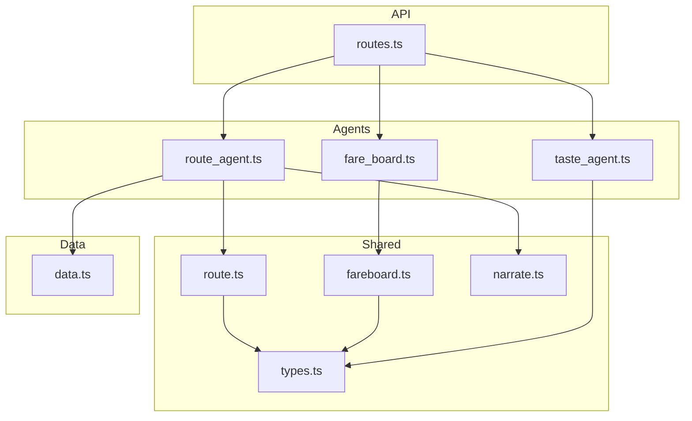
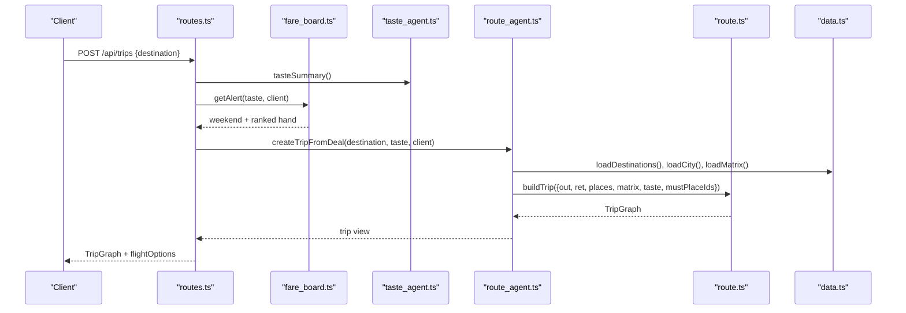
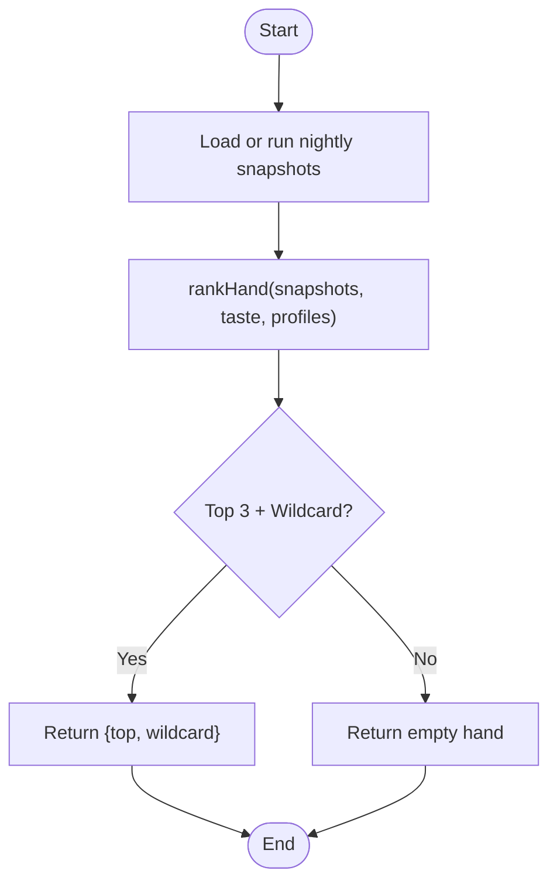
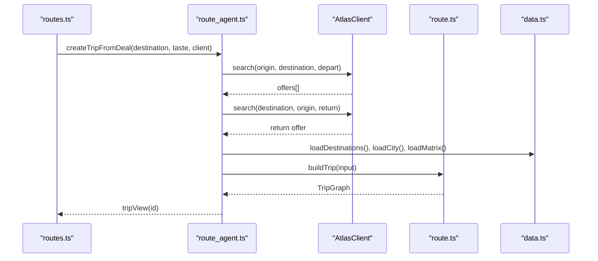
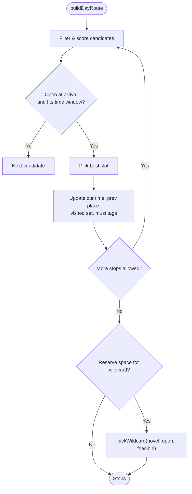
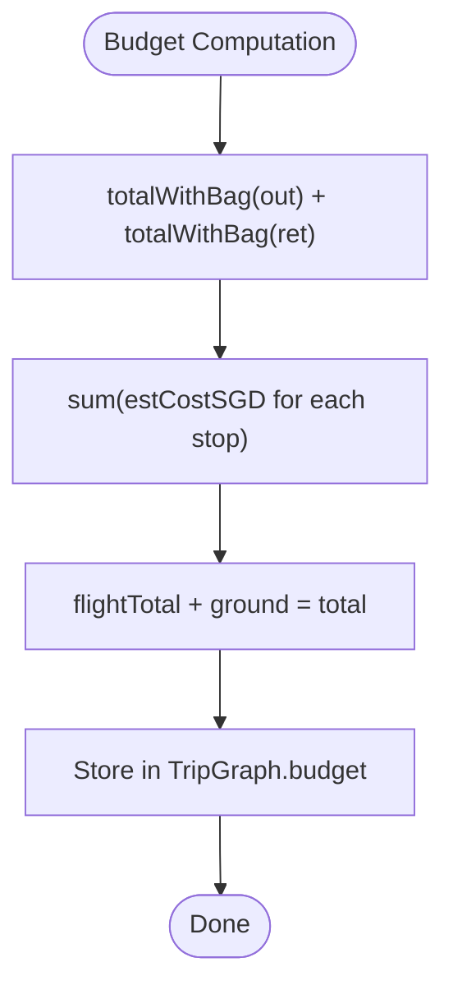
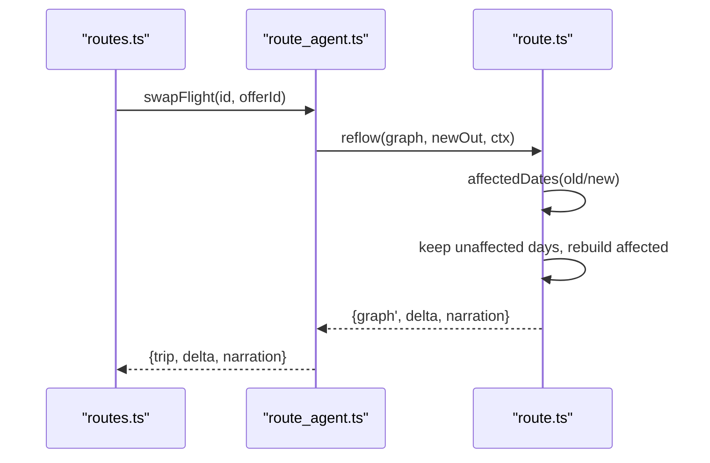
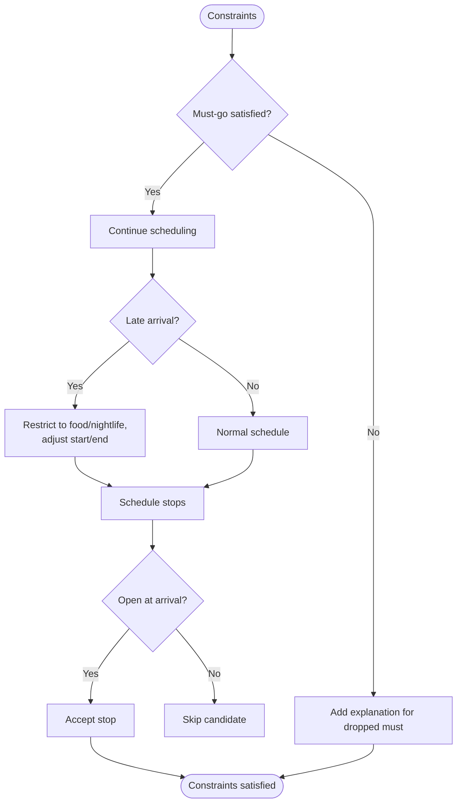
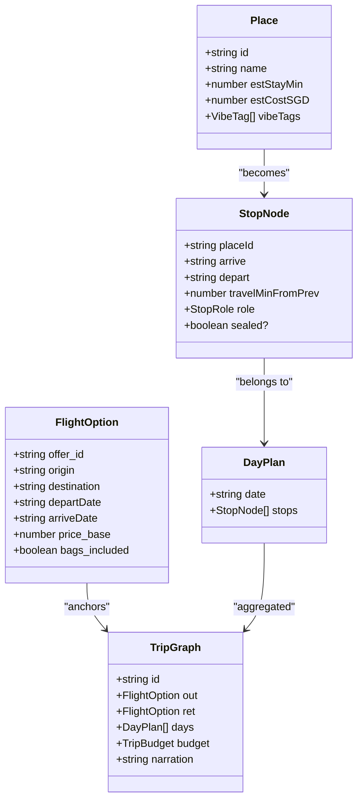
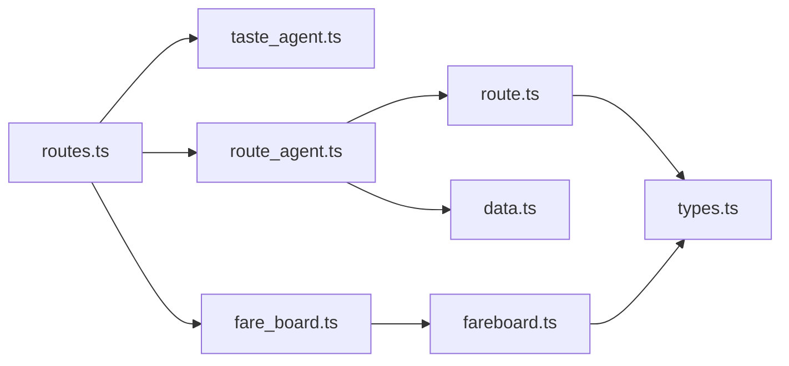

# Trip Planning Data Flow

<cite>
**Referenced Files in This Document**
- [route_agent.ts](file://apps/api/src/agents/route_agent.ts)
- [routes.ts](file://apps/api/src/routes.ts)
- [fare_board.ts](file://apps/api/src/agents/fare_board.ts)
- [taste_agent.ts](file://apps/api/src/agents/taste_agent.ts)
- [data.ts](file://apps/api/src/data.ts)
- [intent.ts](file://apps/api/src/intent.ts)
- [route.ts](file://packages/shared/src/route.ts)
- [types.ts](file://packages/shared/src/types.ts)
- [fareboard.ts](file://packages/shared/src/fareboard.ts)
- [narrate.ts](file://packages/shared/src/narrate.ts)
</cite>

## Table of Contents
1. [Introduction](#introduction)
2. [Project Structure](#project-structure)
3. [Core Components](#core-components)
4. [Architecture Overview](#architecture-overview)
5. [Detailed Component Analysis](#detailed-component-analysis)
6. [Dependency Analysis](#dependency-analysis)
7. [Performance Considerations](#performance-considerations)
8. [Troubleshooting Guide](#troubleshooting-guide)
9. [Conclusion](#conclusion)

## Introduction
This document explains the end-to-end trip planning data flow: how flight search results are integrated with ground activities into a single dependency graph, how budget constraints propagate through that graph, and how replanning (reflow) occurs when components change. It focuses on the RouteAgent’s role in processing flight options, building optimal routes, and maintaining graph consistency across swaps. It also details data transformations from flight offers to stop nodes and final trip itineraries, including graph construction algorithms, constraint satisfaction logic, and reflow mechanisms.

## Project Structure
The system is organized around three agents and a shared library:
- API layer exposes endpoints for taste, fare board, trip creation, and swap/reflow.
- Agents implement domain-specific workflows: TasteAgent (preferences), FareBoardAgent (flight deals), RouteAgent (trip graph).
- Shared library contains pure functions for routing, budgeting, narration, and types.

**Diagram sources**
- [routes.ts:10-85](file://apps/api/src/routes.ts#L10-L85)
- [route_agent.ts:107-185](file://apps/api/src/agents/route_agent.ts#L107-L185)
- [fare_board.ts:41-117](file://apps/api/src/agents/fare_board.ts#L41-L117)
- [route.ts:269-475](file://packages/shared/src/route.ts#L269-L475)
- [fareboard.ts:111-179](file://packages/shared/src/fareboard.ts#L111-L179)
- [narrate.ts:32-78](file://packages/shared/src/narrate.ts#L32-L78)
- [types.ts:86-146](file://packages/shared/src/types.ts#L86-L146)
- [data.ts:17-37](file://apps/api/src/data.ts#L17-L37)

**Section sources**
- [routes.ts:10-85](file://apps/api/src/routes.ts#L10-L85)
- [route_agent.ts:19-185](file://apps/api/src/agents/route_agent.ts#L19-L185)
- [fare_board.ts:15-117](file://apps/api/src/agents/fare_board.ts#L15-L117)
- [route.ts:16-475](file://packages/shared/src/route.ts#L16-L475)
- [fareboard.ts:1-197](file://packages/shared/src/fareboard.ts#L1-L197)
- [narrate.ts:1-79](file://packages/shared/src/narrate.ts#L1-L79)
- [types.ts:1-170](file://packages/shared/src/types.ts#L1-L170)
- [data.ts:1-38](file://apps/api/src/data.ts#L1-L38)

## Core Components
- RouteAgent: owns the trip graph lifecycle — builds initial trips from flight deals, enriches stops, and performs reflow when flights change.
- FareBoardAgent: nightly batch over destinations; per-user ranking over stored snapshots to produce deal hand and wildcard.
- TasteAgent: maintains user preference vector and must-go selections used by both fare ranking and route scoring.
- Shared route engine: constructs day routes and multi-day trip graphs, enforces opening hours and travel times, computes budgets, and supports reflow.

Key responsibilities:
- Transform flight offers into node zero of the trip graph.
- Build daily schedules as sequences of StopNodes constrained by opening hours, travel matrix, and must-go requirements.
- Compute and propagate budget totals across flights and ground costs.
- Reflow affected days when outbound flight changes, preserving unaffected days and updating narration.

**Section sources**
- [route_agent.ts:19-185](file://apps/api/src/agents/route_agent.ts#L19-L185)
- [fare_board.ts:15-117](file://apps/api/src/agents/fare_board.ts#L15-L117)
- [taste_agent.ts:14-118](file://apps/api/src/agents/taste_agent.ts#L14-L118)
- [route.ts:163-475](file://packages/shared/src/route.ts#L163-L475)

## Architecture Overview
The trip planning pipeline integrates preferences, fares, and routing into a single graph. The flight is “node zero,” anchoring all downstream ground stops. When any component changes (e.g., swapping flights), only affected dates are rebuilt while keeping others intact.

**Diagram sources**
- [routes.ts:64-85](file://apps/api/src/routes.ts#L64-L85)
- [fare_board.ts:97-117](file://apps/api/src/agents/fare_board.ts#L97-L117)
- [route_agent.ts:107-153](file://apps/api/src/agents/route_agent.ts#L107-L153)
- [route.ts:349-387](file://packages/shared/src/route.ts#L349-L387)
- [data.ts:17-37](file://apps/api/src/data.ts#L17-L37)

## Detailed Component Analysis

### Flight Search Integration and Deal Ranking
- FareBoardAgent runs a nightly batch to collect cheapest offers per destination for the next long weekend, persisting snapshots. Per-user, it ranks stored snapshots using taste affinity, fare-moment distress signals, and unexpectedness to produce a hand and sealed wildcard.
- The API exposes an alert endpoint that returns the ranked hand without live calls during normal use.

**Diagram sources**
- [fare_board.ts:41-117](file://apps/api/src/agents/fare_board.ts#L41-L117)
- [fareboard.ts:111-179](file://packages/shared/src/fareboard.ts#L111-L179)

**Section sources**
- [fare_board.ts:41-117](file://apps/api/src/agents/fare_board.ts#L41-L117)
- [fareboard.ts:111-179](file://packages/shared/src/fareboard.ts#L111-L179)

### RouteAgent: Creating Trips from Deals
- RouteAgent queries Atlas for outbound and return flight options within the long weekend window, selects the cheapest outbound option, loads city data and travel matrix, seeds must-place IDs from taste state, and builds a TripGraph via the shared engine.
- It stores trips in memory keyed by ID and provides views and swap/reflow operations.

**Diagram sources**
- [route_agent.ts:107-153](file://apps/api/src/agents/route_agent.ts#L107-L153)
- [route.ts:349-387](file://packages/shared/src/route.ts#L349-L387)
- [data.ts:17-37](file://apps/api/src/data.ts#L17-L37)

**Section sources**
- [route_agent.ts:107-153](file://apps/api/src/agents/route_agent.ts#L107-L153)

### Graph Construction: From Flight Offers to Stop Nodes
- Day route builder selects stops based on taste scoring, meal windows, area preferences, must-go guarantees, opening hours, and travel times from the matrix.
- Trip builder iterates each date between outbound arrival and return departure, adjusting start/end times for late arrivals and airport cutoffs, then composes days into a TripGraph with a unified budget.

**Diagram sources**
- [route.ts:163-247](file://packages/shared/src/route.ts#L163-L247)
- [route.ts:306-341](file://packages/shared/src/route.ts#L306-L341)

**Section sources**
- [route.ts:163-247](file://packages/shared/src/route.ts#L163-L247)
- [route.ts:306-341](file://packages/shared/src/route.ts#L306-L341)

### Budget Propagation Through the Graph
- Budget is computed as the sum of flight total (with bag) and ground cost derived from estimated stay costs of selected stops.
- On swap/reflow, fare delta updates flightTotal and recalculates ground cost for affected days; total reflects the new combination. Narration explicitly states money movement.

**Diagram sources**
- [route.ts:343-387](file://packages/shared/src/route.ts#L343-L387)
- [fareboard.ts:46-48](file://packages/shared/src/fareboard.ts#L46-L48)
- [narrate.ts:69-77](file://packages/shared/src/narrate.ts#L69-L77)

**Section sources**
- [route.ts:343-387](file://packages/shared/src/route.ts#L343-L387)
- [fareboard.ts:46-48](file://packages/shared/src/fareboard.ts#L46-L48)
- [narrate.ts:69-77](file://packages/shared/src/narrate.ts#L69-L77)

### Replan (Reflow) Mechanism When Flights Change
- Swap triggers reflow: compute affected dates (outbound arrival day and possibly next day if late), keep unaffected days, rebuild only those needing adjustment, preserve visited places to avoid duplicates, and update budget and narration.
- Delta includes fareDelta, rebuilt/dropped/added dates, and day-one stop counts before/after.

**Diagram sources**
- [route_agent.ts:170-185](file://apps/api/src/agents/route_agent.ts#L170-L185)
- [route.ts:414-474](file://packages/shared/src/route.ts#L414-L474)
- [narrate.ts:41-78](file://packages/shared/src/narrate.ts#L41-L78)

**Section sources**
- [route_agent.ts:170-185](file://apps/api/src/agents/route_agent.ts#L170-L185)
- [route.ts:414-474](file://packages/shared/src/route.ts#L414-L474)

### Constraint Satisfaction Logic
- Must-go guarantee-or-explain: if a must-place cannot fit due to opening hours or time window, an explanation line is added.
- Late-arrival mode restricts first day to food/nightlife and adjusts start/end times accordingly.
- Opening hours enforced per weekday; travel times sourced from precomputed matrix; wildcards reserved to ensure novelty.

**Diagram sources**
- [route.ts:163-247](file://packages/shared/src/route.ts#L163-L247)
- [route.ts:306-341](file://packages/shared/src/route.ts#L306-L341)

**Section sources**
- [route.ts:163-247](file://packages/shared/src/route.ts#L163-L247)
- [route.ts:306-341](file://packages/shared/src/route.ts#L306-L341)

### Data Transformations: Offers → Stops → Itinerary
- FlightOption objects become node zero and define the temporal boundaries for each day.
- Places are transformed into StopNodes with arrive/depart times, travel minutes from previous stop, and roles (anchor, food, quiet, wildcard, must).
- Days aggregate StopNodes into DayPlan; TripGraph aggregates days plus budget and narration.

**Diagram sources**
- [types.ts:86-146](file://packages/shared/src/types.ts#L86-L146)
- [route.ts:349-387](file://packages/shared/src/route.ts#L349-L387)

**Section sources**
- [types.ts:86-146](file://packages/shared/src/types.ts#L86-L146)
- [route.ts:349-387](file://packages/shared/src/route.ts#L349-L387)

## Dependency Analysis
- API routes depend on agents for business logic and on shared functions for deterministic computation.
- RouteAgent depends on data loaders for city/matrix and on shared route engine for graph construction and reflow.
- FareBoardAgent depends on shared fareboard ranking and data loaders for holidays and destinations.
- Shared modules are pure and testable, minimizing coupling and enabling reuse across agents.

**Diagram sources**
- [routes.ts:10-85](file://apps/api/src/routes.ts#L10-L85)
- [route_agent.ts:107-185](file://apps/api/src/agents/route_agent.ts#L107-L185)
- [fare_board.ts:41-117](file://apps/api/src/agents/fare_board.ts#L41-L117)
- [route.ts:269-475](file://packages/shared/src/route.ts#L269-L475)
- [fareboard.ts:111-179](file://packages/shared/src/fareboard.ts#L111-L179)
- [types.ts:86-146](file://packages/shared/src/types.ts#L86-L146)
- [data.ts:17-37](file://apps/api/src/data.ts#L17-L37)

**Section sources**
- [routes.ts:10-85](file://apps/api/src/routes.ts#L10-L85)
- [route_agent.ts:107-185](file://apps/api/src/agents/route_agent.ts#L107-L185)
- [fare_board.ts:41-117](file://apps/api/src/agents/fare_board.ts#L41-L117)
- [route.ts:269-475](file://packages/shared/src/route.ts#L269-L475)
- [fareboard.ts:111-179](file://packages/shared/src/fareboard.ts#L111-L179)
- [types.ts:86-146](file://packages/shared/src/types.ts#L86-L146)
- [data.ts:17-37](file://apps/api/src/data.ts#L17-L37)

## Performance Considerations
- Precomputed travel matrices reduce runtime distance calculations.
- In-memory caches for cities and matrices avoid repeated I/O.
- Reflow minimizes recomputation by keeping unaffected days and only rebuilding affected dates.
- FareBoardAgent batches searches with backoff and persists snapshots to avoid frequent live calls.

[No sources needed since this section provides general guidance]

## Troubleshooting Guide
- Unknown trip or offer: swapFlight returns errors for invalid IDs; verify trip existence and offer association.
- No flights found: createTripFromDeal returns error when no outbound or return offers exist; check destination profile and availability.
- Missing city file: createTripFromDeal requires a full trip data profile; ensure destination has hasCityFile enabled.
- Taste not seeded: planChat and trip creation require a seeded taste vector; seed via /api/taste/seed or deck swipes.

**Section sources**
- [route_agent.ts:107-153](file://apps/api/src/agents/route_agent.ts#L107-L153)
- [route_agent.ts:170-185](file://apps/api/src/agents/route_agent.ts#L170-L185)
- [routes.ts:52-85](file://apps/api/src/routes.ts#L52-L85)

## Conclusion
The trip planner treats the flight as node zero in a single dependency graph that includes all ground stops and a shared budget. The RouteAgent orchestrates flight selection, graph construction, and reflow to maintain consistency when components change. Constraints such as opening hours, must-go guarantees, and late-arrival modes shape feasible schedules. Budget propagation ensures transparency and enables precise narration of trade-offs. The design balances determinism, performance, and extensibility through pure shared functions and clear agent boundaries.