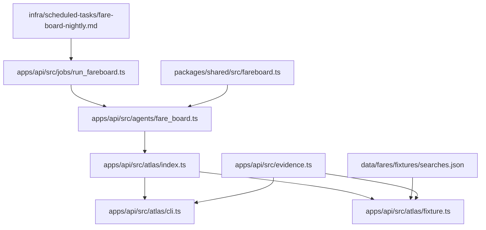
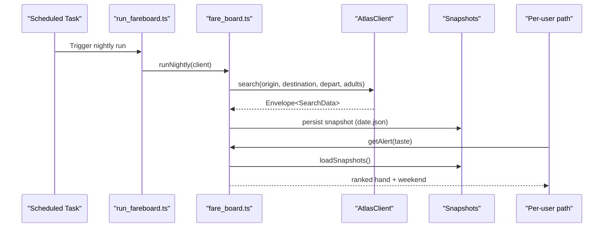
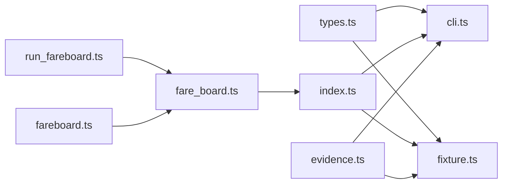
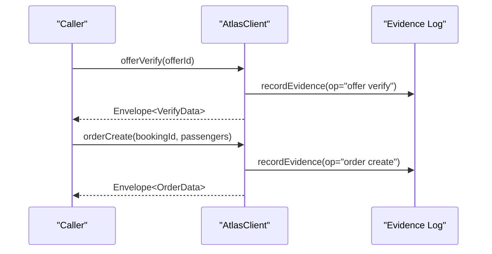
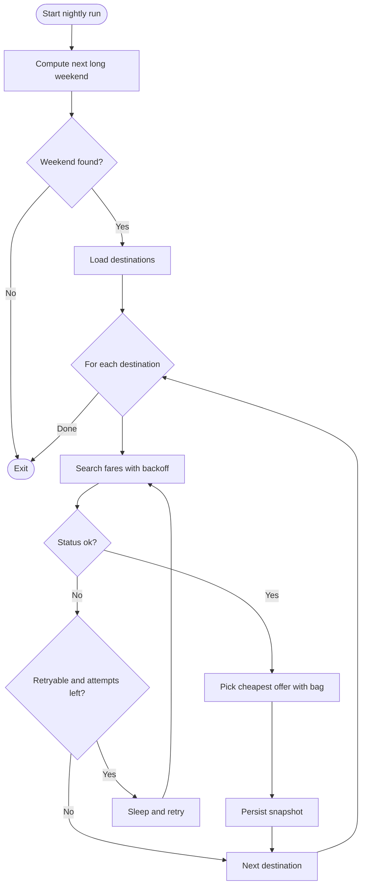

# Integration Architecture

<cite>
**Referenced Files in This Document**
- [apps/api/src/atlas/index.ts](file://apps/api/src/atlas/index.ts)
- [apps/api/src/atlas/cli.ts](file://apps/api/src/atlas/cli.ts)
- [apps/api/src/atlas/fixture.ts](file://apps/api/src/atlas/fixture.ts)
- [apps/api/src/atlas/types.ts](file://apps/api/src/atlas/types.ts)
- [apps/api/src/agents/fare_board.ts](file://apps/api/src/agents/fare_board.ts)
- [apps/api/src/jobs/run_fareboard.ts](file://apps/api/src/jobs/run_fareboard.ts)
- [packages/shared/src/fareboard.ts](file://packages/shared/src/fareboard.ts)
- [data/fares/fixtures/searches.json](file://data/fares/fixtures/searches.json)
- [infra/scheduled-tasks/fare-board-nightly.md](file://infra/scheduled-tasks/fare-board-nightly.md)
- [apps/api/test/atlas.test.ts](file://apps/api/test/atlas.test.ts)
- [apps/api/src/evidence.ts](file://apps/api/src/evidence.ts)
- [apps/api/src/data.ts](file://apps/api/src/data.ts)
- [apps/api/src/booking.ts](file://apps/api/src/booking.ts)
</cite>

## Table of Contents
1. Introduction
2. Project Structure
3. Core Components
4. Architecture Overview
5. Detailed Component Analysis
6. Dependency Analysis
7. Performance Considerations
8. Troubleshooting Guide
9. Conclusion
10. Appendices

## Introduction
This document explains the external integration architecture with a focus on Atlas Skill integration. The system uses a thin wrapper around the official Atlas CLI rather than direct REST calls, enabling stable contracts, auditability, and safe local-first development via fixtures. It also documents the fare board job scheduling for automated deal discovery and alerts, error handling strategies, retry mechanisms, rate limiting approaches, and configuration options for different deployment scenarios.

## Project Structure
The integration surface is centered under apps/api/src/atlas with two implementations:
- CliAtlasClient: shells out to the official atlas-flight CLI in sandbox mode.
- FixtureAtlasClient: deterministic offline stand-in serving pre-recorded envelopes from data/fares/fixtures/searches.json.

A factory createAtlasClient selects the implementation based on environment variables. The fare board pipeline lives in agents/fare_board.ts and is invoked by jobs/run_fareboard.ts, which runs nightly as a scheduled task defined in infra/scheduled-tasks/fare-board-nightly.md. Shared ranking logic is in packages/shared/src/fareboard.ts. Evidence logging is centralized in src/evidence.ts.

**Diagram sources**
- [apps/api/src/atlas/index.ts:1-14](file://apps/api/src/atlas/index.ts#L1-L14)
- [apps/api/src/atlas/cli.ts:1-115](file://apps/api/src/atlas/cli.ts#L1-L115)
- [apps/api/src/atlas/fixture.ts:1-205](file://apps/api/src/atlas/fixture.ts#L1-L205)
- [apps/api/src/agents/fare_board.ts:1-118](file://apps/api/src/agents/fare_board.ts#L1-L118)
- [apps/api/src/jobs/run_fareboard.ts:1-15](file://apps/api/src/jobs/run_fareboard.ts#L1-L15)
- [packages/shared/src/fareboard.ts:1-197](file://packages/shared/src/fareboard.ts#L1-L197)
- [data/fares/fixtures/searches.json:1-200](file://data/fares/fixtures/searches.json#L1-L200)
- [infra/scheduled-tasks/fare-board-nightly.md:1-35](file://infra/scheduled-tasks/fare-board-nightly.md#L1-L35)
- [apps/api/src/evidence.ts:1-30](file://apps/api/src/evidence.ts#L1-L30)

**Section sources**
- [apps/api/src/atlas/index.ts:1-14](file://apps/api/src/atlas/index.ts#L1-L14)
- [apps/api/src/jobs/run_fareboard.ts:1-15](file://apps/api/src/jobs/run_fareboard.ts#L1-L15)
- [apps/api/src/agents/fare_board.ts:1-118](file://apps/api/src/agents/fare_board.ts#L1-L118)
- [packages/shared/src/fareboard.ts:1-197](file://packages/shared/src/fareboard.ts#L1-L197)
- [data/fares/fixtures/searches.json:1-200](file://data/fares/fixtures/searches.json#L1-L200)
- [infra/scheduled-tasks/fare-board-nightly.md:1-35](file://infra/scheduled-tasks/fare-board-nightly.md#L1-L35)
- [apps/api/src/evidence.ts:1-30](file://apps/api/src/evidence.ts#L1-L30)

## Core Components
- Atlas client abstraction: a single interface that both CLI and fixture clients implement, ensuring consistent behavior across environments.
- CLI client: executes atlas-flight commands with JSON envelopes, records evidence, and returns standardized responses.
- Fixture client: serves deterministic envelopes from a JSON file, simulates booking flows, enforces single-use confirmations, and supports price bump scenarios.
- Fare board agent: nightly batch over a fixed candidate set (one origin, multiple destinations), backs off on retryable errors, persists snapshots, and provides per-user alerting purely from stored data.
- Shared ranking: taste-led scoring combining affinity, fare moment distress signals, and unexpectedness; produces a hand of top deals plus a wildcard.

Key benefits of the thin wrapper approach:
- Stable contract: all integrations go through a typed envelope schema, decoupling callers from CLI specifics.
- Auditability: every call is recorded with request_id, operation, environment, and summary.
- Safe local-first development: fixture mode enables full end-to-end testing without live credentials or network access.
- Predictability: deterministic IDs and state transitions simplify debugging and tests.

**Section sources**
- [apps/api/src/atlas/types.ts:1-91](file://apps/api/src/atlas/types.ts#L1-L91)
- [apps/api/src/atlas/cli.ts:18-115](file://apps/api/src/atlas/cli.ts#L18-L115)
- [apps/api/src/atlas/fixture.ts:42-205](file://apps/api/src/atlas/fixture.ts#L42-L205)
- [apps/api/src/agents/fare_board.ts:15-82](file://apps/api/src/agents/fare_board.ts#L15-L82)
- [packages/shared/src/fareboard.ts:3-179](file://packages/shared/src/fareboard.ts#L3-L179)

## Architecture Overview
The system separates discovery (nightly batch) from presentation (per-user ranking). Discovery uses the Atlas client to search fares for a fixed candidate set and stores snapshots. Presentation ranks stored snapshots against user taste without calling external services.

**Diagram sources**
- [apps/api/src/jobs/run_fareboard.ts:1-15](file://apps/api/src/jobs/run_fareboard.ts#L1-L15)
- [apps/api/src/agents/fare_board.ts:41-117](file://apps/api/src/agents/fare_board.ts#L41-L117)
- [apps/api/src/atlas/index.ts:10-13](file://apps/api/src/atlas/index.ts#L10-L13)
- [packages/shared/src/fareboard.ts:111-179](file://packages/shared/src/fareboard.ts#L111-L179)

## Detailed Component Analysis

### Atlas Client Abstraction and Factory
- Factory createAtlasClient chooses between CLI and fixture modes based on ATLAS_MODE.
- Types define a stable envelope and domain models for search, verify, order, pay, and status operations.

Benefits:
- Environment switching without code changes.
- Consistent response shape for consumers.
- Clear separation of concerns between transport (CLI vs fixture) and business logic.

**Section sources**
- [apps/api/src/atlas/index.ts:1-14](file://apps/api/src/atlas/index.ts#L1-L14)
- [apps/api/src/atlas/types.ts:1-91](file://apps/api/src/atlas/types.ts#L1-L91)

### CLI Wrapper Around Official Atlas CLI
- Executes atlas-flight with --json, passes stdin for passenger details once, and never logs sensitive data.
- Records evidence for each operation with request_id, timestamp, operation, environment, and summary.
- Returns a fallback envelope on process errors, marking non-retryable failures.

Error handling:
- Process-level errors are caught and converted into a structured envelope with code CLI_UNAVAILABLE.
- Timeouts and child process errors are surfaced via standard error streams and wrapped in the envelope.

Rate limiting:
- Not implemented here; handled upstream by the fare board agent’s backoff strategy.

Environment requirements:
- Requires atlas-flight installed and authorized (auth login) with environment set to sandbox.

**Section sources**
- [apps/api/src/atlas/cli.ts:18-115](file://apps/api/src/atlas/cli.ts#L18-L115)
- [apps/api/src/evidence.ts:1-30](file://apps/api/src/evidence.ts#L1-L30)

### Fixture Client for Offline Testing and Development
- Serves deterministic envelopes from data/fares/fixtures/searches.json keyed by origin, destination, and departure date.
- Simulates full booking flow: offer verification, order creation, payment confirmation single-use enforcement, and ticketing status.
- Supports optional price bump simulation for specific offers to test price change flows.
- Masks passenger names in summaries and never logs raw passenger data.

Testing utilities:
- Tests validate envelope shape, evidence recording, full booking flow, single-use confirmations, and price bump behavior.

**Section sources**
- [apps/api/src/atlas/fixture.ts:42-205](file://apps/api/src/atlas/fixture.ts#L42-L205)
- [apps/api/test/atlas.test.ts:21-74](file://apps/api/test/atlas.test.ts#L21-L74)
- [data/fares/fixtures/searches.json:1-200](file://data/fares/fixtures/searches.json#L1-L200)

### Fare Board Job Scheduling and Automated Deal Discovery
- Nightly job invokes runNightly with an AtlasClient instance created from the factory.
- Determines next long weekend from holiday data and computes departure date as the evening before the window opens.
- Iterates over destinations, searches fares, picks cheapest offer including bag fees, and persists snapshots per day.
- Per-user alert path loads stored snapshots and ranks them using shared logic; if no snapshots exist yet, it runs an in-memory pass to ensure demo availability.

Backoff and retries:
- Implements exponential backoff with a small fixed sequence for retryable responses during nightly runs.

Persistence:
- Writes one JSON file per day under data/fares/snapshots containing weekend metadata and entries.

**Section sources**
- [apps/api/src/jobs/run_fareboard.ts:1-15](file://apps/api/src/jobs/run_fareboard.ts#L1-L15)
- [apps/api/src/agents/fare_board.ts:15-82](file://apps/api/src/agents/fare_board.ts#L15-L82)
- [apps/api/src/data.ts:27-37](file://apps/api/src/data.ts#L27-L37)

### Ranking and Alert Generation
- Combines taste affinity, fare moment distress signals (seat scarcity, family spread, refundability/changeability), and unexpectedness to score destinations.
- Produces a hand of top three deals and a wildcard introducing novelty relative to user preferences.
- Observed badge logic counts distinct nights of real (CLI-mode) snapshots to qualify for “observed” indicators.

**Section sources**
- [packages/shared/src/fareboard.ts:3-197](file://packages/shared/src/fareboard.ts#L3-L197)

### Booking Flow Integration
- Verifies offers, creates orders, pays with confirmation id, and retrieves ticketing status.
- Validates approved totals match pending orders before payment.
- Returns environment and mode metadata for observability.

**Section sources**
- [apps/api/src/booking.ts:68-98](file://apps/api/src/booking.ts#L68-L98)

## Dependency Analysis

**Diagram sources**
- [apps/api/src/atlas/types.ts:1-91](file://apps/api/src/atlas/types.ts#L1-L91)
- [apps/api/src/atlas/cli.ts:1-115](file://apps/api/src/atlas/cli.ts#L1-L115)
- [apps/api/src/atlas/fixture.ts:1-205](file://apps/api/src/atlas/fixture.ts#L1-L205)
- [apps/api/src/atlas/index.ts:1-14](file://apps/api/src/atlas/index.ts#L1-L14)
- [apps/api/src/jobs/run_fareboard.ts:1-15](file://apps/api/src/jobs/run_fareboard.ts#L1-L15)
- [apps/api/src/agents/fare_board.ts:1-118](file://apps/api/src/agents/fare_board.ts#L1-L118)
- [packages/shared/src/fareboard.ts:1-197](file://packages/shared/src/fareboard.ts#L1-L197)
- [apps/api/src/evidence.ts:1-30](file://apps/api/src/evidence.ts#L1-L30)

**Section sources**
- [apps/api/src/atlas/index.ts:1-14](file://apps/api/src/atlas/index.ts#L1-L14)
- [apps/api/src/agents/fare_board.ts:1-118](file://apps/api/src/agents/fare_board.ts#L1-L118)
- [packages/shared/src/fareboard.ts:1-197](file://packages/shared/src/fareboard.ts#L1-L197)

## Performance Considerations
- Batch-first design minimizes live API calls: only the nightly job calls Atlas; per-user paths are pure ranking over stored snapshots.
- Backoff strategy reduces pressure on rate-limited endpoints during nightly runs.
- Deterministic fixture mode eliminates network latency and flakiness in tests and local development.
- Snapshot persistence allows incremental history building and efficient per-user queries.

[No sources needed since this section provides general guidance]

## Troubleshooting Guide
Common issues and resolutions:
- CLI unavailable: When atlas-flight is not installed or unauthorized, the CLI client returns a structured error envelope with code CLI_UNAVAILABLE. Ensure the CLI is installed and authenticated to sandbox mode.
- Rate limits: If the nightly job encounters retryable responses, it backs off automatically. Do not re-run manually; review the run summary for codes.
- Missing fixture routes: Fixture search returns NO_ROUTES when no matching envelope exists for the query parameters. Add or update data/fares/fixtures/searches.json accordingly.
- Single-use confirmation reuse: Attempting to pay the same confirmation id twice yields CONFIRMATION_USED. Use fresh confirmations per order.
- Evidence log size: In-memory ring buffer caps at a fixed number of records. For extended debugging sessions, clear the log between runs.

Operational checks:
- Verify snapshot files appear daily under data/fares/snapshots after nightly runs.
- Confirm evidence logs capture operation metadata without passenger details.

**Section sources**
- [apps/api/src/atlas/cli.ts:58-78](file://apps/api/src/atlas/cli.ts#L58-L78)
- [apps/api/src/agents/fare_board.ts:53-72](file://apps/api/src/agents/fare_board.ts#L53-L72)
- [apps/api/src/atlas/fixture.ts:97-113](file://apps/api/src/atlas/fixture.ts#L97-L113)
- [apps/api/src/atlas/fixture.ts:169-188](file://apps/api/src/atlas/fixture.ts#L169-L188)
- [apps/api/src/evidence.ts:15-29](file://apps/api/src/evidence.ts#L15-L29)

## Conclusion
The integration architecture leverages a thin wrapper around the official Atlas CLI to provide a stable, auditable interface while supporting robust local-first development through fixtures. The nightly fare board job discovers deals within rate-limit constraints and persists snapshots, enabling fast, cost-effective per-user ranking without live calls. Error handling, retries, and evidence logging ensure reliability and transparency across environments.

[No sources needed since this section summarizes without analyzing specific files]

## Appendices

### Configuration and Environment Setup
- ATLAS_MODE=cli: Enables live integration via atlas-flight CLI. Requires prior authorization and sandbox environment setup.
- Default mode (no ATLAS_MODE or other value): Uses fixture client with data/fares/fixtures/searches.json for offline development and testing.
- Scheduled task: Runs nightly at a specified time, invoking npm run fareboard, and commits new snapshot files.

Deployment notes:
- Local development: Run with default fixture mode to avoid needing CLI credentials.
- CI/Qoder tasks: Configure scheduled task to run nightly and commit snapshots; ensure machine stays awake and CLI is authorized if running in cli mode.

**Section sources**
- [apps/api/src/atlas/index.ts:10-13](file://apps/api/src/atlas/index.ts#L10-L13)
- [infra/scheduled-tasks/fare-board-nightly.md:1-35](file://infra/scheduled-tasks/fare-board-nightly.md#L1-L35)

### Data Models and Envelope Contract
- Envelope: Standardized response shape with schema_version, status, code, message, retryable, request_id, data, and details.
- Domain types: SearchParams/SearchData, VerifyData, PassengerInput, OrderData, PayData, StatusData.
- Mode and environment: Clients expose mode ("fixture" | "cli") and environment ("sandbox").

**Section sources**
- [apps/api/src/atlas/types.ts:1-91](file://apps/api/src/atlas/types.ts#L1-L91)

### Sequence Diagrams for Key Flows

#### Offer Verification and Order Creation

**Diagram sources**
- [apps/api/src/atlas/cli.ts:95-105](file://apps/api/src/atlas/cli.ts#L95-L105)
- [apps/api/src/atlas/fixture.ts:115-167](file://apps/api/src/atlas/fixture.ts#L115-L167)
- [apps/api/src/evidence.ts:18-25](file://apps/api/src/evidence.ts#L18-L25)

#### Nightly Fare Board Batch

**Diagram sources**
- [apps/api/src/agents/fare_board.ts:41-82](file://apps/api/src/agents/fare_board.ts#L41-L82)