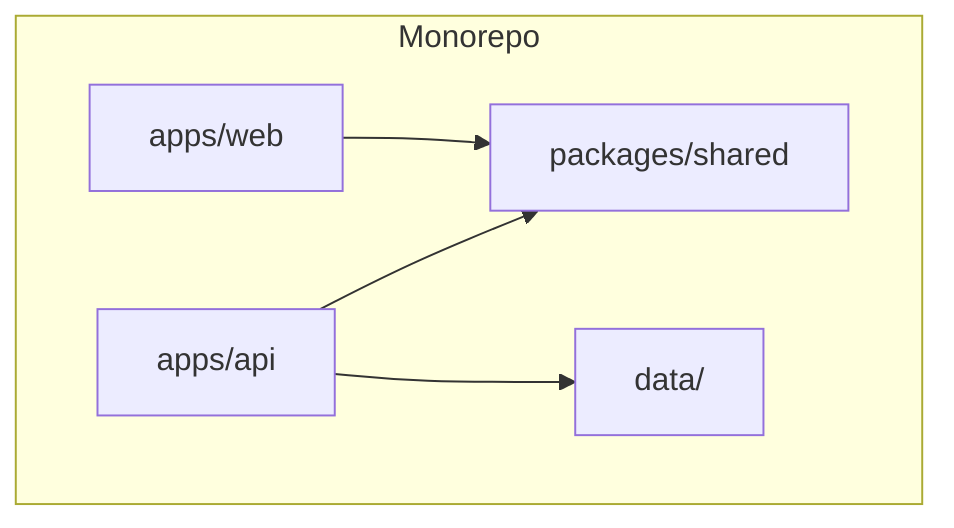
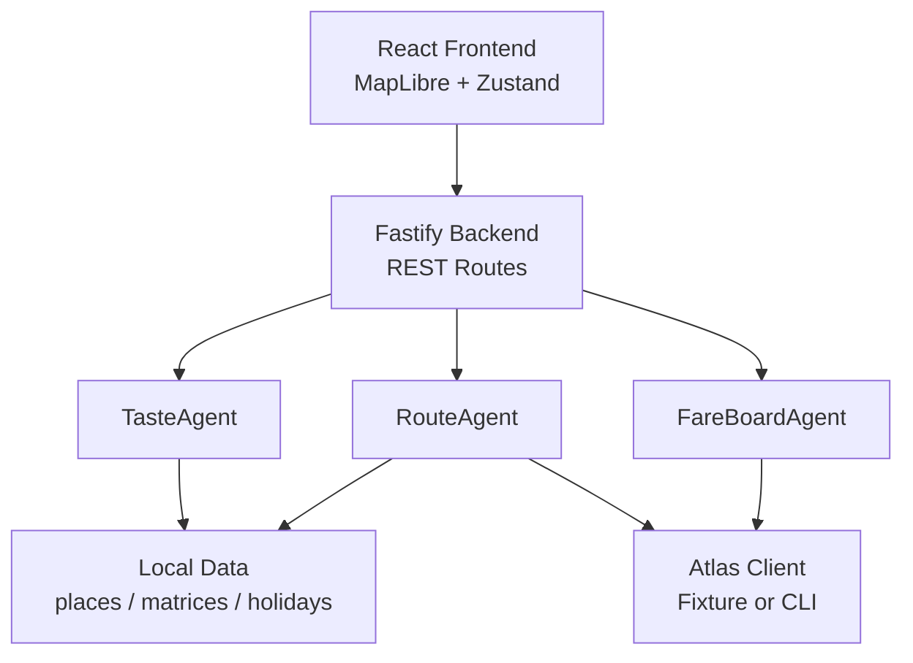
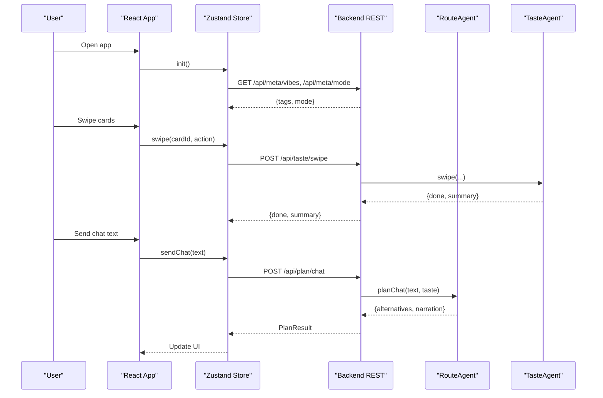
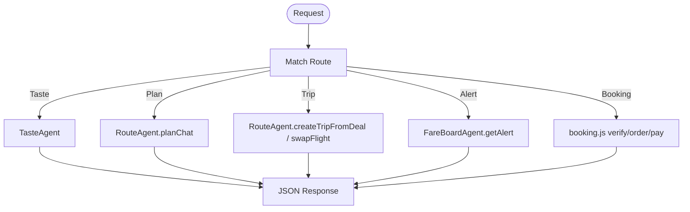
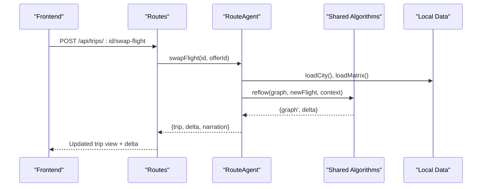
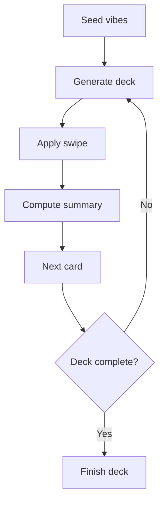
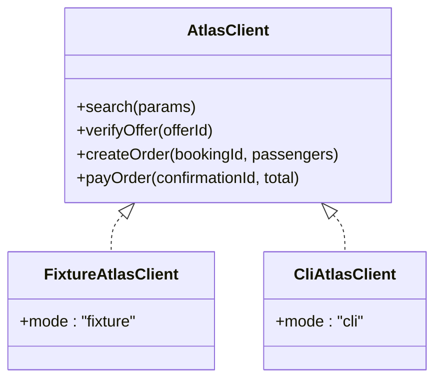
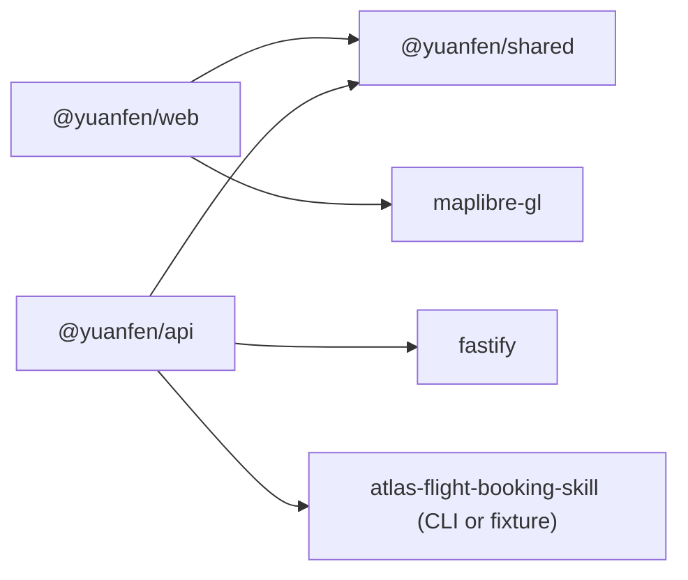

# System Overview

<cite>
**Referenced Files in This Document**
- [README.md](file://README.md)
- [package.json](file://package.json)
- [apps/api/package.json](file://apps/api/package.json)
- [apps/web/package.json](file://apps/web/package.json)
- [packages/shared/package.json](file://packages/shared/package.json)
- [docs/architecture.md](file://docs/architecture.md)
- [docs/local-first-design.md](file://docs/local-first-design.md)
- [apps/api/src/server.ts](file://apps/api/src/server.ts)
- [apps/api/src/routes.ts](file://apps/api/src/routes.ts)
- [apps/api/src/agents/route_agent.ts](file://apps/api/src/agents/route_agent.ts)
- [apps/api/src/agents/taste_agent.ts](file://apps/api/src/agents/taste_agent.ts)
- [apps/api/src/atlas/index.ts](file://apps/api/src/atlas/index.ts)
- [apps/web/src/main.tsx](file://apps/web/src/main.tsx)
- [apps/web/src/App.tsx](file://apps/web/src/App.tsx)
- [apps/web/src/store.ts](file://apps/web/src/store.ts)
- [apps/web/src/api.ts](file://apps/web/src/api.ts)
- [packages/shared/src/types.ts](file://packages/shared/src/types.ts)
</cite>

## Table of Contents
1. Introduction
2. Project Structure
3. Core Components
4. Architecture Overview
5. Detailed Component Analysis
6. Dependency Analysis
7. Performance Considerations
8. Troubleshooting Guide
9. Conclusion

## Introduction
This document provides a system overview of the Trip Graph Agent monorepo. It explains how the React frontend communicates with a Fastify backend through REST APIs, and how the system uses a local-first design to support offline capabilities and preloaded data for demo cities. The technology stack includes TypeScript, React, MapLibre GL, Zustand state management, and an Atlas Skill integration that wraps the official CLI or runs against fixtures. The backend implements a batch-plus-rank pipeline to handle Atlas API rate limits efficiently by running nightly fare scans and ranking stored snapshots per user request.

## Project Structure
The repository is an npm workspaces monorepo with three top-level areas:
- apps/web: Vite + React + TypeScript frontend using MapLibre GL and Zustand for client-side trip graph state.
- apps/api: Node + TypeScript + Fastify backend hosting agents (RouteAgent, TasteAgent, FareBoardAgent), Atlas Skill integration, and REST endpoints.
- packages/shared: Shared TypeScript types and pure functions for taste vectors, calendars, fareboard logic, routing helpers, and narration.

**Diagram sources**
- [package.json:5-8](file://package.json#L5-L8)
- [apps/web/package.json:11-17](file://apps/web/package.json#L11-L17)
- [apps/api/package.json:9-13](file://apps/api/package.json#L9-L13)
- [packages/shared/package.json:6-8](file://packages/shared/package.json#L6-L8)

Key characteristics:
- Single backend app, not microservices; agents are internal modules within apps/api.
- Local-first build: ATLAS_MODE=fixture runs fully offline on checked-in envelopes; ATLAS_MODE=cli shells to the authorized atlas-flight CLI.
- Preloaded data under data/ enables offline enrichment for demo cities and fast interactive planning.

**Section sources**
- [README.md:13-50](file://README.md#L13-L50)
- [docs/local-first-design.md:14-29](file://docs/local-first-design.md#L14-L29)
- [docs/architecture.md:21-38](file://docs/architecture.md#L21-L38)

## Core Components
- Frontend (apps/web): React UI with map-first rendering, swipe-based taste training, alert banner, trip view, booking flow, and evidence panel. State is managed via Zustand and persisted across components without prop drilling.
- Backend (apps/api): Fastify server exposing REST endpoints for taste, planning, trips, alerts, booking, and evidence. Agents implement core logic:
  - RouteAgent: builds day routes, creates full trip graphs from deals, and reflows plans when flights change.
  - TasteAgent: maintains in-memory taste vector from swipes and serves decks.
  - FareBoardAgent: nightly batch job scanning fares and writing snapshots.
- Shared (packages/shared): Pure types and algorithms for taste vectors, calendars, fareboard ranking, route building/reflow, and narration.

**Section sources**
- [apps/web/src/store.ts:13-59](file://apps/web/src/store.ts#L13-L59)
- [apps/api/src/agents/route_agent.ts:19-24](file://apps/api/src/agents/route_agent.ts#L19-L24)
- [apps/api/src/agents/taste_agent.ts:14-18](file://apps/api/src/agents/taste_agent.ts#L14-L18)
- [packages/shared/src/types.ts:79-146](file://packages/shared/src/types.ts#L79-L146)

## Architecture Overview
High-level flow:
- The React frontend renders a map and UI surfaces, calling REST endpoints on the Fastify backend.
- The backend orchestrates agents and integrates with Atlas via a thin wrapper that either uses fixtures or the CLI.
- Data layers include preloaded places, travel-time matrices, and holiday files for offline operation.
- The batch-plus-rank pipeline ensures no live Atlas calls in the user request path; per-user actions rank stored snapshots.

**Diagram sources**
- [apps/api/src/server.ts:8-12](file://apps/api/src/server.ts#L8-L12)
- [apps/api/src/routes.ts:10-134](file://apps/api/src/routes.ts#L10-L134)
- [apps/api/src/agents/route_agent.ts:107-185](file://apps/api/src/agents/route_agent.ts#L107-L185)
- [apps/api/src/agents/taste_agent.ts:28-110](file://apps/api/src/agents/taste_agent.ts#L28-L110)
- [apps/api/src/atlas/index.ts:10-13](file://apps/api/src/atlas/index.ts#L10-L13)

## Detailed Component Analysis

### Frontend Application (apps/web)
- Entry point mounts React and renders App, which composes map, panels, banners, and flows based on Zustand phase.
- Store manages phases (vibes, deck, home, trip), taste summary, plan results, alerts, trip views, swap animations, booking state, and evidence visibility.
- API layer provides typed fetch wrappers for all backend endpoints, including taste, planning, trips, booking, and evidence.

**Diagram sources**
- [apps/web/src/main.tsx:6-10](file://apps/web/src/main.tsx#L6-L10)
- [apps/web/src/App.tsx:15-89](file://apps/web/src/App.tsx#L15-L89)
- [apps/web/src/store.ts:86-203](file://apps/web/src/store.ts#L86-L203)
- [apps/web/src/api.ts:119-149](file://apps/web/src/api.ts#L119-L149)
- [apps/api/src/routes.ts:25-56](file://apps/api/src/routes.ts#L25-L56)
- [apps/api/src/agents/taste_agent.ts:69-84](file://apps/api/src/agents/taste_agent.ts#L69-L84)
- [apps/api/src/agents/route_agent.ts:62-93](file://apps/api/src/agents/route_agent.ts#L62-L93)

**Section sources**
- [apps/web/src/main.tsx:1-11](file://apps/web/src/main.tsx#L1-L11)
- [apps/web/src/App.tsx:15-89](file://apps/web/src/App.tsx#L15-L89)
- [apps/web/src/store.ts:13-59](file://apps/web/src/store.ts#L13-L59)
- [apps/web/src/api.ts:109-198](file://apps/web/src/api.ts#L109-L198)

### Backend Server and Routes (apps/api)
- Fastify server initializes CORS and registers routes with an AtlasClient instance selected by environment.
- Routes expose endpoints for meta info, taste operations, planning, trips, alerts, booking, reveal, and evidence.
- Booking endpoints implement a fixed state machine (verify → accept price → order → pay).

**Diagram sources**
- [apps/api/src/server.ts:8-12](file://apps/api/src/server.ts#L8-L12)
- [apps/api/src/routes.ts:10-134](file://apps/api/src/routes.ts#L10-L134)

**Section sources**
- [apps/api/src/server.ts:1-26](file://apps/api/src/server.ts#L1-L26)
- [apps/api/src/routes.ts:1-135](file://apps/api/src/routes.ts#L1-L135)

### RouteAgent (apps/api)
- Orchestrates shared pure functions to build alternatives, create trip graphs, and reflow plans when flights change.
- Enriches stops with place metadata and supports sealed wildcards revealed later.
- Handles S1 chat parsing into intent, then constructs day routes using places and travel-time matrices.
- Creates trips from deal expansions by searching outbound and return flights, selecting best options, and building a full TripGraph.
- Implements swap-flight to re-plan downstream legs and compute budget deltas.

**Diagram sources**
- [apps/api/src/agents/route_agent.ts:170-185](file://apps/api/src/agents/route_agent.ts#L170-L185)
- [apps/api/src/routes.ts:78-85](file://apps/api/src/routes.ts#L78-L85)

**Section sources**
- [apps/api/src/agents/route_agent.ts:19-93](file://apps/api/src/agents/route_agent.ts#L19-L93)
- [apps/api/src/agents/route_agent.ts:107-185](file://apps/api/src/agents/route_agent.ts#L107-L185)

### TasteAgent (apps/api)
- Maintains in-memory taste state derived from swipe events, seeding from vibe tags and applying like/pass/must-go actions.
- Generates diverse decks by bucketing places by primary vibe tag and round-robin selection.
- Provides undo and summary endpoints to reflect current taste strength and must-go selections.

**Diagram sources**
- [apps/api/src/agents/taste_agent.ts:28-110](file://apps/api/src/agents/taste_agent.ts#L28-L110)

**Section sources**
- [apps/api/src/agents/taste_agent.ts:14-118](file://apps/api/src/agents/taste_agent.ts#L14-L118)

### Atlas Integration (apps/api)
- Thin wrapper selects between FixtureAtlasClient (offline) and CliAtlasClient (live Sandbox) based on ATLAS_MODE.
- Exposes search, offer verification, ancillary catalogue, order creation, payment, and status polling through a consistent interface.

**Diagram sources**
- [apps/api/src/atlas/index.ts:10-13](file://apps/api/src/atlas/index.ts#L10-L13)

**Section sources**
- [apps/api/src/atlas/index.ts:1-14](file://apps/api/src/atlas/index.ts#L1-L14)

### Shared Types and Models (packages/shared)
- Defines core domain models: Place, CityPlaces, TravelMatrix, FlightOption, StopNode, DayPlan, TripBudget, TripGraph, Holiday, LongWeekend, FareSnapshotEntry.
- Encapsulates vibe tags and taste-related structures used by both frontend and backend.

**Section sources**
- [packages/shared/src/types.ts:1-170](file://packages/shared/src/types.ts#L1-L170)

## Dependency Analysis
- Monorepo workspaces link apps/web, apps/api, and packages/shared so they share types and utilities.
- Frontend depends on @yuanfen/shared for types and on MapLibre GL for rendering.
- Backend depends on @yuanfen/shared for algorithms and on Fastify for HTTP serving.
- Atlas integration is isolated behind a client abstraction to allow fixture-driven testing and live Sandbox usage.

**Diagram sources**
- [package.json:5-8](file://package.json#L5-L8)
- [apps/web/package.json:11-17](file://apps/web/package.json#L11-L17)
- [apps/api/package.json:9-13](file://apps/api/package.json#L9-L13)

**Section sources**
- [package.json:1-23](file://package.json#L1-L23)
- [apps/web/package.json:1-25](file://apps/web/package.json#L1-L25)
- [apps/api/package.json:1-15](file://apps/api/package.json#L1-L15)

## Performance Considerations
- Batch-plus-rank architecture avoids live Atlas calls during user interactions; per-user requests perform ranking over stored fare snapshots, keeping response times low and costs near zero.
- Precomputed travel-time matrices enable interactive planning under five seconds.
- Sealed wildcard stops reduce payload size until reveal, improving initial render performance.
- Deterministic intent parsing and template-composed narration avoid LLM latency in the request path.

[No sources needed since this section provides general guidance]

## Troubleshooting Guide
Common issues and where to look:
- API offline error in frontend: check that the backend is running on the expected port and CORS is enabled.
- Taste state errors: ensure vibes are seeded before swiping or planning; endpoints enforce minimum vibe count.
- Unknown destination or city: verify destination keys match profiles and city files exist under data/.
- Booking failures: review evidence log for exact Atlas call details and environment/mode flags.

**Section sources**
- [apps/web/src/store.ts:86-93](file://apps/web/src/store.ts#L86-L93)
- [apps/api/src/routes.ts:25-56](file://apps/api/src/routes.ts#L25-L56)
- [apps/api/src/routes.ts:119-134](file://apps/api/src/routes.ts#L119-L134)

## Conclusion
The Trip Graph Agent system combines a local-first design with a robust backend agent architecture to deliver a responsive, deterministic trip planning experience. The monorepo structure cleanly separates concerns across web, api, and shared packages, while the batch-plus-rank pipeline ensures scalability and cost control. The result is a cohesive system where flight changes cascade through the itinerary, budgets update transparently, and users can explore and book trips with confidence.

[No sources needed since this section summarizes without analyzing specific files]