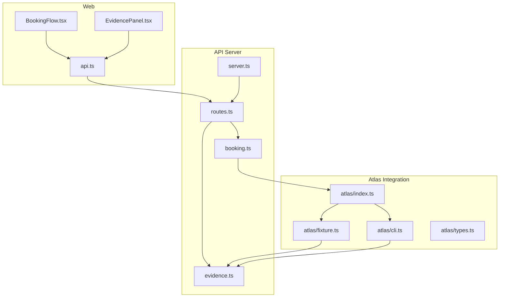
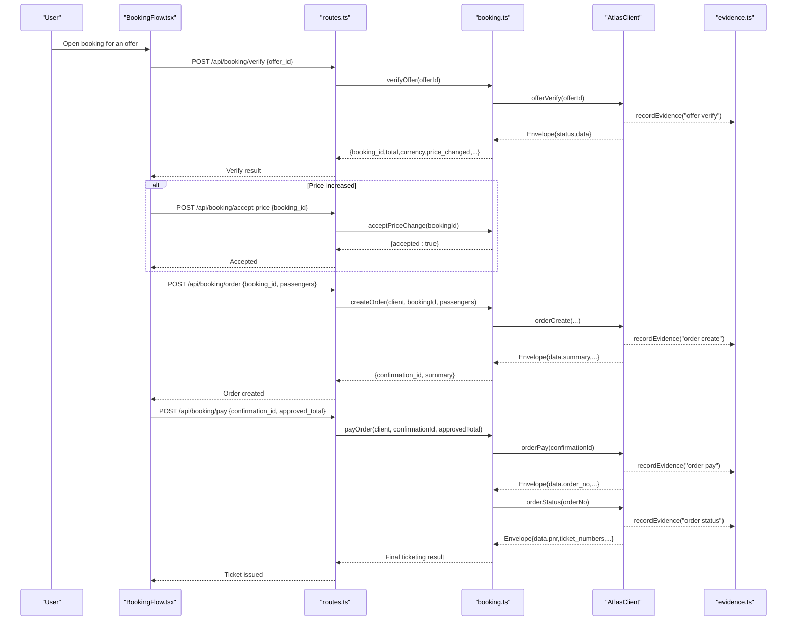
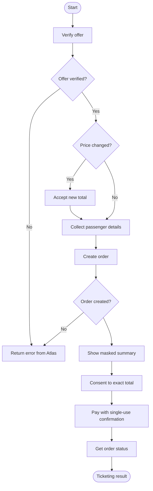
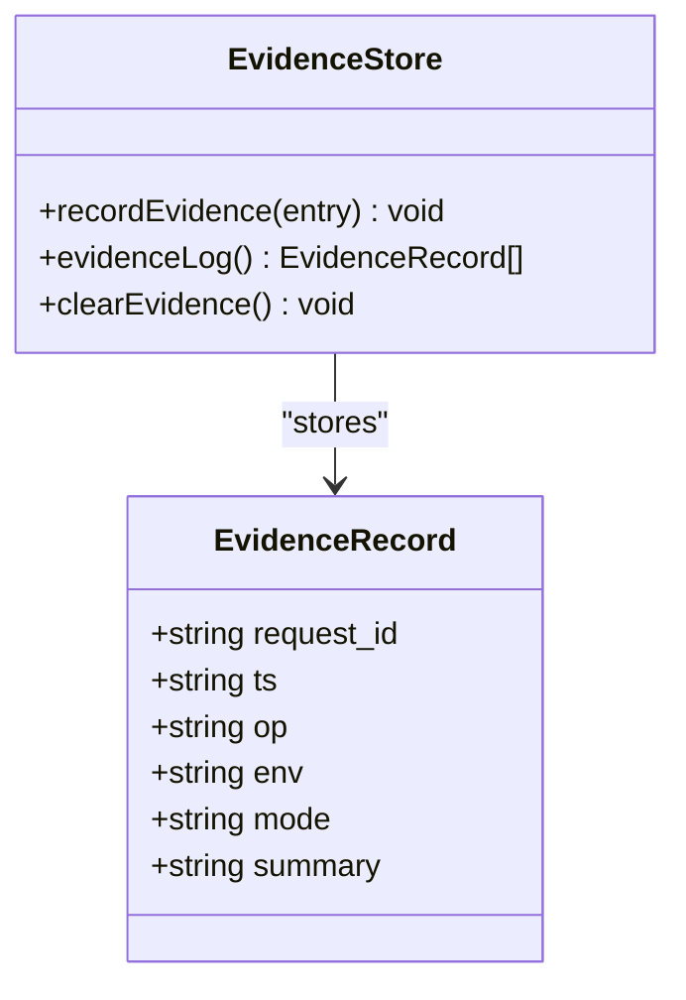
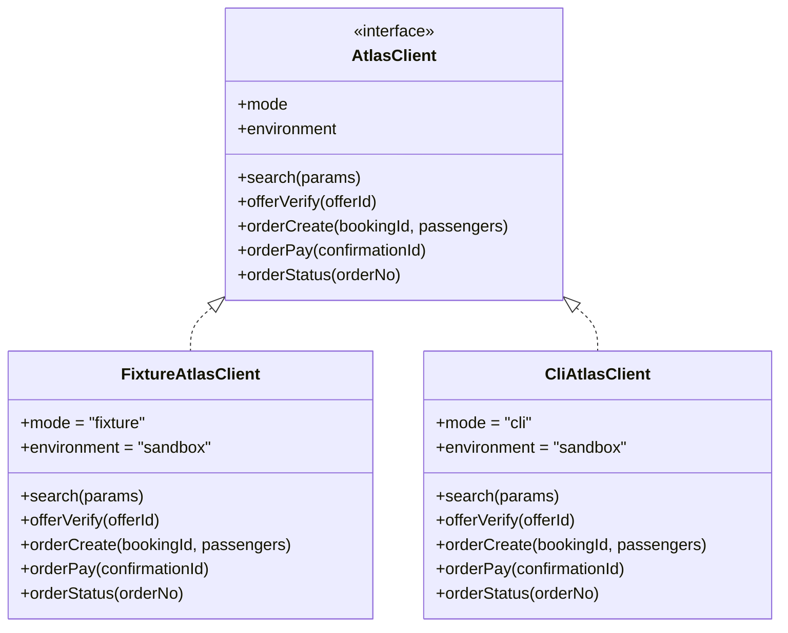
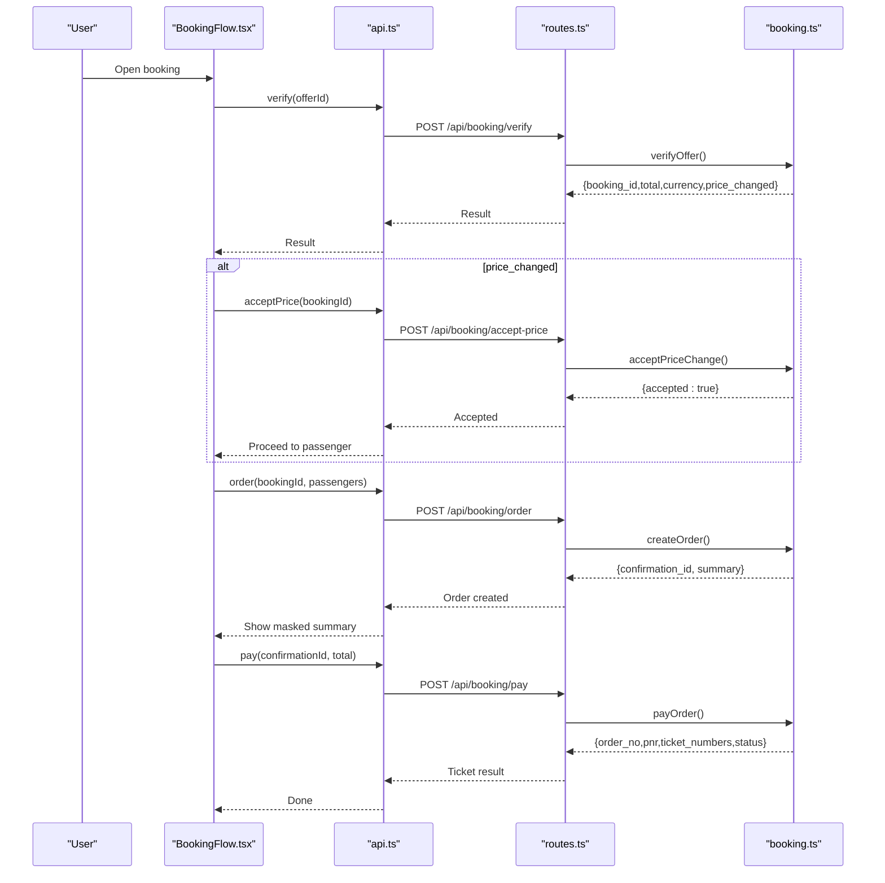
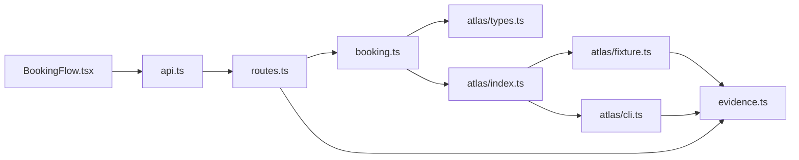

# Booking Workflow

<cite>
**Referenced Files in This Document**
- [booking.ts](file://apps/api/src/booking.ts)
- [evidence.ts](file://apps/api/src/evidence.ts)
- [types.ts](file://apps/api/src/atlas/types.ts)
- [cli.ts](file://apps/api/src/atlas/cli.ts)
- [fixture.ts](file://apps/api/src/atlas/fixture.ts)
- [index.ts](file://apps/api/src/atlas/index.ts)
- [routes.ts](file://apps/api/src/routes.ts)
- [server.ts](file://apps/api/src/server.ts)
- [BookingFlow.tsx](file://apps/web/src/components/booking/BookingFlow.tsx)
- [EvidencePanel.tsx](file://apps/web/src/components/evidence/EvidencePanel.tsx)
- [api.ts](file://apps/web/src/api.ts)
</cite>

## Table of Contents
1. [Introduction](#introduction)
2. [Project Structure](#project-structure)
3. [Core Components](#core-components)
4. [Architecture Overview](#architecture-overview)
5. [Detailed Component Analysis](#detailed-component-analysis)
6. [Dependency Analysis](#dependency-analysis)
7. [Performance Considerations](#performance-considerations)
8. [Troubleshooting Guide](#troubleshooting-guide)
9. [Conclusion](#conclusion)

## Introduction
This document explains the end-to-end booking workflow that integrates with Atlas Skill APIs for flight search, offer verification, order creation, and payment processing. It focuses on human checkpoints at critical decision points: verifying offers, accepting price changes, confirming an exact total before payment, and receiving ticketing results. It also documents the evidence logging system that provides audit trails for every Atlas client call without recording passenger details, and it covers error handling patterns for failed bookings, timeouts, and network failures. Security considerations include data privacy (no passenger data in logs), single-use payment confirmations, and explicit user consent to exact totals.

## Project Structure
The booking flow spans a small set of focused modules:
- API layer exposes endpoints for verify, accept-price, order, pay, and evidence retrieval.
- Booking state machine enforces a fixed sequence with human checkpoints.
- Atlas integration abstracts two modes: fixture (offline deterministic behavior) and CLI (live sandbox via atlas-flight).
- Web UI implements the step-by-step checkpoint flow and displays environment badges and receipts.

**Diagram sources**
- [server.ts:8-12](file://apps/api/src/server.ts#L8-L12)
- [routes.ts:87-133](file://apps/api/src/routes.ts#L87-L133)
- [booking.ts:31-98](file://apps/api/src/booking.ts#L31-L98)
- [evidence.ts:18-24](file://apps/api/src/evidence.ts#L18-L24)
- [index.ts:10-13](file://apps/api/src/atlas/index.ts#L10-L13)
- [fixture.ts:48-204](file://apps/api/src/atlas/fixture.ts#L48-L204)
- [cli.ts:27-113](file://apps/api/src/atlas/cli.ts#L27-L113)
- [types.ts:82-90](file://apps/api/src/atlas/types.ts#L82-L90)
- [BookingFlow.tsx:50-94](file://apps/web/src/components/booking/BookingFlow.tsx#L50-L94)
- [EvidencePanel.tsx:6-27](file://apps/web/src/components/evidence/EvidencePanel.tsx#L6-L27)
- [api.ts:152-196](file://apps/web/src/api.ts#L152-L196)

**Section sources**
- [server.ts:8-12](file://apps/api/src/server.ts#L8-L12)
- [routes.ts:87-133](file://apps/api/src/routes.ts#L87-L133)
- [booking.ts:31-98](file://apps/api/src/booking.ts#L31-L98)
- [evidence.ts:18-24](file://apps/api/src/evidence.ts#L18-L24)
- [index.ts:10-13](file://apps/api/src/atlas/index.ts#L10-L13)
- [fixture.ts:48-204](file://apps/api/src/atlas/fixture.ts#L48-L204)
- [cli.ts:27-113](file://apps/api/src/atlas/cli.ts#L27-L113)
- [types.ts:82-90](file://apps/api/src/atlas/types.ts#L82-L90)
- [BookingFlow.tsx:50-94](file://apps/web/src/components/booking/BookingFlow.tsx#L50-L94)
- [EvidencePanel.tsx:6-27](file://apps/web/src/components/evidence/EvidencePanel.tsx#L6-L27)
- [api.ts:152-196](file://apps/web/src/api.ts#L152-L196)

## Core Components
- Booking state machine: Enforces a fixed sequence with human checkpoints — verify offer, optional price-change acceptance, masked summary, explicit consent to exact total, payment, and ticket status. Passenger details are one-time inputs and never stored or logged.
- Evidence log: In-memory ring buffer capturing operation metadata (request id, timestamp, operation name, environment, mode, summary) for every Atlas client call. No passenger data is recorded.
- Atlas clients:
  - Fixture client: Deterministic offline simulation with fixed IDs, masked names, and single-use confirmation enforcement.
  - CLI client: Shells out to the official atlas-flight CLI in sandbox mode, with timeout and fallback envelope on failure.
- Web flow: Step-based UI that guides users through checkpoints and shows environment badges and receipts.

**Section sources**
- [booking.ts:3-19](file://apps/api/src/booking.ts#L3-L19)
- [evidence.ts:1-29](file://apps/api/src/evidence.ts#L1-L29)
- [fixture.ts:42-73](file://apps/api/src/atlas/fixture.ts#L42-L73)
- [cli.ts:18-26](file://apps/api/src/atlas/cli.ts#L18-L26)
- [BookingFlow.tsx:5-17](file://apps/web/src/components/booking/BookingFlow.tsx#L5-L17)

## Architecture Overview
The booking workflow is a multi-step process orchestrated by the web UI and enforced by the API’s booking state machine. Each step calls Atlas Skill APIs through a unified client abstraction, which can be either a fixture or CLI implementation. Evidence is recorded for each Atlas call.

**Diagram sources**
- [routes.ts:87-115](file://apps/api/src/routes.ts#L87-L115)
- [booking.ts:31-98](file://apps/api/src/booking.ts#L31-L98)
- [evidence.ts:18-24](file://apps/api/src/evidence.ts#L18-L24)
- [cli.ts:31-78](file://apps/api/src/atlas/cli.ts#L31-L78)
- [fixture.ts:115-204](file://apps/api/src/atlas/fixture.ts#L115-L204)
- [BookingFlow.tsx:55-94](file://apps/web/src/components/booking/BookingFlow.tsx#L55-L94)

## Detailed Component Analysis

### Booking State Machine
The state machine ensures a deterministic, auditable flow:
- Verify offer: Calls Atlas to re-validate pricing and returns a booking context with totals and currency. If price changed, requires explicit acceptance.
- Accept price change: Marks the booking as accepted so downstream steps can proceed.
- Create order: Requires passengers (one-time input) and validated booking context; returns a masked summary and a single-use confirmation ID.
- Pay order: Validates that the approved total matches the displayed total exactly, then invokes payment and retrieves ticketing status.

**Diagram sources**
- [booking.ts:31-98](file://apps/api/src/booking.ts#L31-L98)

**Section sources**
- [booking.ts:31-98](file://apps/api/src/booking.ts#L31-L98)

### Evidence Logging System
Every Atlas client call records an evidence entry containing request id, timestamp, operation, environment, mode, and a short summary. The log is an in-memory ring buffer capped at a fixed size and exposed via an endpoint for inspection. Passenger details are never recorded.

**Diagram sources**
- [evidence.ts:6-29](file://apps/api/src/evidence.ts#L6-L29)

**Section sources**
- [evidence.ts:1-29](file://apps/api/src/evidence.ts#L1-L29)
- [cli.ts:49-77](file://apps/api/src/atlas/cli.ts#L49-L77)
- [fixture.ts:64-73](file://apps/api/src/atlas/fixture.ts#L64-L73)
- [routes.ts:133](file://apps/api/src/routes.ts#L133)
- [EvidencePanel.tsx:11-27](file://apps/web/src/components/evidence/EvidencePanel.tsx#L11-L27)

### Atlas Integration: Fixture vs CLI
- Fixture client:
  - Deterministic responses based on checked-in fixtures.
  - Masks passenger names in summaries.
  - Enforces single-use payment confirmations.
  - Records evidence for all operations.
- CLI client:
  - Executes atlas-flight commands with JSON output.
  - Uses a timeout for child processes.
  - On failure, returns a standardized error envelope and records evidence.

**Diagram sources**
- [types.ts:82-90](file://apps/api/src/atlas/types.ts#L82-L90)
- [fixture.ts:48-204](file://apps/api/src/atlas/fixture.ts#L48-L204)
- [cli.ts:27-113](file://apps/api/src/atlas/cli.ts#L27-L113)

**Section sources**
- [types.ts:8-90](file://apps/api/src/atlas/types.ts#L8-L90)
- [fixture.ts:48-204](file://apps/api/src/atlas/fixture.ts#L48-L204)
- [cli.ts:27-113](file://apps/api/src/atlas/cli.ts#L27-L113)
- [index.ts:10-13](file://apps/api/src/atlas/index.ts#L10-L13)

### Web Booking Flow
The UI implements a step-based state machine mirroring the server-side checkpoints:
- Verifying: Re-verifies the offer price.
- Price-changed: Shows previous vs current total and requires user acceptance.
- Passenger: Collects one-time passenger details and creates an order.
- Summary: Displays masked details and asks for explicit consent to the exact total.
- Paying: Submits payment with the exact total and shows final ticketing result.
- Error: Displays errors returned from the API.

**Diagram sources**
- [BookingFlow.tsx:55-94](file://apps/web/src/components/booking/BookingFlow.tsx#L55-L94)
- [api.ts:152-196](file://apps/web/src/api.ts#L152-L196)
- [routes.ts:87-115](file://apps/api/src/routes.ts#L87-L115)
- [booking.ts:31-98](file://apps/api/src/booking.ts#L31-L98)

**Section sources**
- [BookingFlow.tsx:5-179](file://apps/web/src/components/booking/BookingFlow.tsx#L5-L179)
- [api.ts:152-196](file://apps/web/src/api.ts#L152-L196)
- [routes.ts:87-115](file://apps/api/src/routes.ts#L87-L115)
- [booking.ts:31-98](file://apps/api/src/booking.ts#L31-L98)

## Dependency Analysis
- routes.ts depends on booking functions and evidence log to expose endpoints and return consistent error shapes.
- booking.ts depends on AtlasClient interface; actual behavior is provided by fixture or CLI implementations selected at runtime.
- Both Atlas implementations depend on evidence.ts to record operational metadata.
- Web components depend on api.ts to call backend endpoints and render state transitions.

**Diagram sources**
- [routes.ts:1-135](file://apps/api/src/routes.ts#L1-L135)
- [booking.ts:1-104](file://apps/api/src/booking.ts#L1-L104)
- [evidence.ts:1-30](file://apps/api/src/evidence.ts#L1-L30)
- [index.ts:1-14](file://apps/api/src/atlas/index.ts#L1-L14)
- [fixture.ts:1-205](file://apps/api/src/atlas/fixture.ts#L1-L205)
- [cli.ts:1-115](file://apps/api/src/atlas/cli.ts#L1-L115)
- [BookingFlow.tsx:1-179](file://apps/web/src/components/booking/BookingFlow.tsx#L1-L179)
- [api.ts:1-198](file://apps/web/src/api.ts#L1-L198)

**Section sources**
- [routes.ts:1-135](file://apps/api/src/routes.ts#L1-L135)
- [booking.ts:1-104](file://apps/api/src/booking.ts#L1-L104)
- [evidence.ts:1-30](file://apps/api/src/evidence.ts#L1-L30)
- [index.ts:1-14](file://apps/api/src/atlas/index.ts#L1-L14)
- [fixture.ts:1-205](file://apps/api/src/atlas/fixture.ts#L1-L205)
- [cli.ts:1-115](file://apps/api/src/atlas/cli.ts#L1-L115)
- [BookingFlow.tsx:1-179](file://apps/web/src/components/booking/BookingFlow.tsx#L1-L179)
- [api.ts:1-198](file://apps/web/src/api.ts#L1-L198)

## Performance Considerations
- Fixture client is deterministic and fast; suitable for local development and tests.
- CLI client shells out to an external process with a timeout; expect higher latency and potential failures if the CLI is unavailable.
- Evidence log is an in-memory ring buffer with a fixed maximum size; this avoids unbounded growth but may drop older entries under high load.
- Payment confirmation IDs are single-use; repeated attempts will fail quickly, reducing unnecessary work.

[No sources needed since this section provides general guidance]

## Troubleshooting Guide

### Common Booking Issues
- Offer not found or invalid:
  - Symptom: Verification returns an error code and message.
  - Action: Confirm the offer ID exists and is still valid; check evidence log for the operation and response code.
  - Relevant paths: [booking.ts:31-52](file://apps/api/src/booking.ts#L31-L52), [fixture.ts:115-135](file://apps/api/src/atlas/fixture.ts#L115-L135)
- Price change not accepted:
  - Symptom: Order creation fails with a price confirmation error.
  - Action: Ensure the user explicitly accepts the new total before creating an order.
  - Relevant paths: [booking.ts:54-75](file://apps/api/src/booking.ts#L54-L75)
- Confirmation mismatch:
  - Symptom: Payment rejected due to total mismatch.
  - Action: Approve the exact total shown in the masked summary; do not modify the amount.
  - Relevant paths: [booking.ts:77-88](file://apps/api/src/booking.ts#L77-L88)
- Single-use confirmation reused:
  - Symptom: Payment fails because the confirmation was already used.
  - Action: Use a fresh confirmation ID per attempt; avoid retrying the same ID.
  - Relevant paths: [fixture.ts:169-189](file://apps/api/src/atlas/fixture.ts#L169-L189)

### Timeout Scenarios
- CLI client uses a process timeout; if exceeded, a fallback error envelope is returned and evidence is recorded.
- Action: Check evidence log for “CLI_UNAVAILABLE” or timeout-related messages; ensure atlas-flight is installed and authorized.
- Relevant paths: [cli.ts:31-78](file://apps/api/src/atlas/cli.ts#L31-L78)

### Network Failures
- Web fetch layer throws when HTTP responses are not ok; errors bubble up to the UI error state.
- Action: Inspect the error message returned by the API; verify server availability and CORS configuration.
- Relevant paths: [api.ts:109-117](file://apps/web/src/api.ts#L109-L117)

### Debugging Techniques
- Use the evidence panel to inspect recent Atlas calls, including operation names, request IDs, timestamps, environment, and mode.
- Filter by mode (“fixture” vs “cli”) to identify whether you are running locally or against the sandbox.
- Validate that passenger details do not appear in evidence logs; if they do, investigate where data might be leaking.
- Relevant paths: [EvidencePanel.tsx:11-27](file://apps/web/src/components/evidence/EvidencePanel.tsx#L11-L27), [evidence.ts:18-24](file://apps/api/src/evidence.ts#L18-L24)

**Section sources**
- [booking.ts:31-98](file://apps/api/src/booking.ts#L31-L98)
- [fixture.ts:115-204](file://apps/api/src/atlas/fixture.ts#L115-L204)
- [cli.ts:31-78](file://apps/api/src/atlas/cli.ts#L31-L78)
- [api.ts:109-117](file://apps/web/src/api.ts#L109-L117)
- [EvidencePanel.tsx:11-27](file://apps/web/src/components/evidence/EvidencePanel.tsx#L11-L27)
- [evidence.ts:18-24](file://apps/api/src/evidence.ts#L18-L24)

## Security Considerations
- Data privacy:
  - Passenger details are one-time inputs and are never stored or logged. Evidence records only contain operation metadata.
  - Masked names are used in summaries to avoid exposing full personal information.
  - Relevant paths: [evidence.ts:1-13](file://apps/api/src/evidence.ts#L1-L13), [fixture.ts:31-40](file://apps/api/src/atlas/fixture.ts#L31-L40), [fixture.ts:148-166](file://apps/api/src/atlas/fixture.ts#L148-L166)
- PCI compliance patterns:
  - The system does not handle raw payment card data directly; payments are delegated to the Atlas Skill via the CLI or fixture.
  - Explicit user consent to the exact total is required before payment, ensuring transparency and control.
  - Single-use payment confirmations prevent replay attacks.
  - Relevant paths: [cli.ts:18-26](file://apps/api/src/atlas/cli.ts#L18-L26), [booking.ts:77-98](file://apps/api/src/booking.ts#L77-L98), [fixture.ts:169-189](file://apps/api/src/atlas/fixture.ts#L169-L189)
- Environment isolation:
  - Mode and environment are surfaced in responses and UI badges to distinguish fixture from sandbox runs.
  - Relevant paths: [routes.ts:11-12](file://apps/api/src/routes.ts#L11-L12), [BookingFlow.tsx:99-105](file://apps/web/src/components/booking/BookingFlow.tsx#L99-L105)

**Section sources**
- [evidence.ts:1-13](file://apps/api/src/evidence.ts#L1-L13)
- [fixture.ts:31-40](file://apps/api/src/atlas/fixture.ts#L31-L40)
- [fixture.ts:148-166](file://apps/api/src/atlas/fixture.ts#L148-L166)
- [cli.ts:18-26](file://apps/api/src/atlas/cli.ts#L18-L26)
- [booking.ts:77-98](file://apps/api/src/booking.ts#L77-L98)
- [fixture.ts:169-189](file://apps/api/src/atlas/fixture.ts#L169-L189)
- [routes.ts:11-12](file://apps/api/src/routes.ts#L11-L12)
- [BookingFlow.tsx:99-105](file://apps/web/src/components/booking/BookingFlow.tsx#L99-L105)

## Conclusion
The booking workflow enforces a strict, auditable sequence with human checkpoints to ensure trust and compliance. Offer verification, price change acceptance, masked summaries, and explicit consent to exact totals protect both users and the business. The evidence logging system provides a clear audit trail without recording sensitive passenger data. Integration with Atlas Skill APIs supports both offline fixture testing and live sandbox execution, with robust error handling and security patterns around payment flows.

[No sources needed since this section summarizes without analyzing specific files]