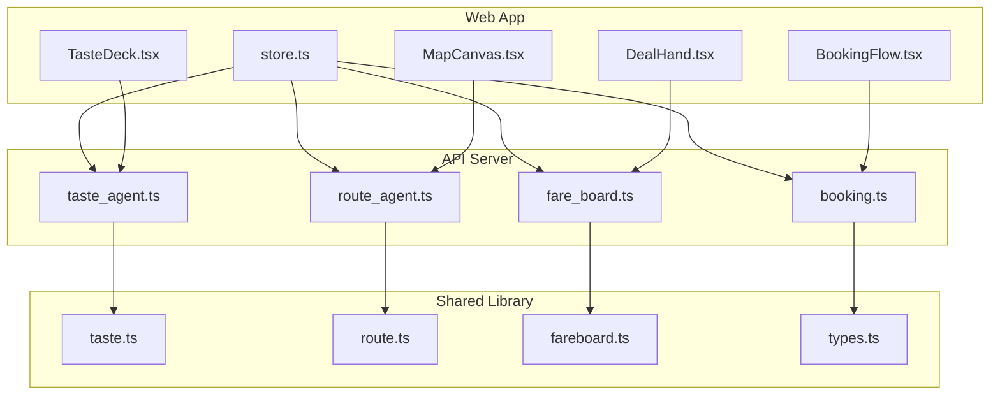
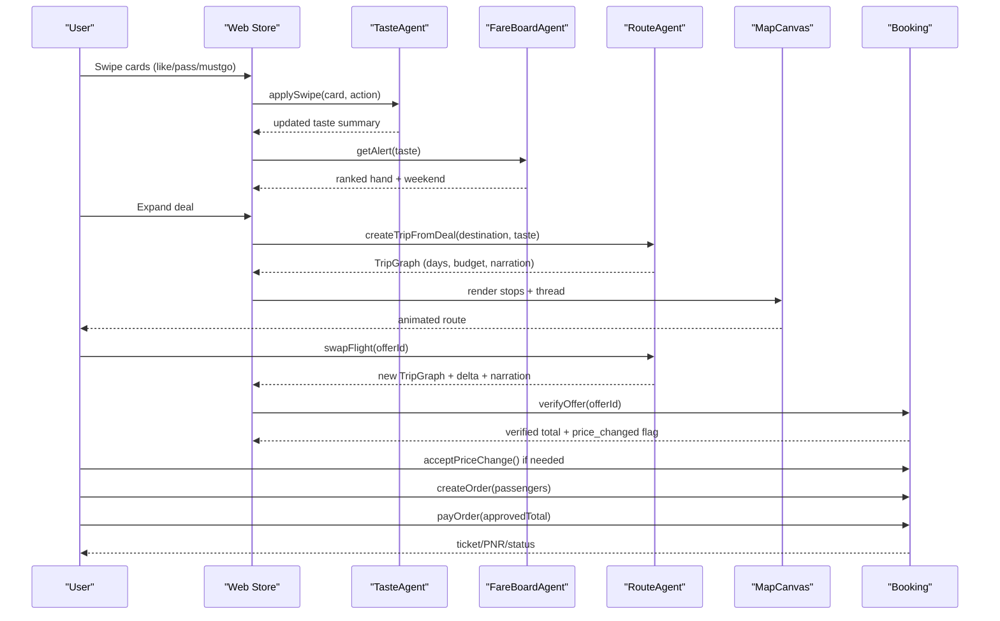
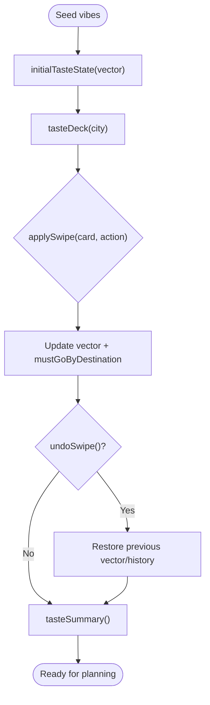
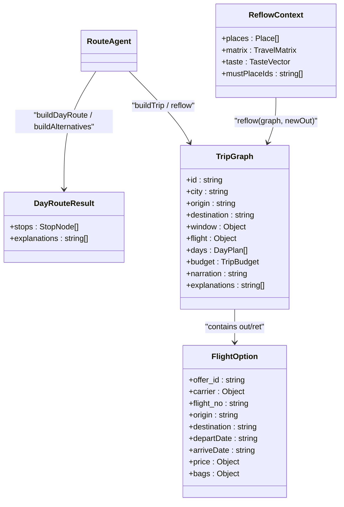
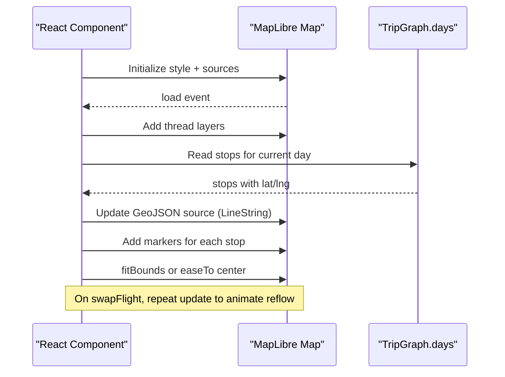
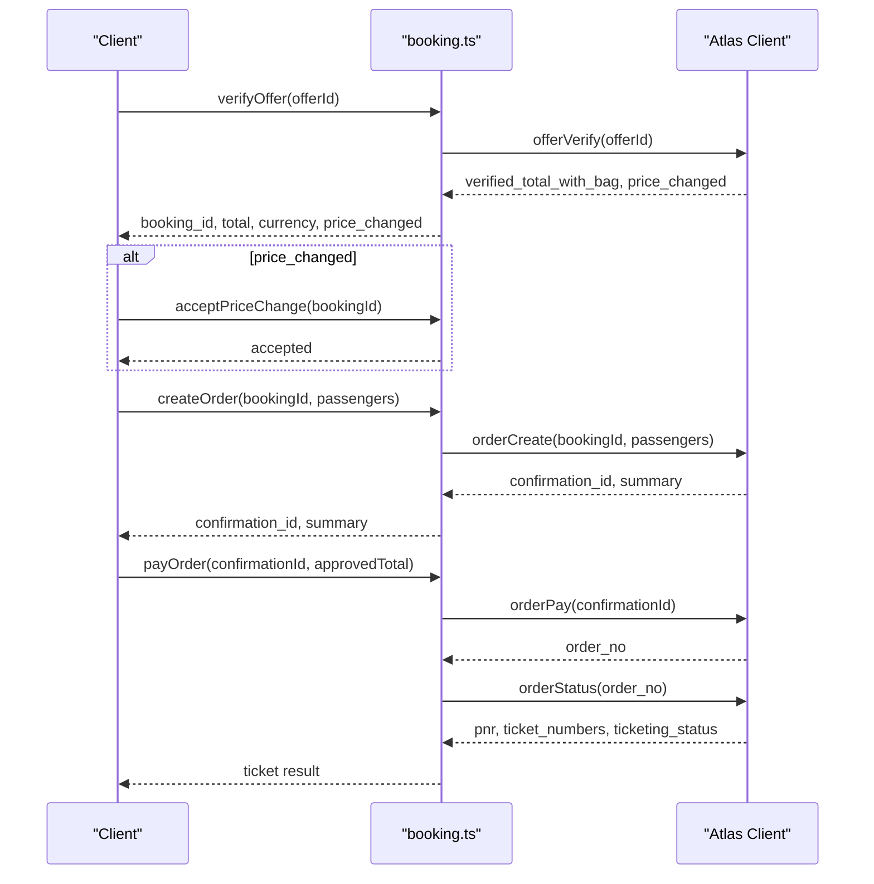
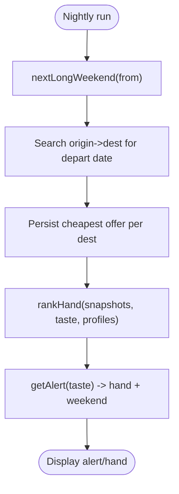
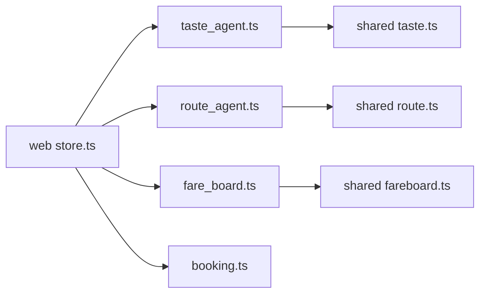

# Core Features

<cite>
**Referenced Files in This Document**
- [taste_agent.ts](file://apps/api/src/agents/taste_agent.ts)
- [route_agent.ts](file://apps/api/src/agents/route_agent.ts)
- [fare_board.ts](file://apps/api/src/agents/fare_board.ts)
- [booking.ts](file://apps/api/src/booking.ts)
- [taste.ts](file://packages/shared/src/taste.ts)
- [route.ts](file://packages/shared/src/route.ts)
- [fareboard.ts](file://packages/shared/src/fareboard.ts)
- [types.ts](file://packages/shared/src/types.ts)
- [MapCanvas.tsx](file://apps/web/src/components/map/MapCanvas.tsx)
- [BookingFlow.tsx](file://apps/web/src/components/booking/BookingFlow.tsx)
- [TasteDeck.tsx](file://apps/web/src/components/onboarding/TasteDeck.tsx)
- [DealHand.tsx](file://apps/web/src/components/deck/DealHand.tsx)
- [store.ts](file://apps/web/src/store.ts)
- [README.md](file://README.md)
</cite>

## Table of Contents
1. [Introduction](#introduction)
2. [Project Structure](#project-structure)
3. [Core Components](#core-components)
4. [Architecture Overview](#architecture-overview)
5. [Detailed Component Analysis](#detailed-component-analysis)
6. [Dependency Analysis](#dependency-analysis)
7. [Performance Considerations](#performance-considerations)
8. [Troubleshooting Guide](#troubleshooting-guide)
9. [Conclusion](#conclusion)

## Introduction
This document explains the Trip Graph Agent’s core features: a vibe-based preference learning system that builds personalized taste vectors from swipe interactions; a graph-based trip planning engine that treats flights as “node zero” and replans downstream legs when flight changes occur; an interactive MapLibre GL JS visualization for real-time route display and replanning animations; a deterministic booking workflow with offer verification, price change acceptance, and payment processing with human checkpoints; and a fare monitoring system that watches deals and triggers replanning opportunities. Practical examples show how these pieces work together to deliver a cohesive trip planning experience.

## Project Structure
The project is organized into a React web app and a Node API server, plus a shared TypeScript package containing core algorithms and types. Key areas:
- Web UI: map rendering, onboarding decks, deal hand, booking flow, and global state management.
- API: agents for taste, routing/trip building, fare board, and booking orchestration.
- Shared: taste vector math, route builder, fare ranking, and type definitions.

**Diagram sources**
- [store.ts:61-282](file://apps/web/src/store.ts#L61-L282)
- [taste_agent.ts:1-118](file://apps/api/src/agents/taste_agent.ts#L1-L118)
- [route_agent.ts:1-191](file://apps/api/src/agents/route_agent.ts#L1-L191)
- [fare_board.ts:1-118](file://apps/api/src/agents/fare_board.ts#L1-L118)
- [booking.ts:1-104](file://apps/api/src/booking.ts#L1-L104)
- [taste.ts:1-68](file://packages/shared/src/taste.ts#L1-L68)
- [route.ts:1-475](file://packages/shared/src/route.ts#L1-L475)
- [fareboard.ts:1-197](file://packages/shared/src/fareboard.ts#L1-L197)
- [types.ts:1-170](file://packages/shared/src/types.ts#L1-L170)
- [MapCanvas.tsx:1-125](file://apps/web/src/components/map/MapCanvas.tsx#L1-L125)
- [BookingFlow.tsx:1-179](file://apps/web/src/components/booking/BookingFlow.tsx#L1-L179)
- [DealHand.tsx:1-169](file://apps/web/src/components/deck/DealHand.tsx#L1-L169)
- [TasteDeck.tsx:1-22](file://apps/web/src/components/onboarding/TasteDeck.tsx#L1-L22)

**Section sources**
- [README.md:1-89](file://README.md#L1-L89)

## Core Components
- TasteAgent: collects user preferences via a 15-card swipe deck, updates a taste vector, and tracks must-go places per destination.
- RouteAgent: builds day routes and multi-day trip graphs anchored by outbound/inbound flights (“node zero”), and replays downstream days when flights change.
- FareBoardAgent: runs nightly snapshots over candidate destinations, ranks them by taste affinity and fare moment, and serves a “deal hand” to users.
- Booking module: implements a fixed, deterministic booking checkpoint sequence with human approvals at critical steps.
- MapCanvas: renders the trip thread and stops on a MapLibre GL JS map, animating replanning transitions.

**Section sources**
- [taste_agent.ts:14-118](file://apps/api/src/agents/taste_agent.ts#L14-L118)
- [route_agent.ts:19-191](file://apps/api/src/agents/route_agent.ts#L19-L191)
- [fare_board.ts:15-118](file://apps/api/src/agents/fare_board.ts#L15-L118)
- [booking.ts:3-104](file://apps/api/src/booking.ts#L3-L104)
- [MapCanvas.tsx:18-125](file://apps/web/src/components/map/MapCanvas.tsx#L18-L125)

## Architecture Overview
The system composes three agents around a single trip graph model. The taste agent shapes personalization; the route agent constructs and reflows the graph; the fare board supplies timely opportunities; the booking module finalizes purchases safely.

**Diagram sources**
- [taste_agent.ts:28-110](file://apps/api/src/agents/taste_agent.ts#L28-L110)
- [fare_board.ts:97-118](file://apps/api/src/agents/fare_board.ts#L97-L118)
- [route_agent.ts:107-185](file://apps/api/src/agents/route_agent.ts#L107-L185)
- [booking.ts:31-98](file://apps/api/src/booking.ts#L31-L98)
- [store.ts:109-249](file://apps/web/src/store.ts#L109-L249)
- [MapCanvas.tsx:47-121](file://apps/web/src/components/map/MapCanvas.tsx#L47-L121)

## Detailed Component Analysis

### Vibe-Based Preference Learning (Taste Agent)
- Initializes a taste vector from selected vibe tags and maintains per-destination must-go lists.
- Generates a diverse 15-card deck per city using place vibe tags and round-robin selection.
- Applies swipe actions to update the vector deterministically and supports undo.
- Produces a summary including top tags, strength, and must-go lists used later in planning.

**Diagram sources**
- [taste_agent.ts:28-110](file://apps/api/src/agents/taste_agent.ts#L28-L110)
- [taste.ts:16-68](file://packages/shared/src/taste.ts#L16-L68)

**Section sources**
- [taste_agent.ts:14-118](file://apps/api/src/agents/taste_agent.ts#L14-L118)
- [taste.ts:1-68](file://packages/shared/src/taste.ts#L1-L68)
- [TasteDeck.tsx:5-22](file://apps/web/src/components/onboarding/TasteDeck.tsx#L5-L22)

### Graph-Based Trip Planning Engine (Route Agent)
- Builds day routes constrained by opening hours, travel times, meal windows, and user taste.
- Treats flights as “node zero”: outbound arrival and return departure define daily time windows and late-arrival night mode.
- Creates a full multi-day TripGraph with budgets and narration.
- Reflows downstream days when flights change, preserving unaffected days and recalculating affected ones.

**Diagram sources**
- [route.ts:163-267](file://packages/shared/src/route.ts#L163-L267)
- [route.ts:269-475](file://packages/shared/src/route.ts#L269-L475)
- [route_agent.ts:62-185](file://apps/api/src/agents/route_agent.ts#L62-L185)
- [types.ts:86-146](file://packages/shared/src/types.ts#L86-L146)

**Section sources**
- [route_agent.ts:19-191](file://apps/api/src/agents/route_agent.ts#L19-L191)
- [route.ts:163-475](file://packages/shared/src/route.ts#L163-L475)

### Interactive Visualization (MapLibre GL JS)
- Renders a desaturated basemap with a prominent “thread” line connecting stops.
- Places numbered pins per stop; sealed wildcards hide identity until revealed.
- Animates fit-to-bounds and redraws the thread on replanning to reflect new itineraries.

**Diagram sources**
- [MapCanvas.tsx:18-125](file://apps/web/src/components/map/MapCanvas.tsx#L18-L125)
- [route_agent.ts:170-185](file://apps/api/src/agents/route_agent.ts#L170-L185)

**Section sources**
- [MapCanvas.tsx:1-125](file://apps/web/src/components/map/MapCanvas.tsx#L1-L125)

### Booking Workflow (Human Checkpoints)
- Verify offer: confirms availability and total with bag; flags price changes.
- Accept price change: explicit consent required before proceeding.
- Create order: requires passenger details once; never stored or logged.
- Pay order: enforces exact approved total; returns PNR and ticketing status.

**Diagram sources**
- [booking.ts:31-98](file://apps/api/src/booking.ts#L31-L98)
- [BookingFlow.tsx:50-179](file://apps/web/src/components/booking/BookingFlow.tsx#L50-L179)

**Section sources**
- [booking.ts:1-104](file://apps/api/src/booking.ts#L1-L104)
- [BookingFlow.tsx:1-179](file://apps/web/src/components/booking/BookingFlow.tsx#L1-L179)

### Fare Monitoring System (Deals and Alerts)
- Nightly batch queries candidate destinations for the next long weekend, persists snapshots, and backs off on retries.
- Per-user alert ranks stored snapshots against the user’s taste vector, blending tag affinity, unexpectedness, and fare moment signals.
- Surfaces a “hand” of top deals plus one sealed wildcard to encourage exploration.

**Diagram sources**
- [fare_board.ts:30-82](file://apps/api/src/agents/fare_board.ts#L30-L82)
- [fare_board.ts:97-118](file://apps/api/src/agents/fare_board.ts#L97-L118)
- [fareboard.ts:111-179](file://packages/shared/src/fareboard.ts#L111-L179)

**Section sources**
- [fare_board.ts:1-118](file://apps/api/src/agents/fare_board.ts#L1-L118)
- [fareboard.ts:1-197](file://packages/shared/src/fareboard.ts#L1-L197)
- [DealHand.tsx:6-169](file://apps/web/src/components/deck/DealHand.tsx#L6-L169)

### Practical Examples
- Personalize tastes: pick at least five vibe tags to seed your profile; swipe through 15 cards per destination to refine your taste vector and mark must-go places.
- Plan a day: enter a natural-language request (e.g., “Day trip in Singapore CBD, must eat chicken rice, then somewhere quiet”) to generate alternatives grounded in opening hours and travel times.
- Explore deals: after finishing the deck, an unprompted alert shows a hand of ranked trips for the upcoming long weekend, including a sealed wildcard.
- Build a trip: expand a deal to create a multi-day trip graph anchored by outbound and return flights; view the route on the map.
- Swap flights: choose another outbound offer; watch day one reflow with a narrated budget delta and updated stops.
- Book safely: verify the offer, accept any price increase, provide one-time passenger details, approve the exact total, and complete payment to receive a test ticket/PNR.

[No sources needed since this section summarizes workflows without analyzing specific files]

## Dependency Analysis
- TasteAgent depends on shared taste utilities for vector math and history tracking.
- RouteAgent depends on shared route builder for day planning, trip construction, and reflow logic.
- FareBoardAgent depends on shared fare ranking and holiday/weekend helpers.
- Web store orchestrates API calls and drives UI state transitions across components.

**Diagram sources**
- [taste_agent.ts:1-118](file://apps/api/src/agents/taste_agent.ts#L1-L118)
- [route_agent.ts:1-191](file://apps/api/src/agents/route_agent.ts#L1-L191)
- [fare_board.ts:1-118](file://apps/api/src/agents/fare_board.ts#L1-L118)
- [store.ts:61-282](file://apps/web/src/store.ts#L61-L282)
- [booking.ts:1-104](file://apps/api/src/booking.ts#L1-L104)
- [taste.ts:1-68](file://packages/shared/src/taste.ts#L1-L68)
- [route.ts:1-475](file://packages/shared/src/route.ts#L1-L475)
- [fareboard.ts:1-197](file://packages/shared/src/fareboard.ts#L1-L197)

**Section sources**
- [store.ts:61-282](file://apps/web/src/store.ts#L61-L282)

## Performance Considerations
- Deterministic algorithms: taste updates, route building, and fare ranking are pure functions with predictable complexity, enabling fast client-side feedback and server-side scalability.
- Minimal external calls: fare ranking uses persisted snapshots; only nightly runs and booking flows call live services.
- Efficient reflow: only affected dates are rebuilt when swapping flights, preserving unchanged days and reducing recomputation.
- Map rendering: GeoJSON source updates and marker redraws are optimized to avoid unnecessary layout thrash; bounds animation provides smooth replanning visuals.

[No sources needed since this section provides general guidance]

## Troubleshooting Guide
- No flights found: ensure a valid destination profile exists and that search windows include both outbound and return dates.
- Empty deal hand: run the nightly fare-board job or allow the first in-memory pass to populate snapshots; ensure at least four destinations are available for ranking.
- Booking errors: verify the offer first; if price changed, explicitly accept the new total before creating an order; ensure passenger details are provided; confirm the exact approved total when paying.
- Map not updating: confirm the map has loaded and that stops/center props are changing; check that the thread source and layers exist before setting data.

**Section sources**
- [fare_board.ts:41-82](file://apps/api/src/agents/fare_board.ts#L41-L82)
- [fare_board.ts:97-118](file://apps/api/src/agents/fare_board.ts#L97-L118)
- [booking.ts:31-98](file://apps/api/src/booking.ts#L31-L98)
- [MapCanvas.tsx:81-121](file://apps/web/src/components/map/MapCanvas.tsx#L81-L121)

## Conclusion
The Trip Graph Agent unifies personalization, planning, monitoring, and booking into a single coherent experience. Swiping builds a taste vector that guides both local day plans and long-weekend trip graphs. Flights anchor the graph as node zero, enabling precise replanning when conditions change. The fare board proactively surfaces deals aligned with your tastes, while the booking workflow ensures safe, transparent settlement with human checkpoints. Together, these features deliver a responsive, trustworthy, and delightful trip planning tool.

[No sources needed since this section summarizes without analyzing specific files]