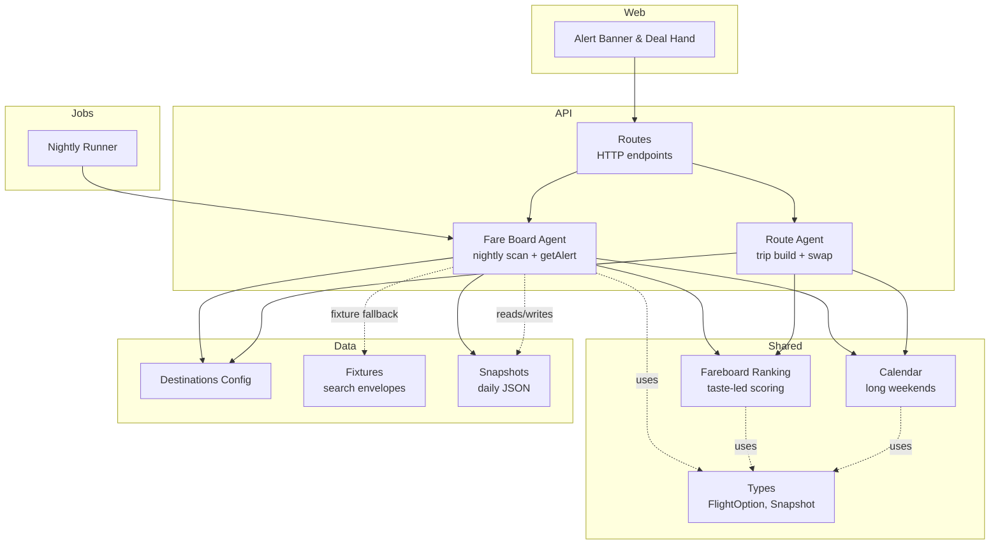
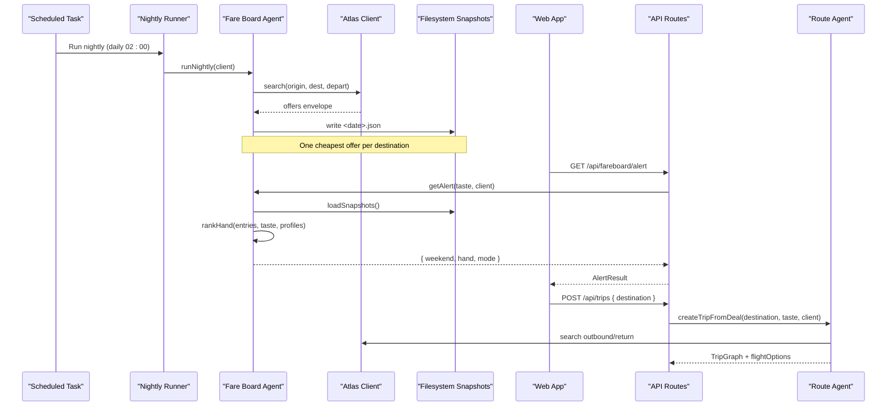
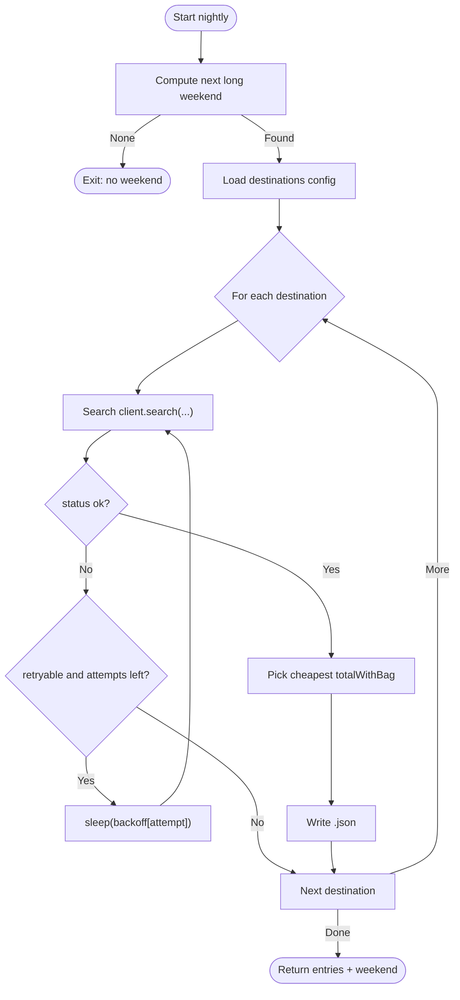
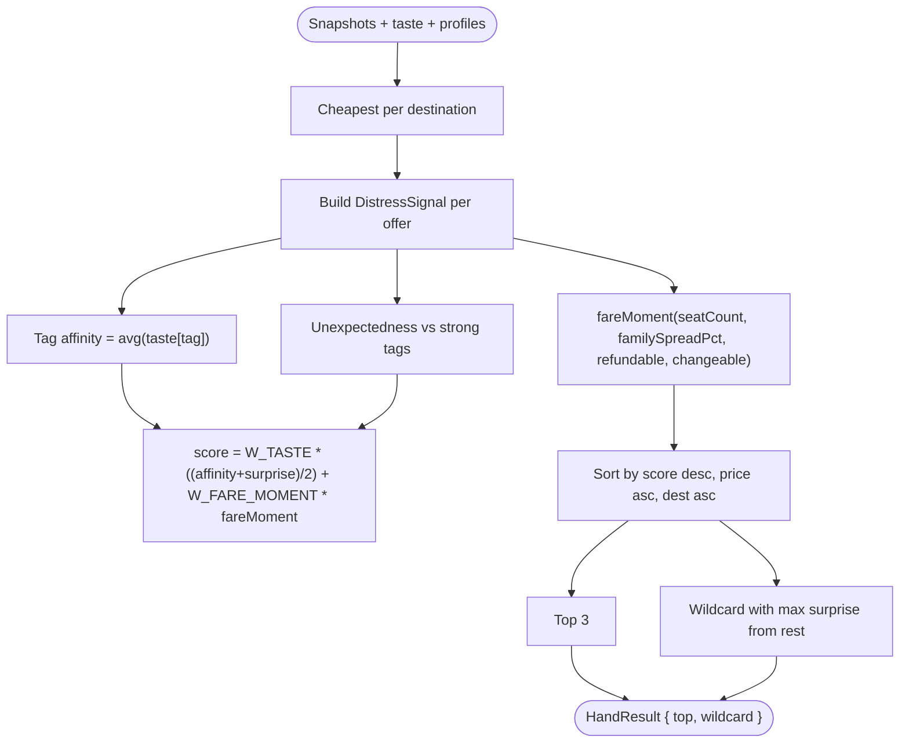
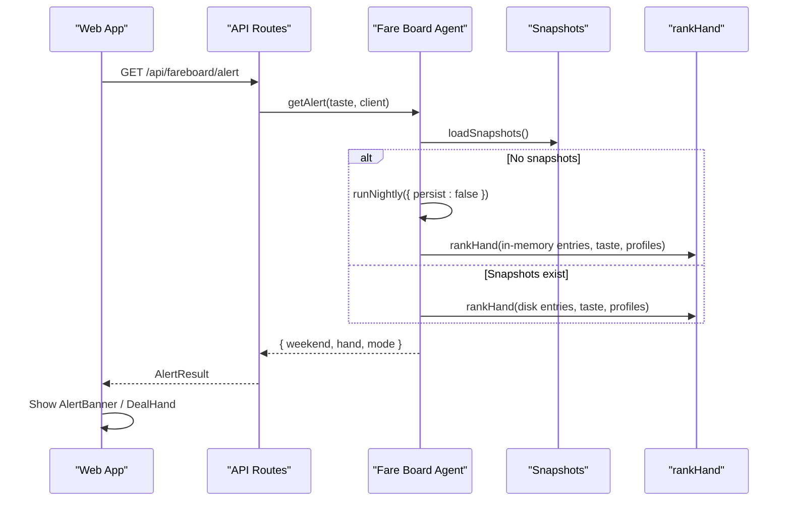
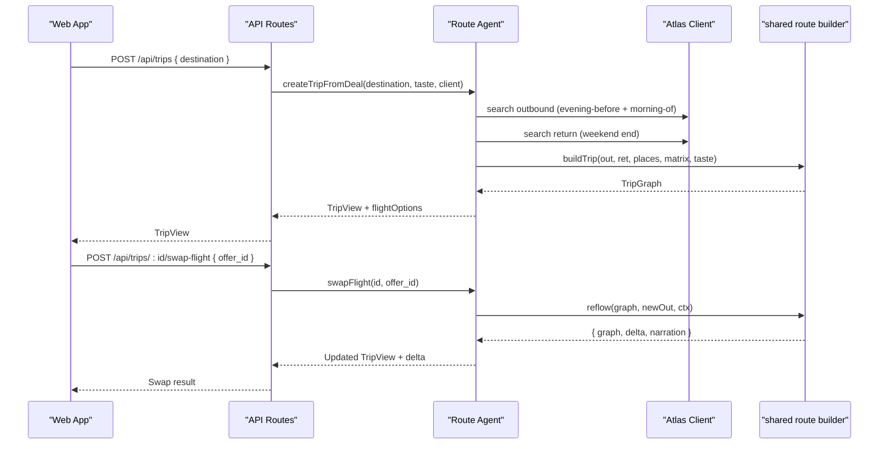
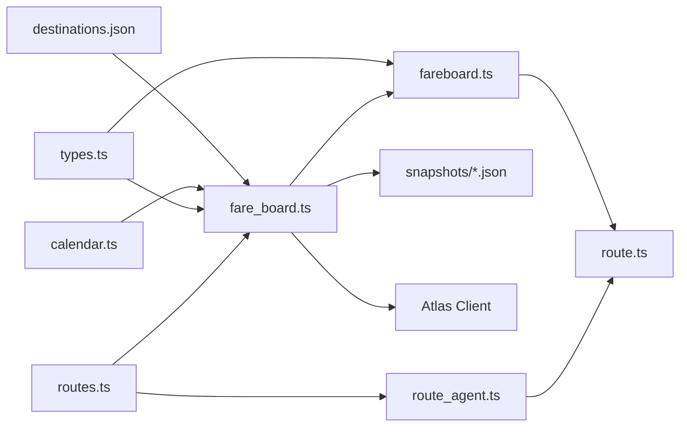

# Fare Monitoring System

<cite>
**Referenced Files in This Document**
- [fare_board.ts](file://apps/api/src/agents/fare_board.ts)
- [run_fareboard.ts](file://apps/api/src/jobs/run_fareboard.ts)
- [fareboard.ts](file://packages/shared/src/fareboard.ts)
- [types.ts](file://packages/shared/src/types.ts)
- [calendar.ts](file://packages/shared/src/calendar.ts)
- [data.ts](file://apps/api/src/data.ts)
- [routes.ts](file://apps/api/src/routes.ts)
- [destinations.json](file://data/places/destinations.json)
- [searches.json](file://data/fares/fixtures/searches.json)
- [fare-board-nightly.md](file://infra/scheduled-tasks/fare-board-nightly.md)
- [api.ts](file://apps/web/src/api.ts)
- [DealHand.tsx](file://apps/web/src/components/deck/DealHand.tsx)
- [route_agent.ts](file://apps/api/src/agents/route_agent.ts)
</cite>

## Table of Contents
1. [Introduction](#introduction)
2. [Project Structure](#project-structure)
3. [Core Components](#core-components)
4. [Architecture Overview](#architecture-overview)
5. [Detailed Component Analysis](#detailed-component-analysis)
6. [Dependency Analysis](#dependency-analysis)
7. [Performance Considerations](#performance-considerations)
8. [Troubleshooting Guide](#troubleshooting-guide)
9. [Conclusion](#conclusion)
10. [Appendices](#appendices)

## Introduction
This document explains the fare monitoring system that watches for flight deals and triggers replanning opportunities. It covers:
- The fare board architecture that continuously monitors prices across multiple dates and destinations
- Deal detection algorithms that identify significant price drops and alternative routing opportunities
- The scheduled nightly job that scans fares and persists snapshots
- Alert generation, notification delivery, and integration with the trip planning engine for automatic replanning suggestions
- Performance considerations, rate limiting strategies, and data retention policies
- Examples of configuring monitoring rules and customizing alert thresholds

The system is designed around a fixed candidate set of destinations from a single origin, scanning the next long weekend window each night, ranking offers by taste affinity and fare moment, and surfacing a “hand” of top deals plus a sealed wildcard to the user interface. When a user expands a deal, the system builds a full trip graph and supports swapping flights to reflow day plans with narrated deltas.

## Project Structure
The fare monitoring system spans API agents, shared logic, scheduled jobs, fixtures, and UI surfaces:
- API agent for nightly scanning and per-user alerts
- Shared library for ranking, calendar math, and types
- Scheduled task definition for nightly execution
- Fixture data for offline/demo runs
- Web components for alert banners and deal hand display
- Trip planning integration for expanding deals into full itineraries

**Diagram sources**
- [fare_board.ts:15-82](file://apps/api/src/agents/fare_board.ts#L15-L82)
- [fareboard.ts:102-179](file://packages/shared/src/fareboard.ts#L102-L179)
- [calendar.ts:22-55](file://packages/shared/src/calendar.ts#L22-L55)
- [routes.ts:58-85](file://apps/api/src/routes.ts#L58-L85)
- [run_fareboard.ts:1-15](file://apps/api/src/jobs/run_fareboard.ts#L1-L15)
- [destinations.json:1-98](file://data/places/destinations.json#L1-L98)
- [searches.json:1-800](file://data/fares/fixtures/searches.json#L1-L800)
- [api.ts:65-81](file://apps/web/src/api.ts#L65-L81)
- [DealHand.tsx:6-34](file://apps/web/src/components/deck/DealHand.tsx#L6-L34)

**Section sources**
- [fare_board.ts:15-82](file://apps/api/src/agents/fare_board.ts#L15-L82)
- [routes.ts:58-85](file://apps/api/src/routes.ts#L58-L85)
- [run_fareboard.ts:1-15](file://apps/api/src/jobs/run_fareboard.ts#L1-L15)
- [fareboard.ts:102-179](file://packages/shared/src/fareboard.ts#L102-L179)
- [calendar.ts:22-55](file://packages/shared/src/calendar.ts#L22-L55)
- [destinations.json:1-98](file://data/places/destinations.json#L1-L98)
- [searches.json:1-800](file://data/fares/fixtures/searches.json#L1-L800)
- [api.ts:65-81](file://apps/web/src/api.ts#L65-L81)
- [DealHand.tsx:6-34](file://apps/web/src/components/deck/DealHand.tsx#L6-L34)

## Core Components
- Nightly scanner: queries the flight search client for the next long weekend’s departure date across all candidate destinations, backs off on retryable errors, and persists one cheapest offer per destination as a daily snapshot file.
- Alert generator: loads historical snapshots, ranks them against the user’s taste vector, and returns a hand of top deals plus a sealed wildcard.
- Trip planner integration: when a user selects a deal, the planner fetches outbound and return options, builds a multi-day itinerary, and supports flight swaps with delta narration.
- Scheduling: a documented Qoder scheduled task executes the nightly scan at a fixed time and commits the new snapshot.

Key responsibilities and boundaries:
- Per-user alert path is pure ranking over stored snapshots; no live search calls are made during alert generation.
- Trip creation may call the search client to populate flight options for the selected destination and window.
- All date math is UTC-based to avoid timezone drift.

**Section sources**
- [fare_board.ts:15-118](file://apps/api/src/agents/fare_board.ts#L15-L118)
- [fareboard.ts:102-179](file://packages/shared/src/fareboard.ts#L102-L179)
- [route_agent.ts:107-185](file://apps/api/src/agents/route_agent.ts#L107-L185)
- [run_fareboard.ts:1-15](file://apps/api/src/jobs/run_fareboard.ts#L1-L15)
- [calendar.ts:22-55](file://packages/shared/src/calendar.ts#L22-L55)

## Architecture Overview
The system separates concerns between batch scanning, ranking, scheduling, and trip planning:

**Diagram sources**
- [run_fareboard.ts:1-15](file://apps/api/src/jobs/run_fareboard.ts#L1-L15)
- [fare_board.ts:41-82](file://apps/api/src/agents/fare_board.ts#L41-L82)
- [routes.ts:58-85](file://apps/api/src/routes.ts#L58-L85)
- [route_agent.ts:107-153](file://apps/api/src/agents/route_agent.ts#L107-L153)

## Detailed Component Analysis

### Nightly Scanner and Snapshot Persistence
- Determines the next long weekend using holiday data and computes the evening-before departure date.
- Iterates over the configured destinations, calling the search client with backoff on retryable responses.
- Persists one cheapest offer per destination as a dated JSON file under the snapshots directory.
- Provides an in-memory fallback for demo runs when no snapshots exist yet.

**Diagram sources**
- [fare_board.ts:30-82](file://apps/api/src/agents/fare_board.ts#L30-L82)
- [calendar.ts:22-55](file://packages/shared/src/calendar.ts#L22-L55)

**Section sources**
- [fare_board.ts:30-82](file://apps/api/src/agents/fare_board.ts#L30-L82)
- [run_fareboard.ts:1-15](file://apps/api/src/jobs/run_fareboard.ts#L1-L15)
- [data.ts:31-37](file://apps/api/src/data.ts#L31-L37)
- [destinations.json:1-98](file://data/places/destinations.json#L1-L98)

### Deal Detection and Ranking Algorithm
- Builds a per-destination cheapest snapshot map.
- Computes three signals:
  - Taste affinity: average of taste vector values over destination tags
  - Unexpectedness: novelty relative to strong tag affinities
  - Fare moment: distress signal derived from seat scarcity, family spread, and policy restrictiveness
- Blends taste-led score with fare moment using fixed weights and sorts by score, then price, then destination code.
- Selects top 3 as the hand and picks a wildcard from remaining candidates that maximizes unexpectedness among destinations with full trip data.

**Diagram sources**
- [fareboard.ts:50-179](file://packages/shared/src/fareboard.ts#L50-L179)

**Section sources**
- [fareboard.ts:50-179](file://packages/shared/src/fareboard.ts#L50-L179)
- [types.ts:86-110](file://packages/shared/src/types.ts#L86-L110)

### Alert Generation and Delivery
- The per-user alert endpoint requires a seeded taste vector.
- Loads snapshots from disk; if none exist, performs an in-memory nightly pass without persisting to ensure demo behavior.
- Returns a weekend object, a ranked hand, and the current client mode.
- The web app displays an alert banner when there is an unprompted hand and opens a deal hand view.

**Diagram sources**
- [routes.ts:58-62](file://apps/api/src/routes.ts#L58-L62)
- [fare_board.ts:97-118](file://apps/api/src/agents/fare_board.ts#L97-L118)
- [fareboard.ts:102-179](file://packages/shared/src/fareboard.ts#L102-L179)
- [api.ts:65-81](file://apps/web/src/api.ts#L65-L81)
- [DealHand.tsx:6-34](file://apps/web/src/components/deck/DealHand.tsx#L6-L34)

**Section sources**
- [routes.ts:58-62](file://apps/api/src/routes.ts#L58-L62)
- [fare_board.ts:97-118](file://apps/api/src/agents/fare_board.ts#L97-L118)
- [api.ts:65-81](file://apps/web/src/api.ts#L65-L81)
- [DealHand.tsx:6-34](file://apps/web/src/components/deck/DealHand.tsx#L6-L34)

### Trip Planning Integration and Replanning
- Expanding a deal creates a trip by fetching outbound and return flight options for the long weekend window and building a multi-day plan grounded in place data and travel matrices.
- Swapping flights triggers a reflow that rebuilds affected days, updates budgets, and produces a delta summary and narration describing changes.

**Diagram sources**
- [route_agent.ts:107-185](file://apps/api/src/agents/route_agent.ts#L107-L185)
- [route_agent.ts:269-474](file://packages/shared/src/route.ts#L269-L474)

**Section sources**
- [route_agent.ts:107-185](file://apps/api/src/agents/route_agent.ts#L107-L185)
- [route_agent.ts:269-474](file://packages/shared/src/route.ts#L269-L474)

### Scheduled Job System
- The nightly job initializes the Atlas client and invokes the nightly runner, logging results including the number of snapshots and the target weekend.
- The scheduled task configuration documents the schedule, constraints, and expected artifacts.

**Section sources**
- [run_fareboard.ts:1-15](file://apps/api/src/jobs/run_fareboard.ts#L1-L15)
- [fare-board-nightly.md:1-35](file://infra/scheduled-tasks/fare-board-nightly.md#L1-L35)

## Dependency Analysis
- The fare board depends on:
  - Calendar utilities to compute long weekends
  - Destination configuration to define the candidate set
  - Snapshot storage for persistence and retrieval
  - Atlas client for live or fixture search
- The ranking module depends on shared types and taste vectors to compute scores.
- The route agent depends on shared trip-building and reflow logic, plus destination and matrix data.

**Diagram sources**
- [fare_board.ts:15-82](file://apps/api/src/agents/fare_board.ts#L15-L82)
- [fareboard.ts:102-179](file://packages/shared/src/fareboard.ts#L102-L179)
- [route_agent.ts:107-185](file://apps/api/src/agents/route_agent.ts#L107-L185)
- [routes.ts:58-85](file://apps/api/src/routes.ts#L58-L85)
- [destinations.json:1-98](file://data/places/destinations.json#L1-L98)
- [calendar.ts:22-55](file://packages/shared/src/calendar.ts#L22-L55)
- [types.ts:86-110](file://packages/shared/src/types.ts#L86-L110)

**Section sources**
- [fare_board.ts:15-82](file://apps/api/src/agents/fare_board.ts#L15-L82)
- [fareboard.ts:102-179](file://packages/shared/src/fareboard.ts#L102-L179)
- [route_agent.ts:107-185](file://apps/api/src/agents/route_agent.ts#L107-L185)
- [routes.ts:58-85](file://apps/api/src/routes.ts#L58-L85)

## Performance Considerations
- Batch scanning:
  - Scans a fixed candidate set (one origin, eight destinations) per long weekend window, minimizing external API calls.
  - Uses exponential backoff on retryable responses to handle rate limits gracefully.
- Ranking:
  - Operates on in-memory structures; complexity is linear in the number of snapshots and destinations.
  - Deterministic sorting ensures stable outputs for identical inputs.
- Trip building and reflow:
  - Rebuilds only affected days when swapping flights, reducing recomputation.
  - Ground cost and budget recalculation are bounded by the number of planned stops.
- External API usage:
  - Nightly scan calls the search client once per destination per run.
  - Trip creation may call search twice (outbound windows) plus one return search per deal expansion.
- Data volume:
  - Each run writes one JSON file containing up to eight entries; growth is linear with days retained.

[No sources needed since this section provides general guidance]

## Troubleshooting Guide
- No upcoming long weekend:
  - If the holiday file does not yield a valid window, the nightly runner exits early with zero entries.
- Rate-limit or transient errors:
  - The scanner retries with backoff; consult the scheduled task instructions to note any retryable codes rather than re-running manually.
- Missing snapshots:
  - The alert path falls back to an in-memory nightly pass so the UI still shows a hand during demos.
- Unknown destination or missing city data:
  - Trip creation validates that the destination has a full city file; otherwise it returns an error.
- Evidence and mode:
  - Use the evidence endpoint to inspect the current mode and environment, which helps distinguish fixture vs live runs.

**Section sources**
- [fare_board.ts:41-82](file://apps/api/src/agents/fare_board.ts#L41-L82)
- [fare-board-nightly.md:15-30](file://infra/scheduled-tasks/fare-board-nightly.md#L15-L30)
- [route_agent.ts:107-153](file://apps/api/src/agents/route_agent.ts#L107-L153)
- [routes.ts:117-133](file://apps/api/src/routes.ts#L117-L133)

## Conclusion
The fare monitoring system combines a disciplined nightly scan, a taste-led ranking algorithm, and tight integration with the trip planning engine to turn price signals into actionable replanning opportunities. Its design keeps per-user interactions fast and deterministic by ranking stored snapshots, while allowing trip creation to fetch fresh flight options when needed. Rate limiting is handled via backoff, and the scheduled task makes the pipeline auditable and reproducible.

[No sources needed since this section summarizes without analyzing specific files]

## Appendices

### Configuration Examples

- Candidate set and tags:
  - Edit the destinations configuration to adjust the origin, destinations, and vibe tags used for taste affinity.
  - Ensure each destination includes a corresponding city file and matrix to enable trip expansion.

- Holiday calendar:
  - Update the holiday file to reflect observed holidays and ensure long weekend windows are computed correctly.

- Snapshot retention:
  - Retain daily snapshot files under the snapshots directory. Historical pricing information grows linearly with days kept.
  - Observed-fare badges require at least seven distinct nights of real (non-fixture) snapshots.

- Alert thresholds and weights:
  - Adjust taste-to-fare-moment blending by modifying the weight constants in the ranking module.
  - Tune distress signal parameters such as seat scarcity window and family spread reference to influence how restrictive or scarce fares are promoted.

- Scheduled task:
  - Configure the nightly task to run at the desired time and ensure the environment can execute the job and commit snapshots.

**Section sources**
- [destinations.json:1-98](file://data/places/destinations.json#L1-L98)
- [fare-board-nightly.md:1-35](file://infra/scheduled-tasks/fare-board-nightly.md#L1-L35)
- [fareboard.ts:5-13](file://packages/shared/src/fareboard.ts#L5-L13)
- [fareboard.ts:181-196](file://packages/shared/src/fareboard.ts#L181-L196)