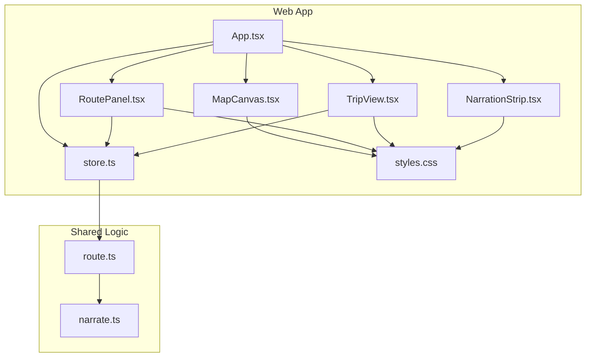
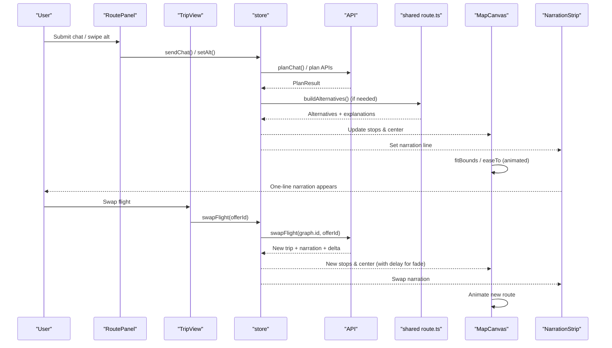
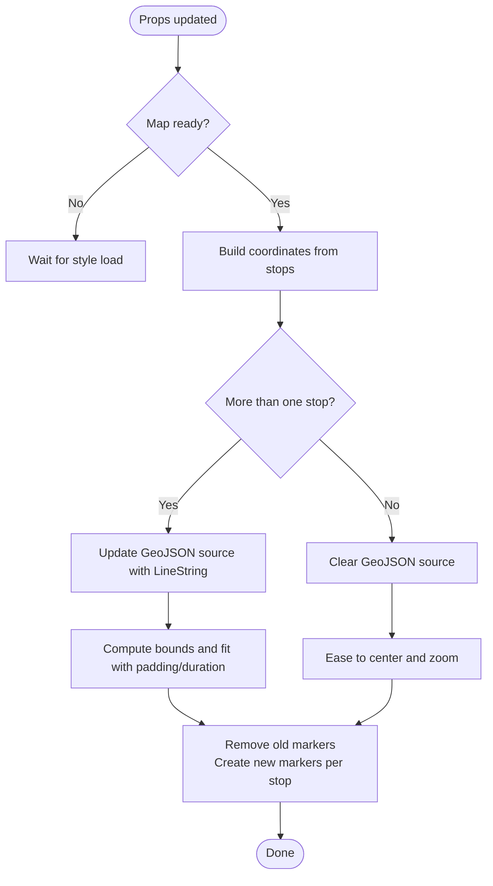
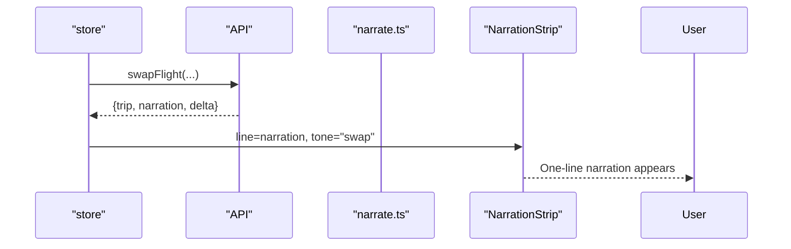
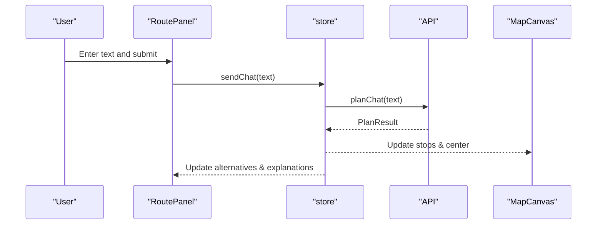
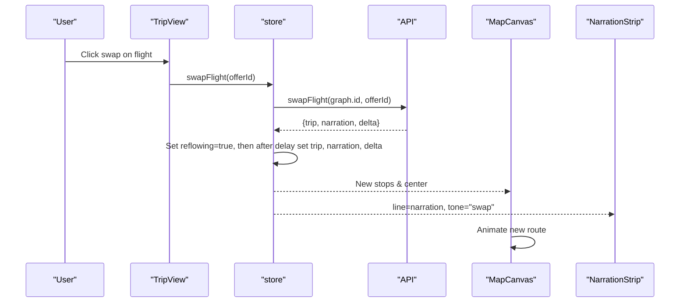
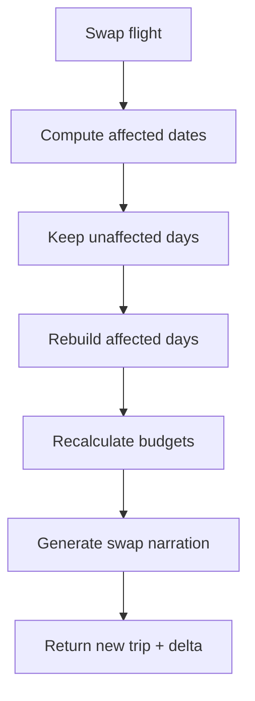
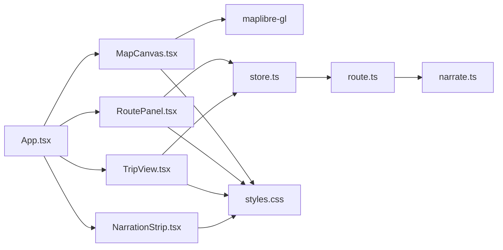

# Interactive Visualization

<cite>
**Referenced Files in This Document**
- [MapCanvas.tsx](file://apps/web/src/components/map/MapCanvas.tsx)
- [NarrationStrip.tsx](file://apps/web/src/components/narration/NarrationStrip.tsx)
- [App.tsx](file://apps/web/src/App.tsx)
- [store.ts](file://apps/web/src/store.ts)
- [RoutePanel.tsx](file://apps/web/src/components/plan/RoutePanel.tsx)
- [TripView.tsx](file://apps/web/src/components/trip/TripView.tsx)
- [route.ts](file://packages/shared/src/route.ts)
- [narrate.ts](file://packages/shared/src/narrate.ts)
- [styles.css](file://apps/web/src/styles.css)
- [package.json](file://apps/web/package.json)
</cite>

## Table of Contents
1. Introduction
2. Project Structure
3. Core Components
4. Architecture Overview
5. Detailed Component Analysis
6. Dependency Analysis
7. Performance Considerations
8. Troubleshooting Guide
9. Conclusion
10. Appendices

## Introduction
This document explains the interactive visualization system that renders real-time trip routes and replanning animations on a MapLibre GL JS canvas. It covers how stops, connections, and dynamic replanning visuals are drawn; how the narration system communicates plan changes; how animations transition between configurations; and how marker rendering, polylines, zoom behavior, and responsive design work together. It also includes performance guidance for large stop lists and real-time updates, plus examples for customizing map styles, adding overlays, and integrating with external mapping services.

## Project Structure
The visualization spans React components, a shared route planner, and CSS-driven UI:
- Map rendering and markers live in the map component.
- Route and trip panels drive data flow and user interactions.
- The store coordinates state transitions and triggers replanning flows.
- Shared logic builds trips, alternatives, and narrations.
- Styles define the visual theme, animations, and responsive layout.

**Diagram sources**
- [App.tsx:15-90](file://apps/web/src/App.tsx#L15-L90)
- [MapCanvas.tsx:34-124](file://apps/web/src/components/map/MapCanvas.tsx#L34-L124)
- [RoutePanel.tsx:6-58](file://apps/web/src/components/plan/RoutePanel.tsx#L6-L58)
- [TripView.tsx:7-77](file://apps/web/src/components/trip/TripView.tsx#L7-L77)
- [NarrationStrip.tsx:1-16](file://apps/web/src/components/narration/NarrationStrip.tsx#L1-L16)
- [store.ts:61-282](file://apps/web/src/store.ts#L61-L282)
- [route.ts:163-475](file://packages/shared/src/route.ts#L163-L475)
- [narrate.ts:32-79](file://packages/shared/src/narrate.ts#L32-L79)
- [styles.css:206-324](file://apps/web/src/styles.css#L206-L324)

**Section sources**
- [App.tsx:15-90](file://apps/web/src/App.tsx#L15-L90)
- [MapCanvas.tsx:34-124](file://apps/web/src/components/map/MapCanvas.tsx#L34-L124)
- [RoutePanel.tsx:6-58](file://apps/web/src/components/plan/RoutePanel.tsx#L6-L58)
- [TripView.tsx:7-77](file://apps/web/src/components/trip/TripView.tsx#L7-L77)
- [NarrationStrip.tsx:1-16](file://apps/web/src/components/narration/NarrationStrip.tsx#L1-L16)
- [store.ts:61-282](file://apps/web/src/store.ts#L61-L282)
- [route.ts:163-475](file://packages/shared/src/route.ts#L163-L475)
- [narrate.ts:32-79](file://packages/shared/src/narrate.ts#L32-L79)
- [styles.css:206-324](file://apps/web/src/styles.css#L206-L324)

## Core Components
- MapCanvas: Initializes a MapLibre GL JS map, adds a GeoJSON source and two line layers (casing and thread), renders markers per stop, and animates fit-to-bounds or center transitions.
- NarrationStrip: Displays a single-line explanation with a tone indicator for plan vs swap events.
- RoutePanel: Presents chat input, alternative plans, and stop details; drives replanning via store actions.
- TripView: Shows flight options, day tabs, budget bar, and day-specific stops; supports swapping flights to trigger replanning.
- Store: Centralized state for phases, plans, trips, and actions like sending chat, swapping flights, revealing stops, and toggling evidence.
- Shared route builder: Builds daily routes, alternatives, full trips, and reflows when flights change; generates narrations.

**Section sources**
- [MapCanvas.tsx:34-124](file://apps/web/src/components/map/MapCanvas.tsx#L34-L124)
- [NarrationStrip.tsx:1-16](file://apps/web/src/components/narration/NarrationStrip.tsx#L1-L16)
- [RoutePanel.tsx:6-58](file://apps/web/src/components/plan/RoutePanel.tsx#L6-L58)
- [TripView.tsx:7-77](file://apps/web/src/components/trip/TripView.tsx#L7-L77)
- [store.ts:61-282](file://apps/web/src/store.ts#L61-L282)
- [route.ts:163-475](file://packages/shared/src/route.ts#L163-L475)
- [narrate.ts:32-79](file://packages/shared/src/narrate.ts#L32-L79)

## Architecture Overview
The app composes a map-backed visualization with reactive state and shared planning logic. User inputs in RoutePanel or TripView update the store, which calls API endpoints to fetch plans or rebuild trips. The store then updates plan/trip objects, which feed into MapCanvas and NarrationStrip. Replanning is animated through CSS transitions and MapLibre’s built-in easing.

**Diagram sources**
- [RoutePanel.tsx:14-30](file://apps/web/src/components/plan/RoutePanel.tsx#L14-L30)
- [TripView.tsx:39-54](file://apps/web/src/components/trip/TripView.tsx#L39-L54)
- [store.ts:195-250](file://apps/web/src/store.ts#L195-L250)
- [route.ts:249-475](file://packages/shared/src/route.ts#L249-L475)
- [MapCanvas.tsx:47-79](file://apps/web/src/components/map/MapCanvas.tsx#L47-L79)
- [NarrationStrip.tsx:7-15](file://apps/web/src/components/narration/NarrationStrip.tsx#L7-L15)

## Detailed Component Analysis

### MapCanvas: Canvas, Markers, Polylines, Zoom
- Initialization: Creates a MapLibre map with a desaturated OSM raster style, sets initial center/zoom, and attaches attribution control.
- Layers: Adds a GeoJSON source named “thread” and two line layers:
  - casing layer: wide, light-colored stroke for depth
  - thread layer: dashed vermilion stroke representing the route
- Markers: For each stop, creates a DOM element styled as a pin (numbered or sealed), positions it at the stop’s coordinates, and adds it to the map.
- Polyline drawing: Converts stops to coordinate pairs and updates the GeoJSON source with a LineString feature if there are multiple stops; otherwise clears features.
- Zoom and framing: If multiple stops exist, computes bounds and fits them with padding and duration; otherwise eases to the current center and zoom.
- Props sync: Uses refs to keep latest stops and center in sync with map load lifecycle to avoid losing early updates before style loads.

**Diagram sources**
- [MapCanvas.tsx:47-79](file://apps/web/src/components/map/MapCanvas.tsx#L47-L79)
- [MapCanvas.tsx:81-124](file://apps/web/src/components/map/MapCanvas.tsx#L81-L124)

**Section sources**
- [MapCanvas.tsx:18-32](file://apps/web/src/components/map/MapCanvas.tsx#L18-L32)
- [MapCanvas.tsx:47-79](file://apps/web/src/components/map/MapCanvas.tsx#L47-L79)
- [MapCanvas.tsx:81-124](file://apps/web/src/components/map/MapCanvas.tsx#L81-L124)

### Narration System: One-Line Explanations
- Purpose: Provide concise, deterministic explanations of plan changes and reasoning behind modifications.
- Behavior: Renders a single line with a glyph and optional tone (“plan” or “swap”). Tone affects styling to visually distinguish swap events.
- Data source: Pulls narration text from plan or trip graph; swap narration is set during flight swaps.

**Diagram sources**
- [store.ts:231-250](file://apps/web/src/store.ts#L231-L250)
- [narrate.ts:41-79](file://packages/shared/src/narrate.ts#L41-L79)
- [NarrationStrip.tsx:1-16](file://apps/web/src/components/narration/NarrationStrip.tsx#L1-L16)

**Section sources**
- [NarrationStrip.tsx:1-16](file://apps/web/src/components/narration/NarrationStrip.tsx#L1-L16)
- [narrate.ts:32-79](file://packages/shared/src/narrate.ts#L32-L79)
- [store.ts:231-250](file://apps/web/src/store.ts#L231-L250)

### Route Panel: Chat, Alternatives, Stop Details
- Chat input: Submits a natural-language request to generate a plan; loading state disables submission.
- Alternatives: Displays current alternative index and allows cycling through alternatives; each alternative maps to stops shown in both list and map.
- Stop rows: Show time windows, travel hops, costs, and roles (must-go, wildcard); sealed wildcards can be revealed.

**Diagram sources**
- [RoutePanel.tsx:14-30](file://apps/web/src/components/plan/RoutePanel.tsx#L14-L30)
- [store.ts:195-203](file://apps/web/src/store.ts#L195-L203)
- [App.tsx:41-69](file://apps/web/src/App.tsx#L41-L69)

**Section sources**
- [RoutePanel.tsx:6-58](file://apps/web/src/components/plan/RoutePanel.tsx#L6-L58)
- [RoutePanel.tsx:62-107](file://apps/web/src/components/plan/RoutePanel.tsx#L62-L107)
- [App.tsx:41-69](file://apps/web/src/App.tsx#L41-L69)

### Trip View: Flight Strip, Day Timeline, Budget Bar
- Flight strip: Lists available outbound flights; active flight highlighted; swapping triggers reflow.
- Day tabs: Switches among days; displays stops for selected day; empty travel days indicated.
- Budget bar: Visualizes air vs ground cost split; shows delta chip after swaps.
- Replanning animation: When swapping flights, a brief delay fades out previous stops before cascading new ones.

**Diagram sources**
- [TripView.tsx:39-77](file://apps/web/src/components/trip/TripView.tsx#L39-L77)
- [store.ts:231-250](file://apps/web/src/store.ts#L231-L250)
- [MapCanvas.tsx:47-79](file://apps/web/src/components/map/MapCanvas.tsx#L47-L79)
- [NarrationStrip.tsx:7-15](file://apps/web/src/components/narration/NarrationStrip.tsx#L7-L15)

**Section sources**
- [TripView.tsx:7-77](file://apps/web/src/components/trip/TripView.tsx#L7-L77)
- [TripView.tsx:80-134](file://apps/web/src/components/trip/TripView.tsx#L80-L134)
- [store.ts:231-250](file://apps/web/src/store.ts#L231-L250)

### Shared Route Builder: Plans, Alternatives, Reflow
- Daily route building: Selects stops based on taste, must-go constraints, open hours, meal windows, and travel times; optionally inserts a wildcard stop.
- Alternatives: Generates multiple distinct plans by excluding previously chosen non-must stops.
- Trip construction: Assembles multi-day plans around flight windows, adjusts start/end times, and handles late arrivals with night-only food mode.
- Reflow: Recomputes affected days when swapping flights, preserves unaffected days, recalculates budgets, and produces a swap narration.

**Diagram sources**
- [route.ts:410-475](file://packages/shared/src/route.ts#L410-L475)
- [route.ts:249-387](file://packages/shared/src/route.ts#L249-L387)
- [route.ts:163-247](file://packages/shared/src/route.ts#L163-L247)

**Section sources**
- [route.ts:163-247](file://packages/shared/src/route.ts#L163-L247)
- [route.ts:249-387](file://packages/shared/src/route.ts#L249-L387)
- [route.ts:410-475](file://packages/shared/src/route.ts#L410-L475)

### Animation System: Smooth Transitions and Highlights
- Map transitions: Uses MapLibre’s fitBounds and easeTo with durations to smoothly frame routes or return to default view.
- UI animations: CSS keyframes animate narration slip-up, stop reveals, budget bar transitions, and reflow fading for trip stops.
- Delayed cascade: After flight swaps, a short delay ensures outgoing day-one stops fade before new plan cascades in, improving perceived continuity.

**Section sources**
- [MapCanvas.tsx:69-79](file://apps/web/src/components/map/MapCanvas.tsx#L69-L79)
- [TripView.tsx:67-77](file://apps/web/src/components/trip/TripView.tsx#L67-L77)
- [store.ts:231-250](file://apps/web/src/store.ts#L231-L250)
- [styles.css:311-324](file://apps/web/src/styles.css#L311-L324)
- [styles.css:477-504](file://apps/web/src/styles.css#L477-L504)

## Dependency Analysis
- MapCanvas depends on MapLibre GL JS and uses a raster OSM source; it manages its own internal state via refs to ensure correct synchronization with React props and map lifecycle.
- App orchestrates components and derives stops/center from store state; it passes data down to MapCanvas and NarrationStrip.
- RoutePanel and TripView interact with the store to mutate state and trigger API calls; they do not directly call MapLibre.
- Shared route logic is independent of UI and provides deterministic outputs consumed by the store and displayed by UI components.
- Styles provide consistent theming and animations across components.

**Diagram sources**
- [MapCanvas.tsx:1-3](file://apps/web/src/components/map/MapCanvas.tsx#L1-L3)
- [App.tsx:1-11](file://apps/web/src/App.tsx#L1-L11)
- [RoutePanel.tsx:1-3](file://apps/web/src/components/plan/RoutePanel.tsx#L1-L3)
- [TripView.tsx:1-4](file://apps/web/src/components/trip/TripView.tsx#L1-L4)
- [store.ts:1-9](file://apps/web/src/store.ts#L1-L9)
- [route.ts:1-14](file://packages/shared/src/route.ts#L1-L14)
- [narrate.ts:1-1](file://packages/shared/src/narrate.ts#L1-L1)
- [styles.css:206-324](file://apps/web/src/styles.css#L206-L324)

**Section sources**
- [MapCanvas.tsx:1-3](file://apps/web/src/components/map/MapCanvas.tsx#L1-L3)
- [App.tsx:1-11](file://apps/web/src/App.tsx#L1-L11)
- [RoutePanel.tsx:1-3](file://apps/web/src/components/plan/RoutePanel.tsx#L1-L3)
- [TripView.tsx:1-4](file://apps/web/src/components/trip/TripView.tsx#L1-L4)
- [store.ts:1-9](file://apps/web/src/store.ts#L1-L9)
- [route.ts:1-14](file://packages/shared/src/route.ts#L1-L14)
- [narrate.ts:1-1](file://packages/shared/src/narrate.ts#L1-L1)
- [styles.css:206-324](file://apps/web/src/styles.css#L206-L324)

## Performance Considerations
- Marker management: Remove all existing markers before recreating to avoid duplicates; batch creation per stop improves performance.
- GeoJSON updates: Update a single source and layer rather than creating/removing layers repeatedly; this minimizes redraw overhead.
- Bounds computation: Compute bounds only when multiple stops exist; otherwise use simple center/zoom transitions.
- Styling efficiency: Use a single desaturated basemap with minimal layers to reduce tile processing and paint operations.
- Large stop lists: Consider virtualization or pagination in side panels; limit visible stops per day to reduce DOM nodes.
- Real-time updates: Debounce rapid prop changes if necessary; rely on refs to prevent redundant re-renders during map load.
- Network requests: Coalesce API calls where possible; cache results in store to avoid repeated queries.
- Animations: Keep durations moderate; avoid excessive concurrent CSS animations to maintain smoothness on low-end devices.

[No sources needed since this section provides general guidance]

## Troubleshooting Guide
- Map does not render stops: Ensure the map has loaded before syncing; check that the “thread” source exists and that coordinates are valid.
- Stops not updating: Verify that stops array serialization triggers effect; confirm refs hold latest values and that markers are removed before recreation.
- Narration not appearing: Confirm store sets narration line and tone; ensure NarrationStrip receives non-null line.
- Replanning flicker: Use the provided delay pattern to fade out old stops before showing new ones; verify reflowing flag usage.
- Style load race conditions: The component stores latest props in refs so early updates are not lost before the style finishes loading.

**Section sources**
- [MapCanvas.tsx:34-45](file://apps/web/src/components/map/MapCanvas.tsx#L34-L45)
- [MapCanvas.tsx:47-79](file://apps/web/src/components/map/MapCanvas.tsx#L47-L79)
- [store.ts:231-250](file://apps/web/src/store.ts#L231-L250)
- [NarrationStrip.tsx:7-15](file://apps/web/src/components/narration/NarrationStrip.tsx#L7-L15)

## Conclusion
The visualization system combines a lightweight MapLibre GL JS canvas with a reactive React architecture and deterministic shared planning logic. It renders trip stops and connections, provides one-line narrations explaining changes, and animates transitions to highlight affected areas during replanning. With careful marker and source management, efficient bounds handling, and CSS-driven animations, it delivers a responsive experience suitable for real-time updates and large datasets. Customization points include map styles, overlay layers, and integration hooks via the store and API.

[No sources needed since this section summarizes without analyzing specific files]

## Appendices

### Customizing Map Styles
- Basemap: Replace the OSM raster tiles with another provider by editing the style definition.
- Layers: Add additional GeoJSON sources and layers for overlays such as heatmaps, polygons, or icons.
- Colors and opacity: Adjust paint properties for lines and markers to match brand guidelines.

**Section sources**
- [MapCanvas.tsx:18-32](file://apps/web/src/components/map/MapCanvas.tsx#L18-L32)
- [MapCanvas.tsx:90-108](file://apps/web/src/components/map/MapCanvas.tsx#L90-L108)

### Adding Overlays
- Create a new GeoJSON source and add corresponding layers for shapes or clusters.
- Bind data updates to store changes to reflect real-time overlays.
- Use MapLibre’s event system to handle interactions like click-throughs.

**Section sources**
- [MapCanvas.tsx:90-108](file://apps/web/src/components/map/MapCanvas.tsx#L90-L108)

### Integrating with External Mapping Services
- Tile providers: Swap raster tiles for vector tiles or other services by updating the style configuration.
- Authentication: Inject API keys or headers as required by the service.
- Feature parity: Ensure the target service supports required features (GeoJSON sources, line layers).

**Section sources**
- [MapCanvas.tsx:18-32](file://apps/web/src/components/map/MapCanvas.tsx#L18-L32)

### Responsive Design Patterns
- Layout: Side panels adapt width and positioning on smaller screens; narration and alerts adjust margins and font sizes.
- Touch-friendly controls: Buttons and chips sized for touch interaction; focus states clearly indicated.
- Accessibility: Labels and aria attributes present for screen readers.

**Section sources**
- [styles.css:591-598](file://apps/web/src/styles.css#L591-L598)
- [styles.css:206-324](file://apps/web/src/styles.css#L206-L324)

### Dependencies and Versions
- MapLibre GL JS version pinned for stability.
- React and Zustand used for UI and state management.
- Vite as the build toolchain.

**Section sources**
- [package.json:11-16](file://apps/web/package.json#L11-L16)