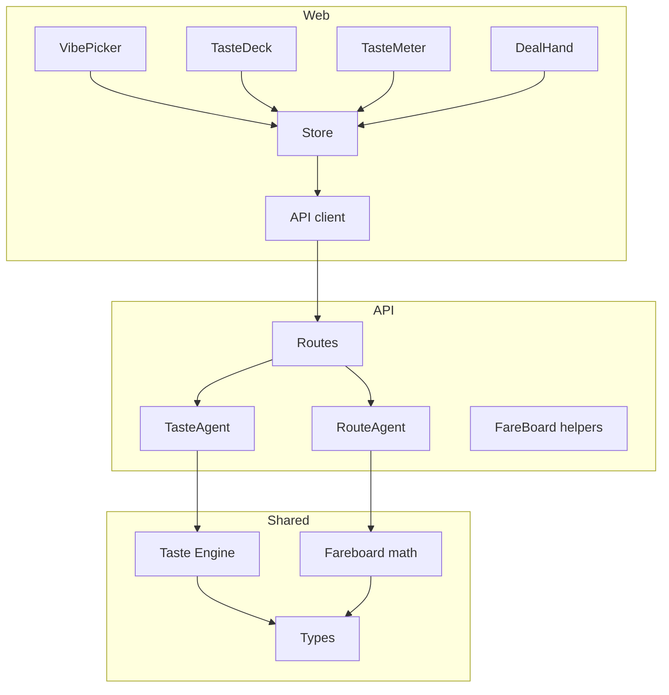
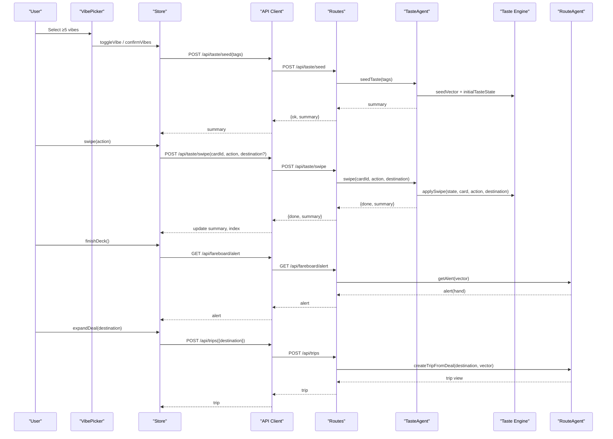
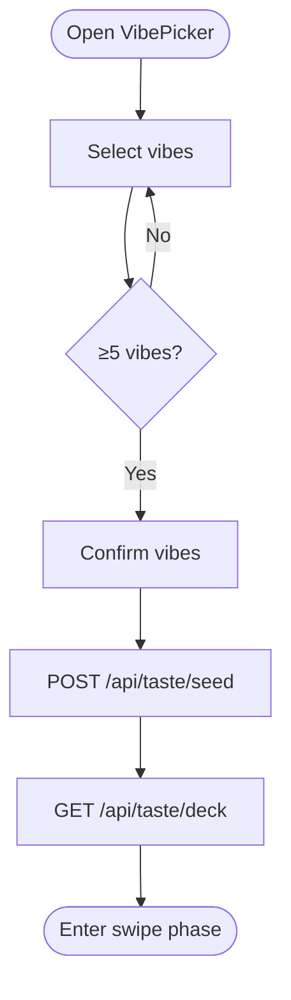
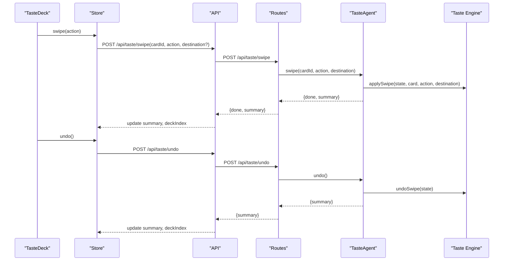
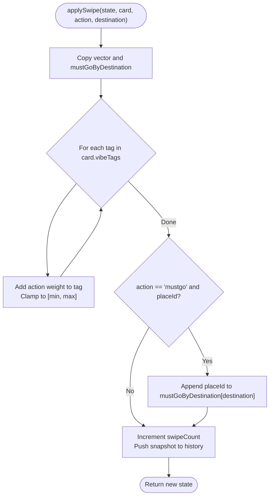
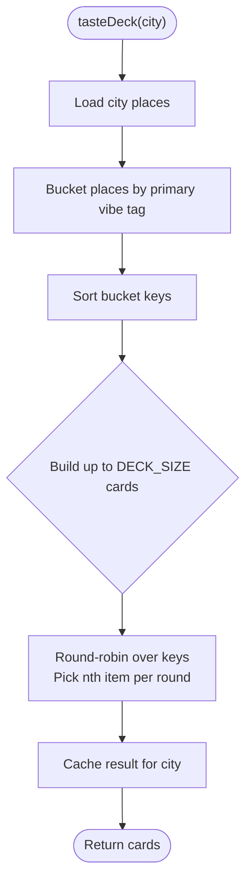
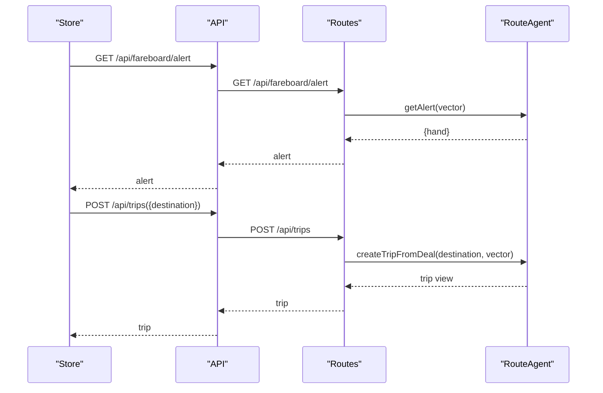
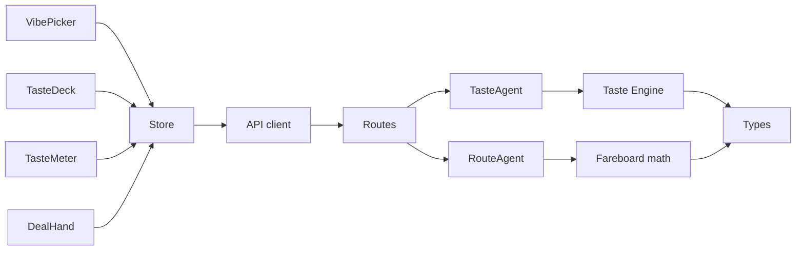

# Preference Learning System

<cite>
**Referenced Files in This Document**
- [taste.ts](file://packages/shared/src/taste.ts)
- [types.ts](file://packages/shared/src/types.ts)
- [VibePicker.tsx](file://apps/web/src/components/onboarding/VibePicker.tsx)
- [TasteDeck.tsx](file://apps/web/src/components/onboarding/TasteDeck.tsx)
- [TasteMeter.tsx](file://apps/web/src/components/onboarding/TasteMeter.tsx)
- [DealHand.tsx](file://apps/web/src/components/deck/DealHand.tsx)
- [store.ts](file://apps/web/src/store.ts)
- [api.ts](file://apps/web/src/api.ts)
- [routes.ts](file://apps/api/src/routes.ts)
- [taste_agent.ts](file://apps/api/src/agents/taste_agent.ts)
- [route_agent.ts](file://apps/api/src/agents/route_agent.ts)
- [fareboard.ts](file://packages/shared/src/fareboard.ts)
</cite>

## Table of Contents
1. [Introduction](#introduction)
2. [Project Structure](#project-structure)
3. [Core Components](#core-components)
4. [Architecture Overview](#architecture-overview)
5. [Detailed Component Analysis](#detailed-component-analysis)
6. [Dependency Analysis](#dependency-analysis)
7. [Performance Considerations](#performance-considerations)
8. [Troubleshooting Guide](#troubleshooting-guide)
9. [Conclusion](#conclusion)

## Introduction
This document explains the preference learning system that captures user tastes through a vibe-based onboarding flow and swipe interactions, then converts those interactions into a numerical taste vector used to generate diverse place recommendations and drive trip planning. It covers:
- Vibe selection and seed vector initialization
- Swipe application logic and undo
- Deck generation for diverse place exposure
- Taste scoring and integration with the trip planning engine
- State management, persistence patterns, and practical examples

## Project Structure
The system spans three layers:
- Web UI: onboarding screens (vibes, swipe deck), progress meter, deal hand, and store-driven state
- API server: routes exposing taste endpoints, fare board alerts, and trip creation
- Shared engine: pure functions for taste vectors, scoring, and route building

**Diagram sources**
- [VibePicker.tsx:1-55](file://apps/web/src/components/onboarding/VibePicker.tsx#L1-L55)
- [TasteDeck.tsx:1-22](file://apps/web/src/components/onboarding/TasteDeck.tsx#L1-L22)
- [TasteMeter.tsx:1-32](file://apps/web/src/components/onboarding/TasteMeter.tsx#L1-L32)
- [DealHand.tsx:1-169](file://apps/web/src/components/deck/DealHand.tsx#L1-L169)
- [store.ts:1-282](file://apps/web/src/store.ts#L1-L282)
- [api.ts:1-198](file://apps/web/src/api.ts#L1-L198)
- [routes.ts:1-135](file://apps/api/src/routes.ts#L1-L135)
- [taste_agent.ts:1-118](file://apps/api/src/agents/taste_agent.ts#L1-L118)
- [route_agent.ts:1-111](file://apps/api/src/agents/route_agent.ts#L1-L111)
- [types.ts:1-170](file://packages/shared/src/types.ts#L1-L170)
- [taste.ts:1-68](file://packages/shared/src/taste.ts#L1-L68)
- [fareboard.ts:47-92](file://packages/shared/src/fareboard.ts#L47-L92)

**Section sources**
- [VibePicker.tsx:1-55](file://apps/web/src/components/onboarding/VibePicker.tsx#L1-L55)
- [TasteDeck.tsx:1-22](file://apps/web/src/components/onboarding/TasteDeck.tsx#L1-L22)
- [store.ts:1-282](file://apps/web/src/store.ts#L1-L282)
- [routes.ts:1-135](file://apps/api/src/routes.ts#L1-L135)
- [taste_agent.ts:1-118](file://apps/api/src/agents/taste_agent.ts#L1-L118)
- [taste.ts:1-68](file://packages/shared/src/taste.ts#L1-L68)
- [types.ts:1-170](file://packages/shared/src/types.ts#L1-L170)

## Core Components
- Vibe Picker: collects at least five initial vibes to seed the taste thread
- Taste Deck: 15-card swipe session per destination with like/pass/must-go and undo
- Taste Meter: visualizes strength and top tags as preferences accumulate
- Taste Agent: maintains in-memory taste state, applies swipes, generates decks, computes summaries
- Route Integration: uses the current taste vector to plan trips and rank deals

Key behaviors:
- Seed vector initializes positive weights for chosen vibes
- Each swipe adjusts tag weights within bounded range
- Must-go actions record explicit places per destination
- Undo restores previous vector and must-go lists
- Summary exposes top tags, strength, and must-go list

**Section sources**
- [VibePicker.tsx:20-55](file://apps/web/src/components/onboarding/VibePicker.tsx#L20-L55)
- [TasteDeck.tsx:5-22](file://apps/web/src/components/onboarding/TasteDeck.tsx#L5-L22)
- [TasteMeter.tsx:1-32](file://apps/web/src/components/onboarding/TasteMeter.tsx#L1-L32)
- [taste_agent.ts:14-118](file://apps/api/src/agents/taste_agent.ts#L14-L118)
- [taste.ts:16-68](file://packages/shared/src/taste.ts#L16-L68)
- [types.ts:68-84](file://packages/shared/src/types.ts#L68-L84)

## Architecture Overview
End-to-end flow from vibe selection to trip planning:

**Diagram sources**
- [VibePicker.tsx:20-55](file://apps/web/src/components/onboarding/VibePicker.tsx#L20-L55)
- [store.ts:100-141](file://apps/web/src/store.ts#L100-L141)
- [api.ts:119-144](file://apps/web/src/api.ts#L119-L144)
- [routes.ts:25-70](file://apps/api/src/routes.ts#L25-L70)
- [taste_agent.ts:28-84](file://apps/api/src/agents/taste_agent.ts#L28-L84)
- [taste.ts:20-50](file://packages/shared/src/taste.ts#L20-L50)
- [route_agent.ts:107-111](file://apps/api/src/agents/route_agent.ts#L107-L111)

## Detailed Component Analysis

### Vibe-Based Onboarding
- Users select at least five vibes; this seeds the taste thread
- The UI enforces a minimum count before proceeding
- On confirmation, the web client seeds the server-side taste state and loads the first deck

**Diagram sources**
- [VibePicker.tsx:20-55](file://apps/web/src/components/onboarding/VibePicker.tsx#L20-L55)
- [store.ts:100-107](file://apps/web/src/store.ts#L100-L107)
- [routes.ts:25-29](file://apps/api/src/routes.ts#L25-L29)
- [taste_agent.ts:28-33](file://apps/api/src/agents/taste_agent.ts#L28-L33)

**Section sources**
- [VibePicker.tsx:20-55](file://apps/web/src/components/onboarding/VibePicker.tsx#L20-L55)
- [store.ts:100-107](file://apps/web/src/store.ts#L100-L107)
- [routes.ts:25-29](file://apps/api/src/routes.ts#L25-L29)
- [taste_agent.ts:28-33](file://apps/api/src/agents/taste_agent.ts#L28-L33)

### Swipe Deck and Progress
- A 15-card deck is presented per destination
- Actions: like, pass, must-go
- Undo reverses the last swipe and updates progress
- A visible meter shows strength and top tags

**Diagram sources**
- [TasteDeck.tsx:5-22](file://apps/web/src/components/onboarding/TasteDeck.tsx#L5-L22)
- [store.ts:109-127](file://apps/web/src/store.ts#L109-L127)
- [api.ts:122-139](file://apps/web/src/api.ts#L122-L139)
- [routes.ts:31-44](file://apps/api/src/routes.ts#L31-L44)
- [taste_agent.ts:69-92](file://apps/api/src/agents/taste_agent.ts#L69-L92)
- [taste.ts:30-61](file://packages/shared/src/taste.ts#L30-L61)

**Section sources**
- [TasteDeck.tsx:5-22](file://apps/web/src/components/onboarding/TasteDeck.tsx#L5-L22)
- [store.ts:109-127](file://apps/web/src/store.ts#L109-L127)
- [routes.ts:31-44](file://apps/api/src/routes.ts#L31-L44)
- [taste_agent.ts:69-92](file://apps/api/src/agents/taste_agent.ts#L69-L92)
- [taste.ts:30-61](file://packages/shared/src/taste.ts#L30-L61)

### Taste Vector Algorithm
- Seed vector: each selected vibe receives a positive weight
- Swipe application:
  - like increases tag weights by a fixed amount
  - pass decreases tag weights
  - mustgo increases tag weights more strongly and records the place id under the destination key
- Weights are clamped to a bounded range
- Undo restores the exact previous vector and must-go lists
- Place scoring sums tag weights and normalizes by tag count

**Diagram sources**
- [taste.ts:30-50](file://packages/shared/src/taste.ts#L30-L50)

**Section sources**
- [taste.ts:11-14](file://packages/shared/src/taste.ts#L11-L14)
- [taste.ts:20-24](file://packages/shared/src/taste.ts#L20-L24)
- [taste.ts:30-50](file://packages/shared/src/taste.ts#L30-L50)
- [taste.ts:52-61](file://packages/shared/src/taste.ts#L52-L61)
- [taste.ts:63-67](file://packages/shared/src/taste.ts#L63-L67)

### Deck Generation System
- Places are grouped by their primary vibe tag
- A deterministic round-robin across buckets produces a diverse 15-card deck
- Decks are cached per destination to ensure consistency during a session
- Destination-scoped decks allow pre-trip swiping for any city

**Diagram sources**
- [taste_agent.ts:35-67](file://apps/api/src/agents/taste_agent.ts#L35-L67)

**Section sources**
- [taste_agent.ts:35-67](file://apps/api/src/agents/taste_agent.ts#L35-L67)
- [routes.ts:14-23](file://apps/api/src/routes.ts#L14-L23)

### Trip Planning Integration
- After finishing the deck, an alert surfaces ranked deals based on the current taste vector
- Expanding a deal creates a trip using the taste vector and must-go list
- The route builder consumes the taste vector to assemble day plans and alternatives

**Diagram sources**
- [store.ts:129-141](file://apps/web/src/store.ts#L129-L141)
- [store.ts:218-225](file://apps/web/src/store.ts#L218-L225)
- [routes.ts:58-70](file://apps/api/src/routes.ts#L58-L70)
- [route_agent.ts:107-111](file://apps/api/src/agents/route_agent.ts#L107-L111)

**Section sources**
- [routes.ts:58-70](file://apps/api/src/routes.ts#L58-L70)
- [route_agent.ts:107-111](file://apps/api/src/agents/route_agent.ts#L107-L111)
- [store.ts:129-141](file://apps/web/src/store.ts#L129-L141)
- [store.ts:218-225](file://apps/web/src/store.ts#L218-L225)

### Practical Examples
- Seeding: selecting food, coffee, nature, culture, chill sets positive weights for those tags
- Swiping: liking a place tagged nature and views raises both tags; passing nightlife lowers it; marking must-go boosts views and records the place under the active destination
- Undo: reversing a must-go removes the recorded place and restores prior vector values exactly
- Scoring: a place with many matching high-weight tags scores higher than one with fewer or lower-weight matches

These behaviors are validated by tests covering seeding, swipe effects, undo correctness, destination-scoped must-go, and deterministic scoring.

**Section sources**
- [taste.test.ts:34-76](file://packages/shared/test/taste.test.ts#L34-L76)
- [taste.test.ts:78-112](file://packages/shared/test/taste.test.ts#L78-L112)
- [taste.test.ts:114-129](file://packages/shared/test/taste.test.ts#L114-L129)

## Dependency Analysis
- Web components depend on the store for state and actions
- Store calls the API client which proxies to server routes
- Routes delegate to agents for business logic
- Agents use shared taste engine for pure computations
- Fareboard and route builders consume the taste vector for ranking and planning

**Diagram sources**
- [store.ts:1-282](file://apps/web/src/store.ts#L1-L282)
- [api.ts:119-198](file://apps/web/src/api.ts#L119-L198)
- [routes.ts:1-135](file://apps/api/src/routes.ts#L1-L135)
- [taste_agent.ts:1-118](file://apps/api/src/agents/taste_agent.ts#L1-L118)
- [route_agent.ts:1-111](file://apps/api/src/agents/route_agent.ts#L1-L111)
- [taste.ts:1-68](file://packages/shared/src/taste.ts#L1-L68)
- [fareboard.ts:47-92](file://packages/shared/src/fareboard.ts#L47-L92)
- [types.ts:1-170](file://packages/shared/src/types.ts#L1-L170)

**Section sources**
- [store.ts:1-282](file://apps/web/src/store.ts#L1-L282)
- [api.ts:119-198](file://apps/web/src/api.ts#L119-L198)
- [routes.ts:1-135](file://apps/api/src/routes.ts#L1-L135)
- [taste_agent.ts:1-118](file://apps/api/src/agents/taste_agent.ts#L1-L118)
- [route_agent.ts:1-111](file://apps/api/src/agents/route_agent.ts#L1-L111)
- [taste.ts:1-68](file://packages/shared/src/taste.ts#L1-L68)
- [fareboard.ts:47-92](file://packages/shared/src/fareboard.ts#L47-L92)
- [types.ts:1-170](file://packages/shared/src/types.ts#L1-L170)

## Performance Considerations
- Deck caching: per-destination decks are cached to avoid recomputation during a session
- Bounded weights: clamping prevents runaway growth and keeps scoring stable
- Deterministic deck generation: round-robin ensures consistent diversity without randomness overhead
- Minimal state mutations: snapshots in history enable efficient undo without deep copies beyond necessary fields

[No sources needed since this section provides general guidance]

## Troubleshooting Guide
Common issues and resolutions:
- Not seeded: endpoints require a prior seed; ensure at least five vibes are selected and confirmed
- Unknown card: verify the cardId belongs to the current deck for the active destination
- Undo at start: no-op when deckIndex is zero; guard against negative indices
- API offline: store sets an error message if the backend is unreachable; start the dev server

Operational notes:
- Error responses propagate from API to store and display user-facing messages
- Evidence endpoint can be used to inspect call logs for debugging

**Section sources**
- [routes.ts:25-44](file://apps/api/src/routes.ts#L25-L44)
- [store.ts:86-93](file://apps/web/src/store.ts#L86-L93)
- [store.ts:109-127](file://apps/web/src/store.ts#L109-L127)
- [api.ts:109-117](file://apps/web/src/api.ts#L109-L117)

## Conclusion
The preference learning system combines a simple, intuitive onboarding flow with a robust mathematical model to capture user tastes. Through vibe selection and swipe interactions, it builds a taste vector that drives diverse deck generation and powers trip planning. The design emphasizes determinism, clarity, and extensibility, with clear separation between UI, API, and shared logic. Undo functionality and destination-scoped must-go support flexible exploration, while the fareboard and route integrations translate learned preferences into actionable travel plans.