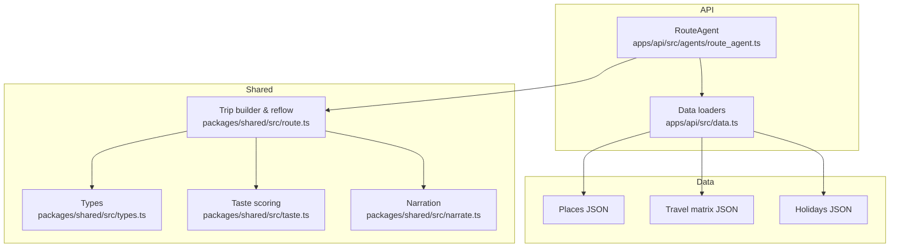
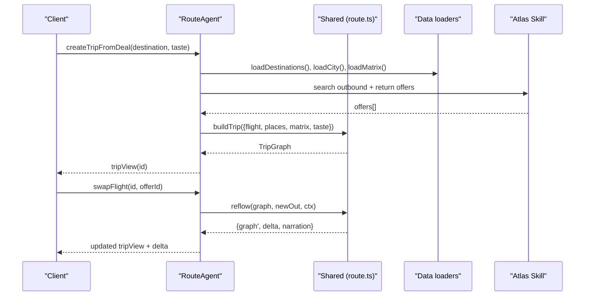
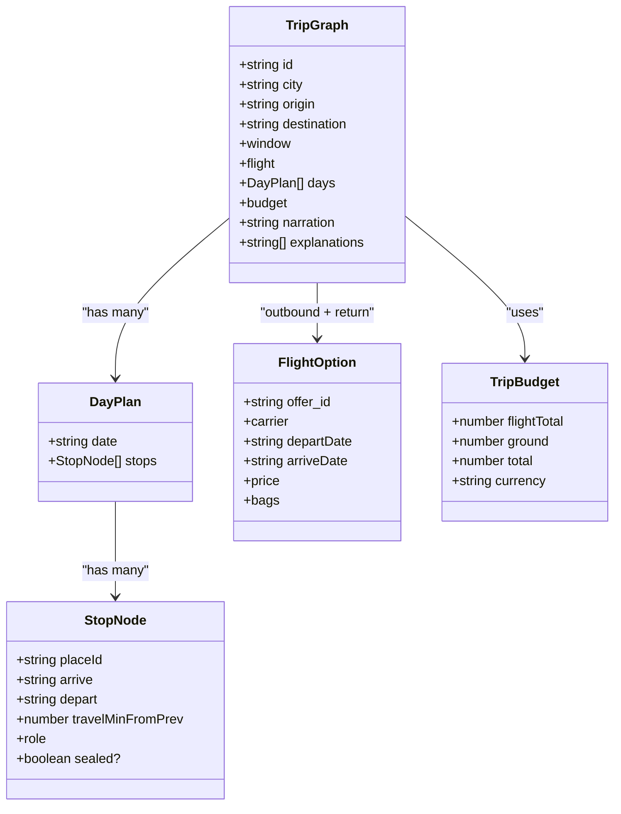
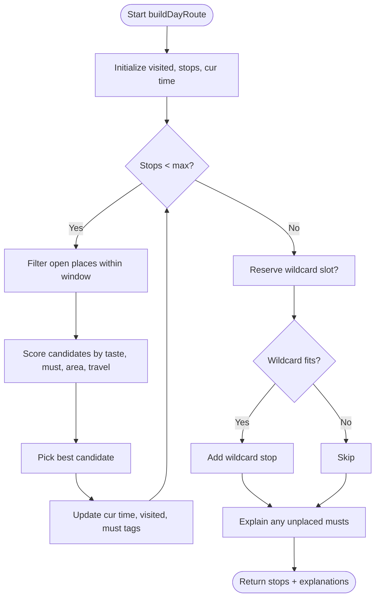
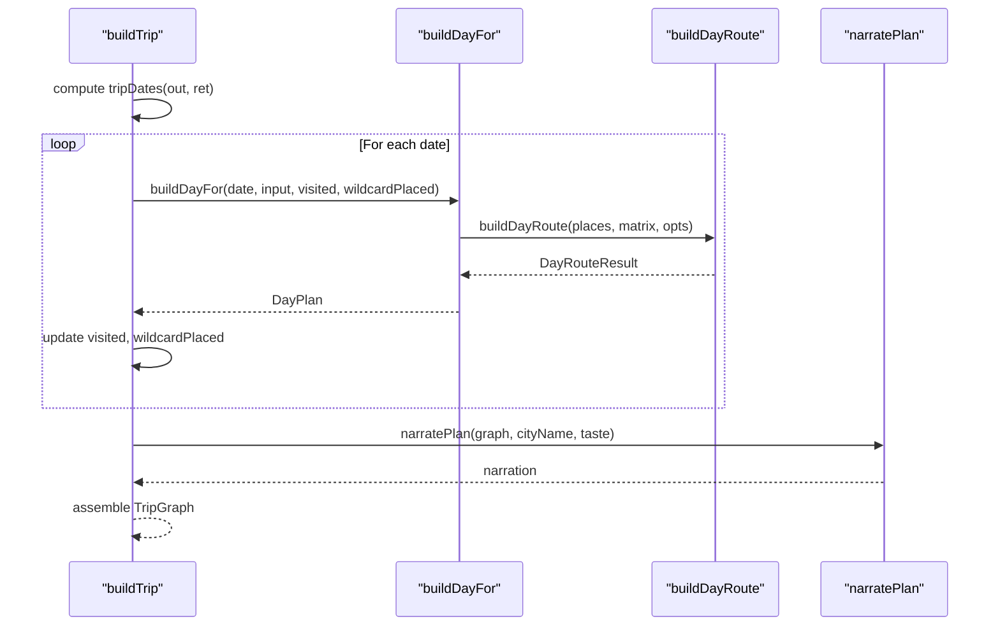
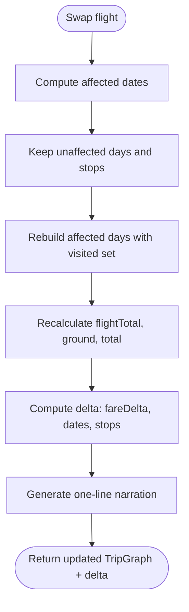
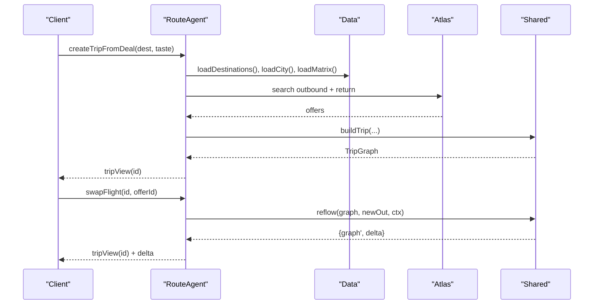
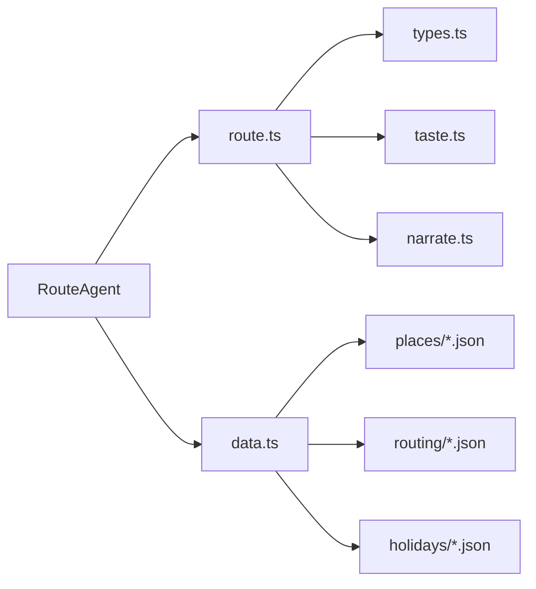

# Trip Planning Engine

<cite>
**Referenced Files in This Document**
- [route_agent.ts](file://apps/api/src/agents/route_agent.ts)
- [route.ts](file://packages/shared/src/route.ts)
- [types.ts](file://packages/shared/src/types.ts)
- [taste.ts](file://packages/shared/src/taste.ts)
- [narrate.ts](file://packages/shared/src/narrate.ts)
- [data.ts](file://apps/api/src/data.ts)
- [architecture.md](file://docs/architecture.md)
- [README.md](file://README.md)
</cite>

## Table of Contents
1. [Introduction](#introduction)
2. [Project Structure](#project-structure)
3. [Core Components](#core-components)
4. [Architecture Overview](#architecture-overview)
5. [Detailed Component Analysis](#detailed-component-analysis)
6. [Dependency Analysis](#dependency-analysis)
7. [Performance Considerations](#performance-considerations)
8. [Troubleshooting Guide](#troubleshooting-guide)
9. [Conclusion](#conclusion)

## Introduction
This document explains the graph-based trip planning engine that treats flights as “node zero” and automatically replans downstream legs when changes occur. The system models a trip as a directed dependency graph where each stop is constrained by opening hours, travel times, budget, and user taste. When a flight changes, only the affected days are rebuilt while preserving unaffected stops, and the shared budget updates with the fare delta. The engine produces deterministic, narrated plans and supports swapping flights to reflow the itinerary.

## Project Structure
The project separates concerns into:
- API layer (agents and data access)
- Shared library (pure functions for routing, taste scoring, narration, and types)
- Static data (places, matrices, holidays)
- Documentation and tests

**Diagram sources**
- [route_agent.ts:107-185](file://apps/api/src/agents/route_agent.ts#L107-L185)
- [route.ts:269-474](file://packages/shared/src/route.ts#L269-L474)
- [types.ts:135-146](file://packages/shared/src/types.ts#L135-L146)
- [taste.ts:63-67](file://packages/shared/src/taste.ts#L63-L67)
- [narrate.ts:32-78](file://packages/shared/src/narrate.ts#L32-L78)
- [data.ts:17-37](file://apps/api/src/data.ts#L17-L37)

**Section sources**
- [README.md:1-11](file://README.md#L1-L11)
- [architecture.md:1-51](file://docs/architecture.md#L1-L51)

## Core Components
- TripGraph: A single directed graph representing a trip. Node zero is the outbound flight; all ground stops are downstream. It includes per-day schedules, a shared budget spanning air and ground, and a one-sentence narration.
- DayPlan and StopNode: Each day contains ordered stops with arrival/departure times, travel time from the previous stop, and role (anchor, food, quiet, wildcard, must).
- FlightOption: Represents an airline offer with timing, price, and baggage details used to compute total cost and schedule constraints.
- TasteVector: A vector over vibe tags that ranks places and influences selection during planning.
- TravelMatrix: Precomputed pairwise travel times between places to constrain feasibility and optimize ordering.

Key responsibilities:
- BuildAlternatives/buildDayRoute: Greedy, constraint-aware daily route construction with must-go guarantees or explanations.
- buildTrip: Constructs a multi-day TripGraph anchored by flights, applying arrival buffers, late-arrival night mode, and airport cutoffs.
- reflow: Detects affected dates due to flight changes and rebuilds only those days while preserving unaffected stops and propagating budget deltas.

**Section sources**
- [types.ts:86-146](file://packages/shared/src/types.ts#L86-L146)
- [route.ts:163-267](file://packages/shared/src/route.ts#L163-L267)
- [route.ts:269-387](file://packages/shared/src/route.ts#L269-L387)
- [route.ts:414-474](file://packages/shared/src/route.ts#L414-L474)

## Architecture Overview
The engine follows a “batch-plus-rank” model: fares are preloaded via a nightly job and ranked against the user’s taste vector. RouteAgent owns the trip graph lifecycle: create from a deal, view enriched stops, and swap flights to trigger reflow.

**Diagram sources**
- [route_agent.ts:107-185](file://apps/api/src/agents/route_agent.ts#L107-L185)
- [route.ts:269-474](file://packages/shared/src/route.ts#L269-L474)
- [data.ts:17-37](file://apps/api/src/data.ts#L17-L37)

**Section sources**
- [architecture.md:1-51](file://docs/architecture.md#L1-L51)
- [route_agent.ts:107-185](file://apps/api/src/agents/route_agent.ts#L107-L185)

## Detailed Component Analysis

### TripGraph Data Model
TripGraph is the central artifact:
- Anchored by outbound and return FlightOptions
- Contains ordered DayPlans across the trip window
- Maintains a unified budget (flightTotal, ground, total)
- Produces a one-sentence narration summarizing plan and swaps

**Diagram sources**
- [types.ts:86-146](file://packages/shared/src/types.ts#L86-L146)

**Section sources**
- [types.ts:86-146](file://packages/shared/src/types.ts#L86-L146)

### Daily Route Planner (buildDayRoute)
The planner builds a feasible sequence of stops under hard constraints:
- Opening hours: ensures arrival leaves at least 30 minutes before closing
- Time windows: start/end bounds per day, with late-arrival night mode limiting to food/nightlife
- Travel times: uses precomputed matrix to estimate inter-stop durations
- Must-go handling: prioritizes mustPlaceIds and mustTags; if not feasible, adds exactly one explanation per dropped must
- Wildcard placement: reserves time for a novel, taste-adjacent stop when possible

Scoring combines taste alignment, meal-time bonuses, mood-tag proximity, area preference, must-go urgency, and travel penalty.

**Diagram sources**
- [route.ts:163-247](file://packages/shared/src/route.ts#L163-L247)

**Section sources**
- [route.ts:163-247](file://packages/shared/src/route.ts#L163-L247)

### Trip Builder (buildTrip): Flight as Node Zero
- Computes trip dates from outbound arrival to return departure
- Adjusts day boundaries based on arrival time and airport cutoff
- Applies late-arrival logic to restrict first day to food/nightlife and slow next morning
- Builds each day sequentially, preventing reuse of places and placing at most one wildcard
- Aggregates budget: flight total (with bags) plus ground costs derived from estimated stay costs
- Generates narration using top taste tags and total budget

**Diagram sources**
- [route.ts:296-387](file://packages/shared/src/route.ts#L296-L387)
- [narrate.ts:32-39](file://packages/shared/src/narrate.ts#L32-L39)

**Section sources**
- [route.ts:296-387](file://packages/shared/src/route.ts#L296-L387)

### Replanning Mechanism (reflow)
When a flight changes:
- Identify affected dates: typically the arrival date, and possibly the next day if late arrival
- Preserve unaffected days and their stops
- Rebuild only affected days, respecting visited set to avoid duplicates and wildcard policy
- Compute delta: fare difference, added/dropped/rebuilt dates, and day-one stop count change
- Update budget and regenerate narration describing the swap

**Diagram sources**
- [route.ts:410-474](file://packages/shared/src/route.ts#L410-L474)

**Section sources**
- [route.ts:410-474](file://packages/shared/src/route.ts#L410-L474)

### Route Agent Orchestration
RouteAgent coordinates:
- Creating trips from deals: fetches destinations, loads city data and matrices, queries Atlas for outbound/return offers, selects cheapest valid option, builds TripGraph, caches it
- Viewing trips: enriches stops with place metadata and exposes flight options with totals
- Swapping flights: validates offer, calls reflow, updates stored graph, returns enriched view and delta

**Diagram sources**
- [route_agent.ts:107-185](file://apps/api/src/agents/route_agent.ts#L107-L185)
- [route.ts:269-474](file://packages/shared/src/route.ts#L269-L474)

**Section sources**
- [route_agent.ts:107-185](file://apps/api/src/agents/route_agent.ts#L107-L185)

### Constraint Propagation and Optimization Strategies
- Hard constraints:
  - Opening hours with minimum dwell buffer
  - Airport cutoff before return flight
  - Late-arrival restrictions to food/nightlife
  - Max stops per day and wildcard reservation
- Soft preferences:
  - Taste vector weighting via scorePlace
  - Meal-time boosts for food venues
  - Area preference bonus
  - Must-go priority with guarantee-or-explain semantics
- Optimization:
  - Greedy selection with scoring balances taste, feasibility, and travel cost
  - Visited set prevents duplicate visits across days
  - Wildcard placed once per trip to introduce novelty without overfitting

**Section sources**
- [route.ts:41-51](file://packages/shared/src/route.ts#L41-L51)
- [route.ts:111-161](file://packages/shared/src/route.ts#L111-L161)
- [route.ts:163-247](file://packages/shared/src/route.ts#L163-L247)
- [route.ts:306-387](file://packages/shared/src/route.ts#L306-L387)

## Dependency Analysis
- RouteAgent depends on:
  - Shared route functions for building and reflowing graphs
  - Data loaders for cities, matrices, and destinations
  - Atlas skill for flight offers
- Shared route module depends on:
  - Types for consistent contracts
  - Taste scoring for ranking
  - Narration for deterministic summaries
- Data loaders cache city and matrix objects to avoid repeated I/O

**Diagram sources**
- [route_agent.ts:1-18](file://apps/api/src/agents/route_agent.ts#L1-L18)
- [route.ts:1-14](file://packages/shared/src/route.ts#L1-L14)
- [data.ts:1-37](file://apps/api/src/data.ts#L1-L37)

**Section sources**
- [route_agent.ts:1-18](file://apps/api/src/agents/route_agent.ts#L1-L18)
- [route.ts:1-14](file://packages/shared/src/route.ts#L1-L14)
- [data.ts:1-37](file://apps/api/src/data.ts#L1-L37)

## Performance Considerations
- Precomputed travel matrices: O(1) lookup per pair reduces planning latency
- Caching:
  - City and matrix data cached in memory per process to avoid disk reads
  - Trip instances cached in-memory map keyed by trip id for quick views and swaps
- Efficient reflow:
  - Only affected dates are rebuilt; unaffected days are reused
  - Visited set prevents redundant recomputation and duplicate stops
- Scoring complexity:
  - Per-day greedy selection is linear in number of candidates with sorting overhead; typical candidate sets are small relative to full POI catalogs
- Memory footprint:
  - TripGraph stores compact representations; enrichment occurs on read paths to minimize payload size

[No sources needed since this section provides general guidance]

## Troubleshooting Guide
Common issues and diagnostics:
- No stops selected:
  - Check opening hours and time windows; ensure startMin/endMin allow sufficient slots
  - Verify mustPlaceIds are feasible given constraints; explanations will indicate why they were dropped
- Late arrival behavior:
  - If arrival is late, first day may be restricted to food/nightlife; adjust expectations or choose earlier flights
- Swap does not change itinerary:
  - If the new flight lands at the same time/date, reflow may be idempotent; verify delta.fareDelta and rebuiltDates
- Budget mismatch:
  - Ensure flight options include baggage fees; totalWithBag is used consistently in budget calculations

**Section sources**
- [route.ts:41-51](file://packages/shared/src/route.ts#L41-L51)
- [route.ts:231-247](file://packages/shared/src/route.ts#L231-L247)
- [route.ts:292-329](file://packages/shared/src/route.ts#L292-L329)
- [route.ts:414-474](file://packages/shared/src/route.ts#L414-L474)

## Conclusion
The trip planning engine implements a robust, graph-centric approach where flights anchor the entire itinerary. By treating the trip as a single dependency graph, it can propagate changes efficiently through reflow, maintain a unified budget, and produce clear, deterministic narratives. The design balances performance with flexibility, leveraging precomputed data, caching, and targeted rebuilding to scale to larger trip graphs while keeping response times low.