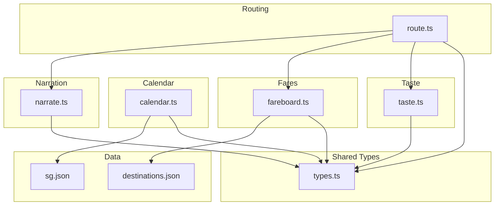
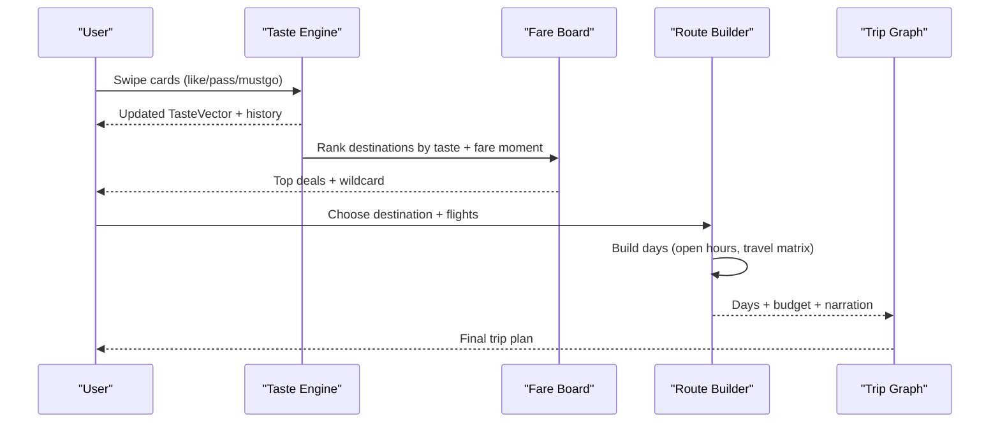
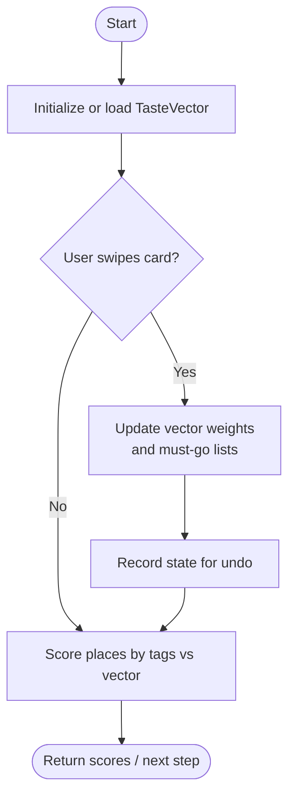
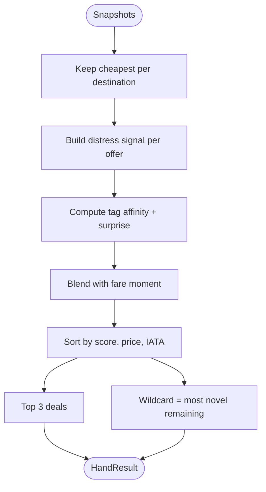
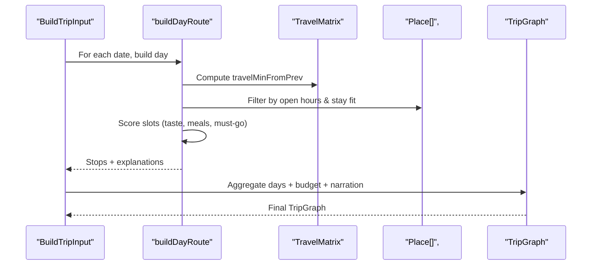
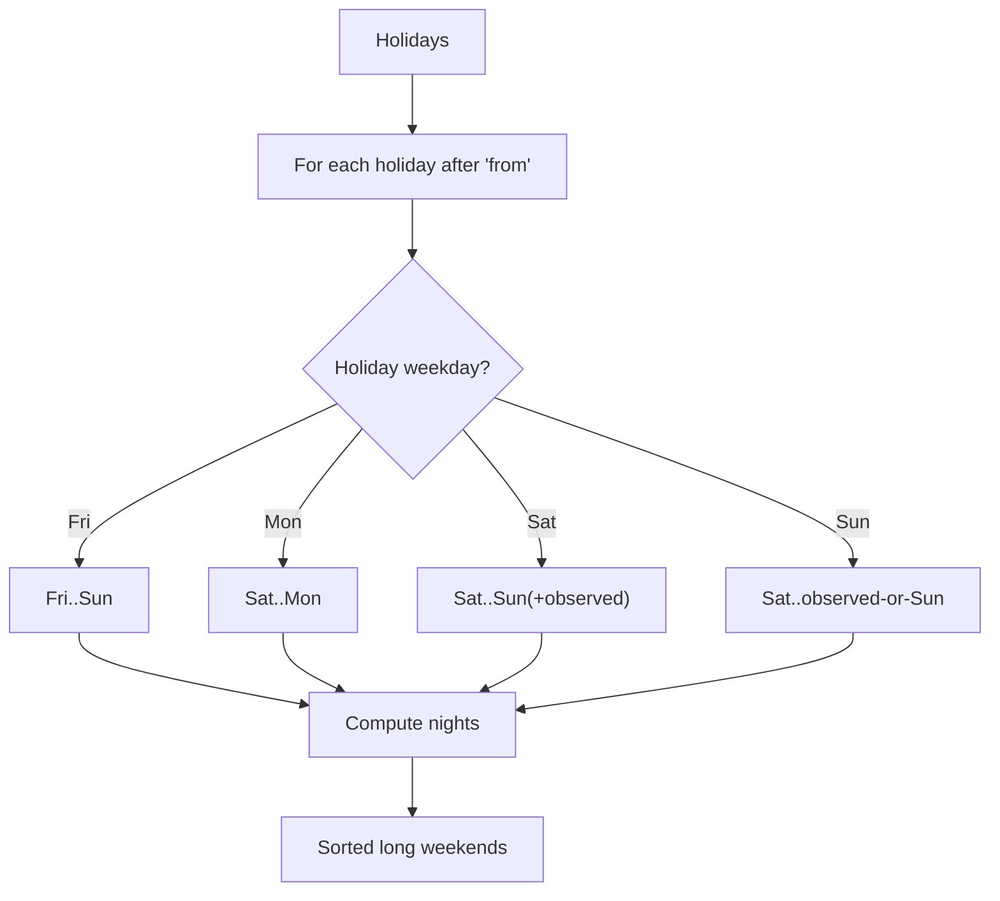
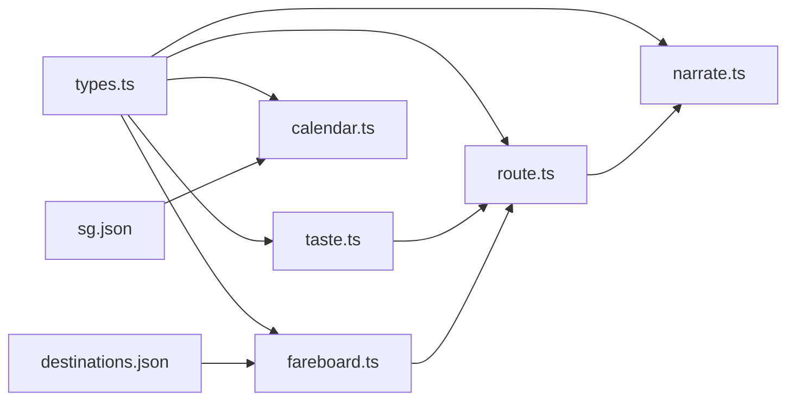
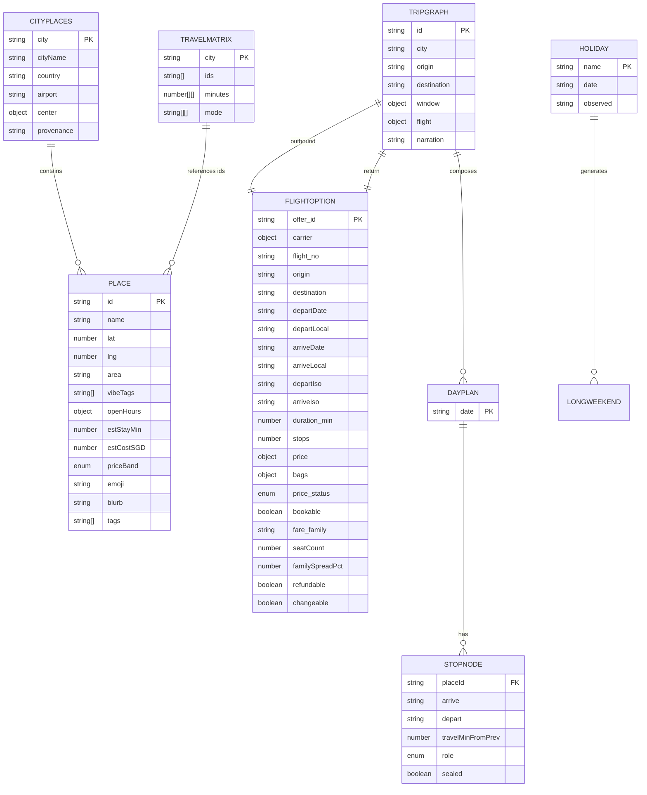

# Core Types and Entities

<cite>
**Referenced Files in This Document**
- [types.ts](file://packages/shared/src/types.ts)
- [taste.ts](file://packages/shared/src/taste.ts)
- [route.ts](file://packages/shared/src/route.ts)
- [fareboard.ts](file://packages/shared/src/fareboard.ts)
- [calendar.ts](file://packages/shared/src/calendar.ts)
- [narrate.ts](file://packages/shared/src/narrate.ts)
- [destinations.json](file://data/places/destinations.json)
- [sg.json](file://data/holidays/sg.json)
</cite>

## Table of Contents
1. [Introduction](#introduction)
2. [Project Structure](#project-structure)
3. [Core Components](#core-components)
4. [Architecture Overview](#architecture-overview)
5. [Detailed Component Analysis](#detailed-component-analysis)
6. [Dependency Analysis](#dependency-analysis)
7. [Performance Considerations](#performance-considerations)
8. [Troubleshooting Guide](#troubleshooting-guide)
9. [Conclusion](#conclusion)
10. [Appendices](#appendices)

## Introduction
This document describes the core data model that powers the Trip Graph Agent. It focuses on the fundamental types and entities that represent user taste, places, travel matrices, flight options, daily plans, and complete trip graphs. It explains how these types interrelate, their validation rules, and how they are used to build personalized, time-feasible itineraries and budgets.

## Project Structure
The core types and logic live primarily in a shared package:
- Type definitions and domain models are centralized in a single file for clarity and reuse.
- Taste modeling and scoring utilities transform user interactions into a numerical preference vector.
- Route building uses place metadata, open hours, and travel times to construct feasible day plans.
- Fare ranking blends taste affinity with fare “moment” signals to propose destinations.
- Calendar utilities derive long weekends from holiday datasets.
- Narration turns structured results into human-readable summaries.

**Diagram sources**
- [types.ts:1-170](file://packages/shared/src/types.ts#L1-L170)
- [taste.ts:1-68](file://packages/shared/src/taste.ts#L1-L68)
- [route.ts:1-475](file://packages/shared/src/route.ts#L1-L475)
- [fareboard.ts:1-197](file://packages/shared/src/fareboard.ts#L1-L197)
- [calendar.ts:1-56](file://packages/shared/src/calendar.ts#L1-L56)
- [narrate.ts:1-79](file://packages/shared/src/narrate.ts#L1-L79)
- [destinations.json:1-98](file://data/places/destinations.json#L1-L98)
- [sg.json:1-31](file://data/holidays/sg.json#L1-L31)

**Section sources**
- [types.ts:1-170](file://packages/shared/src/types.ts#L1-L170)
- [taste.ts:1-68](file://packages/shared/src/taste.ts#L1-L68)
- [route.ts:1-475](file://packages/shared/src/route.ts#L1-L475)
- [fareboard.ts:1-197](file://packages/shared/src/fareboard.ts#L1-L197)
- [calendar.ts:1-56](file://packages/shared/src/calendar.ts#L1-L56)
- [narrate.ts:1-79](file://packages/shared/src/narrate.ts#L1-L79)
- [destinations.json:1-98](file://data/places/destinations.json#L1-L98)
- [sg.json:1-31](file://data/holidays/sg.json#L1-L31)

## Core Components
This section documents each core type, its fields, constraints, and usage patterns within the application.

### VibeTag and TasteVector
- VibeTag is a closed set of experience categories (e.g., food, nature, culture).
- TasteVector maps each VibeTag to a numeric weight representing user preference strength.
- Usage:
  - Scoring places by matching tags to user preferences.
  - Ranking destination deals based on tag affinity and unexpectedness.
  - Influencing route selection during day planning.

Validation and behavior:
- Weights are bounded during swipe updates to prevent runaway values.
- Empty vectors can be seeded from initial selections.

Example usage pattern:
- Onboarding swipes update the vector; later, places and destinations are scored against it.

**Section sources**
- [types.ts:1-20](file://packages/shared/src/types.ts#L1-L20)
- [taste.ts:11-28](file://packages/shared/src/taste.ts#L11-L28)
- [taste.ts:30-67](file://packages/shared/src/taste.ts#L30-L67)

### Place
- Represents a point of interest with location, area, vibe tags, open hours, estimated stay duration, cost, price band, emoji, blurb, and optional tags.
- OpenHours supports per-day intervals or a daily default.
- Validation rules applied by routing:
  - Places must be open at arrival time with sufficient buffer before closing.
  - Estimated stay must fit within the day’s end window.

Usage:
- Day planners select and sequence places based on taste, must-go requirements, and feasibility.
- Budgets sum estimated costs across selected stops.

**Section sources**
- [types.ts:24-49](file://packages/shared/src/types.ts#L24-L49)
- [route.ts:41-51](file://packages/shared/src/route.ts#L41-L51)
- [route.ts:163-247](file://packages/shared/src/route.ts#L163-L247)

### CityPlaces
- Aggregates city metadata (id, name, country, airport, center coordinates) plus an array of Place entries.
- Used as the dataset for building routes and travel matrices per city.

Usage:
- Loaded per destination to drive itinerary generation.

**Section sources**
- [types.ts:51-59](file://packages/shared/src/types.ts#L51-L59)

### TravelMatrix
- Encodes pairwise travel times (in minutes) and modes between place IDs within a city.
- Used to compute travel durations between consecutive stops and to estimate first-leg travel.

Usage:
- Feeds feasibility checks and slot scoring during route building.

**Section sources**
- [types.ts:61-66](file://packages/shared/src/types.ts#L61-L66)
- [route.ts:82-88](file://packages/shared/src/route.ts#L82-L88)

### DeckCard
- A UI-facing representation of a place or suggestion with id, optional placeId, title, emoji, vibeTags, and subtitle.
- Used in onboarding and deal discovery to capture user preferences via swiping.

Usage:
- Swipe actions update the TasteState and influence subsequent recommendations.

**Section sources**
- [types.ts:68-75](file://packages/shared/src/types.ts#L68-L75)
- [taste.ts:30-50](file://packages/shared/src/taste.ts#L30-L50)

### FlightOption
- Describes a specific flight offer including carrier, flight number, origin/destination, dates and local times, ISO timestamps, duration, stops, pricing, baggage policy, bookability, fare family, and optional distress signals (seat count, spread, refundable/changeable flags).
- Used throughout trip construction and reflow when swapping outbound flights.

Validation and behavior:
- Total cost includes checked bag fee if not included.
- Distress signals influence fare moment scoring.

**Section sources**
- [types.ts:86-110](file://packages/shared/src/types.ts#L86-L110)
- [fareboard.ts:46-48](file://packages/shared/src/fareboard.ts#L46-L48)
- [fareboard.ts:56-78](file://packages/shared/src/fareboard.ts#L56-L78)

### StopNode
- A scheduled visit in a day plan with placeId, arrive/depart times, travel minutes from previous stop, role (anchor, food, quiet, wildcard, must), and optional sealed flag.
- Role indicates purpose: anchor (primary activity), food (meal), quiet (rest/nature), wildcard (novelty pick), must (user-required).

Usage:
- Constructed by the day planner; roles guide narration and explanations.

**Section sources**
- [types.ts:112-121](file://packages/shared/src/types.ts#L112-L121)
- [route.ts:104-109](file://packages/shared/src/route.ts#L104-L109)
- [route.ts:133-161](file://packages/shared/src/route.ts#L133-L161)

### DayPlan
- A date-bound list of StopNode entries forming one day’s itinerary.
- Used to compose multi-day TripGraphs and compute budgets.

Usage:
- Each day is built respecting open hours, meal windows, late arrivals, and airport cutoffs.

**Section sources**
- [types.ts:123-126](file://packages/shared/src/types.ts#L123-L126)
- [route.ts:306-341](file://packages/shared/src/route.ts#L306-L341)

### TripGraph
- The top-level trip artifact containing id, city, origin/destination, travel window (start/end, optional holiday), outbound and return FlightOptions, days, budget, narration, and explanations.
- Budget aggregates flight total, ground costs, and total currency.

Usage:
- Produced by building or refloowing trips; narrated for user feedback.

**Section sources**
- [types.ts:128-146](file://packages/shared/src/types.ts#L128-L146)
- [route.ts:349-387](file://packages/shared/src/route.ts#L349-L387)
- [route.ts:414-474](file://packages/shared/src/route.ts#L414-L474)
- [narrate.ts:32-39](file://packages/shared/src/narrate.ts#L32-L39)
- [narrate.ts:41-78](file://packages/shared/src/narrate.ts#L41-L78)

### Holiday and LongWeekend
- Holiday defines a named holiday with date and optional observed date.
- LongWeekend derives contiguous weekend-like windows around holidays, including nights count.

Usage:
- Calendar utility computes candidate trip windows aligned with public holidays.

**Section sources**
- [types.ts:148-159](file://packages/shared/src/types.ts#L148-L159)
- [calendar.ts:22-55](file://packages/shared/src/calendar.ts#L22-L55)
- [sg.json:6-29](file://data/holidays/sg.json#L6-L29)

## Architecture Overview
The data model underpins three primary workflows:
- Taste acquisition and scoring: convert swipes into a TasteVector and score places.
- Destination ranking: blend taste affinity, fare moment, and unexpectedness to propose deals.
- Trip construction: assemble days and budgets around flights, open hours, and travel times.

**Diagram sources**
- [taste.ts:30-67](file://packages/shared/src/taste.ts#L30-L67)
- [fareboard.ts:111-179](file://packages/shared/src/fareboard.ts#L111-L179)
- [route.ts:163-247](file://packages/shared/src/route.ts#L163-L247)
- [route.ts:349-387](file://packages/shared/src/route.ts#L349-L387)

## Detailed Component Analysis

### Taste Model and Scoring
- emptyVector initializes all tags to zero.
- seedVector sets initial weights for chosen tags.
- applySwipe updates vector and must-go lists, recording history for undo.
- scorePlace normalizes tag match strength by number of tags to avoid bias toward many-tag places.

**Diagram sources**
- [taste.ts:16-28](file://packages/shared/src/taste.ts#L16-L28)
- [taste.ts:30-67](file://packages/shared/src/taste.ts#L30-L67)

**Section sources**
- [taste.ts:16-67](file://packages/shared/src/taste.ts#L16-L67)

### Destination Ranking (Fareboard)
- rankHand selects cheapest offers per destination, then ranks by:
  - Tag affinity (average taste weight over destination tags)
  - Unexpectedness (novelty relative to strong tastes)
  - Fare moment (distress signals like scarcity, non-refundable, non-changeable)
- Wildcard picks the most surprising remaining destination with full city data.

**Diagram sources**
- [fareboard.ts:111-179](file://packages/shared/src/fareboard.ts#L111-L179)
- [fareboard.ts:56-78](file://packages/shared/src/fareboard.ts#L56-L78)
- [fareboard.ts:80-91](file://packages/shared/src/fareboard.ts#L80-L91)

**Section sources**
- [fareboard.ts:14-37](file://packages/shared/src/fareboard.ts#L14-L37)
- [fareboard.ts:46-48](file://packages/shared/src/fareboard.ts#L46-L48)
- [fareboard.ts:56-91](file://packages/shared/src/fareboard.ts#L56-L91)
- [fareboard.ts:111-179](file://packages/shared/src/fareboard.ts#L111-L179)

### Day Planner and Route Building
- buildDayRoute constructs a feasible sequence of stops:
  - Filters candidates by open hours and time windows.
  - Scores slots considering taste, meal windows, mood tags, area preference, must-go priority, and travel time.
  - Reserves space for a wildcard stop to introduce novelty.
  - Produces explanations for any unplaced must-go items.
- buildTrip orchestrates multi-day plans around outbound/return flights, adjusting start/end times for late arrivals and early departures.
- reflow rebuilds affected days when flights change, preserving unaffected days and recomputing budgets.

**Diagram sources**
- [route.ts:163-247](file://packages/shared/src/route.ts#L163-L247)
- [route.ts:306-341](file://packages/shared/src/route.ts#L306-L341)
- [route.ts:349-387](file://packages/shared/src/route.ts#L349-L387)
- [route.ts:414-474](file://packages/shared/src/route.ts#L414-L474)

**Section sources**
- [route.ts:16-51](file://packages/shared/src/route.ts#L16-L51)
- [route.ts:76-130](file://packages/shared/src/route.ts#L76-L130)
- [route.ts:133-161](file://packages/shared/src/route.ts#L133-L161)
- [route.ts:163-247](file://packages/shared/src/route.ts#L163-L247)
- [route.ts:306-341](file://packages/shared/src/route.ts#L306-L341)
- [route.ts:349-387](file://packages/shared/src/route.ts#L349-L387)
- [route.ts:414-474](file://packages/shared/src/route.ts#L414-L474)

### Calendar and Holidays
- longWeekends scans official holidays and produces contiguous windows adjacent to weekends, accounting for observed dates.
- Used to suggest trip windows aligned with public holidays.

**Diagram sources**
- [calendar.ts:22-55](file://packages/shared/src/calendar.ts#L22-L55)
- [sg.json:6-29](file://data/holidays/sg.json#L6-L29)

**Section sources**
- [calendar.ts:1-56](file://packages/shared/src/calendar.ts#L1-L56)
- [sg.json:1-31](file://data/holidays/sg.json#L1-L31)

### Narration
- narratePlan summarizes trip length, top taste tags, and total budget in a single sentence.
- narrateSwap explains the impact of swapping outbound flights on landing time, day-one stops, and budget.

**Section sources**
- [narrate.ts:32-39](file://packages/shared/src/narrate.ts#L32-L39)
- [narrate.ts:41-78](file://packages/shared/src/narrate.ts#L41-L78)

## Dependency Analysis
- types.ts is the foundation consumed by all modules.
- taste.ts depends on types and provides scoring functions used by route.ts and fareboard.ts indirectly through place scoring and destination tagging.
- route.ts depends on types, taste scoring, fare totals, and narration to produce TripGraphs.
- fareboard.ts depends on types and uses totalWithBag to normalize pricing.
- calendar.ts depends on types and consumes holiday datasets.
- Data files (destinations.json, sg.json) provide external configuration for destination profiles and holidays.

**Diagram sources**
- [types.ts:1-170](file://packages/shared/src/types.ts#L1-L170)
- [taste.ts:1-68](file://packages/shared/src/taste.ts#L1-L68)
- [route.ts:1-475](file://packages/shared/src/route.ts#L1-L475)
- [fareboard.ts:1-197](file://packages/shared/src/fareboard.ts#L1-L197)
- [calendar.ts:1-56](file://packages/shared/src/calendar.ts#L1-L56)
- [narrate.ts:1-79](file://packages/shared/src/narrate.ts#L1-L79)
- [destinations.json:1-98](file://data/places/destinations.json#L1-L98)
- [sg.json:1-31](file://data/holidays/sg.json#L1-L31)

**Section sources**
- [types.ts:1-170](file://packages/shared/src/types.ts#L1-L170)
- [taste.ts:1-68](file://packages/shared/src/taste.ts#L1-L68)
- [route.ts:1-475](file://packages/shared/src/route.ts#L1-L475)
- [fareboard.ts:1-197](file://packages/shared/src/fareboard.ts#L1-L197)
- [calendar.ts:1-56](file://packages/shared/src/calendar.ts#L1-L56)
- [narrate.ts:1-79](file://packages/shared/src/narrate.ts#L1-L79)
- [destinations.json:1-98](file://data/places/destinations.json#L1-L98)
- [sg.json:1-31](file://data/holidays/sg.json#L1-L31)

## Performance Considerations
- Place scoring divides by the square root of tag count to reduce bias toward places with many tags.
- Day planning filters candidates early using open hours and time windows to limit sorting and scoring work.
- Fare ranking deduplicates by destination to keep only the cheapest offer per destination before scoring.
- Rebuilding trips preserves unaffected days to minimize recomputation when swapping flights.

[No sources needed since this section provides general guidance]

## Troubleshooting Guide
Common issues and where to inspect:
- No stops selected:
  - Verify open hours and ensure arrival falls within open intervals with sufficient buffer.
  - Check that estimated stay fits within the day’s end window.
  - Inspect must-go constraints and night-only mode restrictions.
- Must-go items dropped:
  - Explanations are generated for each unplaced must-go item indicating why it did not fit.
- Late arrival handling:
  - First day may switch to night-food-only mode; second day may start later.
- Budget mismatches:
  - Ground cost sums estimated costs of selected stops; verify Place.estCostSGD values.
- Fare ranking anomalies:
  - Ensure distress signals are present for meaningful fare moment scoring.
  - Confirm at least four destinations exist for wildcard selection.

**Section sources**
- [route.ts:41-51](file://packages/shared/src/route.ts#L41-L51)
- [route.ts:163-247](file://packages/shared/src/route.ts#L163-L247)
- [route.ts:306-341](file://packages/shared/src/route.ts#L306-L341)
- [fareboard.ts:111-179](file://packages/shared/src/fareboard.ts#L111-L179)

## Conclusion
The Trip Graph Agent’s data model centers on a small set of well-defined types that connect user taste, place metadata, travel logistics, and flight options into coherent, feasible trip plans. By separating concerns—taste modeling, destination ranking, route construction, and narration—the system remains modular, testable, and extensible while delivering personalized, time-aware itineraries with transparent budgets and explanations.

[No sources needed since this section summarizes without analyzing specific files]

## Appendices

### Entity Relationship Diagram

**Diagram sources**
- [types.ts:35-159](file://packages/shared/src/types.ts#L35-L159)