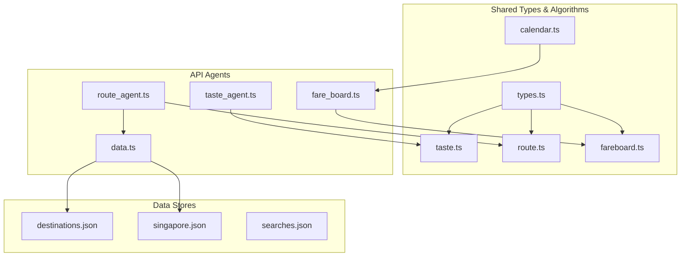
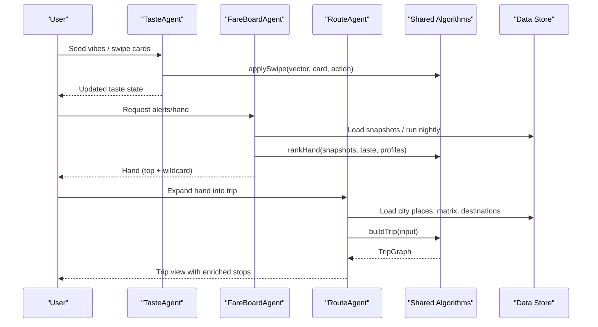
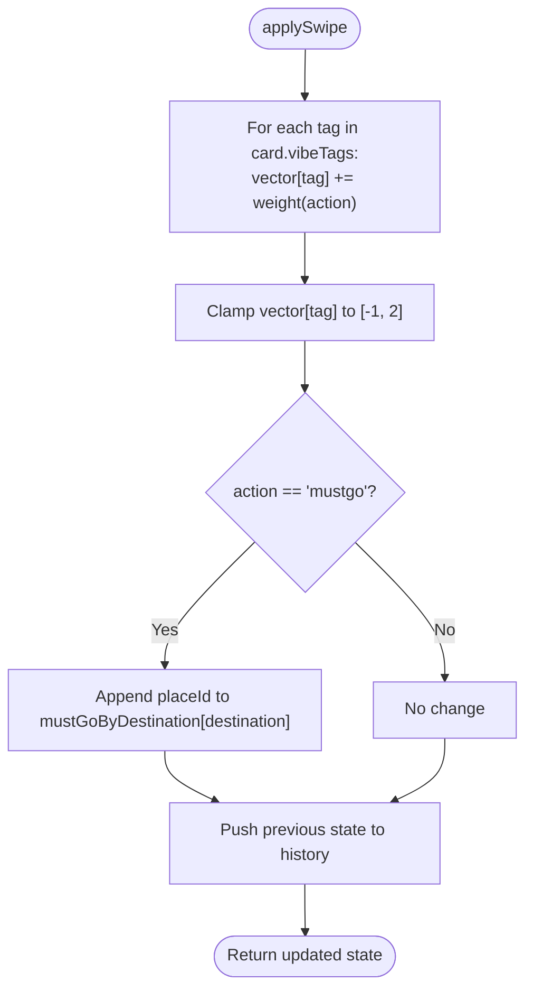
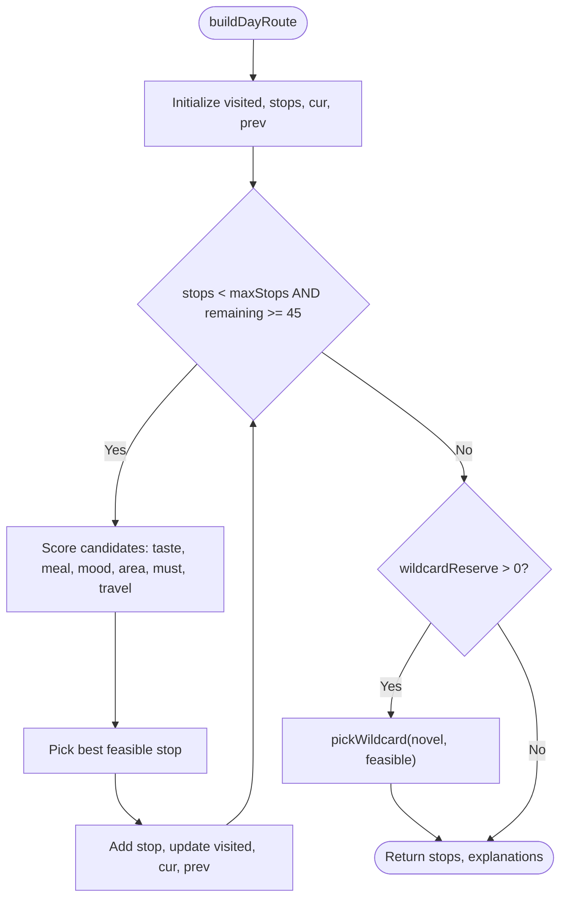
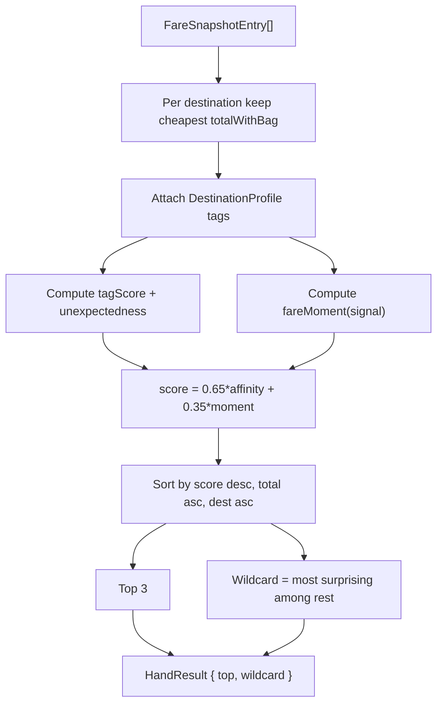
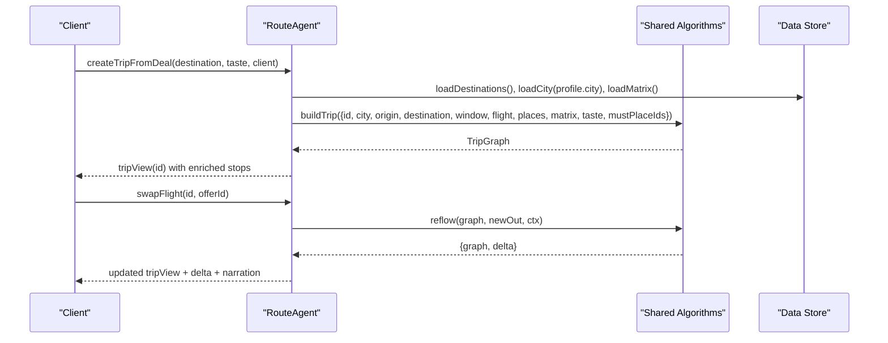
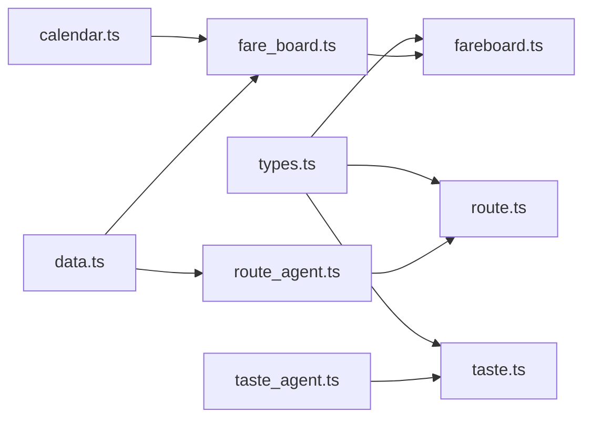

# Data Models

<cite>
**Referenced Files in This Document**
- [types.ts](file://packages/shared/src/types.ts)
- [taste.ts](file://packages/shared/src/taste.ts)
- [route.ts](file://packages/shared/src/route.ts)
- [fareboard.ts](file://packages/shared/src/fareboard.ts)
- [calendar.ts](file://packages/shared/src/calendar.ts)
- [fare_board.ts](file://apps/api/src/agents/fare_board.ts)
- [route_agent.ts](file://apps/api/src/agents/route_agent.ts)
- [taste_agent.ts](file://apps/api/src/agents/taste_agent.ts)
- [data.ts](file://apps/api/src/data.ts)
- [destinations.json](file://data/places/destinations.json)
- [singapore.json](file://data/places/singapore.json)
- [searches.json](file://data/fares/fixtures/searches.json)
</cite>

## Table of Contents
1. Introduction
2. Project Structure
3. Core Components
4. Architecture Overview
5. Detailed Component Analysis
6. Dependency Analysis
7. Performance Considerations
8. Troubleshooting Guide
9. Conclusion
10. Appendices

## Introduction
This document describes the data models and data flows that power the Trip Graph Agent. It focuses on core types (TripGraph, TasteVector, StopNode, FlightOption), how preference vectors are computed from swipe interactions, route calculation logic (stop ordering, travel time, budget propagation), fare board structures for price tracking and deal detection, and data lifecycle considerations including caching and performance for large datasets.

## Project Structure
The data model is defined centrally in shared types and algorithms, while API agents orchestrate data loading, transformation, and persistence.

**Diagram sources**
- [types.ts:1-170](file://packages/shared/src/types.ts#L1-L170)
- [taste.ts:1-68](file://packages/shared/src/taste.ts#L1-L68)
- [route.ts:1-475](file://packages/shared/src/route.ts#L1-L475)
- [fareboard.ts:1-197](file://packages/shared/src/fareboard.ts#L1-L197)
- [calendar.ts:1-56](file://packages/shared/src/calendar.ts#L1-L56)
- [fare_board.ts:1-118](file://apps/api/src/agents/fare_board.ts#L1-L118)
- [route_agent.ts:1-191](file://apps/api/src/agents/route_agent.ts#L1-L191)
- [taste_agent.ts:1-118](file://apps/api/src/agents/taste_agent.ts#L1-L118)
- [data.ts:1-38](file://apps/api/src/data.ts#L1-L38)
- [destinations.json:1-98](file://data/places/destinations.json#L1-L98)
- [singapore.json:1-57](file://data/places/singapore.json#L1-L57)
- [searches.json:1-800](file://data/fares/fixtures/searches.json#L1-L800)

**Section sources**
- [types.ts:1-170](file://packages/shared/src/types.ts#L1-L170)
- [data.ts:1-38](file://apps/api/src/data.ts#L1-L38)

## Core Components
This section documents the primary domain entities and their relationships.

### Core Type Definitions
- VibeTag: A closed set of experience tags used to express preferences and match places.
- TasteVector: A mapping from each VibeTag to a numeric weight reflecting user preference strength.
- Place: A point-of-interest with location, vibeTags, openHours, estimated stay duration, cost, and metadata.
- CityPlaces: Aggregates city-level info and its places.
- TravelMatrix: Precomputed inter-place travel times and modes for a city.
- DeckCard: UI representation of a place for swiping.
- SwipeAction: User interaction type affecting taste vector updates.
- TasteState: Current taste vector plus must-go lists per destination and history for undo.
- FlightOption: A flight offer with pricing, timing, baggage, and optional distress signals.
- StopRole: Role classification for stops (anchor, food, quiet, wildcard, must).
- StopNode: A scheduled visit within a day plan with arrival/departure times and travel time from previous stop.
- DayPlan: A date with ordered stops.
- TripBudget: Aggregated costs for flights and ground activities.
- TripGraph: The final trip artifact combining flights, days, budget, narration, and explanations.
- Holiday/LongWeekend: Calendar constructs for planning windows.
- FareSnapshotEntry: Stored snapshot of cheapest offers per origin/destination/date for ranking.

Entity Relationships
- TripGraph contains FlightOption pairs (outbound/return), an array of DayPlan entries, and TripBudget.
- Each DayPlan contains StopNode entries referencing Place by id.
- Places carry vibeTags that align with VibeTag; TasteVector weights these tags to score places.
- FareSnapshotEntry wraps FlightOption and metadata for ranking deals.

Validation Rules and Constraints
- Open hours: Stops must be open at arrival with at least 30 minutes before closing.
- Late arrival: On arrival day, if arriving late, only food/nightlife stops are considered and limited to one stop.
- Must-go guarantees: If a must-tag or must-place cannot fit, an explanation line is produced instead of silently dropping it.
- Wildcard placement: At most one wildcard per trip unless explicitly disabled; wildcards introduce novel tags not strongly expressed by the user.
- Budget totals: Flight total includes base price plus checked bag fee when not included; ground cost sums estimated costs of visited places.

**Section sources**
- [types.ts:1-170](file://packages/shared/src/types.ts#L1-L170)
- [route.ts:41-51](file://packages/shared/src/route.ts#L41-L51)
- [route.ts:132-161](file://packages/shared/src/route.ts#L132-L161)
- [route.ts:163-247](file://packages/shared/src/route.ts#L163-L247)
- [route.ts:269-387](file://packages/shared/src/route.ts#L269-L387)
- [fareboard.ts:46-48](file://packages/shared/src/fareboard.ts#L46-L48)

## Architecture Overview
High-level flow from user preferences and fares to a complete trip graph.

**Diagram sources**
- [taste_agent.ts:28-84](file://apps/api/src/agents/taste_agent.ts#L28-L84)
- [fare_board.ts:41-118](file://apps/api/src/agents/fare_board.ts#L41-L118)
- [route_agent.ts:107-185](file://apps/api/src/agents/route_agent.ts#L107-L185)
- [taste.ts:30-67](file://packages/shared/src/taste.ts#L30-L67)
- [fareboard.ts:111-179](file://packages/shared/src/fareboard.ts#L111-L179)
- [route.ts:349-387](file://packages/shared/src/route.ts#L349-L387)

## Detailed Component Analysis

### Taste Vector and Preference Scoring
- Empty and seed vectors initialize neutral or biased preferences based on initial vibe selections.
- Swipes update the vector with weighted increments per tag: like (+0.3), pass (-0.15), mustgo (+0.6), clamped to [-1, 2].
- Place scoring aggregates tag weights normalized by number of tags to avoid bias toward multi-tagged places.
- Undo support maintains history of prior states for reversible swipe sessions.

**Diagram sources**
- [taste.ts:30-61](file://packages/shared/src/taste.ts#L30-L61)

**Section sources**
- [taste.ts:11-67](file://packages/shared/src/taste.ts#L11-L67)
- [taste_agent.ts:28-92](file://apps/api/src/agents/taste_agent.ts#L28-L92)

### Route Calculation Model
- Time helpers convert between wall-clock strings and minutes; weekday keys select open hours.
- Slot scoring combines taste affinity, meal-time bonuses, mood proximity, area preference, must-satisfaction urgency, and travel penalty.
- Wildcard selection picks a novel place introducing tags not strongly expressed, ensuring feasibility against open hours and remaining time.
- Day builder iteratively selects feasible stops until capacity/time constraints are met, then optionally inserts a wildcard.
- Trip builder schedules days across outbound/return dates, adjusts start/end times for late arrivals and airport cutoffs, and computes budgets.
- Reflow recalculates affected days when outbound flight changes, preserving unaffected days and recomputing deltas.

**Diagram sources**
- [route.ts:163-247](file://packages/shared/src/route.ts#L163-L247)
- [route.ts:132-161](file://packages/shared/src/route.ts#L132-L161)

**Section sources**
- [route.ts:16-51](file://packages/shared/src/route.ts#L16-L51)
- [route.ts:111-161](file://packages/shared/src/route.ts#L111-L161)
- [route.ts:163-247](file://packages/shared/src/route.ts#L163-L247)
- [route.ts:269-387](file://packages/shared/src/route.ts#L269-L387)
- [route.ts:389-475](file://packages/shared/src/route.ts#L389-L475)

### Fare Board and Deal Detection
- Nightly batch queries a fixed candidate set for the next long weekend window, persists snapshots, and backs off on retryable errors.
- Ranking blends taste affinity and fare moment:
  - Taste affinity uses tag overlap and unexpectedness relative to strong preferences.
  - Fare moment derives from seat scarcity, family price spread, and restrictiveness (non-refundable/non-changeable).
  - Weights favor taste (65%) over fare moment (35%).
- Hand returns top three ranked deals plus a wildcard offering novelty beyond the hand’s tags.
- Observed badge requires at least seven distinct nights of real (CLI) snapshots.

**Diagram sources**
- [fareboard.ts:111-179](file://packages/shared/src/fareboard.ts#L111-L179)
- [fareboard.ts:56-91](file://packages/shared/src/fareboard.ts#L56-L91)
- [fare_board.ts:41-118](file://apps/api/src/agents/fare_board.ts#L41-L118)

**Section sources**
- [fareboard.ts:1-197](file://packages/shared/src/fareboard.ts#L1-L197)
- [fare_board.ts:1-118](file://apps/api/src/agents/fare_board.ts#L1-L118)
- [calendar.ts:22-55](file://packages/shared/src/calendar.ts#L22-L55)

### Trip Graph Construction and Enrichment
- createTripFromDeal selects outbound and return flights for the next long weekend, loads city data, seeds must-gos from taste state, and builds a TripGraph.
- tripView enriches stops with place details, hiding sealed wildcards until client reveal.
- swapFlight triggers reflow to adjust itinerary when changing outbound flights, returning delta metrics and updated narration.

**Diagram sources**
- [route_agent.ts:107-185](file://apps/api/src/agents/route_agent.ts#L107-L185)
- [route.ts:349-475](file://packages/shared/src/route.ts#L349-L475)

**Section sources**
- [route_agent.ts:19-191](file://apps/api/src/agents/route_agent.ts#L19-L191)
- [route.ts:349-475](file://packages/shared/src/route.ts#L349-L475)

## Dependency Analysis
Key dependencies and coupling:
- Shared types underpin all components; any schema change cascades through taste, route, and fareboard modules.
- Route calculations depend on taste scoring and fare totals; they also rely on calendar utilities for holiday-derived windows.
- Fare board depends on destination profiles and snapshot storage; it does not call live services in per-user paths.
- API agents coordinate data loading via centralized loaders with caches for cities and matrices.

**Diagram sources**
- [types.ts:1-170](file://packages/shared/src/types.ts#L1-L170)
- [taste.ts:1-68](file://packages/shared/src/taste.ts#L1-L68)
- [route.ts:1-475](file://packages/shared/src/route.ts#L1-L475)
- [fareboard.ts:1-197](file://packages/shared/src/fareboard.ts#L1-L197)
- [calendar.ts:1-56](file://packages/shared/src/calendar.ts#L1-L56)
- [data.ts:1-38](file://apps/api/src/data.ts#L1-L38)
- [fare_board.ts:1-118](file://apps/api/src/agents/fare_board.ts#L1-L118)
- [route_agent.ts:1-191](file://apps/api/src/agents/route_agent.ts#L1-L191)
- [taste_agent.ts:1-118](file://apps/api/src/agents/taste_agent.ts#L1-L118)

**Section sources**
- [data.ts:1-38](file://apps/api/src/data.ts#L1-L38)
- [fare_board.ts:1-118](file://apps/api/src/agents/fare_board.ts#L1-L118)
- [route_agent.ts:1-191](file://apps/api/src/agents/route_agent.ts#L1-L191)

## Performance Considerations
- Caching:
  - Cities and travel matrices are cached in memory per process to avoid repeated file reads.
  - Deck cards are cached per destination to speed up taste sessions.
- Algorithmic complexity:
  - Day route building sorts candidates per slot; typical place counts are small, keeping sorting fast.
  - Fare ranking reduces snapshots to cheapest per destination first, then scores a manageable set.
- I/O:
  - Nightly runs persist snapshots to disk; per-user alert path avoids live calls by ranking stored data.
- Large datasets:
  - For very large place sets, consider indexing by area/tags and precomputing adjacency graphs for faster travel lookups.
  - Snapshot ranking can be partitioned by destination to parallelize scoring.

[No sources needed since this section provides general guidance]

## Troubleshooting Guide
Common issues and diagnostics:
- No fits for must-go: Explanations indicate why a must-place/tag was dropped (closed or outside window).
- Wildcard not placed: May be due to insufficient remaining time or lack of novel tags meeting feasibility.
- Late arrival mode: Only food/nightlife allowed on arrival night; ensure options exist.
- Fare board empty: Ensure nightly run has executed or fixtures are available; check snapshot directory and CLI vs fixture mode.
- Swap flight errors: Verify offer exists for the trip and that reflow can compute affected dates.

**Section sources**
- [route.ts:231-247](file://packages/shared/src/route.ts#L231-L247)
- [fare_board.ts:84-118](file://apps/api/src/agents/fare_board.ts#L84-L118)
- [route_agent.ts:170-185](file://apps/api/src/agents/route_agent.ts#L170-L185)

## Conclusion
The Trip Graph Agent integrates user preferences, fare intelligence, and deterministic routing to produce actionable trip plans. Core data models are cohesive and well-scoped, enabling clear transformations from swipes to trips and from fare snapshots to ranked deals. Caching and algorithmic choices support responsive performance, while validation rules ensure practical, bookable itineraries.

[No sources needed since this section summarizes without analyzing specific files]

## Appendices

### Data Lifecycle and Storage
- Preferences: In-memory taste state with undo history; persisted by client for resilience.
- Fares: Nightly snapshots stored per date; per-user ranking reads from disk or in-memory fixture fallback.
- City data: Loaded from JSON files with in-process caching.

**Section sources**
- [taste_agent.ts:22-26](file://apps/api/src/agents/taste_agent.ts#L22-L26)
- [fare_board.ts:21-22](file://apps/api/src/agents/fare_board.ts#L21-L22)
- [fare_board.ts:75-92](file://apps/api/src/agents/fare_board.ts#L75-L92)
- [data.ts:14-25](file://apps/api/src/data.ts#L14-L25)

### Sample Data Structures
- Destinations profile defines candidate origins and destinations with tags and capability flags.
- City places include coordinates, tags, open hours, estimated durations and costs.
- Fixture searches provide realistic flight envelopes for testing and demo flows.

**Section sources**
- [destinations.json:1-98](file://data/places/destinations.json#L1-L98)
- [singapore.json:1-57](file://data/places/singapore.json#L1-L57)
- [searches.json:1-800](file://data/fares/fixtures/searches.json#L1-L800)