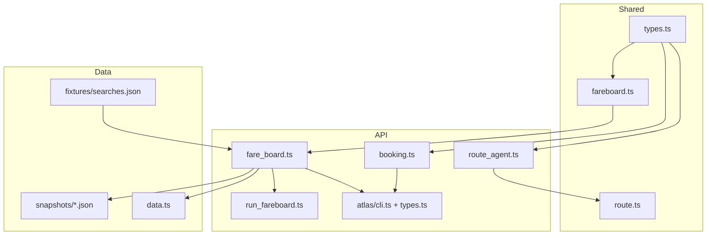
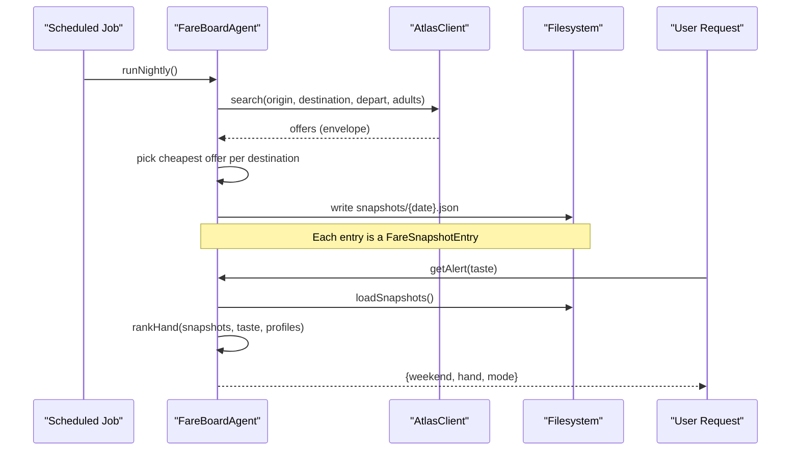
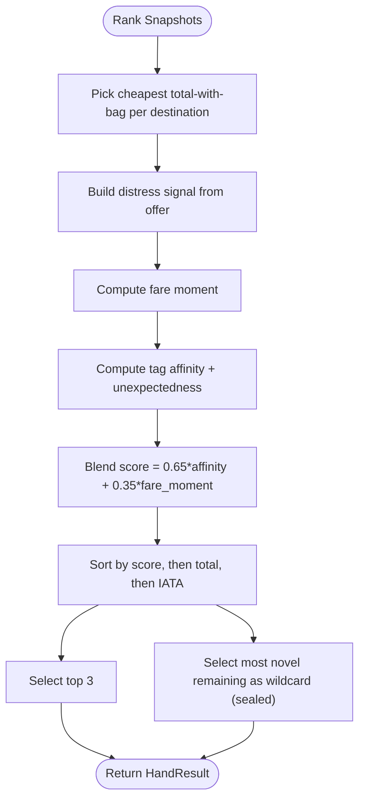
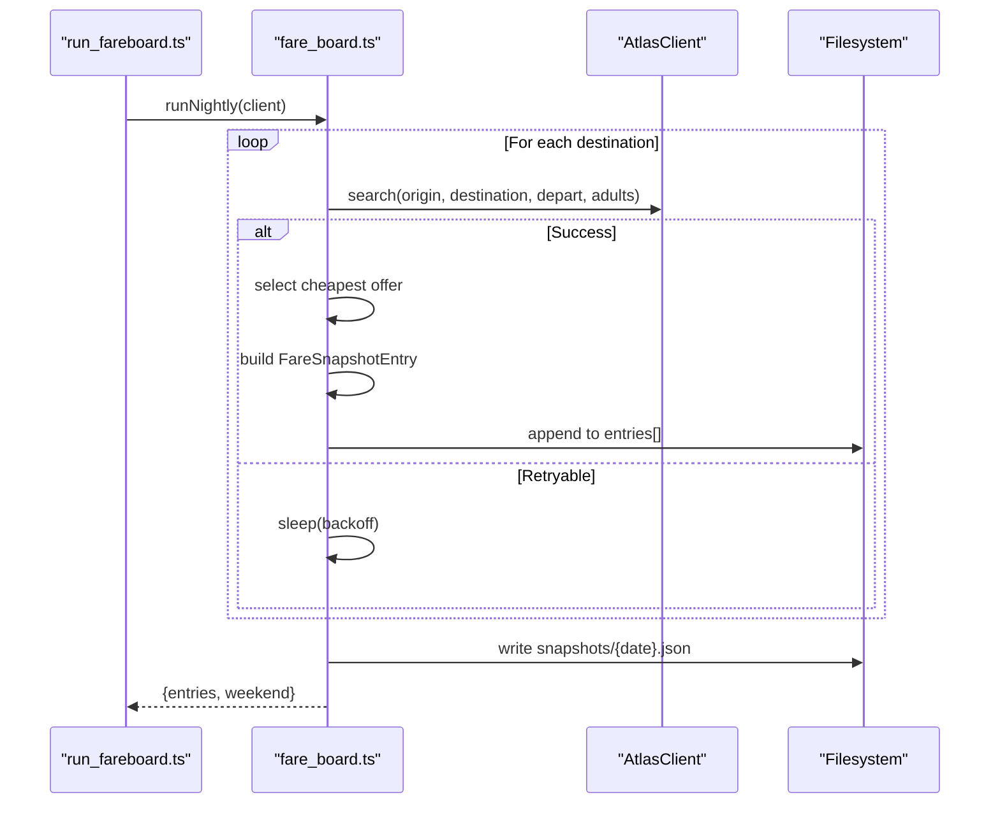
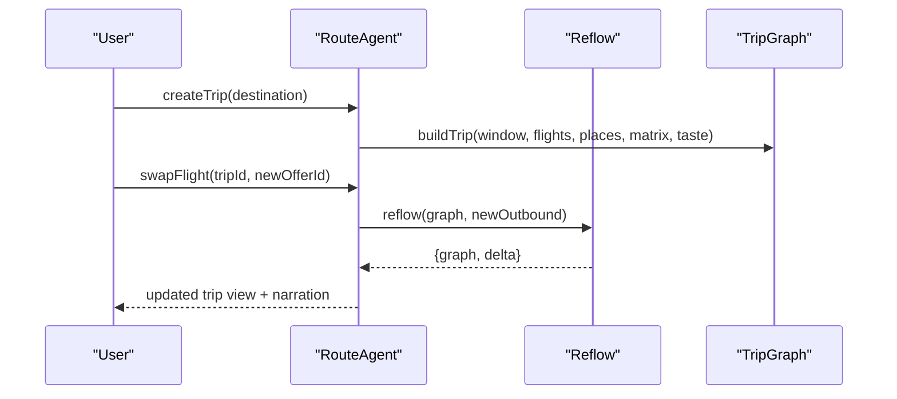
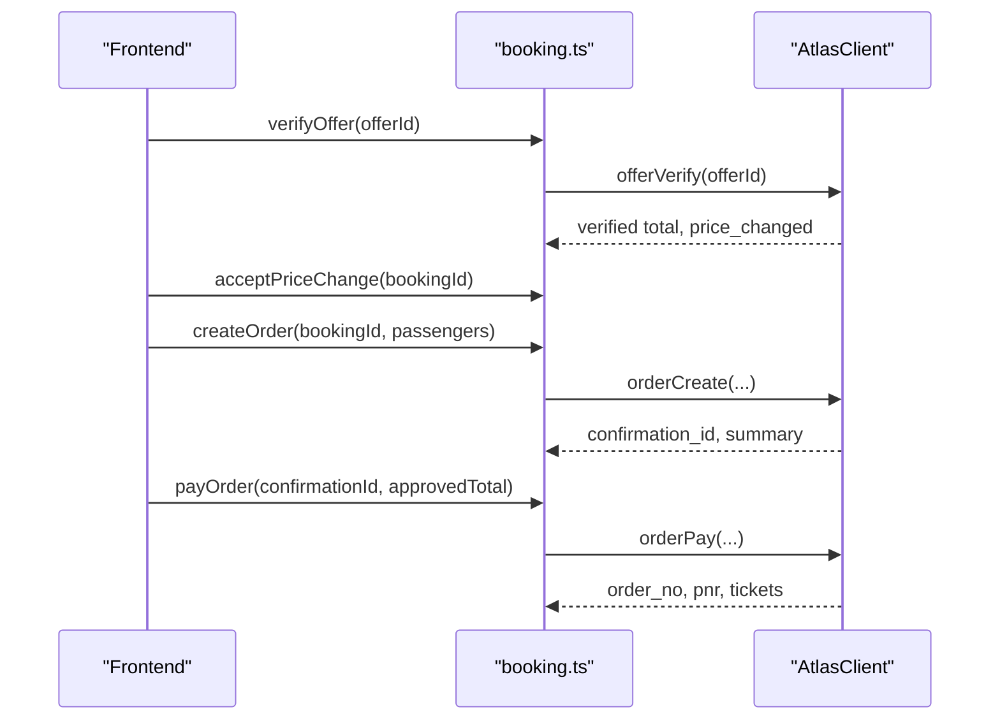
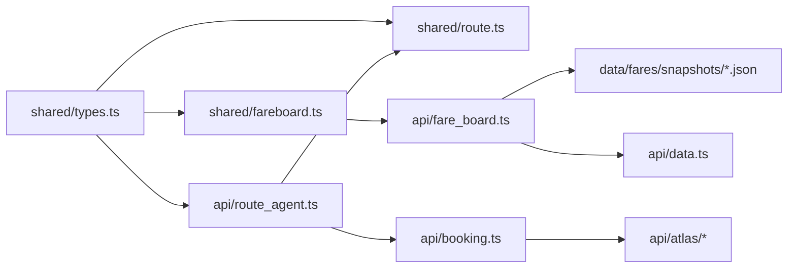

# Fare Board Data Model

<cite>
**Referenced Files in This Document**
- [fareboard.ts](file://packages/shared/src/fareboard.ts)
- [types.ts](file://packages/shared/src/types.ts)
- [fare_board.ts](file://apps/api/src/agents/fare_board.ts)
- [run_fareboard.ts](file://apps/api/src/jobs/run_fareboard.ts)
- [data.ts](file://apps/api/src/data.ts)
- [2026-08-24.json](file://data/fares/snapshots/2026-08-24.json)
- [searches.json](file://data/fares/fixtures/searches.json)
- [route_agent.ts](file://apps/api/src/agents/route_agent.ts)
- [route.ts](file://packages/shared/src/route.ts)
- [booking.ts](file://apps/api/src/booking.ts)
- [cli.ts](file://apps/api/src/atlas/cli.ts)
- [types.ts (atlas)](file://apps/api/src/atlas/types.ts)
</cite>

## Table of Contents
1. [Introduction](#introduction)
2. [Project Structure](#project-structure)
3. [Core Components](#core-components)
4. [Architecture Overview](#architecture-overview)
5. [Detailed Component Analysis](#detailed-component-analysis)
6. [Dependency Analysis](#dependency-analysis)
7. [Performance Considerations](#performance-considerations)
8. [Troubleshooting Guide](#troubleshooting-guide)
9. [Conclusion](#conclusion)
10. [Appendices](#appendices)

## Introduction
This document explains the fare board data model used by the Trip Graph Agent to monitor flight prices and detect deals for upcoming long weekends. It focuses on how fare snapshots are captured, stored, and ranked into a “hand” of opportunities; how price changes over time are tracked; and how fare changes can trigger replanning within the broader trip planning system. It also covers data retention practices, snapshot formats, and integration with external flight booking APIs via an Atlas client.

## Project Structure
The fare board spans shared types and ranking logic, API agent orchestration, scheduled jobs, and persistent snapshot storage:
- Shared library defines core types and ranking algorithms.
- API agent performs nightly scans and serves per-user alerts based on stored snapshots.
- Scheduled job triggers nightly scans.
- Snapshot files persist daily results for historical analysis and UI badges.
- Route agent and reflow logic connect fare changes to trip replanning.
- Booking module integrates with external APIs to verify and book offers.

**Diagram sources**
- [fareboard.ts:1-197](file://packages/shared/src/fareboard.ts#L1-L197)
- [types.ts:86-169](file://packages/shared/src/types.ts#L86-L169)
- [fare_board.ts:1-118](file://apps/api/src/agents/fare_board.ts#L1-L118)
- [run_fareboard.ts:1-15](file://apps/api/src/jobs/run_fareboard.ts#L1-L15)
- [data.ts:1-38](file://apps/api/src/data.ts#L1-L38)
- [2026-08-24.json:1-306](file://data/fares/snapshots/2026-08-24.json#L1-L306)
- [searches.json:1-800](file://data/fares/fixtures/searches.json#L1-L800)
- [route_agent.ts:134-173](file://apps/api/src/agents/route_agent.ts#L134-L173)
- [route.ts:392-474](file://packages/shared/src/route.ts#L392-L474)
- [booking.ts:1-104](file://apps/api/src/booking.ts#L1-L104)
- [cli.ts:74-114](file://apps/api/src/atlas/cli.ts#L74-L114)
- [types.ts (atlas):1-58](file://apps/api/src/atlas/types.ts#L1-L58)

**Section sources**
- [fare_board.ts:1-118](file://apps/api/src/agents/fare_board.ts#L1-L118)
- [run_fareboard.ts:1-15](file://apps/api/src/jobs/run_fareboard.ts#L1-L15)
- [data.ts:1-38](file://apps/api/src/data.ts#L1-L38)
- [2026-08-24.json:1-306](file://data/fares/snapshots/2026-08-24.json#L1-L306)
- [searches.json:1-800](file://data/fares/fixtures/searches.json#L1-L800)

## Core Components
- FareSnapshotEntry: Represents one captured offer for a destination on a specific departure date, including metadata about when and how it was fetched.
- FlightOption: The canonical shape of a flight offer, including pricing, baggage, schedule, and optional fare-moment signals.
- DestinationProfile and RankedDeal: Used to rank destinations against user taste and fare moment to produce a hand of top deals plus a wildcard.
- HandResult: The output of ranking — top three deals and a sealed wildcard that introduces novelty.
- DistressSignal: Optional signals derived from an offer to quantify fare scarcity or restrictiveness.

Key responsibilities:
- Capture: Nightly scan queries available flights for a fixed origin and candidate destinations for the next long weekend.
- Store: Persist each day’s results as a JSON file containing weekend context and entries.
- Rank: Compute a blended score combining taste affinity, unexpectedness, and fare moment to surface the best opportunities.
- Replan: When fares change, reflow the trip graph to reflect new dates and costs.

**Section sources**
- [types.ts:86-169](file://packages/shared/src/types.ts#L86-L169)
- [fareboard.ts:14-48](file://packages/shared/src/fareboard.ts#L14-L48)
- [fareboard.ts:111-179](file://packages/shared/src/fareboard.ts#L111-L179)
- [fare_board.ts:41-82](file://apps/api/src/agents/fare_board.ts#L41-L82)

## Architecture Overview
The fare board operates in two phases:
1. Nightly batch: Scans a fixed set of destinations for the next long weekend, persists the cheapest offer per destination as a snapshot entry, and writes a dated snapshot file.
2. Per-user alert: Loads all stored snapshots, ranks them using taste and fare moment, and returns a hand of deals without calling live APIs.

**Diagram sources**
- [run_fareboard.ts:1-15](file://apps/api/src/jobs/run_fareboard.ts#L1-L15)
- [fare_board.ts:41-118](file://apps/api/src/agents/fare_board.ts#L41-L118)
- [cli.ts:74-114](file://apps/api/src/atlas/cli.ts#L74-L114)
- [2026-08-24.json:1-306](file://data/fares/snapshots/2026-08-24.json#L1-L306)

## Detailed Component Analysis

### FareSnapshotEntry and FlightOption
- FareSnapshotEntry captures:
  - Origin, destination, and departure date.
  - The selected FlightOption (cheapest total with bag).
  - Timestamp and request ID for auditability.
  - Mode indicating whether data came from fixtures or live CLI.
- FlightOption includes:
  - Carrier and flight details, schedule, duration, stops.
  - Price and currency, baggage inclusion and fees.
  - Price status and bookability.
  - Optional fare-moment signals (seat count, family spread percentage, refundable/changeable flags).

These structures enable consistent storage and downstream ranking while preserving enough context to understand why a deal was surfaced.

**Section sources**
- [types.ts:86-169](file://packages/shared/src/types.ts#L86-L169)
- [2026-08-24.json:1-306](file://data/fares/snapshots/2026-08-24.json#L1-L306)

### Ranking and Deal Detection
The ranking algorithm computes a blended score per destination:
- Taste affinity: average of user taste values across destination tags.
- Unexpectedness: novelty relative to strongly expressed tastes.
- Fare moment: distress signal derived from seat scarcity, price spread, and policy restrictiveness.
- Final score weights taste-led affinity at 65% and fare moment at 35%.

It selects:
- Top three deals by score (ties broken by cheaper total then IATA).
- Wildcard: the most novel remaining destination with full trip data, marked sealed.

The headline price shown to users is always total with checked bag.

**Diagram sources**
- [fareboard.ts:50-91](file://packages/shared/src/fareboard.ts#L50-L91)
- [fareboard.ts:111-179](file://packages/shared/src/fareboard.ts#L111-L179)

**Section sources**
- [fareboard.ts:50-91](file://packages/shared/src/fareboard.ts#L50-L91)
- [fareboard.ts:111-179](file://packages/shared/src/fareboard.ts#L111-L179)

### Nightly Batch and Snapshot Storage
- Determines the next long weekend from holiday data and calculates the fly-out date.
- Iterates over configured destinations, querying the Atlas client for offers.
- On success, picks the cheapest offer (total with bag) and creates a FareSnapshotEntry.
- Persists a dated JSON file containing the weekend context and all entries.
- Implements retryable backoff for transient failures.

**Diagram sources**
- [run_fareboard.ts:1-15](file://apps/api/src/jobs/run_fareboard.ts#L1-L15)
- [fare_board.ts:41-82](file://apps/api/src/agents/fare_board.ts#L41-L82)
- [cli.ts:74-114](file://apps/api/src/atlas/cli.ts#L74-L114)

**Section sources**
- [fare_board.ts:30-82](file://apps/api/src/agents/fare_board.ts#L30-L82)
- [run_fareboard.ts:1-15](file://apps/api/src/jobs/run_fareboard.ts#L1-L15)

### Per-User Alert Path
- Loads persisted snapshots from disk.
- If none exist, runs an in-memory fixture pass so the demo always has a board.
- Computes the hand via rankHand using stored snapshots and destination profiles.
- Returns weekend context, hand, and client mode without making live calls.

**Section sources**
- [fare_board.ts:84-118](file://apps/api/src/agents/fare_board.ts#L84-L118)
- [data.ts:31-37](file://apps/api/src/data.ts#L31-L37)

### Integration with Trip Planning and Replanning
- The route agent builds a TripGraph from a selected destination and flight options, seeding must-go places from prior swipes.
- When fares change (e.g., swapping outbound flights), the reflow function recalculates affected dates, rebuilds days, and updates budgets and narration.
- The delta includes fareDelta and lists of rebuilt/dropped/added dates, enabling precise replanning responses.

**Diagram sources**
- [route_agent.ts:134-173](file://apps/api/src/agents/route_agent.ts#L134-L173)
- [route.ts:392-474](file://packages/shared/src/route.ts#L392-L474)

**Section sources**
- [route_agent.ts:134-173](file://apps/api/src/agents/route_agent.ts#L134-L173)
- [route.ts:392-474](file://packages/shared/src/route.ts#L392-L474)

### External Booking API Integration
- The booking module implements a deterministic state machine: verify -> accept price change if needed -> create order -> pay -> ticket.
- Uses the Atlas client to call offer verification, order creation, payment, and status checks.
- Passengers’ details are passed through once and never stored or logged.

**Diagram sources**
- [booking.ts:31-98](file://apps/api/src/booking.ts#L31-L98)
- [cli.ts:95-114](file://apps/api/src/atlas/cli.ts#L95-L114)
- [types.ts (atlas):26-58](file://apps/api/src/atlas/types.ts#L26-L58)

**Section sources**
- [booking.ts:1-104](file://apps/api/src/booking.ts#L1-L104)
- [cli.ts:74-114](file://apps/api/src/atlas/cli.ts#L74-L114)
- [types.ts (atlas):1-58](file://apps/api/src/atlas/types.ts#L1-L58)

## Dependency Analysis
- Shared types underpin both fare board and trip planning modules.
- The fare board depends on:
  - Holiday and destination profile data loaders.
  - Atlas client for live searches (nightly only).
  - Filesystem for snapshot persistence.
- Trip planning depends on:
  - Flight options and matrices to build and reflow itineraries.
  - Booking module to finalize purchases via Atlas.

**Diagram sources**
- [types.ts:86-169](file://packages/shared/src/types.ts#L86-L169)
- [fareboard.ts:1-197](file://packages/shared/src/fareboard.ts#L1-L197)
- [fare_board.ts:1-118](file://apps/api/src/agents/fare_board.ts#L1-L118)
- [route_agent.ts:134-173](file://apps/api/src/agents/route_agent.ts#L134-L173)
- [route.ts:392-474](file://packages/shared/src/route.ts#L392-L474)
- [booking.ts:1-104](file://apps/api/src/booking.ts#L1-L104)

**Section sources**
- [fare_board.ts:1-118](file://apps/api/src/agents/fare_board.ts#L1-L118)
- [route_agent.ts:134-173](file://apps/api/src/agents/route_agent.ts#L134-L173)
- [route.ts:392-474](file://packages/shared/src/route.ts#L392-L474)
- [booking.ts:1-104](file://apps/api/src/booking.ts#L1-L104)

## Performance Considerations
- Nightly scanning iterates a fixed candidate set; ensure destination list remains small to keep latency low.
- Backoff retries prevent cascading failures during transient outages.
- Ranking operates over in-memory arrays; snapshot growth should be managed to avoid excessive memory usage.
- Rebuilding trip graphs after flight swaps affects only impacted dates, minimizing recomputation.

[No sources needed since this section provides general guidance]

## Troubleshooting Guide
Common issues and mitigations:
- No upcoming long weekend: The nightly job returns empty entries; verify holiday configuration.
- Insufficient snapshots: The alert path requires at least four destinations to return a hand; ensure nightly runs succeed or rely on fixture mode for demos.
- Fixture vs live mode: Observed-fare badge counts only real CLI-mode snapshots; fixture entries do not contribute to the badge threshold.
- Booking errors: Follow the deterministic state machine; ensure price acceptance before ordering and exact total approval before payment.

**Section sources**
- [fare_board.ts:30-32](file://apps/api/src/agents/fare_board.ts#L30-L32)
- [fare_board.ts:114-117](file://apps/api/src/agents/fare_board.ts#L114-L117)
- [fareboard.ts:185-196](file://packages/shared/src/fareboard.ts#L185-L196)
- [booking.ts:31-98](file://apps/api/src/booking.ts#L31-L98)

## Conclusion
The fare board model captures and stores flight pricing snapshots for upcoming long weekends, ranks them using a blend of user taste and fare moment, and presents actionable deals. It integrates tightly with trip planning to support replanning when fares change and connects to external booking APIs through a robust, auditable flow. Snapshot persistence enables historical tracking and UI features like observed-fare badges.

[No sources needed since this section summarizes without analyzing specific files]

## Appendices

### Snapshot Format
Each snapshot file contains:
- Weekend context: holiday name, start/end dates, nights.
- Entries: array of FareSnapshotEntry objects representing the cheapest offer per destination for the chosen departure date.

Example structure references:
- Weekend and entries wrapper.
- Offer fields including carrier, schedule, price, bags, and optional signals.

**Section sources**
- [2026-08-24.json:1-306](file://data/fares/snapshots/2026-08-24.json#L1-L306)
- [searches.json:1-800](file://data/fares/fixtures/searches.json#L1-L800)

### Data Retention Policies
- Snapshots are written per date into a dedicated directory.
- There is no built-in cleanup routine in the analyzed code; retention is governed by filesystem management outside this repository.
- Observed-fare badge thresholds require multiple distinct nights of CLI-mode snapshots.

**Section sources**
- [fare_board.ts:75-82](file://apps/api/src/agents/fare_board.ts#L75-L82)
- [fareboard.ts:185-196](file://packages/shared/src/fareboard.ts#L185-L196)

### Integration Points Summary
- Atlas client: Search, offer verification, order lifecycle.
- Data loaders: Holidays, destinations, city profiles, travel matrices.
- Filesystem: Snapshot persistence and loading.
- Trip planner: Build and reflow itineraries based on flight options.

**Section sources**
- [cli.ts:74-114](file://apps/api/src/atlas/cli.ts#L74-L114)
- [data.ts:17-37](file://apps/api/src/data.ts#L17-L37)
- [fare_board.ts:41-118](file://apps/api/src/agents/fare_board.ts#L41-L118)
- [route_agent.ts:134-173](file://apps/api/src/agents/route_agent.ts#L134-L173)
- [route.ts:392-474](file://packages/shared/src/route.ts#L392-L474)