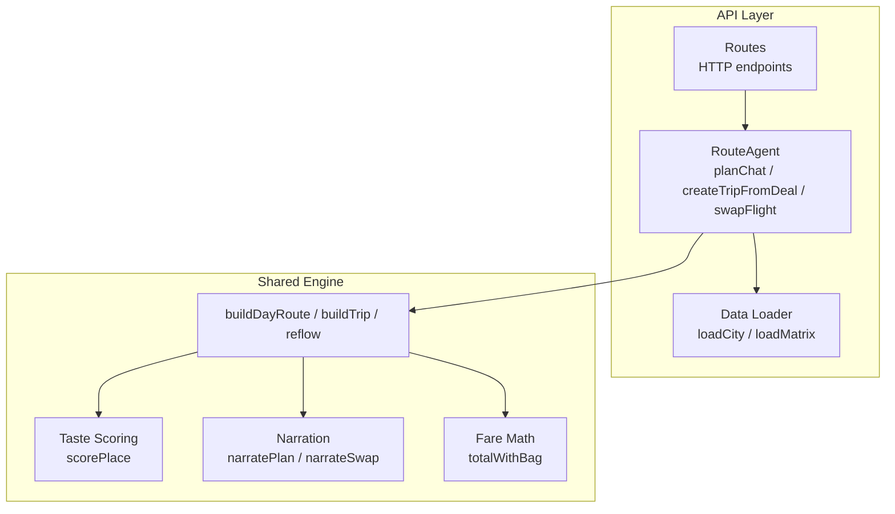
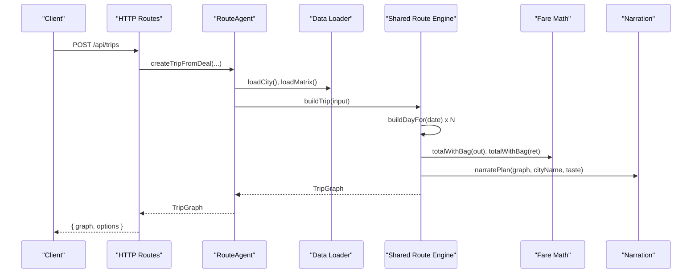
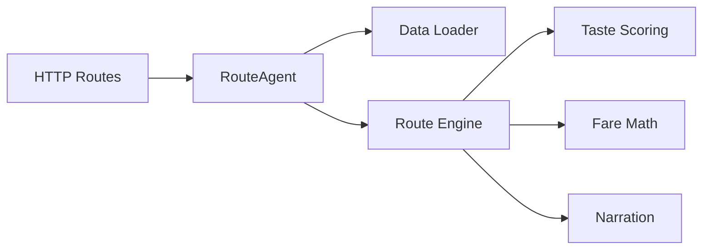
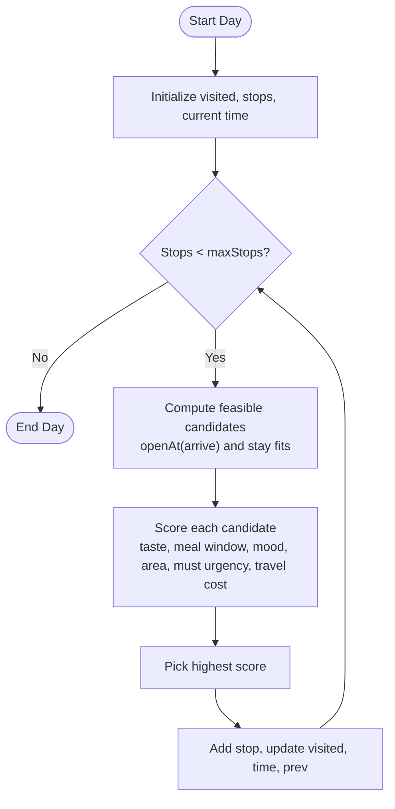
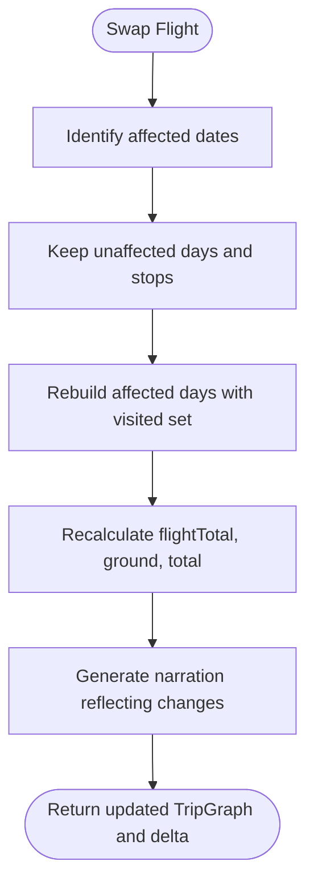

# Route Calculation Model

<cite>
**Referenced Files in This Document**
- [route.ts](file://packages/shared/src/route.ts)
- [types.ts](file://packages/shared/src/types.ts)
- [taste.ts](file://packages/shared/src/taste.ts)
- [narrate.ts](file://packages/shared/src/narrate.ts)
- [fareboard.ts](file://packages/shared/src/fareboard.ts)
- [route_agent.ts](file://apps/api/src/agents/route_agent.ts)
- [routes.ts](file://apps/api/src/routes.ts)
- [data.ts](file://apps/api/src/data.ts)
</cite>

## Table of Contents
1. [Introduction](#introduction)
2. [Project Structure](#project-structure)
3. [Core Components](#core-components)
4. [Architecture Overview](#architecture-overview)
5. [Detailed Component Analysis](#detailed-component-analysis)
6. [Dependency Analysis](#dependency-analysis)
7. [Performance Considerations](#performance-considerations)
8. [Troubleshooting Guide](#troubleshooting-guide)
9. [Conclusion](#conclusion)
10. [Appendices](#appendices)

## Introduction
This document explains the route calculation models that optimize trip itineraries in the Trip Graph Agent. It focuses on:
- The StopNode structure and its role system (anchor, food, quiet, wildcard, must).
- Travel time calculations between stops using a precomputed travel matrix.
- Budget constraint propagation across flights and ground activities.
- Optimal stop ordering under temporal constraints (opening hours, arrival buffers, airport cutoffs).
- Multi-day itinerary optimization and reflow when flight times change.
- Integration with the broader trip graph system via the RouteAgent and shared route engine.

The goal is to make the deterministic planning engine accessible to both technical and non-technical readers while preserving precise references to the implementation.

## Project Structure
The route calculation spans two layers:
- Shared route engine (pure functions, no I/O): scoring, scheduling, budgeting, narration, and reflow logic.
- API agent layer (orchestration): loading city data and matrices, parsing intents, building trips, swapping flights, and exposing endpoints.

**Diagram sources**
- [route_agent.ts:1-191](file://apps/api/src/agents/route_agent.ts#L1-L191)
- [routes.ts:1-135](file://apps/api/src/routes.ts#L1-L135)
- [data.ts:1-38](file://apps/api/src/data.ts#L1-L38)
- [route.ts:1-475](file://packages/shared/src/route.ts#L1-L475)
- [taste.ts:1-68](file://packages/shared/src/taste.ts#L1-L68)
- [narrate.ts:1-79](file://packages/shared/src/narrate.ts#L1-L79)
- [fareboard.ts:1-197](file://packages/shared/src/fareboard.ts#L1-L197)

**Section sources**
- [route_agent.ts:1-191](file://apps/api/src/agents/route_agent.ts#L1-L191)
- [routes.ts:1-135](file://apps/api/src/routes.ts#L1-L135)
- [data.ts:1-38](file://apps/api/src/data.ts#L1-L38)
- [route.ts:1-475](file://packages/shared/src/route.ts#L1-L475)

## Core Components
- StopNode: Represents a scheduled visit with place identity, arrival/departure times, travel minutes from previous stop, and role. Roles include anchor, food, quiet, wildcard, and must.
- DayPlan: A date-bound sequence of StopNodes forming one day’s itinerary.
- TripGraph: The full multi-day plan including flights, days, budget totals, narration, and explanations for dropped must-go items.
- TravelMatrix: Precomputed travel times and modes between places used to compute inter-stop durations.
- TasteVector: User preference weights per vibe tag used to score places and destinations.

Key responsibilities:
- Schedule feasibility: opening hours, minimum stay, late arrival night mode, airport cutoffs.
- Role assignment: must > food during meal windows > quiet/chill/nature > anchor; wildcard reserved for novelty.
- Budget propagation: flight total plus ground costs form a single budget; fare swaps adjust ground budget accordingly.

**Section sources**
- [types.ts:35-146](file://packages/shared/src/types.ts#L35-L146)
- [route.ts:104-161](file://packages/shared/src/route.ts#L104-L161)
- [route.ts:163-247](file://packages/shared/src/route.ts#L163-L247)
- [route.ts:269-387](file://packages/shared/src/route.ts#L269-L387)
- [fareboard.ts:46-48](file://packages/shared/src/fareboard.ts#L46-L48)

## Architecture Overview
The system builds a directed trip graph where node zero is the outbound flight. Ground stops are scheduled downstream, respecting temporal constraints and taste preferences. When flights change, only affected dates are rebuilt while preserving unaffected days and stops.

**Diagram sources**
- [routes.ts:64-85](file://apps/api/src/routes.ts#L64-L85)
- [route_agent.ts:107-153](file://apps/api/src/agents/route_agent.ts#L107-L153)
- [route.ts:349-387](file://packages/shared/src/route.ts#L349-L387)
- [fareboard.ts:46-48](file://packages/shared/src/fareboard.ts#L46-L48)
- [narrate.ts:32-39](file://packages/shared/src/narrate.ts#L32-L39)

## Detailed Component Analysis

### StopNode and Role System
StopNode captures each scheduled visit:
- placeId: unique identifier for the place.
- arrive/depart: wall-clock times in HH:mm format.
- travelMinFromPrev: travel duration from the previous stop or first-leg buffer.
- role: classification guiding narrative and selection priority:
  - must: explicitly required by user (place ID or tag match).
  - food: prioritized during meal windows.
  - quiet: chill or nature tags preferred later in the day or when space remains.
  - anchor: default category for cultural/art/history/view spots.
  - wildcard: sealed surprise that introduces novel tags aligned with taste.

Role assignment logic:
- Must takes precedence if present or matched by tags.
- Food gets boosted during meal windows; penalized outside.
- Quiet/nature favored when mood tags align and remaining time is limited.
- Anchor is the fallback.

Wildcard placement:
- Reserved slot ensures at least one novel discovery per day unless night-only mode.
- Wildcard is sealed until revealed client-side.

**Section sources**
- [types.ts:112-126](file://packages/shared/src/types.ts#L112-L126)
- [route.ts:97-109](file://packages/shared/src/route.ts#L97-L109)
- [route.ts:111-161](file://packages/shared/src/route.ts#L111-L161)
- [route.ts:163-247](file://packages/shared/src/route.ts#L163-L247)

### Travel Time Calculations Between Stops
Travel durations come from a precomputed TravelMatrix:
- ids: ordered list of place IDs.
- minutes[i][j]: travel minutes from i to j.
- mode[i][j]: transport mode (e.g., walk, drive).

First leg uses a fixed buffer to account for starting from an origin point. Missing edges fall back to the same buffer.

Open-hours validation:
- Each candidate stop must be open upon arrival and allow a minimum stay before closing (with a safety margin).
- Weekday-specific schedules are resolved from daily or per-day openHours.

**Section sources**
- [route.ts:18-44](file://packages/shared/src/route.ts#L18-L44)
- [route.ts:82-88](file://packages/shared/src/route.ts#L82-L88)
- [route.ts:189-205](file://packages/shared/src/route.ts#L189-L205)

### Budget Constraint Propagation
Budget spans air and ground:
- Flight total: base price plus checked bag fee if not included.
- Ground cost: sum of estimated costs for all selected stops.
- Total: flightTotal + ground.

When flights change:
- Reflow computes fareDelta and rebuilds only affected dates.
- Ground budget adjusts automatically because stops are reselected based on updated start/end windows and visited set.
- Narration reflects money movement into or out of ground budget.

**Section sources**
- [fareboard.ts:46-48](file://packages/shared/src/fareboard.ts#L46-L48)
- [route.ts:343-387](file://packages/shared/src/route.ts#L343-L387)
- [route.ts:414-474](file://packages/shared/src/route.ts#L414-L474)
- [narrate.ts:41-78](file://packages/shared/src/narrate.ts#L41-L78)

### Optimal Stop Ordering and Temporal Constraints
Greedy slot scoring selects the next best stop each iteration:
- Base score from taste affinity via scorePlace.
- Meal window boosts for food; penalties outside meals.
- Mood tag alignment near end-of-day increases relevance.
- Area proximity bonus when specified.
- Must-go urgency adds large priority if not yet satisfied.
- Travel cost subtracted proportionally to discourage long detours.

Temporal constraints enforced:
- Arrival buffer after landing.
- Airport cutoff before departure.
- Late arrival triggers night-food-only mode with at most one stop.
- Slow start next morning after very late arrival.
- Wildcard reserve prevents squeezing surprises too tightly.

**Section sources**
- [route.ts:111-130](file://packages/shared/src/route.ts#L111-L130)
- [route.ts:285-341](file://packages/shared/src/route.ts#L285-L341)
- [route.ts:163-247](file://packages/shared/src/route.ts#L163-L247)

### Multi-Day Itinerary Optimization
Multi-day planning:
- Generates dates from outbound arrival to return departure.
- For each date, computes startMin/endMin based on flight times and late arrival rules.
- Preserves previously placed stops across days to avoid duplicates.
- Ensures at most one wildcard per trip to maintain novelty without overexposure.

Alternatives generation:
- Produces multiple distinct day routes by excluding prior selections (except must-go).
- Useful for presenting varied plans to users.

**Section sources**
- [route.ts:296-341](file://packages/shared/src/route.ts#L296-L341)
- [route.ts:249-267](file://packages/shared/src/route.ts#L249-L267)

### Reflow: Replanning After Flight Changes
Reflow minimizes recomputation:
- Identifies affected dates (arrival day and possibly next day if late).
- Keeps unaffected days and their stops intact.
- Rebuilds only changed days, carrying forward visited set and wildcard flag.
- Computes delta metrics: fareDelta, rebuilt/dropped/added dates, day-one stop counts before/after.
- Updates budget and narration to reflect changes.

**Section sources**
- [route.ts:389-474](file://packages/shared/src/route.ts#L389-L474)

### Integration with the Broader Trip Graph System
RouteAgent orchestrates:
- Parsing user intent and generating day alternatives for quick planning.
- Creating full trips from deals by fetching flights, loading city data and matrices, and building a TripGraph.
- Swapping flights to trigger reflow and returning enriched views with place details and sealed wildcards.

HTTP routes expose:
- Taste seeding and swiping.
- Chat-based day planning.
- Trip creation, viewing, and flight swapping.
- Wildcard reveal endpoint to unmask sealed stops on demand.

**Section sources**
- [route_agent.ts:19-191](file://apps/api/src/agents/route_agent.ts#L19-L191)
- [routes.ts:10-135](file://apps/api/src/routes.ts#L10-L135)
- [data.ts:10-38](file://apps/api/src/data.ts#L10-L38)

### Example Scenarios and Constraint Satisfaction
- Late arrival scenario:
  - Night-food-only mode limits stops to food/nightlife and caps at one stop.
  - Next morning starts slower to accommodate rest.
- Must-go guarantee-or-explain:
  - If a must-go cannot fit due to opening hours or time window, it is excluded with a single explanation line.
- Wildcard novelty:
  - A sealed stop is inserted if there is room, chosen from places introducing new tags relative to user taste.
- Budget-aware swaps:
  - Cheaper flights increase ground budget; more expensive ones reduce it, reflected in narration.

These behaviors are validated by tests covering Singapore CBD day trips, must-go handling, and reflow idempotency.

**Section sources**
- [route.ts:163-247](file://packages/shared/src/route.ts#L163-L247)
- [route.ts:285-341](file://packages/shared/src/route.ts#L285-L341)
- [route.ts:414-474](file://packages/shared/src/route.ts#L414-L474)
- [route.test.ts:181-238](file://packages/shared/test/route.test.ts#L181-L238)
- [route.test.ts:239-298](file://packages/shared/test/route.test.ts#L239-L298)

## Dependency Analysis
High-level dependencies:
- RouteAgent depends on shared route functions and data loaders.
- Shared route engine depends on taste scoring, fare math, and narration utilities.
- Data loader caches city and matrix JSON files for performance.

**Diagram sources**
- [routes.ts:1-135](file://apps/api/src/routes.ts#L1-L135)
- [route_agent.ts:1-191](file://apps/api/src/agents/route_agent.ts#L1-L191)
- [route.ts:1-475](file://packages/shared/src/route.ts#L1-L475)
- [taste.ts:1-68](file://packages/shared/src/taste.ts#L1-L68)
- [fareboard.ts:1-197](file://packages/shared/src/fareboard.ts#L1-L197)
- [narrate.ts:1-79](file://packages/shared/src/narrate.ts#L1-L79)
- [data.ts:1-38](file://apps/api/src/data.ts#L1-L38)

**Section sources**
- [route_agent.ts:1-191](file://apps/api/src/agents/route_agent.ts#L1-L191)
- [route.ts:1-475](file://packages/shared/src/route.ts#L1-L475)
- [data.ts:1-38](file://apps/api/src/data.ts#L1-L38)

## Performance Considerations
- Greedy selection per slot avoids exponential search while maintaining strong heuristic quality through scoring and constraints.
- TravelMatrix lookup is O(1) per edge; overall complexity per day is O(S × P log P) where S is max stops and P is candidate pool size.
- Caching of city and matrix data reduces repeated I/O.
- Reflow rebuilds only affected dates, minimizing recomputation.
- Sealed wildcards reduce payload size and enable client-side reveals.

[No sources needed since this section provides general guidance]

## Troubleshooting Guide
Common issues and diagnostics:
- No stops selected:
  - Check opening hours and time windows; ensure startMin/endMin are realistic.
  - Verify must-go constraints are feasible given closed times.
- Wildcard not placed:
  - Ensure sufficient remaining time after reserving a wildcard slot.
  - Confirm there are candidates with novel tags and open hours.
- Budget mismatch:
  - Confirm flight totals include checked bags; verify ground costs sum correctly.
- Reflow unexpected changes:
  - Inspect affectedDates logic for late arrivals; confirm kept days and visited set.

Use explanations returned by buildDayRoute to understand why must-go items were dropped.

**Section sources**
- [route.ts:231-247](file://packages/shared/src/route.ts#L231-L247)
- [route.ts:343-387](file://packages/shared/src/route.ts#L343-L387)
- [route.ts:414-474](file://packages/shared/src/route.ts#L414-L474)

## Conclusion
The route calculation model delivers deterministic, constraint-aware itinerary planning anchored by a unified trip graph. It balances taste-driven scoring, temporal feasibility, and budget propagation across flights and ground activities. The reflow mechanism ensures rapid adaptation to flight changes while preserving stable parts of the plan. Together, these components provide a robust foundation for multi-day trip optimization and interactive planning experiences.

[No sources needed since this section summarizes without analyzing specific files]

## Appendices

### Data Models Summary
- Place: location metadata, tags, open hours, estimated stay/cost, and descriptive fields.
- TravelMatrix: pairwise travel times and modes for efficient routing.
- StopNode: scheduled visit with role and timing.
- DayPlan: date-scoped sequence of stops.
- TripGraph: complete plan with flights, days, budget, narration, and explanations.

**Section sources**
- [types.ts:35-146](file://packages/shared/src/types.ts#L35-L146)

### Algorithm Flowcharts

#### Daily Slot Selection

**Diagram sources**
- [route.ts:163-247](file://packages/shared/src/route.ts#L163-L247)
- [route.ts:111-130](file://packages/shared/src/route.ts#L111-L130)

#### Reflow After Flight Swap

**Diagram sources**
- [route.ts:414-474](file://packages/shared/src/route.ts#L414-L474)
- [route.ts:343-387](file://packages/shared/src/route.ts#L343-L387)