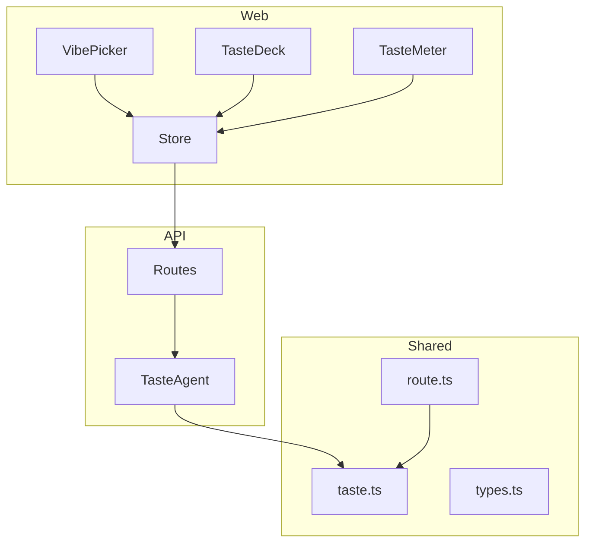
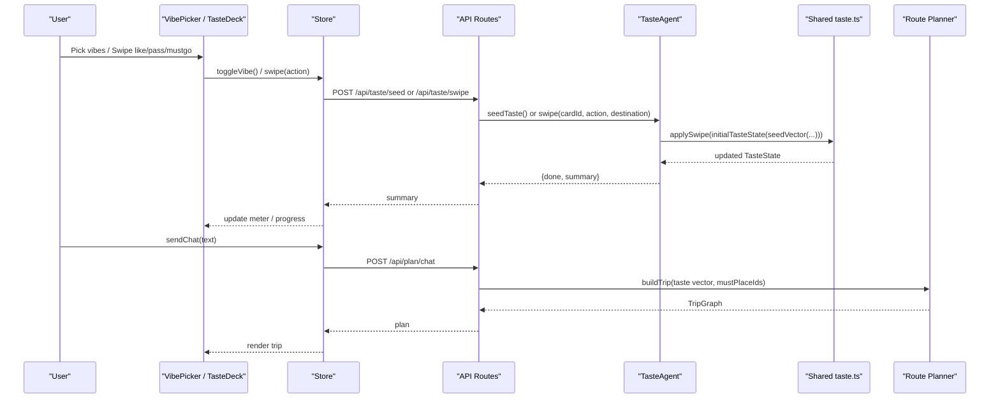
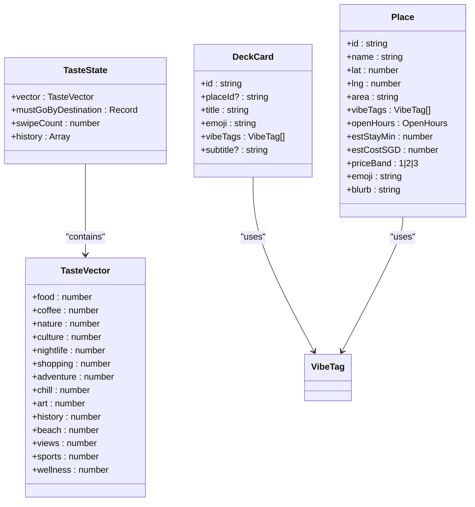
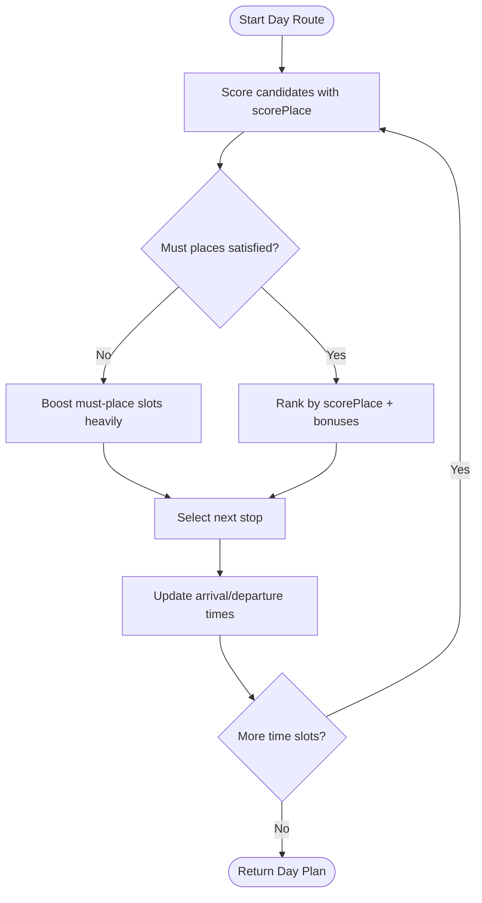
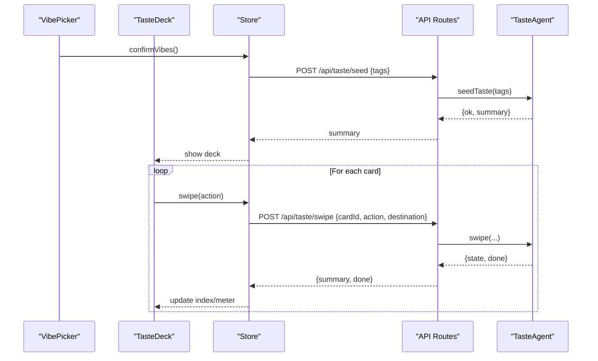
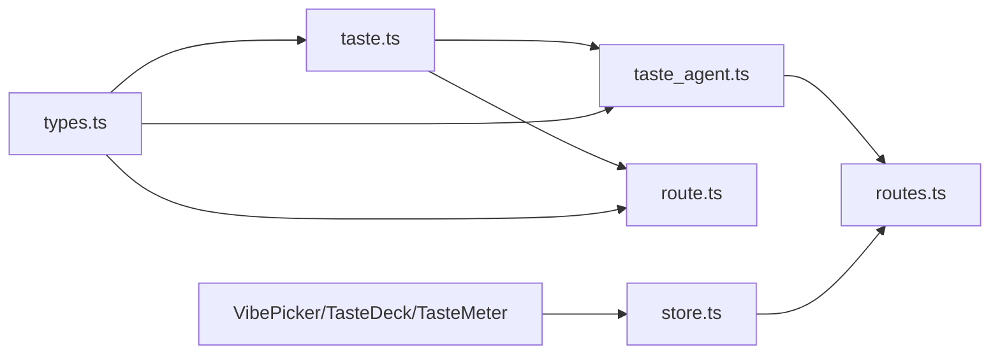

# Taste Scoring Model

<cite>
**Referenced Files in This Document**
- [taste.ts](file://packages/shared/src/taste.ts)
- [types.ts](file://packages/shared/src/types.ts)
- [taste_agent.ts](file://apps/api/src/agents/taste_agent.ts)
- [routes.ts](file://apps/api/src/routes.ts)
- [TasteDeck.tsx](file://apps/web/src/components/onboarding/TasteDeck.tsx)
- [TasteMeter.tsx](file://apps/web/src/components/onboarding/TasteMeter.tsx)
- [VibePicker.tsx](file://apps/web/src/components/onboarding/VibePicker.tsx)
- [store.ts](file://apps/web/src/store.ts)
- [route.ts](file://packages/shared/src/route.ts)
- [taste.test.ts](file://packages/shared/test/taste.test.ts)
</cite>

## Table of Contents
1. Introduction
2. Project Structure
3. Core Components
4. Architecture Overview
5. Detailed Component Analysis
6. Dependency Analysis
7. Performance Considerations
8. Troubleshooting Guide
9. Conclusion

## Introduction
This document explains the taste scoring system that powers preference learning for the Trip Graph Agent. It covers:
- The TasteState interface and how it evolves over time
- How swipe interactions (like, pass, mustgo) translate into numerical preference vectors across vibe categories
- The algorithm for updating taste vectors from swipe history
- The role of must-go items per destination
- How the scoring system influences trip generation via place ranking and route construction

The goal is to make the model accessible to both technical and non-technical readers while providing precise formulas, example calculations, and integration points with the broader trip planning system.

## Project Structure
The taste system spans shared logic, API orchestration, and UI components:
- Shared core: taste vector math, state transitions, and place scoring
- API agent: session management, deck generation, and summary computation
- Web UI: vibe selection, swipe deck, and progress meter
- Route planner: uses the taste vector to score places and build day routes and trips

**Diagram sources**
- [TasteDeck.tsx:1-22](file://apps/web/src/components/onboarding/TasteDeck.tsx#L1-L22)
- [TasteMeter.tsx:1-32](file://apps/web/src/components/onboarding/TasteMeter.tsx#L1-L32)
- [VibePicker.tsx:1-55](file://apps/web/src/components/onboarding/VibePicker.tsx#L1-L55)
- [store.ts:100-127](file://apps/web/src/store.ts#L100-L127)
- [routes.ts:25-50](file://apps/api/src/routes.ts#L25-L50)
- [taste_agent.ts:28-110](file://apps/api/src/agents/taste_agent.ts#L28-L110)
- [taste.ts:16-67](file://packages/shared/src/taste.ts#L16-L67)
- [route.ts:111-150](file://packages/shared/src/route.ts#L111-L150)

**Section sources**
- [taste.ts:16-67](file://packages/shared/src/taste.ts#L16-L67)
- [taste_agent.ts:28-110](file://apps/api/src/agents/taste_agent.ts#L28-L110)
- [routes.ts:25-50](file://apps/api/src/routes.ts#L25-L50)
- [TasteDeck.tsx:1-22](file://apps/web/src/components/onboarding/TasteDeck.tsx#L1-L22)
- [TasteMeter.tsx:1-32](file://apps/web/src/components/onboarding/TasteMeter.tsx#L1-L32)
- [VibePicker.tsx:1-55](file://apps/web/src/components/onboarding/VibePicker.tsx#L1-L55)
- [store.ts:100-127](file://apps/web/src/store.ts#L100-L127)
- [route.ts:111-150](file://packages/shared/src/route.ts#L111-L150)

## Core Components
- TasteVector: a map from each VibeTag to a numeric weight representing user preference strength for that category.
- SwipeAction: discrete actions like like, pass, mustgo that shift weights by fixed amounts.
- TasteState: current vector plus per-destination must-go lists, swipe count, and history for undo.
- Place scoring: converts a vector and place tags into a single number used to rank stops.

Key behaviors:
- Seeding: initial positive weights for chosen vibes.
- Swiping: increment/decrement weights per tag on the card; clamp within bounds.
- Must-go: record specific place IDs per destination alongside vector updates.
- Undo: restore previous vector and must-go lists exactly.

**Section sources**
- [types.ts:1-84](file://packages/shared/src/types.ts#L1-L84)
- [taste.ts:16-67](file://packages/shared/src/taste.ts#L16-L67)

## Architecture Overview
End-to-end flow from user interaction to trip generation:

**Diagram sources**
- [routes.ts:25-56](file://apps/api/src/routes.ts#L25-L56)
- [taste_agent.ts:28-110](file://apps/api/src/agents/taste_agent.ts#L28-L110)
- [taste.ts:20-67](file://packages/shared/src/taste.ts#L20-L67)
- [route.ts:314-356](file://packages/shared/src/route.ts#L314-L356)
- [store.ts:100-203](file://apps/web/src/store.ts#L100-L203)

## Detailed Component Analysis

### TasteState Interface and Lifecycle
- TasteState holds:
  - vector: current preference weights per vibe tag
  - mustGoByDestination: per-destination list of place IDs marked as must-go
  - swipeCount: total swipes performed
  - history: snapshots enabling undo
- Lifecycle:
  - Seed: pick at least five vibes to initialize vector with small positive weights
  - Swipe: update vector and optionally append a must-go entry
  - Undo: revert to previous snapshot

**Diagram sources**
- [types.ts:18-84](file://packages/shared/src/types.ts#L18-L84)

**Section sources**
- [types.ts:18-84](file://packages/shared/src/types.ts#L18-L84)
- [taste.ts:26-61](file://packages/shared/src/taste.ts#L26-L61)

### Swipe-Based Preference Learning Mechanics
- Weights:
  - like: +0.3 per matching tag
  - pass: -0.15 per matching tag
  - mustgo: +0.6 per matching tag
- Bounds:
  - Each tag weight is clamped between -1 and 2
- Must-go:
  - When mustgo is used and the card has a placeId, that ID is appended to the list for the given destination key (default "home")
- History and undo:
  - Each swipe pushes the previous vector and must-go map onto history
  - undo restores the prior state exactly

Mathematical update rule:
- For each tag t in card.vibeTags:
  - w_t ← clamp(w_t + Δ(action), -1, 2)
  - where Δ(like)=+0.3, Δ(pass)=-0.15, Δ(mustgo)=+0.6

Example calculation:
- Initial seed: food=0.5, others=0
- Like a card with tags ["nature", "chill"]:
  - nature: 0 + 0.3 = 0.3
  - chill: 0 + 0.3 = 0.3
- Pass a card with tags ["nightlife"]:
  - nightlife: 0 - 0.15 = -0.15
- Mustgo a card with tags ["views"] and placeId "sg-mbs-skypark":
  - views: 0 + 0.6 = 0.6
  - mustGoByDestination.home includes "sg-mbs-skypark"

Clamping ensures no tag exceeds [-1, 2].

**Section sources**
- [taste.ts:11-14](file://packages/shared/src/taste.ts#L11-L14)
- [taste.ts:30-49](file://packages/shared/src/taste.ts#L30-L49)
- [taste.test.ts:43-76](file://packages/shared/test/taste.test.ts#L43-L76)
- [taste.test.ts:78-112](file://packages/shared/test/taste.test.ts#L78-L112)

### Place Scoring Algorithm
- Purpose: convert a taste vector and a place’s vibe tags into a single scalar score used to rank candidates.
- Formula:
  - score(place) = (Σ_{t ∈ place.vibeTags} w_t) / sqrt(|place.vibeTags|)
- Effect:
  - Aggregates aligned preferences
  - Normalizes by tag count to avoid bias toward places with many tags

Example:
- Vector: food=0.8, culture=0.3, nature=0.0
- Place A tags: ["food"] → score = 0.8 / sqrt(1) = 0.8
- Place B tags: ["food", "culture"] → score = (0.8 + 0.3) / sqrt(2) ≈ 0.78
- Place C tags: ["nature", "chill"] → score = (0.0 + 0.0) / sqrt(2) = 0.0

This deterministic scoring is used throughout route building to select high-preference stops.

**Section sources**
- [taste.ts:63-67](file://packages/shared/src/taste.ts#L63-L67)
- [taste.test.ts:114-129](file://packages/shared/test/taste.test.ts#L114-L129)

### Role of Must-Go Items
- Must-go entries are stored per destination key (e.g., "home", "da-nang", "bangkok").
- They persist independently across destinations and are restored correctly on undo.
- During trip generation, must-go place IDs are injected as mandatory stops in the route builder.

Integration point:
- The route builder accepts mustPlaceIds and treats them as highest priority when slotting stops.

**Section sources**
- [taste.ts:40-43](file://packages/shared/src/taste.ts#L40-L43)
- [taste.test.ts:78-112](file://packages/shared/test/taste.test.ts#L78-L112)
- [route.ts:90-108](file://packages/shared/src/route.ts#L90-L108)

### Integration Points with Trip Planning
- After seeding and swiping, the client calls chat/plan endpoints which forward the current taste vector and must-go constraints to the route planner.
- The planner constructs day routes using:
  - scorePlace for candidate ranking
  - must-place enforcement for must-go items
  - additional heuristics (meal windows, mood tags, area filters, travel times)
- The result is a TripGraph with days, stops, budget, and explanations.

**Diagram sources**
- [route.ts:111-150](file://packages/shared/src/route.ts#L111-L150)
- [route.ts:314-356](file://packages/shared/src/route.ts#L314-L356)

**Section sources**
- [routes.ts:52-56](file://apps/api/src/routes.ts#L52-L56)
- [route.ts:111-150](file://packages/shared/src/route.ts#L111-L150)
- [route.ts:314-356](file://packages/shared/src/route.ts#L314-L356)

### UI Flow and State Management
- VibePicker: collect at least five vibes to seed the taste thread
- TasteDeck: present a 15-card deck per destination; track progress and allow undo
- TasteMeter: visualize strength and top tags learned so far
- Store: orchestrates API calls, maintains local phase and deck indices, and forwards results back to UI

**Diagram sources**
- [VibePicker.tsx:20-55](file://apps/web/src/components/onboarding/VibePicker.tsx#L20-L55)
- [TasteDeck.tsx:9-21](file://apps/web/src/components/onboarding/TasteDeck.tsx#L9-L21)
- [store.ts:100-127](file://apps/web/src/store.ts#L100-L127)
- [routes.ts:25-44](file://apps/api/src/routes.ts#L25-L44)
- [taste_agent.ts:28-84](file://apps/api/src/agents/taste_agent.ts#L28-L84)

**Section sources**
- [VibePicker.tsx:20-55](file://apps/web/src/components/onboarding/VibePicker.tsx#L20-L55)
- [TasteDeck.tsx:9-21](file://apps/web/src/components/onboarding/TasteDeck.tsx#L9-L21)
- [TasteMeter.tsx:1-32](file://apps/web/src/components/onboarding/TasteMeter.tsx#L1-L32)
- [store.ts:100-127](file://apps/web/src/store.ts#L100-L127)
- [routes.ts:25-44](file://apps/api/src/routes.ts#L25-L44)
- [taste_agent.ts:28-84](file://apps/api/src/agents/taste_agent.ts#L28-L84)

## Dependency Analysis
- Shared layer (taste.ts, types.ts) defines pure functions and data structures consumed by both API and route planner.
- API layer (taste_agent.ts, routes.ts) manages sessions, decks, and exposes HTTP endpoints.
- Web layer (components, store) drives user interactions and persists local state.
- Route planner depends on taste scoring to prioritize places and enforce must-go constraints.

**Diagram sources**
- [taste.ts:1-67](file://packages/shared/src/taste.ts#L1-L67)
- [types.ts:1-84](file://packages/shared/src/types.ts#L1-L84)
- [taste_agent.ts:1-118](file://apps/api/src/agents/taste_agent.ts#L1-L118)
- [routes.ts:25-56](file://apps/api/src/routes.ts#L25-L56)
- [store.ts:100-203](file://apps/web/src/store.ts#L100-L203)
- [route.ts:111-150](file://packages/shared/src/route.ts#L111-L150)

**Section sources**
- [taste.ts:1-67](file://packages/shared/src/taste.ts#L1-L67)
- [taste_agent.ts:1-118](file://apps/api/src/agents/taste_agent.ts#L1-L118)
- [routes.ts:25-56](file://apps/api/src/routes.ts#L25-L56)
- [store.ts:100-203](file://apps/web/src/store.ts#L100-L203)
- [route.ts:111-150](file://packages/shared/src/route.ts#L111-L150)

## Performance Considerations
- Vector updates are O(k) per swipe where k is the number of tags on the card; typical k is small, making this efficient.
- Clamping and simple arithmetic ensure minimal overhead.
- Place scoring is O(k) per candidate; used during route construction where candidate sets are bounded by city/place limits.
- Deck caching in the API reduces repeated work for generating diverse cards per city.
- Undo uses immutable snapshots; memory grows linearly with swipe count but remains small for a 15-card deck.

[No sources needed since this section provides general guidance]

## Troubleshooting Guide
Common issues and resolutions:
- Not seeded:
  - Symptom: errors when calling swipe or plan without seeding
  - Resolution: call seed endpoint with at least five valid vibes first
- Unknown card:
  - Symptom: error indicating unknown cardId
  - Resolution: ensure the cardId corresponds to the current deck item
- Undo edge cases:
  - Ensure history exists before undoing; if empty, state remains unchanged
- Destination-scoped must-go:
  - Verify destination parameter is correct when swiping destination decks; undo restores only the last swiped destination’s list

**Section sources**
- [routes.ts:25-50](file://apps/api/src/routes.ts#L25-L50)
- [taste_agent.ts:69-92](file://apps/api/src/agents/taste_agent.ts#L69-L92)
- [taste.ts:52-61](file://packages/shared/src/taste.ts#L52-L61)

## Conclusion
The taste scoring model translates user swipes into a robust, bounded preference vector that guides place ranking and trip construction. With clear mathematical rules, deterministic scoring, and per-destination must-go tracking, the system balances personalization with discoverability. Integrated through clean APIs and a responsive UI, it enables seamless progression from vibe selection to personalized trip graphs.

[No sources needed since this section summarizes without analyzing specific files]