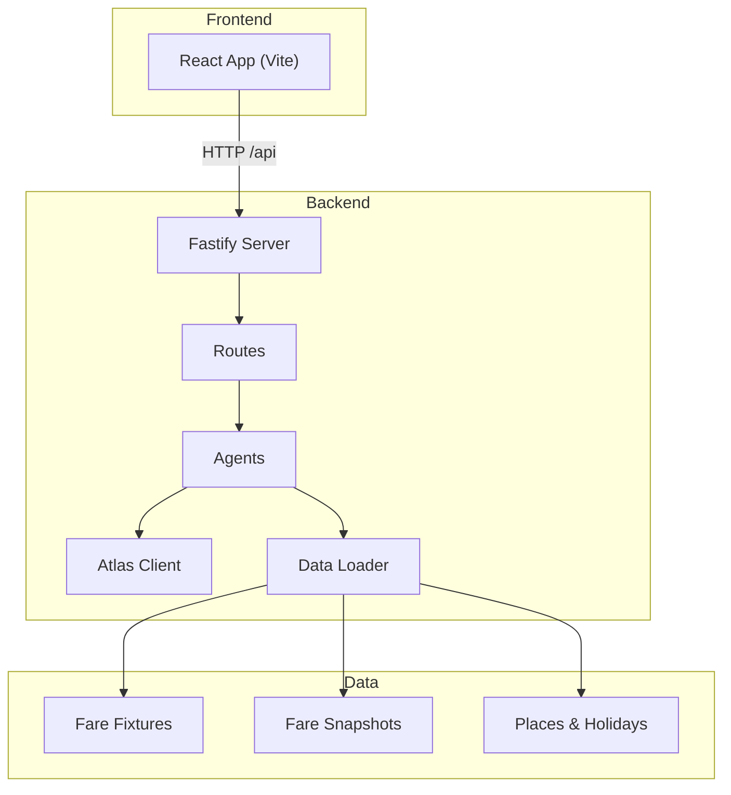
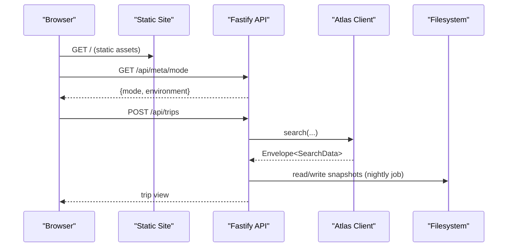
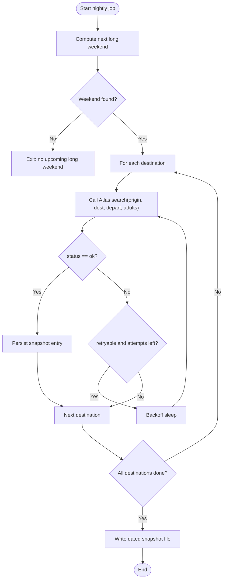
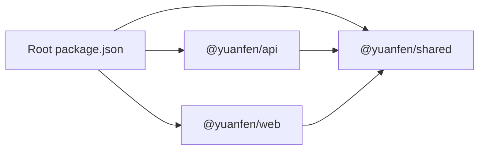

# Deployment Guide

<cite>
**Referenced Files in This Document**
- [server.ts](file://apps/api/src/server.ts)
- [routes.ts](file://apps/api/src/routes.ts)
- [fare_board.ts](file://apps/api/src/agents/fare_board.ts)
- [run_fareboard.ts](file://apps/api/src/jobs/run_fareboard.ts)
- [index.ts](file://apps/api/src/atlas/index.ts)
- [types.ts](file://apps/api/src/atlas/types.ts)
- [data.ts](file://apps/api/src/data.ts)
- [vite.config.ts](file://apps/web/vite.config.ts)
- [package.json](file://package.json)
- [api/package.json](file://apps/api/package.json)
- [web/package.json](file://apps/web/package.json)
- [fare-board-nightly.md](file://infra/scheduled-tasks/fare-board-nightly.md)
- [.gitignore](file://.gitignore)
</cite>

## Table of Contents
1. Introduction
2. Project Structure
3. Core Components
4. Architecture Overview
5. Detailed Component Analysis
6. Dependency Analysis
7. Performance Considerations
8. Troubleshooting Guide
9. Conclusion
10. Appendices

## Introduction
This guide documents production deployment for the Trip Graph Agent, covering:
- Fastify API server configuration and runtime environment
- React frontend build with Vite and serving strategies
- Scheduled nightly fare-board batch jobs using Qoder Scheduled Tasks
- Containerization guidance, scaling considerations, and monitoring approaches
- Security considerations for Atlas Skill authentication and data privacy
- Deployment checklists, rollback procedures, and operational runbooks

The system consists of a Node.js Fastify API and a React frontend built with Vite. The API integrates with an Atlas Skill client that can operate in fixture mode (offline) or CLI mode (live). A nightly job runs fare searches over a fixed destination set and persists snapshots used by the per-user alert flow.

## Project Structure
The repository is a monorepo with two apps and shared packages:
- apps/api: Fastify server, agents, Atlas integration, routes, and nightly job entrypoint
- apps/web: React application built with Vite; proxies /api to the backend during development
- packages/shared: Shared types and utilities used by both apps
- infra/scheduled-tasks: Qoder Scheduled Task definition for the nightly fare-board job
- data: Static datasets including places, holidays, routing matrices, and fare fixtures/snapshots

**Diagram sources**
- [server.ts:8-12](file://apps/api/src/server.ts#L8-L12)
- [routes.ts:10-134](file://apps/api/src/routes.ts#L10-L134)
- [fare_board.ts:41-82](file://apps/api/src/agents/fare_board.ts#L41-L82)
- [index.ts:10-13](file://apps/api/src/atlas/index.ts#L10-L13)
- [data.ts:17-37](file://apps/api/src/data.ts#L17-L37)

**Section sources**
- [server.ts:8-25](file://apps/api/src/server.ts#L8-L25)
- [vite.config.ts:4-12](file://apps/web/vite.config.ts#L4-L12)
- [package.json:5-13](file://package.json#L5-L13)

## Core Components
- Fastify API server: Initializes CORS, registers routes, and starts listening on a configurable port. It binds to 0.0.0.0 for containerized deployments.
- Routes: Expose endpoints for taste, planning, fare alerts, trips, booking verification/order/pay, and evidence logging.
- Atlas client abstraction: Switches between fixture and CLI modes based on environment variables. Fixture mode reads from local JSON; CLI mode shells out to the authorized atlas-flight CLI.
- Nightly fare-board job: Orchestrates fare searches across a fixed destination set, backs off on retryable errors, and writes dated snapshot files.
- Frontend: Vite dev server proxies /api to the backend; production builds static assets served by any web server or CDN.

Key environment variables:
- API_PORT: Port for the Fastify server (default 8787)
- ATLAS_MODE: Controls Atlas client behavior ("fixture" default, "cli" for live)

**Section sources**
- [server.ts:8-25](file://apps/api/src/server.ts#L8-L25)
- [index.ts:10-13](file://apps/api/src/atlas/index.ts#L10-L13)
- [routes.ts:10-134](file://apps/api/src/routes.ts#L10-L134)
- [run_fareboard.ts:5-15](file://apps/api/src/jobs/run_fareboard.ts#L5-L15)

## Architecture Overview
Production topology options:
- Single-host reverse proxy: Serve the React static build behind a reverse proxy (e.g., Nginx) and route /api to the Fastify API process.
- Separate services: Deploy the React build to a CDN or static hosting and the Fastify API as a managed service (container or serverless).
- Monolith: Run both the API and serve the static build from the same process if desired.

**Diagram sources**
- [routes.ts:58-70](file://apps/api/src/routes.ts#L58-L70)
- [fare_board.ts:41-82](file://apps/api/src/agents/fare_board.ts#L41-L82)
- [index.ts:10-13](file://apps/api/src/atlas/index.ts#L10-L13)

## Detailed Component Analysis

### Fastify API Server
- Binds to 0.0.0.0 and listens on API_PORT (default 8787).
- Registers CORS allowing all origins for development; tighten in production.
- Creates an Atlas client based on ATLAS_MODE and passes it into route handlers.

Operational notes:
- Ensure the process manager restarts the server on failure.
- Set API_PORT via environment configuration.
- In production, consider enabling structured logging and health checks.

**Section sources**
- [server.ts:8-25](file://apps/api/src/server.ts#L8-L25)

### Atlas Client Integration
- Mode selection: ATLAS_MODE=cli uses the CLI client; otherwise, fixture client reads local JSON fixtures.
- Environment exposure: The client exposes mode and environment to routes for observability.

Security note:
- When ATLAS_MODE=cli, ensure the host has authorized access to the Atlas Sandbox CLI and that credentials are not logged.
- Avoid logging request payloads containing sensitive identifiers.

**Section sources**
- [index.ts:10-13](file://apps/api/src/atlas/index.ts#L10-L13)
- [types.ts:80-90](file://apps/api/src/atlas/types.ts#L80-L90)

### Routes and Endpoints
- Taste, planning, and fare alert endpoints rely on stored snapshots and optional in-memory fallback when no snapshots exist yet.
- Booking endpoints orchestrate verify, accept price change, order creation, payment, and status queries through the Atlas client.
- Evidence endpoint returns mode/environment and call logs for auditability.

Production considerations:
- Validate inputs and return consistent error shapes.
- Rate-limit sensitive endpoints if exposed publicly.
- Restrict CORS to known domains in production.

**Section sources**
- [routes.ts:10-134](file://apps/api/src/routes.ts#L10-L134)

### Nightly Fare-Board Batch Job
- Runs over a fixed origin and destinations defined in data/places/destinations.json.
- Computes the next long weekend window and departs the evening before.
- Backs off on retryable responses and persists a dated snapshot file under data/fares/snapshots.
- Per-user alert path ranks stored snapshots without live calls.

Operational notes:
- Use Qoder Scheduled Tasks to run daily at 02:00 SGT.
- Ensure the environment has ATLAS_MODE configured appropriately for the target environment.
- Commit only new snapshot files after successful runs.

**Diagram sources**
- [fare_board.ts:41-82](file://apps/api/src/agents/fare_board.ts#L41-L82)

**Section sources**
- [fare_board.ts:15-118](file://apps/api/src/agents/fare_board.ts#L15-L118)
- [run_fareboard.ts:5-15](file://apps/api/src/jobs/run_fareboard.ts#L5-L15)
- [fare-board-nightly.md:1-35](file://infra/scheduled-tasks/fare-board-nightly.md#L1-L35)

### Data Loading and Persistence
- Reads static datasets (places, holidays, routing matrices) with caching in memory.
- Writes fare snapshots to data/fares/snapshots/<date>.json.
- Ensures directories exist before writing.

Production considerations:
- Mount persistent storage for data/fares/snapshots if running containers.
- Back up snapshot directory regularly.
- Keep fixtures small and curated; avoid committing large raw pulls.

**Section sources**
- [data.ts:1-37](file://apps/api/src/data.ts#L1-L37)
- [fare_board.ts:75-82](file://apps/api/src/agents/fare_board.ts#L75-L82)

### Frontend Build and Serving
- Development: Vite dev server proxies /api to http://localhost:8787.
- Production: Build static assets with vite build and serve via a web server or CDN. Configure base URL and API base path as needed.

Deployment options:
- Reverse proxy: Serve static assets and proxy /api to the API service.
- CDN + API: Host static assets on a CDN and call the API directly from the browser (ensure CORS is configured correctly).

**Section sources**
- [vite.config.ts:4-12](file://apps/web/vite.config.ts#L4-L12)
- [web/package.json:6-10](file://apps/web/package.json#L6-L10)

## Dependency Analysis
Top-level scripts orchestrate workspace commands:
- npm run dev: Starts both API and web concurrently
- npm test: Runs tests
- npm run fareboard: Executes the nightly job entrypoint

Workspace layout:
- apps/* and packages/* are workspaces; dependencies are declared per app and shared package.

**Diagram sources**
- [package.json:5-13](file://package.json#L5-L13)

**Section sources**
- [package.json:5-13](file://package.json#L5-L13)
- [api/package.json:6-13](file://apps/api/package.json#L6-L13)
- [web/package.json:6-17](file://apps/web/package.json#L6-L17)

## Performance Considerations
- Caching: Data loader caches city and matrix lookups in memory; this reduces disk I/O on repeated requests.
- Backoff: Nightly job implements exponential backoff for retryable errors to respect rate limits.
- Snapshot-based ranking: Per-user alert path ranks stored snapshots, avoiding live calls and reducing latency.
- Frontend: Vite produces optimized static assets; leverage CDN caching headers for performance.

[No sources needed since this section provides general guidance]

## Troubleshooting Guide
Common issues and resolutions:
- API does not start: Check API_PORT binding and ensure port is available; review console logs for startup errors.
- ATLAS_MODE misconfiguration: Verify ATLAS_MODE value; fixture mode requires valid fixtures; cli mode requires authorized CLI environment.
- Nightly job fails: Confirm scheduled task execution context, filesystem write permissions for data/fares/snapshots, and network access for CLI mode.
- CORS errors in browser: Ensure production CORS allows your frontend domain; adjust server CORS settings accordingly.
- Missing snapshots: If no snapshots exist, the per-user alert path performs an in-memory fixture pass; verify fixture data availability.

Operational tips:
- Use the /api/evidence endpoint to inspect mode, environment, and recent calls for debugging.
- Inspect snapshot files in data/fares/snapshots for correctness and completeness.

**Section sources**
- [server.ts:15-25](file://apps/api/src/server.ts#L15-L25)
- [index.ts:10-13](file://apps/api/src/atlas/index.ts#L10-L13)
- [routes.ts:117-134](file://apps/api/src/routes.ts#L117-L134)
- [fare_board.ts:97-118](file://apps/api/src/agents/fare_board.ts#L97-L118)

## Conclusion
Deploy the Fastify API with explicit environment configuration for ports and Atlas mode, build the React frontend with Vite, and serve static assets via a web server or CDN. Schedule the nightly fare-board job using Qoder Scheduled Tasks to maintain fresh snapshots. Harden security by tightening CORS, protecting secrets, and auditing logs. Monitor API health, job success, and snapshot freshness to ensure reliable operation.

[No sources needed since this section summarizes without analyzing specific files]

## Appendices

### Environment Configuration
- API_PORT: Port for the Fastify server (default 8787)
- ATLAS_MODE: "fixture" (default) or "cli" for live Atlas Sandbox

Set these in your process manager or platform environment. Do not commit secrets to version control.

**Section sources**
- [server.ts:15-25](file://apps/api/src/server.ts#L15-L25)
- [index.ts:10-13](file://apps/api/src/atlas/index.ts#L10-L13)

### Build Processes
- Install dependencies at root: npm install
- Run tests: npm test
- Start dev servers: npm run dev
- Build frontend: npm run build -w @yuanfen/web
- Run nightly job: npm run fareboard

**Section sources**
- [package.json:9-13](file://package.json#L9-L13)
- [web/package.json:6-10](file://apps/web/package.json#L6-L10)
- [api/package.json:6-8](file://apps/api/package.json#L6-L8)

### Scheduled Task Setup (Qoder)
- Create a Qoder Scheduled Task named fare-board-nightly
- Schedule daily at 02:00 SGT
- Use cheap tier model
- Goal mode off
- Instructions include running npm run fareboard, verifying snapshot output, handling retries, and committing only the new snapshot file

**Section sources**
- [fare-board-nightly.md:1-35](file://infra/scheduled-tasks/fare-board-nightly.md#L1-L35)

### Containerization Strategy
- API: Package the Node.js process with a minimal image; expose API_PORT; mount persistent volume for data/fares/snapshots; set environment variables for API_PORT and ATLAS_MODE.
- Frontend: Build static assets and serve via a lightweight HTTP server or CDN.
- Secrets: Inject secrets via secure environment variables; do not bake them into images.

[No sources needed since this section provides general guidance]

### Scaling Considerations
- Stateless API: Scale horizontally behind a load balancer; ensure shared state is avoided or externalized.
- Nightly job: Run as a single instance per schedule; ensure idempotency and robust error handling.
- Storage: Use durable storage for snapshots; back up regularly.

[No sources needed since this section provides general guidance]

### Monitoring Approaches
- Health checks: Add a simple /health endpoint returning status and uptime.
- Metrics: Log request counts, error rates, and job run durations.
- Alerts: Alert on failed job runs, high error rates, and missing snapshots.
- Audit: Use /api/evidence to trace calls and environment details.

[No sources needed since this section provides general guidance]

### Security Considerations
- CORS: Restrict allowed origins in production to your frontend domain(s).
- Authentication: If exposing public APIs, add authentication and authorization layers.
- Secrets: Store Atlas credentials securely; never log sensitive payloads.
- Data privacy: Avoid logging passenger or personal data; sanitize logs.

**Section sources**
- [server.ts:8-12](file://apps/api/src/server.ts#L8-L12)
- [routes.ts:117-134](file://apps/api/src/routes.ts#L117-L134)

### Deployment Checklist
- Environment variables set: API_PORT, ATLAS_MODE
- Dependencies installed and tests passing
- Frontend built successfully
- CORS configured for production domains
- Nightly scheduled task created and verified
- Persistent storage mounted for snapshots
- Logging and monitoring enabled
- Rollback plan documented and tested

**Section sources**
- [server.ts:8-25](file://apps/api/src/server.ts#L8-L25)
- [fare-board-nightly.md:1-35](file://infra/scheduled-tasks/fare-board-nightly.md#L1-L35)

### Rollback Procedures
- Revert code changes and redeploy previous known-good version
- Restore snapshot directory from backup if corrupted
- Re-run nightly job to regenerate snapshots if necessary
- Verify API health and key endpoints post-rollback

[No sources needed since this section provides general guidance]

### Operational Runbooks
- Restart API: Graceful restart via process manager; confirm port binding and logs
- Regenerate snapshots: Trigger nightly job manually; validate output files
- Investigate errors: Check /api/evidence, review logs, and inspect snapshot contents
- Update environments: Change ATLAS_MODE or API_PORT and redeploy

**Section sources**
- [routes.ts:117-134](file://apps/api/src/routes.ts#L117-L134)
- [fare_board.ts:41-82](file://apps/api/src/agents/fare_board.ts#L41-L82)