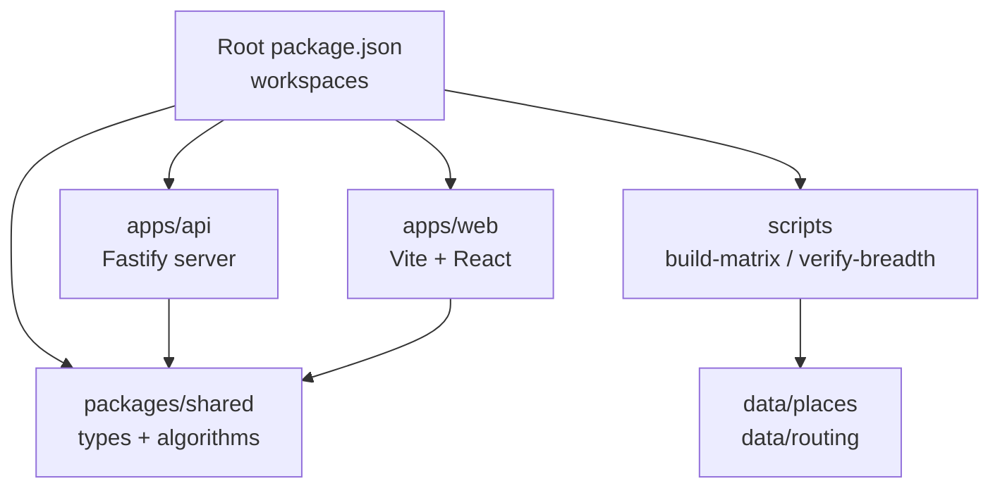
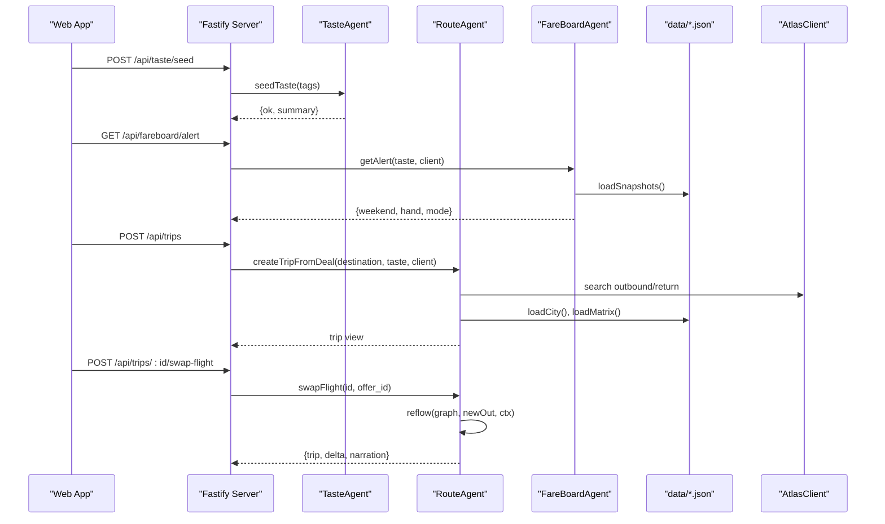
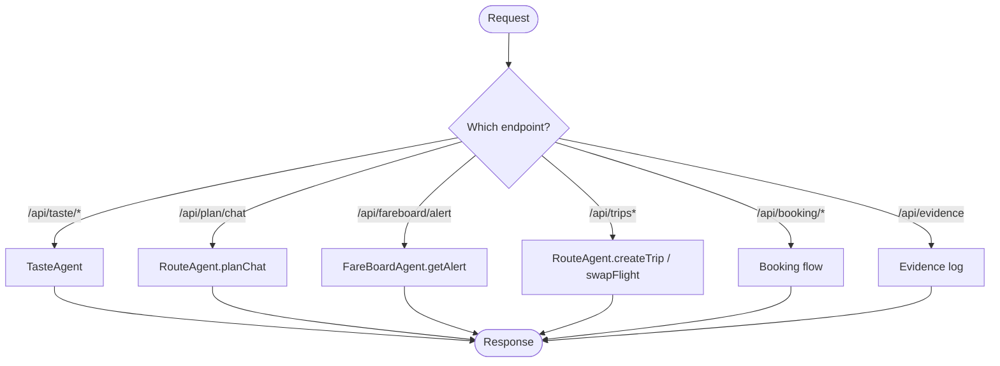
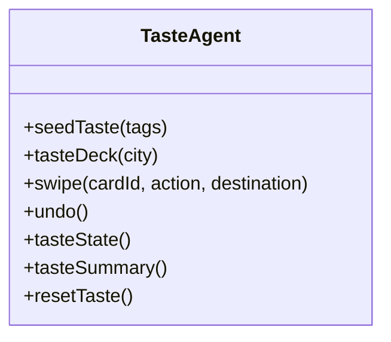
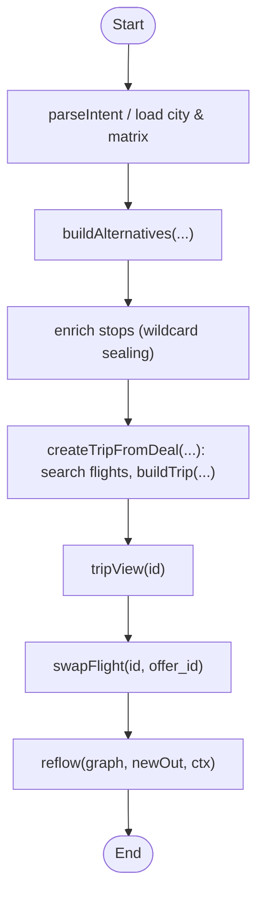
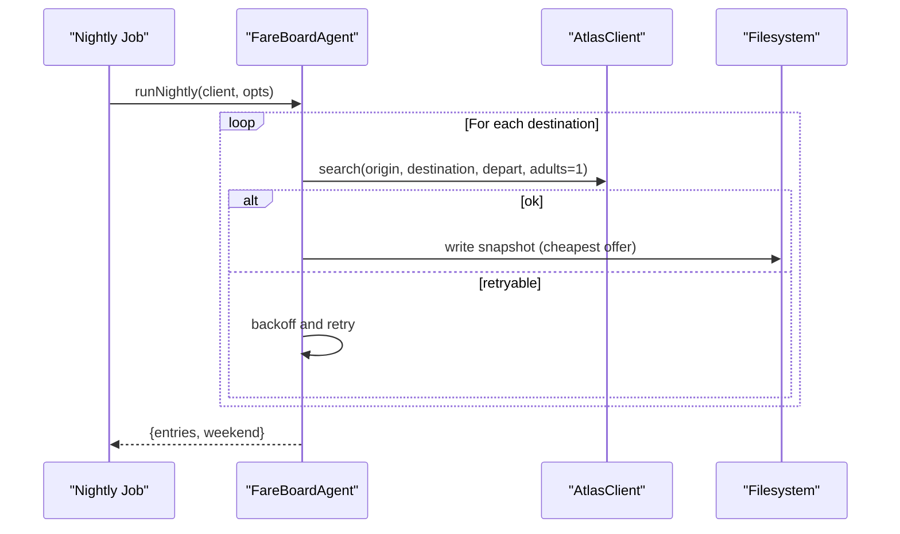
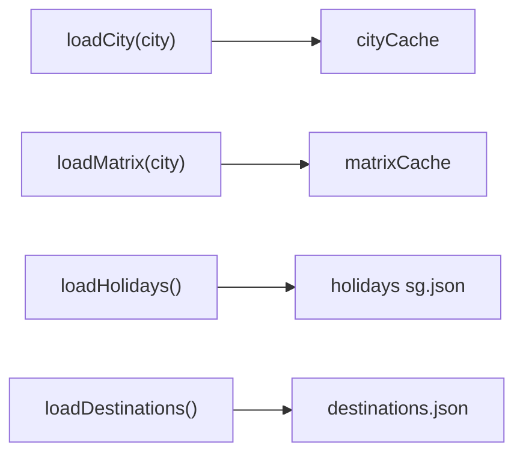
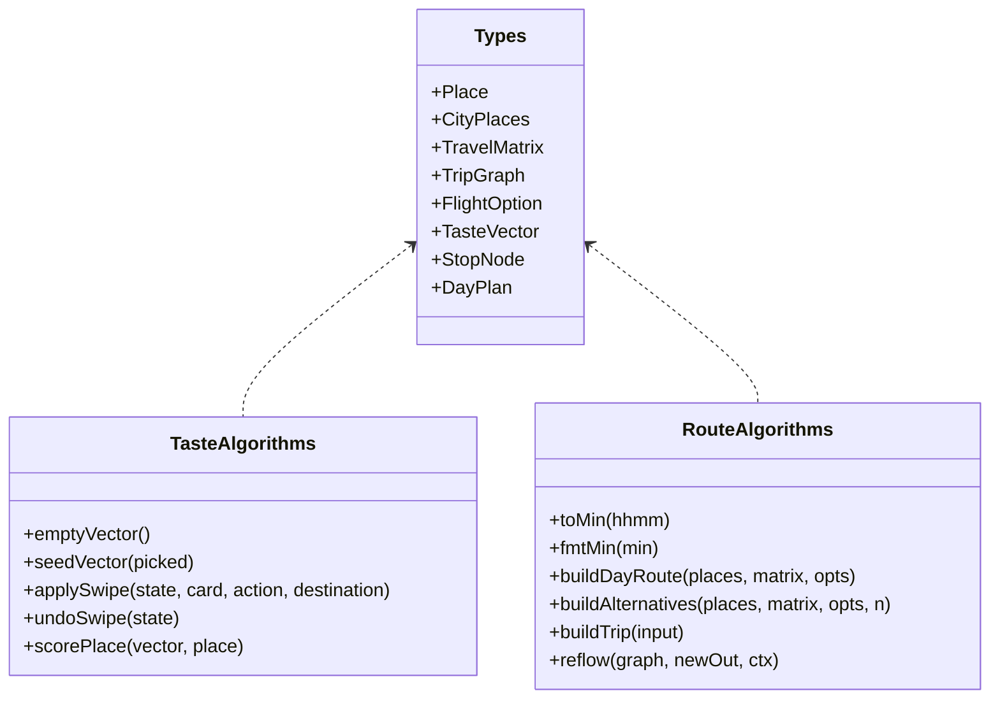
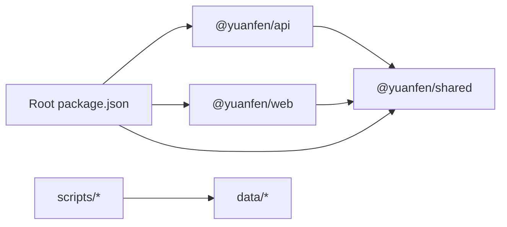

# Developer Guide

<cite>
**Referenced Files in This Document**
- [README.md](file://README.md)
- [package.json](file://package.json)
- [tsconfig.base.json](file://tsconfig.base.json)
- [vitest.config.ts](file://vitest.config.ts)
- [apps/api/package.json](file://apps/api/package.json)
- [apps/web/package.json](file://apps/web/package.json)
- [packages/shared/package.json](file://packages/shared/package.json)
- [packages/shared/src/index.ts](file://packages/shared/src/index.ts)
- [packages/shared/src/types.ts](file://packages/shared/src/types.ts)
- [packages/shared/src/taste.ts](file://packages/shared/src/taste.ts)
- [packages/shared/src/route.ts](file://packages/shared/src/route.ts)
- [scripts/build-matrix.mjs](file://scripts/build-matrix.mjs)
- [scripts/verify-breadth.mjs](file://scripts/verify-breadth.mjs)
- [apps/api/src/server.ts](file://apps/api/src/server.ts)
- [apps/api/src/routes.ts](file://apps/api/src/routes.ts)
- [apps/api/src/data.ts](file://apps/api/src/data.ts)
- [apps/api/src/agents/taste_agent.ts](file://apps/api/src/agents/taste_agent.ts)
- [apps/api/src/agents/route_agent.ts](file://apps/api/src/agents/route_agent.ts)
- [apps/api/src/agents/fare_board.ts](file://apps/api/src/agents/fare_board.ts)
- [docs/qoder-evidence-checklist.md](file://docs/qoder-evidence-checklist.md)
</cite>

## Table of Contents
1. Introduction
2. Project Structure
3. Core Components
4. Architecture Overview
5. Detailed Component Analysis
6. Dependency Analysis
7. Performance Considerations
8. Troubleshooting Guide
9. Conclusion
10. Appendices

## Introduction
This guide explains how to contribute to the Trip Graph Agent monorepo. It covers the repository layout, shared TypeScript configuration, build and verification scripts, code style and naming conventions, architectural principles, local development workflow, testing procedures, code review practices, Qoder platform integration and evidence collection, extending the agent system (adding places and taste scoring), debugging techniques, performance tips, and quality best practices.

The project is a local-first vertical slice with a Fastify API and a React frontend, backed by preloaded place data and travel-time matrices. The core idea is a single trip graph where the flight is node zero and every ground stop is part of the same dependency graph; swapping flights reflows downstream days deterministically.

**Section sources**
- [README.md:1-89](file://README.md#L1-L89)

## Project Structure
The repository is a Node.js/npm workspaces monorepo with three top-level areas:
- apps: runtime applications (Fastify API and Vite + React web app)
- packages: shared library for types, algorithms, and utilities
- scripts: tooling for building travel-time matrices and verifying data breadth

Key characteristics:
- Single backend process hosts all sub-agents as internal modules.
- Preloaded data under data/ ensures offline-friendly demos and resilience against external rate limits.
- Shared types and algorithms live in packages/shared and are consumed by both apps.

**Diagram sources**
- [package.json:1-23](file://package.json#L1-L23)
- [apps/api/package.json:1-15](file://apps/api/package.json#L1-L15)
- [apps/web/package.json:1-25](file://apps/web/package.json#L1-L25)
- [packages/shared/package.json:1-10](file://packages/shared/package.json#L1-L10)

**Section sources**
- [package.json:1-23](file://package.json#L1-L23)
- [apps/api/package.json:1-15](file://apps/api/package.json#L1-L15)
- [apps/web/package.json:1-25](file://apps/web/package.json#L1-L25)
- [packages/shared/package.json:1-10](file://packages/shared/package.json#L1-L10)

## Core Components
- Fastify API server: bootstraps CORS, registers routes, and exposes endpoints for taste training, planning, fareboard alerts, trips, booking, and evidence retrieval.
- Sub-agents:
  - TasteAgent: manages swipe-driven taste vector and must-go selections per destination.
  - RouteAgent: builds day routes, full trip graphs, and supports flight swap reflow.
  - FareBoardAgent: nightly batch over candidate destinations, snapshotting cheapest offers and ranking them per user taste.
- Shared library:
  - Types: Place, CityPlaces, TravelMatrix, TripGraph, FlightOption, etc.
  - Algorithms: taste scoring, route building, alternatives generation, trip builder, reflow logic, calendar helpers, fareboard ranking, narration.

Development entry points:
- npm run dev starts both api (:8787) and web (:5173).
- npm test runs Vitest across packages and api tests.
- npm run fareboard executes the nightly fare-board job locally.

**Section sources**
- [apps/api/src/server.ts:1-26](file://apps/api/src/server.ts#L1-L26)
- [apps/api/src/routes.ts:1-135](file://apps/api/src/routes.ts#L1-L135)
- [apps/api/src/agents/taste_agent.ts:1-118](file://apps/api/src/agents/taste_agent.ts#L1-L118)
- [apps/api/src/agents/route_agent.ts:1-191](file://apps/api/src/agents/route_agent.ts#L1-L191)
- [apps/api/src/agents/fare_board.ts:1-118](file://apps/api/src/agents/fare_board.ts#L1-L118)
- [packages/shared/src/index.ts:1-7](file://packages/shared/src/index.ts#L1-L7)
- [packages/shared/src/types.ts:1-170](file://packages/shared/src/types.ts#L1-L170)
- [packages/shared/src/route.ts:1-475](file://packages/shared/src/route.ts#L1-L475)
- [packages/shared/src/taste.ts:1-68](file://packages/shared/src/taste.ts#L1-L68)
- [package.json:1-23](file://package.json#L1-L23)

## Architecture Overview
High-level flow:
- Client calls API endpoints for taste onboarding, planning, fareboard alerts, trip creation, flight swap, and booking.
- Routes delegate to sub-agents that orchestrate deterministic algorithms and optional Atlas Skill calls.
- Data layer reads from checked-in JSON files (places, routing matrices, holidays, destinations).
- Nightly fareboard job writes snapshots used by the alert endpoint.

**Diagram sources**
- [apps/api/src/routes.ts:1-135](file://apps/api/src/routes.ts#L1-L135)
- [apps/api/src/agents/taste_agent.ts:1-118](file://apps/api/src/agents/taste_agent.ts#L1-L118)
- [apps/api/src/agents/route_agent.ts:1-191](file://apps/api/src/agents/route_agent.ts#L1-L191)
- [apps/api/src/agents/fare_board.ts:1-118](file://apps/api/src/agents/fare_board.ts#L1-L118)
- [apps/api/src/data.ts:1-38](file://apps/api/src/data.ts#L1-L38)

## Detailed Component Analysis

### API Server and Routing
- Server bootstraps Fastify, enables CORS, and registers routes with an Atlas client instance.
- Routes expose:
  - Taste onboarding: deck, seed, swipe, undo, vector, meta.
  - Planning: chat-based day plan.
  - Fareboard: alert based on stored snapshots or in-memory fixture pass.
  - Trips: create from deal, view, swap flight to trigger reflow.
  - Booking: verify offer, accept price change, order, pay.
  - Evidence: returns mode/environment and call log.

**Diagram sources**
- [apps/api/src/server.ts:1-26](file://apps/api/src/server.ts#L1-L26)
- [apps/api/src/routes.ts:1-135](file://apps/api/src/routes.ts#L1-L135)

**Section sources**
- [apps/api/src/server.ts:1-26](file://apps/api/src/server.ts#L1-L26)
- [apps/api/src/routes.ts:1-135](file://apps/api/src/routes.ts#L1-L135)

### TasteAgent
- Maintains an in-memory taste profile per session, seeded from vibe tags.
- Generates a diverse 15-card deck per destination using round-robin buckets by primary vibe tag.
- Applies swipes to update the taste vector and track must-go selections per destination.
- Supports undo by replaying history.

**Diagram sources**
- [apps/api/src/agents/taste_agent.ts:1-118](file://apps/api/src/agents/taste_agent.ts#L1-L118)
- [packages/shared/src/types.ts:1-170](file://packages/shared/src/types.ts#L1-L170)
- [packages/shared/src/taste.ts:1-68](file://packages/shared/src/taste.ts#L1-L68)

**Section sources**
- [apps/api/src/agents/taste_agent.ts:1-118](file://apps/api/src/agents/taste_agent.ts#L1-L118)
- [packages/shared/src/taste.ts:1-68](file://packages/shared/src/taste.ts#L1-L68)

### RouteAgent
- Builds day routes and multi-day trip graphs anchored by flights.
- Uses shared algorithms to score places, schedule stops respecting open hours and meal windows, and reserve time for a sealed wildcard stop.
- Creates trips from fareboard deals by searching outbound and return flights, then assembling days and budgets.
- Swapping flights triggers reflow: only affected dates are rebuilt while preserving other days.

**Diagram sources**
- [apps/api/src/agents/route_agent.ts:1-191](file://apps/api/src/agents/route_agent.ts#L1-L191)
- [packages/shared/src/route.ts:1-475](file://packages/shared/src/route.ts#L1-L475)

**Section sources**
- [apps/api/src/agents/route_agent.ts:1-191](file://apps/api/src/agents/route_agent.ts#L1-L191)
- [packages/shared/src/route.ts:1-475](file://packages/shared/src/route.ts#L1-L475)

### FareBoardAgent
- Nightly job queries candidate destinations for the next long weekend, picks the cheapest offer per destination, and persists snapshots.
- Per-user alert ranks stored snapshots against the current taste vector without live API calls.
- Includes retry/backoff for transient failures and supports fixture mode for offline demos.

**Diagram sources**
- [apps/api/src/agents/fare_board.ts:1-118](file://apps/api/src/agents/fare_board.ts#L1-L118)

**Section sources**
- [apps/api/src/agents/fare_board.ts:1-118](file://apps/api/src/agents/fare_board.ts#L1-L118)

### Data Layer
- Centralized loaders read places, routing matrices, holidays, and destination profiles from data/.
- In-process caches avoid repeated disk reads during a request.

**Diagram sources**
- [apps/api/src/data.ts:1-38](file://apps/api/src/data.ts#L1-L38)

**Section sources**
- [apps/api/src/data.ts:1-38](file://apps/api/src/data.ts#L1-L38)

### Shared Library: Types and Algorithms
- Types define the canonical shapes for places, matrices, trips, fares, and state.
- Algorithms implement:
  - Taste vector updates and place scoring.
  - Day route construction with constraints (open hours, meal windows, wildcard reservation).
  - Alternatives generation by excluding previously selected non-must stops.
  - Trip building around flight arrival/departure times and late-arrival night mode.
  - Reflow to rebuild affected days when flights change.

**Diagram sources**
- [packages/shared/src/types.ts:1-170](file://packages/shared/src/types.ts#L1-L170)
- [packages/shared/src/taste.ts:1-68](file://packages/shared/src/taste.ts#L1-L68)
- [packages/shared/src/route.ts:1-475](file://packages/shared/src/route.ts#L1-L475)

**Section sources**
- [packages/shared/src/types.ts:1-170](file://packages/shared/src/types.ts#L1-L170)
- [packages/shared/src/taste.ts:1-68](file://packages/shared/src/taste.ts#L1-L68)
- [packages/shared/src/route.ts:1-475](file://packages/shared/src/route.ts#L1-L475)

## Dependency Analysis
- Workspaces: root package.json defines workspaces for apps/* and packages/*.
- API depends on @yuanfen/shared and Fastify ecosystem.
- Web depends on @yuanfen/shared and React/MapLibre/Zustand.
- Scripts depend on Node fs/promises and fetch to OSRM demo server with fallbacks.

**Diagram sources**
- [package.json:1-23](file://package.json#L1-L23)
- [apps/api/package.json:1-15](file://apps/api/package.json#L1-L15)
- [apps/web/package.json:1-25](file://apps/web/package.json#L1-L25)
- [packages/shared/package.json:1-10](file://packages/shared/package.json#L1-L10)

**Section sources**
- [package.json:1-23](file://package.json#L1-L23)
- [apps/api/package.json:1-15](file://apps/api/package.json#L1-L15)
- [apps/web/package.json:1-25](file://apps/web/package.json#L1-L25)
- [packages/shared/package.json:1-10](file://packages/shared/package.json#L1-L10)

## Performance Considerations
- Use precomputed travel-time matrices to avoid live routing calls during planning and reflow.
- Cache city and matrix data in memory per process to reduce disk I/O.
- Keep the nightly fareboard job idempotent and resilient with retries; store snapshots to support fast per-user ranking.
- Limit reflow scope to affected dates when swapping flights to minimize recomputation.
- Prefer deterministic algorithms over model calls wherever possible to keep latency predictable.

[No sources needed since this section provides general guidance]

## Troubleshooting Guide
Common issues and checks:
- Missing or malformed place data: run the breadth verifier to detect duplicate IDs, invalid coordinates, incomplete openHours, unknown vibe tags, thin tag coverage, and matrix mismatches.
- Matrix regeneration: if OSRM is unavailable, the build script falls back to haversine estimates; ensure output exists under data/routing.
- API not starting: confirm ports and environment variables; check logs for errors during server startup.
- Taste state not seeded: endpoints require a prior seed; use /api/taste/seed before planning or fareboard queries.
- Booking errors: verify offer first, accept price changes explicitly, and ensure passenger inputs match expected schema.

Useful commands:
- npm test to run unit tests across packages and api.
- npm run fareboard to execute the nightly job locally and write snapshots.
- scripts/verify-breadth.mjs to validate data integrity.
- scripts/build-matrix.mjs to regenerate travel-time matrices.

**Section sources**
- [scripts/verify-breadth.mjs:1-84](file://scripts/verify-breadth.mjs#L1-L84)
- [scripts/build-matrix.mjs:1-91](file://scripts/build-matrix.mjs#L1-L91)
- [apps/api/src/server.ts:1-26](file://apps/api/src/server.ts#L1-L26)
- [apps/api/src/routes.ts:1-135](file://apps/api/src/routes.ts#L1-L135)

## Conclusion
This guide outlined the monorepo structure, shared TypeScript configuration, build and verification scripts, code style and naming patterns, architecture, development workflow, testing, code review practices, Qoder integration, extension guidelines, debugging techniques, performance tips, and quality standards. Follow these practices to maintain consistency, reliability, and clarity as you extend the Trip Graph Agent.

[No sources needed since this section summarizes without analyzing specific files]

## Appendices

### TypeScript Configuration Sharing via tsconfig.base.json
- Base compiler options enforce strict typing, ES2022 target, ESNext module resolution, bundler resolution, consistent casing, and safe indexed access.
- Each workspace can extend this base to share baseline rules while adding app-specific settings.

**Section sources**
- [tsconfig.base.json:1-14](file://tsconfig.base.json#L1-L14)

### Build Matrix Scripts
- build-matrix.mjs generates pairwise travel-time matrices per city, preferring OSRM driving durations with walking fallback for short legs and haversine-based estimates when OSRM fails.
- verify-breadth.mjs validates place datasets and matrices, reporting duplicates, coordinate issues, incomplete openHours, unknown tags, thin tag coverage, and matrix shape mismatches.

**Section sources**
- [scripts/build-matrix.mjs:1-91](file://scripts/build-matrix.mjs#L1-L91)
- [scripts/verify-breadth.mjs:1-84](file://scripts/verify-breadth.mjs#L1-L84)

### Code Style Conventions and Naming Patterns
- File and folder names use kebab-case for directories and camelCase for modules.
- Types are defined centrally in packages/shared/src/types.ts and exported via index.ts.
- Functions follow descriptive verbs (e.g., buildTrip, reflow, applySwipe, loadCity).
- Constants like VIBE_TAGS are centralized and typed as const arrays for precise union types.

**Section sources**
- [packages/shared/src/types.ts:1-170](file://packages/shared/src/types.ts#L1-L170)
- [packages/shared/src/index.ts:1-7](file://packages/shared/src/index.ts#L1-L7)

### Architectural Principles
- Deterministic engine orchestration: sub-agents compose pure algorithms with minimal side effects.
- Local-first data: checked-in datasets enable offline demos and resilience.
- Separation of concerns: routes delegate to agents; agents use shared algorithms; data layer abstracts file I/O.
- Safety boundaries: booking/payment paths are deterministic with human checkpoints.

**Section sources**
- [README.md:45-51](file://README.md#L45-L51)
- [apps/api/src/agents/route_agent.ts:19-24](file://apps/api/src/agents/route_agent.ts#L19-L24)

### Development Workflow
- Install dependencies and run both servers concurrently.
- Run tests with Vitest across packages and api.
- Execute the fareboard job manually to generate snapshots for local testing.
- Use ATLAS_MODE=fixture by default; switch to cli mode for live Sandbox flows after setting up CLI auth.

**Section sources**
- [package.json:1-23](file://package.json#L1-L23)
- [README.md:61-81](file://README.md#L61-L81)

### Testing Procedures
- Unit tests live under packages/*/test and apps/api/test, discovered by Vitest config.
- Focus areas: taste updates, calendar helpers, fare ranking, route building and reflow, atlas integration, and API endpoints.

**Section sources**
- [vitest.config.ts:1-8](file://vitest.config.ts#L1-L8)

### Code Review Processes
- Ensure new features align with the PRD and architecture.
- Verify type safety and strict TS settings remain satisfied.
- Confirm data validation via verify-breadth and matrix generation where applicable.
- Check that sensitive data is never logged and booking flows remain deterministic.

[No sources needed since this section provides general guidance]

### Qoder Platform Integration and Evidence Collection
- Evidence checklist emphasizes spec-driven development, quest history export, sub-agent cost-tier routing, scheduled tasks, and safety scans.
- Maintain screenshots and exports from the Qoder portal close to submission time.

**Section sources**
- [docs/qoder-evidence-checklist.md:1-17](file://docs/qoder-evidence-checklist.md#L1-L17)

### Extending the Agent System
- Adding a new place:
  - Add entries to data/places/<city>.json following Place schema (id, name, lat/lng, area, vibeTags, openHours, estStayMin, estCostSGD, priceBand, emoji, blurb).
  - Regenerate or provide a matching matrix under data/routing/<city>.json with minutes and mode matrices aligned to ids.
  - Run verify-breadth to catch inconsistencies.
- Implementing custom taste scoring:
  - Extend or wrap scorePlace in packages/shared/src/taste.ts to incorporate additional signals (e.g., recency, diversity penalties).
  - Update algorithm consumers (route builder, alternatives generator) to reflect new scoring behavior.
  - Validate with existing tests and add new ones for edge cases.

**Section sources**
- [packages/shared/src/types.ts:35-49](file://packages/shared/src/types.ts#L35-L49)
- [packages/shared/src/route.ts:111-130](file://packages/shared/src/route.ts#L111-L130)
- [packages/shared/src/taste.ts:63-67](file://packages/shared/src/taste.ts#L63-L67)
- [scripts/verify-breadth.mjs:25-80](file://scripts/verify-breadth.mjs#L25-L80)

### Debugging Techniques
- Inspect evidence log via /api/evidence to see mode, environment, and recorded calls.
- Log intermediate states in agents during development (avoid logging sensitive data).
- Use console outputs from scripts to diagnose matrix generation and data validation failures.

**Section sources**
- [apps/api/src/routes.ts:133-134](file://apps/api/src/routes.ts#L133-L134)
- [scripts/build-matrix.mjs:48-53](file://scripts/build-matrix.mjs#L48-L53)
- [scripts/verify-breadth.mjs:75-83](file://scripts/verify-breadth.mjs#L75-L83)

### Best Practices for Code Quality
- Keep algorithms pure and colocated in packages/shared for reuse and testability.
- Enforce strict TypeScript settings via tsconfig.base.json.
- Validate data integrity with verify-breadth and matrix generation scripts.
- Favor deterministic flows for settlement and booking; isolate any probabilistic components behind clear interfaces.
- Write tests for new algorithms and endpoints; run the full suite before merging.

**Section sources**
- [tsconfig.base.json:1-14](file://tsconfig.base.json#L1-L14)
- [scripts/verify-breadth.mjs:1-84](file://scripts/verify-breadth.mjs#L1-L84)
- [vitest.config.ts:1-8](file://vitest.config.ts#L1-L8)