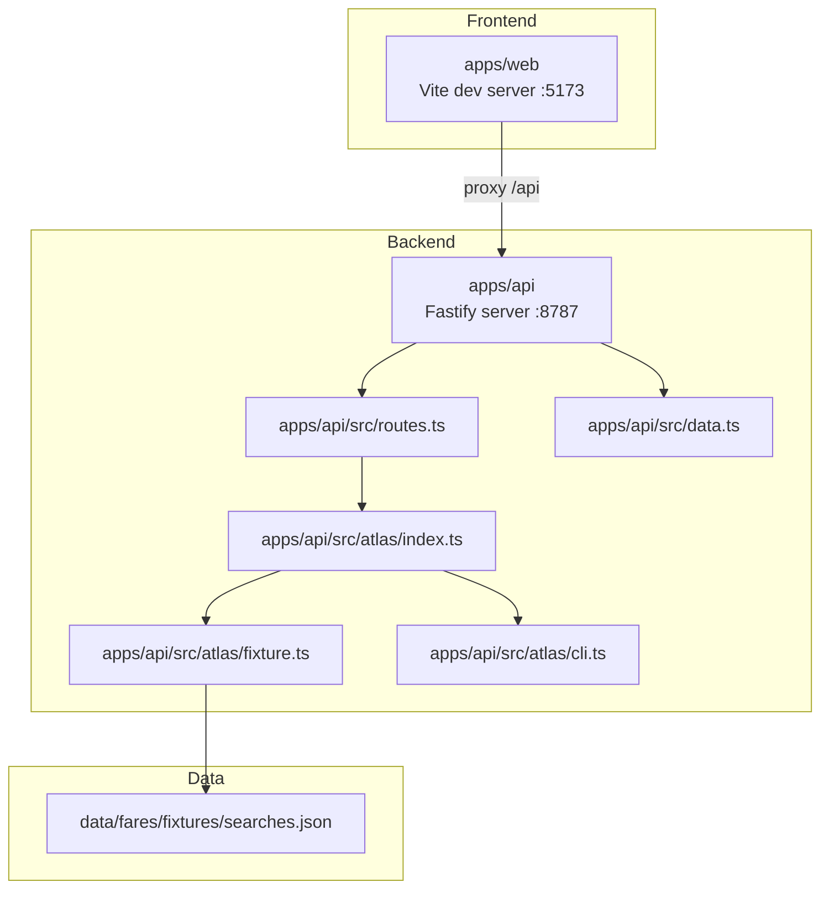
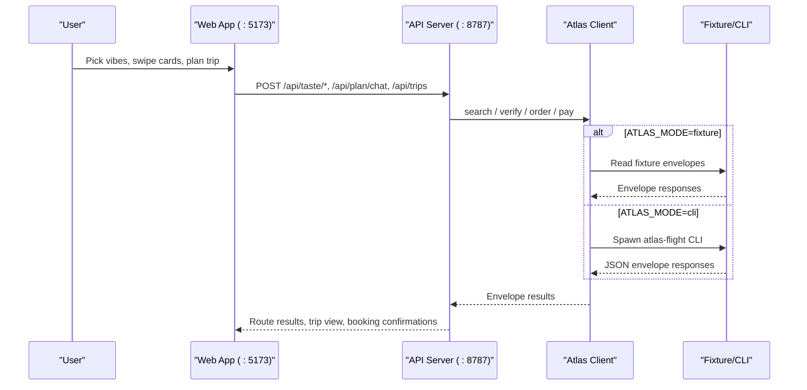
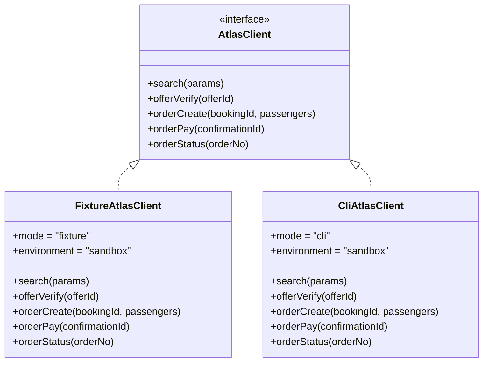
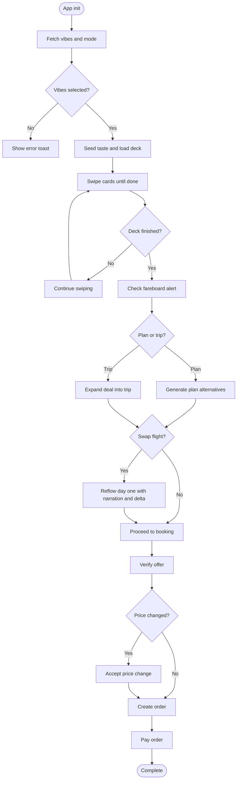
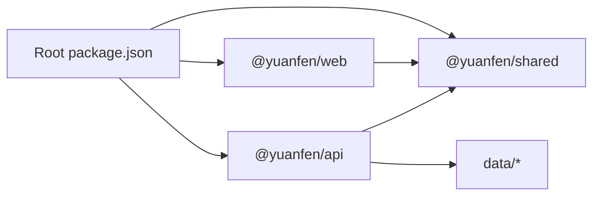

# Getting Started

<cite>
**Referenced Files in This Document**
- [README.md](file://README.md)
- [package.json](file://package.json)
- [apps/api/package.json](file://apps/api/package.json)
- [apps/web/package.json](file://apps/web/package.json)
- [apps/web/vite.config.ts](file://apps/web/vite.config.ts)
- [apps/api/src/server.ts](file://apps/api/src/server.ts)
- [apps/api/src/atlas/index.ts](file://apps/api/src/atlas/index.ts)
- [apps/api/src/atlas/cli.ts](file://apps/api/src/atlas/cli.ts)
- [apps/api/src/atlas/fixture.ts](file://apps/api/src/atlas/fixture.ts)
- [apps/api/src/routes.ts](file://apps/api/src/routes.ts)
- [apps/web/src/store.ts](file://apps/web/src/store.ts)
- [apps/web/src/api.ts](file://apps/web/src/api.ts)
- [apps/web/src/App.tsx](file://apps/web/src/App.tsx)
- [apps/api/src/data.ts](file://apps/api/src/data.ts)
- [data/fares/fixtures/searches.json](file://data/fares/fixtures/searches.json)
- [docs/demo-script.md](file://docs/demo-script.md)
</cite>

## Table of Contents
1. Introduction
2. Project Structure
3. Core Components
4. Architecture Overview
5. Detailed Component Analysis
6. Dependency Analysis
7. Performance Considerations
8. Troubleshooting Guide
9. Conclusion

## Introduction
This guide helps you set up and run the Trip Graph Agent locally, then walk through the complete golden path from vibe selection to booking. You will start the development server, open the web interface at localhost:5173, and interact with the API on :8787. The project supports two modes:
- Local-first mode (default): runs fully offline using checked-in fixtures.
- Live Atlas CLI mode: shells out to the authorized atlas-flight CLI for Sandbox operations.

The repository uses npm workspaces to manage the frontend, backend, and shared package.

**Section sources**
- [README.md:61-80](file://README.md#L61-L80)
- [package.json:5-12](file://package.json#L5-L12)

## Project Structure
At a high level:
- apps/web: React + Vite frontend that proxies API calls to the backend during development.
- apps/api: Fastify backend that implements taste training, trip planning, fareboard alerts, flight swap reflow, and booking flows. It also integrates with Atlas via a pluggable client.
- packages/shared: Shared types and utilities used by both apps.
- data: Preloaded places, routing matrices, holidays, and fixture envelopes for local-first operation.

**Diagram sources**
- [apps/web/vite.config.ts:4-12](file://apps/web/vite.config.ts#L4-L12)
- [apps/api/src/server.ts:8-20](file://apps/api/src/server.ts#L8-L20)
- [apps/api/src/routes.ts:10-134](file://apps/api/src/routes.ts#L10-L134)
- [apps/api/src/atlas/index.ts:10-13](file://apps/api/src/atlas/index.ts#L10-L13)
- [apps/api/src/atlas/fixture.ts:48-62](file://apps/api/src/atlas/fixture.ts#L48-L62)
- [apps/api/src/atlas/cli.ts:27-33](file://apps/api/src/atlas/cli.ts#L27-L33)
- [apps/api/src/data.ts:7-37](file://apps/api/src/data.ts#L7-L37)
- [data/fares/fixtures/searches.json:1](file://data/fares/fixtures/searches.json#L1)

**Section sources**
- [README.md:13-50](file://README.md#L13-L50)
- [apps/web/package.json:1-25](file://apps/web/package.json#L1-L25)
- [apps/api/package.json:1-15](file://apps/api/package.json#L1-L15)
- [packages/shared/package.json:1-10](file://packages/shared/package.json#L1-L10)

## Core Components
- Development server orchestration:
  - Root script starts both apps concurrently.
  - Web app runs on port 5173 and proxies /api to the backend.
  - Backend runs on port 8787 by default and exposes CORS for the dev origin.
- Atlas client abstraction:
  - Fixture client serves deterministic, offline fares from checked-in fixtures.
  - CLI client shells out to atlas-flight for live Sandbox operations.
- Routes:
  - Taste training endpoints for vibes and swiping.
  - Planning endpoint to generate route alternatives.
  - Fareboard alert endpoint for proactive long-weekend deals.
  - Trip creation, flight swap, reveal, and booking endpoints.

Key environment variables:
- ATLAS_MODE: fixture (default) or cli.
- API_PORT: defaults to 8787 if not set.

**Section sources**
- [package.json:9-12](file://package.json#L9-L12)
- [apps/web/vite.config.ts:4-12](file://apps/web/vite.config.ts#L4-L12)
- [apps/api/src/server.ts:8-20](file://apps/api/src/server.ts#L8-L20)
- [apps/api/src/atlas/index.ts:10-13](file://apps/api/src/atlas/index.ts#L10-L13)
- [apps/api/src/atlas/fixture.ts:48-62](file://apps/api/src/atlas/fixture.ts#L48-L62)
- [apps/api/src/atlas/cli.ts:27-33](file://apps/api/src/atlas/cli.ts#L27-L33)
- [apps/api/src/routes.ts:10-134](file://apps/api/src/routes.ts#L10-L134)

## Architecture Overview
The frontend initiates user interactions (vibes, swipes, chat, booking). These are proxied to the backend, which orchestrates agents and the Atlas client layer. In local-first mode, all fares come from fixtures; in live mode, the backend invokes the atlas-flight CLI.

**Diagram sources**
- [apps/web/src/api.ts:109-197](file://apps/web/src/api.ts#L109-L197)
- [apps/api/src/routes.ts:10-134](file://apps/api/src/routes.ts#L10-L134)
- [apps/api/src/atlas/index.ts:10-13](file://apps/api/src/atlas/index.ts#L10-L13)
- [apps/api/src/atlas/fixture.ts:97-203](file://apps/api/src/atlas/fixture.ts#L97-L203)
- [apps/api/src/atlas/cli.ts:31-113](file://apps/api/src/atlas/cli.ts#L31-L113)

## Detailed Component Analysis

### Environment Setup and Installation
- Prerequisites: Node.js with npm support for workspaces.
- Install dependencies:
  - Run workspace install to link apps and shared packages.
- Start development servers:
  - Use the root script to launch both the API and web apps concurrently.
  - The web app opens at http://localhost:5173 and proxies /api to the backend.
  - The API listens on port 8787 by default unless overridden by API_PORT.

Mode configuration:
- Local-first (default): Set ATLAS_MODE=fixture to run entirely offline using fixture data.
- Live Atlas CLI: Set ATLAS_MODE=cli to shell out to atlas-flight. Requires prior browser authorization and environment selection per the Atlas Skill user guide.

**Section sources**
- [README.md:61-80](file://README.md#L61-L80)
- [package.json:9-12](file://package.json#L9-L12)
- [apps/web/vite.config.ts:4-12](file://apps/web/vite.config.ts#L4-L12)
- [apps/api/src/server.ts:15-20](file://apps/api/src/server.ts#L15-L20)
- [apps/api/src/atlas/index.ts:10-13](file://apps/api/src/atlas/index.ts#L10-L13)
- [apps/api/src/atlas/cli.ts:18-25](file://apps/api/src/atlas/cli.ts#L18-L25)

### Running the Golden Path
Follow this sequence to demonstrate the full flow:
1. Pick vibes: Select at least five vibe tags to seed your taste profile.
2. Swipe taste cards: Like/pass/mustgo through cards to refine preferences.
3. Generate trip plans: Enter a natural-language prompt to produce route alternatives.
4. Handle long-weekend alerts: After finishing the deck, an unprompted alert may appear with top deals and a sealed wildcard.
5. Swap flights: Choose an alternative offer to see day-one reflow and budget delta narration.
6. Complete bookings: Verify offer, accept price changes, create order, approve total, and pay to receive order number, PNR, and tickets.

You can reference the timed demo script for pacing and emphasis during presentations.

**Section sources**
- [README.md:70-80](file://README.md#L70-L80)
- [docs/demo-script.md:5-14](file://docs/demo-script.md#L5-L14)

### API Endpoints Reference
Core endpoints exposed by the backend:
- GET /api/meta/vibes: Returns available vibe tags and minimum required count.
- GET /api/meta/mode: Returns current client mode and environment.
- GET /api/taste/deck/:destination: Returns a deck of place cards for taste training.
- POST /api/taste/seed: Seeds taste with selected vibe tags.
- POST /api/taste/swipe: Records a swipe action and returns updated summary.
- POST /api/taste/undo: Undoes last swipe.
- GET /api/taste/vector: Returns current taste vector summary.
- POST /api/plan/chat: Generates plan alternatives based on text input and taste vector.
- GET /api/fareboard/alert: Returns proactive deal alert if applicable.
- POST /api/trips: Creates a trip from a chosen destination and taste vector.
- GET /api/trips/:id: Retrieves trip view by ID.
- POST /api/trips/:id/swap-flight: Swaps flight offer and returns reflowed trip with narration and delta.
- POST /api/booking/verify: Verifies an offer and returns booking details.
- POST /api/booking/accept-price: Accepts a price change for a booking.
- POST /api/booking/order: Creates an order with passenger details.
- POST /api/booking/pay: Pays the order and returns ticketing status.
- GET /api/reveal/:city/:placeId: Reveals a sealed stop’s details.
- GET /api/evidence: Returns evidence log entries for debugging.

These endpoints are implemented in the routes module and consumed by the frontend store.

**Section sources**
- [apps/api/src/routes.ts:10-134](file://apps/api/src/routes.ts#L10-L134)
- [apps/web/src/api.ts:119-197](file://apps/web/src/api.ts#L119-L197)

### Atlas Client Modes
- Fixture client:
  - Reads fixture envelopes from data/fares/fixtures/searches.json.
  - Provides deterministic IDs and behavior suitable for local-first development.
  - Evidence log marks mode as fixture.
- CLI client:
  - Spawns atlas-flight with --json and parses envelopes.
  - Requires prior browser authorization and environment use sandbox.
  - Evidence log records request IDs and timestamps.

**Diagram sources**
- [apps/api/src/atlas/types.ts](file://apps/api/src/atlas/types.ts)
- [apps/api/src/atlas/fixture.ts:48-203](file://apps/api/src/atlas/fixture.ts#L48-L203)
- [apps/api/src/atlas/cli.ts:27-113](file://apps/api/src/atlas/cli.ts#L27-L113)

**Section sources**
- [apps/api/src/atlas/index.ts:10-13](file://apps/api/src/atlas/index.ts#L10-L13)
- [apps/api/src/atlas/fixture.ts:48-203](file://apps/api/src/atlas/fixture.ts#L48-L203)
- [apps/api/src/atlas/cli.ts:18-113](file://apps/api/src/atlas/cli.ts#L18-L113)

### Frontend Flow and State
The web app initializes by fetching vibe metadata and current mode, then guides users through phases:
- Vibes phase: select tags and seed taste.
- Deck phase: swipe cards to refine preferences.
- Home/trip phase: generate plans, handle alerts, expand trips, swap flights, and proceed through booking.

The store coordinates API calls and updates UI state accordingly. Errors are surfaced as toasts and can be dismissed.

**Diagram sources**
- [apps/web/src/store.ts:86-281](file://apps/web/src/store.ts#L86-L281)
- [apps/web/src/api.ts:119-197](file://apps/web/src/api.ts#L119-L197)
- [apps/api/src/routes.ts:10-134](file://apps/api/src/routes.ts#L10-L134)

**Section sources**
- [apps/web/src/App.tsx:15-90](file://apps/web/src/App.tsx#L15-L90)
- [apps/web/src/store.ts:86-281](file://apps/web/src/store.ts#L86-L281)
- [apps/web/src/api.ts:119-197](file://apps/web/src/api.ts#L119-L197)

## Dependency Analysis
- Workspaces:
  - Root defines workspaces for apps and packages.
  - Scripts run dev tasks across workspaces concurrently.
- Apps:
  - Web depends on shared types and UI libraries.
  - API depends on Fastify, CORS, and shared types.
- Data:
  - API reads static data files for places, routing matrices, holidays, and fixture envelopes.

**Diagram sources**
- [package.json:5-12](file://package.json#L5-L12)
- [apps/web/package.json:11-17](file://apps/web/package.json#L11-L17)
- [apps/api/package.json:9-13](file://apps/api/package.json#L9-L13)
- [apps/api/src/data.ts:7-37](file://apps/api/src/data.ts#L7-L37)

**Section sources**
- [package.json:5-12](file://package.json#L5-L12)
- [apps/web/package.json:1-25](file://apps/web/package.json#L1-L25)
- [apps/api/package.json:1-15](file://apps/api/package.json#L1-L15)
- [apps/api/src/data.ts:7-37](file://apps/api/src/data.ts#L7-L37)

## Performance Considerations
- Local-first mode avoids network latency and rate limits by using fixture envelopes.
- The backend caches city and matrix data to reduce repeated file reads.
- The fixture client provides deterministic IDs and stable behavior for repeatable tests and demos.
- When using CLI mode, ensure the atlas-flight CLI is responsive and consider timeouts for long-running operations.

[No sources needed since this section provides general guidance]

## Troubleshooting Guide
Common setup issues and resolutions:
- API offline error in the web app:
  - Ensure the backend is running and accessible at the proxied address.
  - Check that the web dev server proxies /api to the backend port.
- Port conflicts:
  - Change API_PORT if 8787 is already in use.
- Atlas CLI mode not working:
  - Verify atlas-flight is installed and authorized.
  - Confirm environment is set to sandbox before running.
- Unknown destination errors:
  - Ensure the destination exists in the places dataset.
- Fixture data missing:
  - Confirm data/fares/fixtures/searches.json is present and valid.

Evidence logging:
- Use the evidence endpoint to inspect call logs, including mode, environment, and request summaries.

**Section sources**
- [apps/web/src/store.ts:86-93](file://apps/web/src/store.ts#L86-L93)
- [apps/web/vite.config.ts:4-12](file://apps/web/vite.config.ts#L4-L12)
- [apps/api/src/server.ts:15-20](file://apps/api/src/server.ts#L15-L20)
- [apps/api/src/atlas/cli.ts:18-25](file://apps/api/src/atlas/cli.ts#L18-L25)
- [apps/api/src/routes.ts:17-23](file://apps/api/src/routes.ts#L17-L23)
- [apps/api/src/routes.ts:133](file://apps/api/src/routes.ts#L133)
- [data/fares/fixtures/searches.json:1](file://data/fares/fixtures/searches.json#L1)

## Conclusion
You now have the steps to set up the development environment, choose between local-first and live Atlas CLI modes, run the servers, and execute the full golden path from vibe selection to booking. Use the evidence panel and route endpoints to debug and understand how the system behaves under each mode. For presentation purposes, follow the demo script to highlight the most impactful moments: the unprompted long-weekend alert and the flight-swap reflow.

[No sources needed since this section summarizes without analyzing specific files]