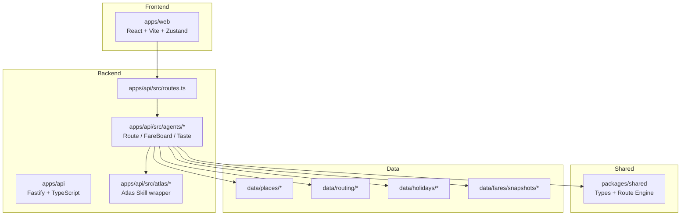
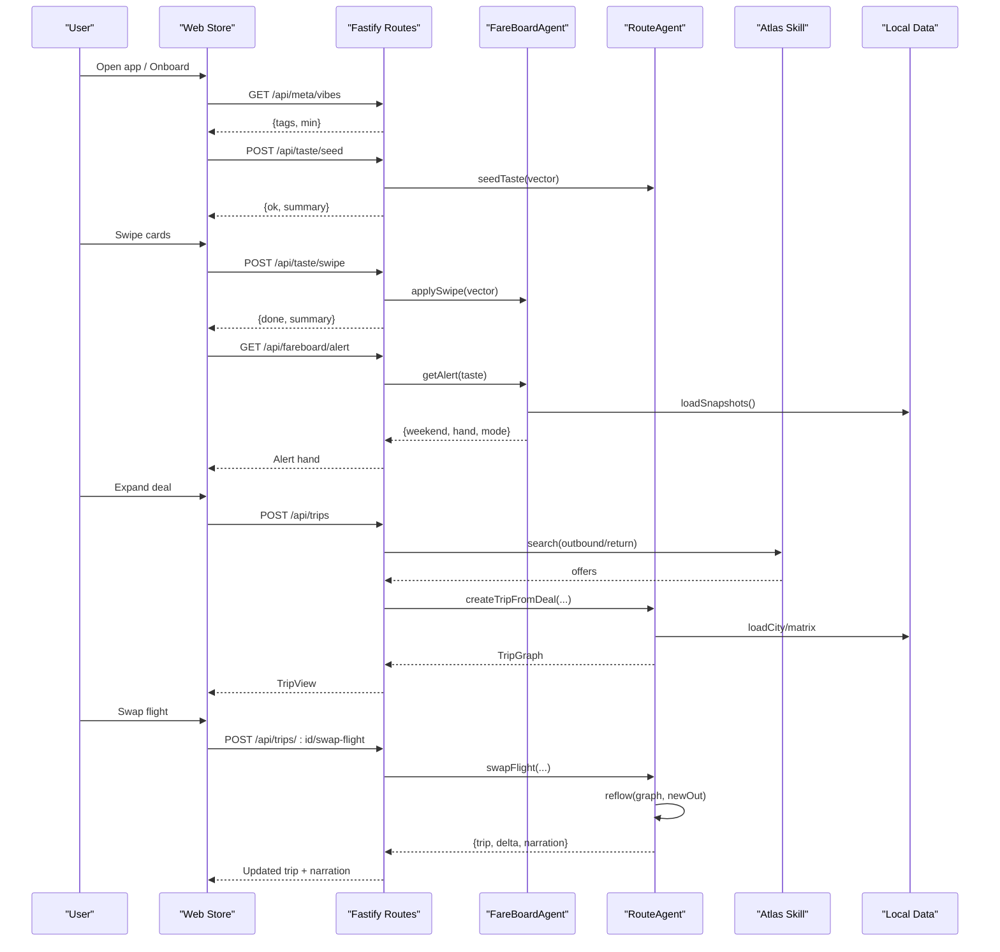
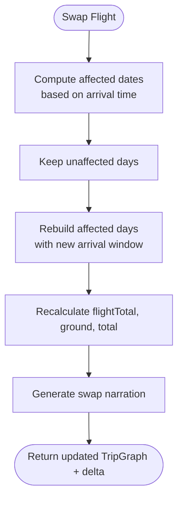
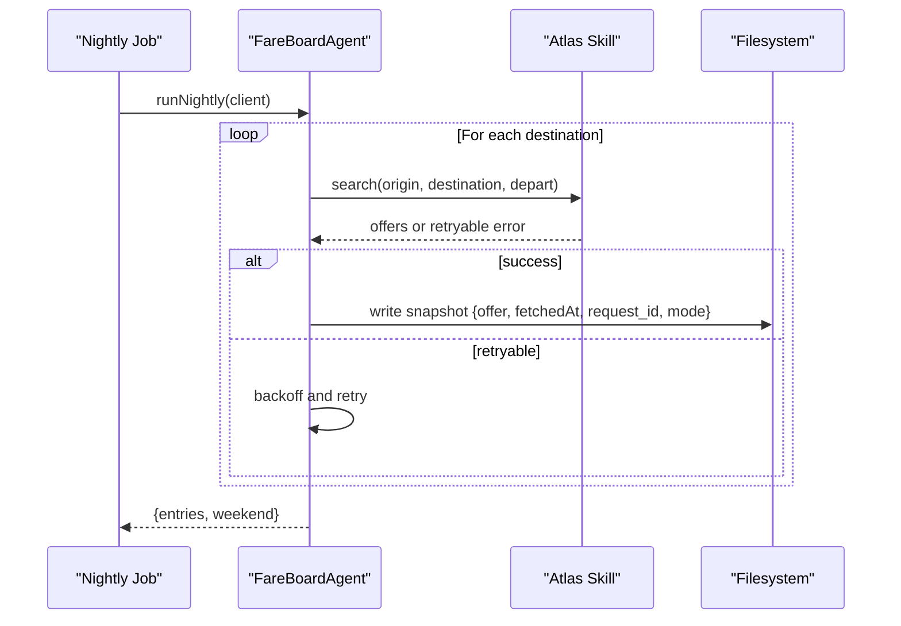
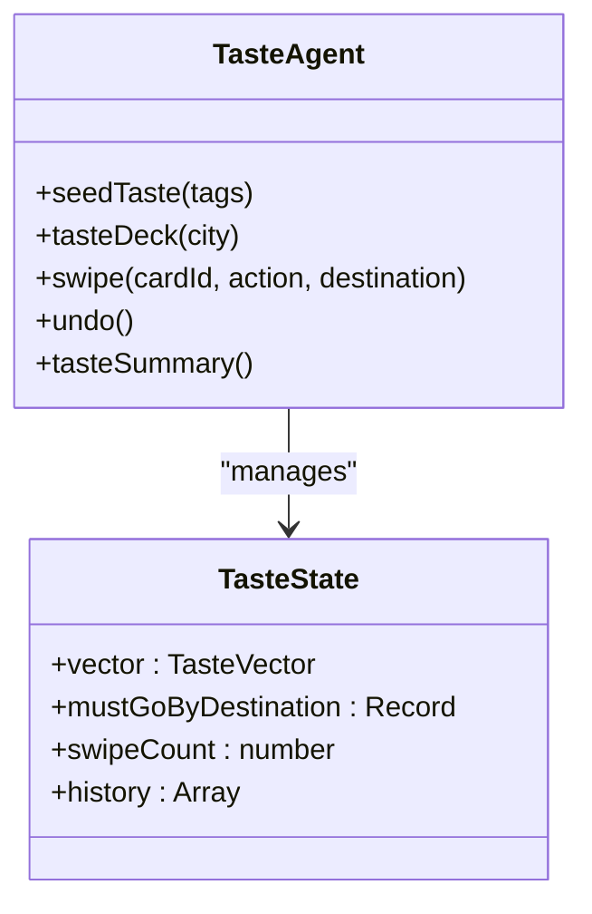
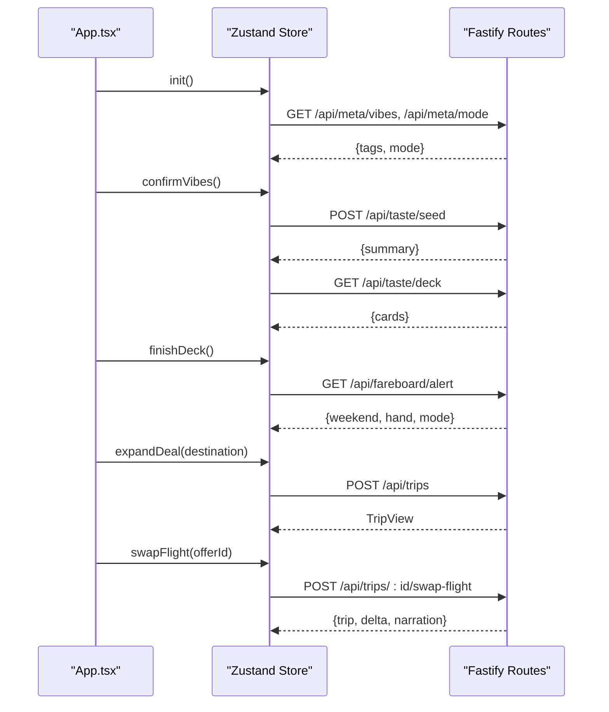
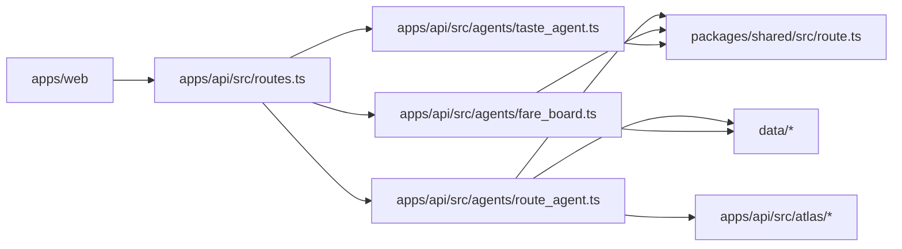

# Project Overview

<cite>
**Referenced Files in This Document**
- [README.md](file://README.md)
- [PRD.md](file://docs/PRD.md)
- [architecture.md](file://docs/architecture.md)
- [local-first-design.md](file://docs/local-first-design.md)
- [package.json](file://package.json)
- [server.ts](file://apps/api/src/server.ts)
- [routes.ts](file://apps/api/src/routes.ts)
- [route_agent.ts](file://apps/api/src/agents/route_agent.ts)
- [fare_board.ts](file://apps/api/src/agents/fare_board.ts)
- [taste_agent.ts](file://apps/api/src/agents/taste_agent.ts)
- [types.ts](file://packages/shared/src/types.ts)
- [route.ts](file://packages/shared/src/route.ts)
- [App.tsx](file://apps/web/src/App.tsx)
- [store.ts](file://apps/web/src/store.ts)
</cite>

## Table of Contents
1. [Introduction](#introduction)
2. [Project Structure](#project-structure)
3. [Core Components](#core-components)
4. [Architecture Overview](#architecture-overview)
5. [Detailed Component Analysis](#detailed-component-analysis)
6. [Dependency Analysis](#dependency-analysis)
7. [Performance Considerations](#performance-considerations)
8. [Troubleshooting Guide](#troubleshooting-guide)
9. [Conclusion](#conclusion)

## Introduction
Trip Graph Agent is an AI-powered travel planning application built for the Alibaba Cloud × Atlas Agentic AI Hackathon (WiT Singapore). Its core philosophy treats a trip as one directed dependency graph where the flight is “node zero” and every ground activity is downstream, all constrained by shared budget and timing. Swapping the flight re-plans downstream days and narrates the budget delta in one sentence.

The project’s purpose is to demonstrate a graph-based replanning approach that differs from traditional linear itinerary planners: instead of appending flights above a static plan, the flight drives the entire schedule, and changes cascade deterministically through the graph. The app combines local-first data with preloaded places, routing matrices, and holiday calendars so the per-user path stays fast and deterministic, while still integrating with Atlas flight APIs via a thin skill wrapper.

Key differentiators:
- Graph-based replanning: arrival time shapes day one; swapping flights triggers visible reflow across affected days.
- Local-first architecture: offline-enriched data and precomputed matrices keep interactions responsive and resilient to rate limits.
- Deterministic booking workflows: settlement code is fixed, auditable, and human-checked — no free-form generation near funds movement.

Judging alignment:
- Innovation: itinerary as a dependency graph with downstream re-plan propagation.
- Feasibility: batch-plus-rank design, rate-limit aware, cost-controllable, deterministic settlement.
- Demo completeness: end-to-end golden path from onboarding to booking and evidence log.

**Section sources**
- [README.md:1-11](file://README.md#L1-L11)
- [PRD.md:10-31](file://docs/PRD.md#L10-L31)
- [architecture.md:3-19](file://docs/architecture.md#L3-L19)

## Project Structure
The repository is a TypeScript monorepo using npm workspaces with three layers:
- apps/web: React + TypeScript frontend with MapLibre GL JS map-first UI, swipe deck, narration strip, booking flow, and evidence panel.
- apps/api: Fastify backend hosting the trip graph, three sub-agents, and Atlas Skill integration.
- packages/shared: Pure functions and types for taste, fare ranking, route building, and trip graph operations.

**Diagram sources**
- [server.ts:1-12](file://apps/api/src/server.ts#L1-L12)
- [routes.ts:10-134](file://apps/api/src/routes.ts#L10-L134)
- [route_agent.ts:1-24](file://apps/api/src/agents/route_agent.ts#L1-L24)
- [fare_board.ts:1-20](file://apps/api/src/agents/fare_board.ts#L1-L20)
- [taste_agent.ts:1-18](file://apps/api/src/agents/taste_agent.ts#L1-L18)
- [types.ts:35-146](file://packages/shared/src/types.ts#L35-L146)
- [route.ts:163-267](file://packages/shared/src/route.ts#L163-L267)

**Section sources**
- [README.md:13-50](file://README.md#L13-L50)
- [local-first-design.md:14-24](file://docs/local-first-design.md#L14-L24)
- [package.json:1-22](file://package.json#L1-L22)

## Core Components
- Trip Graph model: A directed graph with node zero as the outbound flight, days as sequences of stops, and a single budget spanning air and ground. Types define FlightOption, StopNode, DayPlan, TripGraph, and related structures.
- RouteAgent: Orchestrates S1 chat routes, S3 deal expansion into full TripGraphs, and S4 flight-swap reflow. It uses shared build/reflow logic over places and matrices.
- FareBoardAgent: Nightly batch job that queries Atlas for fares across a fixed candidate set, backs off on rate limits, and writes timestamped snapshots. Per-user alert ranks stored snapshots against the taste vector.
- TasteAgent: Converts swipe events into a taste vector used by both RouteAgent (place ranking) and FareBoardAgent (snapshot ranking). Supports undo and must-go tracking per destination.
- Web App: Stateful UI driving onboarding, route browsing, deal alerts, trip view, booking checkpoints, and evidence panel. Uses Zustand store to coordinate flows and API calls.

**Section sources**
- [types.ts:86-146](file://packages/shared/src/types.ts#L86-L146)
- [route_agent.ts:19-24](file://apps/api/src/agents/route_agent.ts#L19-L24)
- [fare_board.ts:15-20](file://apps/api/src/agents/fare_board.ts#L15-L20)
- [taste_agent.ts:14-18](file://apps/api/src/agents/taste_agent.ts#L14-L18)
- [App.tsx:15-89](file://apps/web/src/App.tsx#L15-L89)
- [store.ts:11-59](file://apps/web/src/store.ts#L11-L59)

## Architecture Overview
The system implements a “batch-plus-rank” architecture to respect Atlas rate limits and keep per-user paths deterministic:
- Nightly job runs a fixed candidate set (one origin, multiple destinations), backs off on retryable responses, and persists snapshots.
- Per-user actions rank stored snapshots against the taste vector without live API calls.
- Settlement is deterministic with human checkpoints: verify offer, confirm price increases, masked summary, explicit consent, then payment.

**Diagram sources**
- [routes.ts:10-134](file://apps/api/src/routes.ts#L10-L134)
- [fare_board.ts:41-117](file://apps/api/src/agents/fare_board.ts#L41-L117)
- [route_agent.ts:107-185](file://apps/api/src/agents/route_agent.ts#L107-L185)
- [route.ts:349-474](file://packages/shared/src/route.ts#L349-L474)
- [store.ts:129-249](file://apps/web/src/store.ts#L129-L249)

## Detailed Component Analysis

### Trip Graph Model and Replanning
The trip graph centers on the flight as node zero. Each day is a sequence of stops with roles (anchor, food, quiet, wildcard, must), travel times from a precomputed matrix, and constraints like opening hours and meal windows. Building a trip computes budgets and generates a single narration line. Reflow detects affected dates based on arrival time and rebuilds only those days, preserving identity of unaffected days.

**Diagram sources**
- [route.ts:410-474](file://packages/shared/src/route.ts#L410-L474)

**Section sources**
- [types.ts:112-146](file://packages/shared/src/types.ts#L112-L146)
- [route.ts:163-267](file://packages/shared/src/route.ts#L163-L267)
- [route.ts:349-474](file://packages/shared/src/route.ts#L349-L474)
- [route_agent.ts:170-185](file://apps/api/src/agents/route_agent.ts#L170-L185)

### Fare Board and Proactive Alerts
The nightly job walks a fixed candidate set, searches outbound flights for evening-before departure, selects the cheapest total-with-bag offer, and persists timestamped snapshots. The per-user alert ranks these snapshots against the taste vector and returns a hand of top destinations plus a sealed wildcard. If no snapshots exist yet, it performs an in-memory run to ensure the demo always has content.

**Diagram sources**
- [fare_board.ts:41-82](file://apps/api/src/agents/fare_board.ts#L41-L82)

**Section sources**
- [fare_board.ts:15-20](file://apps/api/src/agents/fare_board.ts#L15-L20)
- [fare_board.ts:41-117](file://apps/api/src/agents/fare_board.ts#L41-L117)
- [local-first-design.md:51-68](file://docs/local-first-design.md#L51-L68)

### Taste Agent and Deck Flow
TasteAgent turns swipes into a taste vector and supports undo. Decks are generated deterministically by bucketing places by primary vibe tag and round-robin picking to diversify exposure. Must-go selections are tracked per destination and influence route generation.

**Diagram sources**
- [taste_agent.ts:28-118](file://apps/api/src/agents/taste_agent.ts#L28-L118)
- [types.ts:79-84](file://packages/shared/src/types.ts#L79-L84)

**Section sources**
- [taste_agent.ts:14-18](file://apps/api/src/agents/taste_agent.ts#L14-L18)
- [taste_agent.ts:28-118](file://apps/api/src/agents/taste_agent.ts#L28-L118)
- [store.ts:95-193](file://apps/web/src/store.ts#L95-L193)

### Web Application Flow
The React app orchestrates phases: vibes selection, taste deck, home with map and chat, deal alert, trip view, booking modal, and evidence panel. The Zustand store coordinates API calls, state transitions, and user interactions such as swiping, swapping flights, and revealing wildcards.

**Diagram sources**
- [App.tsx:15-89](file://apps/web/src/App.tsx#L15-L89)
- [store.ts:86-249](file://apps/web/src/store.ts#L86-L249)
- [routes.ts:10-134](file://apps/api/src/routes.ts#L10-L134)

**Section sources**
- [App.tsx:15-89](file://apps/web/src/App.tsx#L15-L89)
- [store.ts:11-59](file://apps/web/src/store.ts#L11-L59)
- [store.ts:86-249](file://apps/web/src/store.ts#L86-L249)

## Dependency Analysis
- Frontend depends on backend REST endpoints for taste, planning, alerts, trips, and booking.
- Backend routes depend on agents for business logic and on Atlas client for flight operations.
- Agents depend on shared pure functions for route building, taste scoring, and fare calculations.
- Data layer provides places, routing matrices, holidays, and fare snapshots.

**Diagram sources**
- [routes.ts:10-134](file://apps/api/src/routes.ts#L10-L134)
- [route_agent.ts:1-24](file://apps/api/src/agents/route_agent.ts#L1-L24)
- [fare_board.ts:1-20](file://apps/api/src/agents/fare_board.ts#L1-L20)
- [taste_agent.ts:1-18](file://apps/api/src/agents/taste_agent.ts#L1-L18)
- [route.ts:1-14](file://packages/shared/src/route.ts#L1-L14)

**Section sources**
- [routes.ts:10-134](file://apps/api/src/routes.ts#L10-L134)
- [route_agent.ts:1-24](file://apps/api/src/agents/route_agent.ts#L1-L24)
- [fare_board.ts:1-20](file://apps/api/src/agents/fare_board.ts#L1-L20)
- [taste_agent.ts:1-18](file://apps/api/src/agents/taste_agent.ts#L1-L18)

## Performance Considerations
- Precomputed travel-time matrices enable interactive planning under 5 seconds.
- Batch-plus-rank avoids per-user live fan-out to Atlas, keeping latency low and costs predictable.
- Local-first data ensures resilience and deterministic behavior during demos and development.
- Booking flows are deterministic and minimal in compute, focusing on verification and confirmation steps.

[No sources needed since this section provides general guidance]

## Troubleshooting Guide
- Mode and environment: Check the mode endpoint to confirm fixture vs CLI operation and environment labels.
- Evidence panel: Use the evidence endpoint to inspect call IDs, timestamps, operations, and modes for debugging Atlas interactions.
- Error handling: Routes return structured errors for invalid inputs, missing trips, unknown cities, and unseeded taste states.
- Rate limiting: Fare board job backs off on retryable responses; if alerts are empty, trigger the nightly job or ensure snapshots exist.

**Section sources**
- [routes.ts:10-134](file://apps/api/src/routes.ts#L10-L134)
- [fare_board.ts:41-117](file://apps/api/src/agents/fare_board.ts#L41-L117)
- [server.ts:15-25](file://apps/api/src/server.ts#L15-L25)

## Conclusion
Trip Graph Agent demonstrates a practical, scalable approach to travel planning by treating trips as dependency graphs with the flight as node zero. The combination of graph-based replanning, local-first data, and deterministic booking workflows aligns with hackathon goals around innovation, feasibility, and demo completeness. The architecture balances autonomy in planning with safety in settlement, providing a clear path for productionization beyond the hackathon.

[No sources needed since this section summarizes without analyzing specific files]