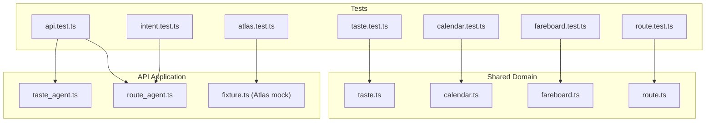
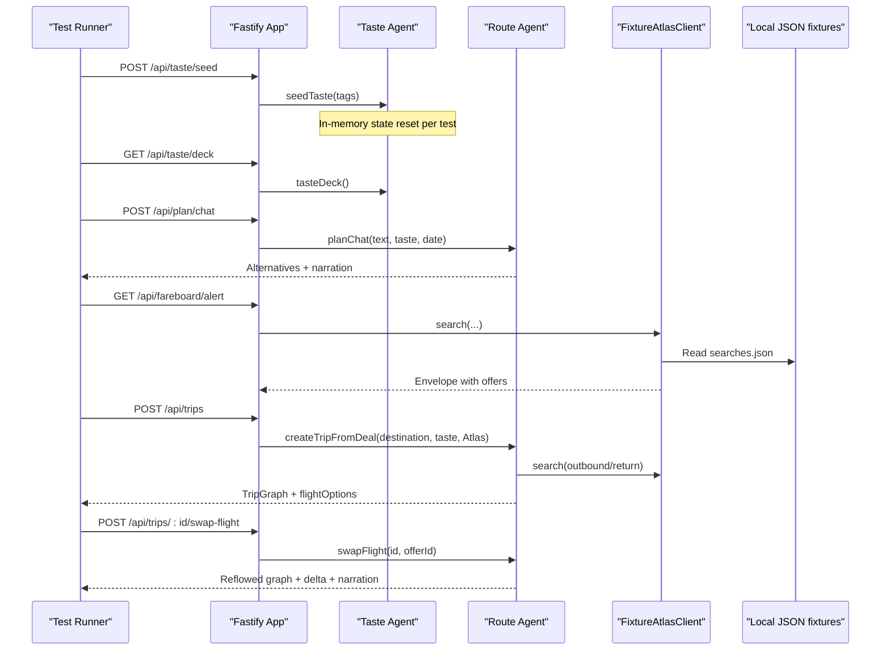
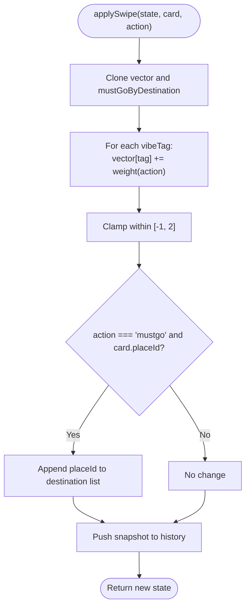
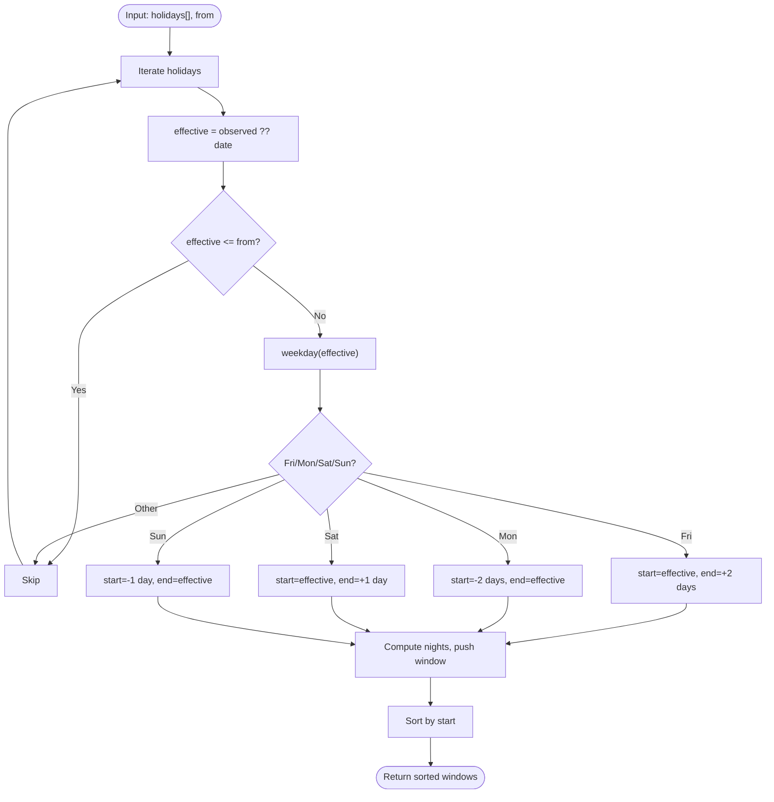
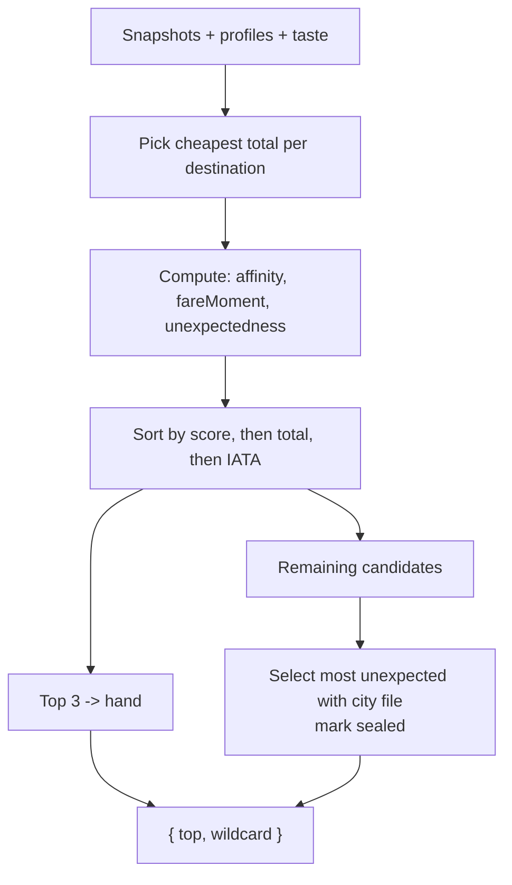
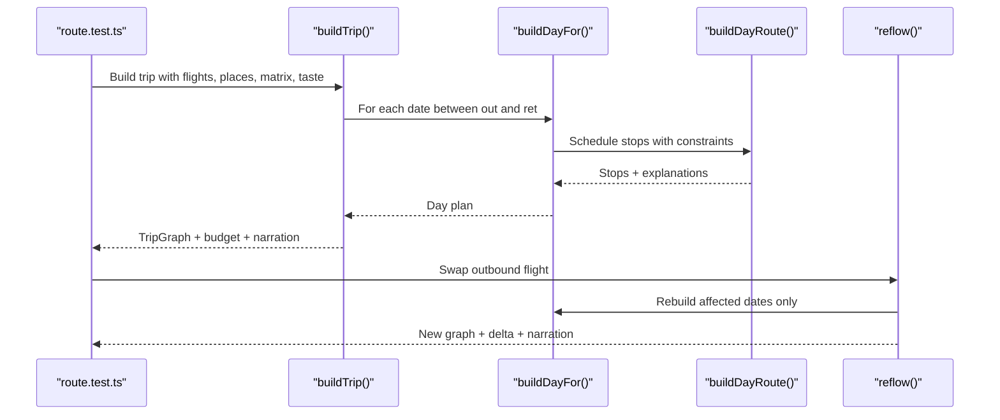
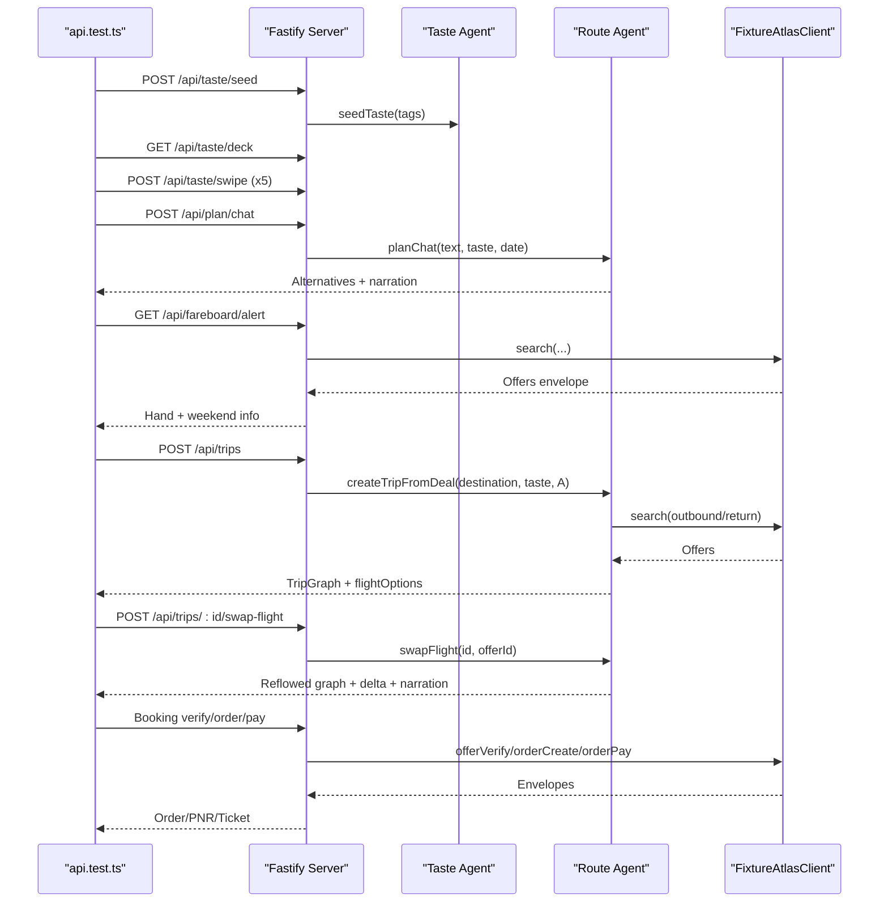
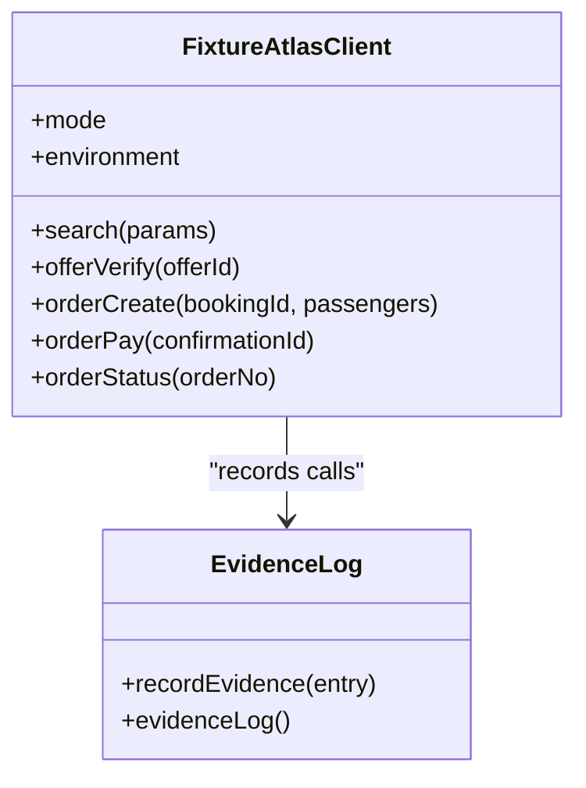
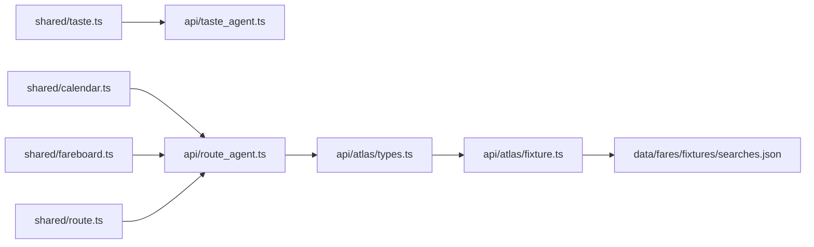

# Testing Strategy

<cite>
**Referenced Files in This Document**
- [vitest.config.ts](file://vitest.config.ts)
- [api.test.ts](file://apps/api/test/api.test.ts)
- [atlas.test.ts](file://apps/api/test/atlas.test.ts)
- [intent.test.ts](file://apps/api/test/intent.test.ts)
- [calendar.test.ts](file://packages/shared/test/calendar.test.ts)
- [fareboard.test.ts](file://packages/shared/test/fareboard.test.ts)
- [route.test.ts](file://packages/shared/test/route.test.ts)
- [taste.test.ts](file://packages/shared/test/taste.test.ts)
- [taste_agent.ts](file://apps/api/src/agents/taste_agent.ts)
- [route_agent.ts](file://apps/api/src/agents/route_agent.ts)
- [fixture.ts](file://apps/api/src/atlas/fixture.ts)
- [searches.json](file://data/fares/fixtures/searches.json)
- [calendar.ts](file://packages/shared/src/calendar.ts)
- [fareboard.ts](file://packages/shared/src/fareboard.ts)
- [route.ts](file://packages/shared/src/route.ts)
</cite>

## Table of Contents
1. Introduction
2. Project Structure
3. Core Components
4. Architecture Overview
5. Detailed Component Analysis
6. Dependency Analysis
7. Performance Considerations
8. Troubleshooting Guide
9. Conclusion
10. Appendices

## Introduction
This document explains the testing strategy for the Trip Graph Agent across the monorepo using Vitest. It covers unit tests for taste scoring, calendar operations, fare ranking logic, and route calculations; integration tests for API endpoints, Atlas Skill interactions, and end-to-end user flows; and a fixture-based approach that enables offline development and demo scenarios. It also documents test structure, mocking strategies, assertion patterns, and provides guidance for writing new tests while maintaining quality.

## Project Structure
The repository uses a shared package for domain logic and an API application for orchestration and HTTP endpoints. Tests are centralized under each package/app with a single Vitest configuration that includes both locations.

**Diagram sources**
- [vitest.config.ts:3-6](file://vitest.config.ts#L3-L6)
- [taste.test.ts:1-130](file://packages/shared/test/taste.test.ts#L1-L130)
- [calendar.test.ts:1-51](file://packages/shared/test/calendar.test.ts#L1-L51)
- [fareboard.test.ts:1-215](file://packages/shared/test/fareboard.test.ts#L1-L215)
- [route.test.ts:1-299](file://packages/shared/test/route.test.ts#L1-L299)
- [api.test.ts:1-182](file://apps/api/test/api.test.ts#L1-L182)
- [atlas.test.ts:1-75](file://apps/api/test/atlas.test.ts#L1-L75)
- [intent.test.ts:1-24](file://apps/api/test/intent.test.ts#L1-L24)

**Section sources**
- [vitest.config.ts:3-6](file://vitest.config.ts#L3-L6)

## Core Components
- Taste vector and swipe mechanics: seed vectors, apply/undo swipes, place scoring.
- Calendar long-weekend detection from holiday data.
- Fare ranking: blend of taste affinity, fare moment distress, and unexpectedness; hand selection and wildcard sealing.
- Route building: day routes, trip graphs, alternatives, reflow on flight swaps.
- API agents: taste agent state, route agent planning and trip creation/reflow.
- Fixture Atlas client: deterministic flight search, booking flow, evidence logging, price bump simulation.

**Section sources**
- [taste.ts:16-67](file://packages/shared/src/taste.ts#L16-L67)
- [calendar.ts:28-55](file://packages/shared/src/calendar.ts#L28-L55)
- [fareboard.ts:56-197](file://packages/shared/src/fareboard.ts#L56-L197)
- [route.ts:163-475](file://packages/shared/src/route.ts#L163-L475)
- [taste_agent.ts:28-118](file://apps/api/src/agents/taste_agent.ts#L28-L118)
- [route_agent.ts:62-191](file://apps/api/src/agents/route_agent.ts#L62-L191)
- [fixture.ts:48-205](file://apps/api/src/atlas/fixture.ts#L48-L205)

## Architecture Overview
The testing architecture separates concerns:
- Unit tests validate pure functions in the shared package.
- Integration tests spin up the Fastify server and exercise HTTP endpoints.
- Fixture-based tests replace external services with deterministic mocks to enable offline runs and stable demos.

**Diagram sources**
- [api.test.ts:25-112](file://apps/api/test/api.test.ts#L25-L112)
- [route_agent.ts:107-185](file://apps/api/src/agents/route_agent.ts#L107-L185)
- [fixture.ts:97-205](file://apps/api/src/atlas/fixture.ts#L97-L205)
- [searches.json:1-800](file://data/fares/fixtures/searches.json#L1-L800)

## Detailed Component Analysis

### Taste Scoring Algorithms
- Seed vector initialization assigns positive weights to chosen tags and zero to others.
- Swipe actions adjust tag weights with bounded ranges; must-go boosts more than like and records destination-scoped must-go lists.
- Undo restores previous state including history and must-go lists.
- Place scoring averages tag weights normalized by tag count.

**Diagram sources**
- [taste.ts:30-61](file://packages/shared/src/taste.ts#L30-L61)

**Section sources**
- [taste.test.ts:34-76](file://packages/shared/test/taste.test.ts#L34-L76)
- [taste.test.ts:78-112](file://packages/shared/test/taste.test.ts#L78-L112)
- [taste.test.ts:114-129](file://packages/shared/test/taste.test.ts#L114-L129)
- [taste_agent.ts:28-92](file://apps/api/src/agents/taste_agent.ts#L28-L92)

### Calendar Operations
- Long weekend detection computes windows around holidays that land on or adjacent to weekends.
- Observed dates are considered; past holidays are ignored; midweek holidays without adjacent weekends produce no window.

**Diagram sources**
- [calendar.ts:28-55](file://packages/shared/src/calendar.ts#L28-L55)

**Section sources**
- [calendar.test.ts:11-49](file://packages/shared/test/calendar.test.ts#L11-L49)

### Fare Ranking Logic
- Fare moment scores scarcity and restrictiveness signals; missing fields default gracefully.
- Unexpectedness measures novelty relative to strongly expressed taste tags.
- rankHand blends taste affinity and fare moment, selects top three, and seals a wildcard with maximum unexpectedness among remaining destinations with full trip data.
- Observed badge shows after seven distinct real-night snapshots; fixture-mode entries do not count.

**Diagram sources**
- [fareboard.ts:111-179](file://packages/shared/src/fareboard.ts#L111-L179)

**Section sources**
- [fareboard.test.ts:86-120](file://packages/shared/test/fareboard.test.ts#L86-L120)
- [fareboard.test.ts:122-162](file://packages/shared/test/fareboard.test.ts#L122-L162)
- [fareboard.test.ts:164-193](file://packages/shared/test/fareboard.test.ts#L164-L193)
- [fareboard.test.ts:195-215](file://packages/shared/test/fareboard.test.ts#L195-L215)

### Route Calculations
- buildDayRoute schedules stops respecting opening hours, travel times, meal windows, mood preferences, area filters, and must-go constraints; reserves time for a sealed wildcard when applicable.
- buildAlternatives generates multiple diverse plans by excluding previously selected non-must places.
- buildTrip composes multi-day graphs with arrival shaping, late-arrival night mode, departure cutoffs, budget totals, and exactly one sealed wildcard across the trip.
- reflow recomputes affected days when swapping flights, preserving unaffected days and narrating changes.

**Diagram sources**
- [route.ts:163-475](file://packages/shared/src/route.ts#L163-L475)

**Section sources**
- [route.test.ts:112-178](file://packages/shared/test/route.test.ts#L112-L178)
- [route.test.ts:180-204](file://packages/shared/test/route.test.ts#L180-L204)
- [route.test.ts:206-237](file://packages/shared/test/route.test.ts#L206-L237)
- [route.test.ts:239-299](file://packages/shared/test/route.test.ts#L239-L299)

### API Endpoints and User Flows
- Golden path tests initialize a taste profile, generate day plans, fetch fare alerts, expand deals into trips, swap flights, and complete booking verification/order/pay.
- Evidence log asserts that all Atlas calls are recorded and passenger details are never logged.
- Pre-swiped must-go destinations are routed into trips.

**Diagram sources**
- [api.test.ts:25-182](file://apps/api/test/api.test.ts#L25-L182)
- [route_agent.ts:107-185](file://apps/api/src/agents/route_agent.ts#L107-L185)
- [fixture.ts:97-205](file://apps/api/src/atlas/fixture.ts#L97-L205)

**Section sources**
- [api.test.ts:42-182](file://apps/api/test/api.test.ts#L42-L182)

### Atlas Skill Interactions and Fixtures
- FixtureAtlasClient serves deterministic envelopes from local JSON fixtures, simulates price bumps, enforces single-use payment confirmation IDs, masks names, and logs every call to the evidence store.
- Tests assert envelope shape, offer counts, price status, PNR length, ticket numbers, and privacy guarantees.

**Diagram sources**
- [fixture.ts:48-205](file://apps/api/src/atlas/fixture.ts#L48-L205)

**Section sources**
- [atlas.test.ts:21-74](file://apps/api/test/atlas.test.ts#L21-L74)
- [searches.json:1-800](file://data/fares/fixtures/searches.json#L1-L800)

### Intent Parsing
- parseIntent extracts city, area, must tags, and mood tags from natural language phrases; unknown cities return null safely.

**Section sources**
- [intent.test.ts:4-23](file://apps/api/test/intent.test.ts#L4-L23)

## Dependency Analysis
- Shared package exports pure functions used by API agents and tests.
- API agents depend on shared logic and local data loaders; they also depend on the Atlas client abstraction implemented by the fixture client in tests.
- Tests isolate behavior by resetting in-memory state before each scenario.

**Diagram sources**
- [taste_agent.ts:1-118](file://apps/api/src/agents/taste_agent.ts#L1-L118)
- [route_agent.ts:1-191](file://apps/api/src/agents/route_agent.ts#L1-L191)
- [fixture.ts:1-205](file://apps/api/src/atlas/fixture.ts#L1-L205)
- [searches.json:1-800](file://data/fares/fixtures/searches.json#L1-L800)

**Section sources**
- [taste_agent.ts:1-118](file://apps/api/src/agents/taste_agent.ts#L1-L118)
- [route_agent.ts:1-191](file://apps/api/src/agents/route_agent.ts#L1-L191)
- [fixture.ts:1-205](file://apps/api/src/atlas/fixture.ts#L1-L205)

## Performance Considerations
- Deterministic algorithms ensure fast, repeatable tests without network latency.
- Fixture-based Atlas client reads static JSON once per instance; avoid reloading fixtures per test where possible.
- Use minimal fixture payloads for unit tests; reserve larger datasets for integration tests.
- Keep assertions focused on critical paths to reduce flakiness and improve runtime.

## Troubleshooting Guide
- State isolation: Always reset taste, trips, bookings, and evidence before each test to prevent cross-test contamination.
- Fixture mismatches: Ensure fixture files contain required routes and offers for the queries being tested.
- Privacy checks: Verify that passenger details never appear in evidence logs; use masked names in order summaries.
- Timezone safety: All date math uses UTC anchoring; confirm ISO strings and weekday computations align with expectations.

**Section sources**
- [api.test.ts:25-48](file://apps/api/test/api.test.ts#L25-L48)
- [atlas.test.ts:21-74](file://apps/api/test/atlas.test.ts#L21-L74)
- [fixture.ts:137-167](file://apps/api/src/atlas/fixture.ts#L137-L167)

## Conclusion
The testing strategy combines precise unit tests for core algorithms, robust integration tests for API workflows, and a comprehensive fixture-based system for reliable offline development and demos. The pattern emphasizes deterministic inputs, isolated state, and clear assertions aligned with feature requirements. Following these guidelines ensures maintainable, high-quality tests as the codebase evolves.

## Appendices

### Test Coverage Summary (51 tests)
- Shared package unit tests:
  - Taste: 10 tests covering seeding, swipe/undo, destination-scoped must-go, and place scoring.
  - Calendar: 6 tests validating long weekend windows and edge cases.
  - Fareboard: 14 tests covering ranking, fare moment, unexpectedness, and observed badge.
  - Route: 15 tests covering arrival shaping, must-go handling, reflow, Singapore CBD day trip, alternatives, and determinism.
- API integration tests:
  - API golden path: 8 tests covering taste seeding/gating, chat planning, fare alert hand, trip expansion, flight swap, booking flow, evidence log, and pre-swiped must-go routing.
  - Atlas fixture: 5 tests covering envelope shape, evidence logging, full booking flow, single-use payments, and price bump simulation.
  - Intent parsing: 3 tests covering phrase parsing, unknown city handling, and multiple must clauses.

Total: 51 tests across unit, integration, and fixture layers.

**Section sources**
- [taste.test.ts:1-130](file://packages/shared/test/taste.test.ts#L1-L130)
- [calendar.test.ts:1-51](file://packages/shared/test/calendar.test.ts#L1-L51)
- [fareboard.test.ts:1-215](file://packages/shared/test/fareboard.test.ts#L1-L215)
- [route.test.ts:1-299](file://packages/shared/test/route.test.ts#L1-L299)
- [api.test.ts:1-182](file://apps/api/test/api.test.ts#L1-L182)
- [atlas.test.ts:1-75](file://apps/api/test/atlas.test.ts#L1-L75)
- [intent.test.ts:1-24](file://apps/api/test/intent.test.ts#L1-L24)

### Writing New Tests: Guidelines
- Prefer pure function tests in the shared package for algorithmic logic; keep them deterministic and input-focused.
- Use integration tests to validate end-to-end flows via the Fastify server; reset state in beforeEach hooks.
- Leverage FixtureAtlasClient for external dependencies; add fixture entries in searches.json when needed.
- Assert on contracts: envelope shapes, status codes, field presence, privacy guarantees, and business invariants (e.g., exactly one sealed wildcard).
- Keep tests small and focused; group related behaviors with describe blocks and name tests after requirements (e.g., FR-xxx).
- Avoid flaky assertions; prefer exact values or tight tolerances for numeric outputs.

[No sources needed since this section provides general guidance]